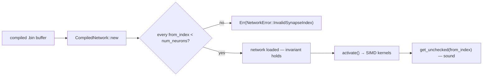

# AGENTS.md

## TDD (required)

- **Test-driven development:** new behaviour or bugfixes start from **failing tests**, then minimal implementation, then refactor. Do not land Rust changes without **tests** in `neat-core` (or the relevant crate) and a green **`cargo test --workspace`**.
- Run **`./quality.sh`** before commit/PR.

## Testing: "what" not "how"

All test cases must be **"what" tests** (same rule as **NEAT-AI** `CONTRIBUTING.md`):

- **What tests** run real code paths and assert on **observable outcomes**: return values, errors, compiled structures, numerical results, public invariants.
- **How tests** tie to **implementation detail** and are discouraged: asserting on private fields, internal call order, source greps, line counts, or "this helper was invoked" unless the contract under test is explicitly that wiring.

Name tests after the behaviour or outcome (e.g. `relu_maps_negative_to_zero`), not the mechanism (`relu_calls_clamp_branch`).

## Repository layout

- **`neat-core/`** — shared native library; **WASM** stays in **NEAT-AI** (`wasm_activation`).
- **`training_bin_stream`** (`neat-core/src/training_bin_stream.rs`) — **one** chunked `.bin` scan API: pipelined double-buffer reads on native hosts, sequential `File::read` chunks on `wasm32` (same `for_each_read_chunk` callback). Used by **NEAT-AI-scorer** for production-sized forward-only scoring.
- Root **`Cargo.toml`** is a **virtual workspace**; **`[workspace.package].version`** is what the PR **auto-bump** job edits; **`neat-core`** uses `version.workspace = true`.

## Unsafe & SIMD invariants

The native SIMD hot path (`neat-core/src/simd_native.rs`) is `unsafe`-heavy. These
invariants are load-bearing — one is a memory-safety (UB) contract — so an agent
editing the hot path **must** keep them intact.

- **Load-time `from_index` validation is the soundness precondition for
  `get_unchecked`.** The SIMD kernels index the activation buffer (sized to exactly
  `num_neurons`) with `get_unchecked(from_index)`. `CompiledNetwork::new`
  (`neat-core/src/network.rs`) validates **once, at load** that every synapse's
  `from_index < num_neurons`, returning `NetworkError::InvalidSynapseIndex`
  otherwise. That single check is what makes the unchecked reads sound. **Never
  remove or bypass it** — a compiled network with `from_index >= num_neurons`
  would be an out-of-bounds read (UB: heap disclosure or a fault) on every
  `activate()`. Do not delete it as "redundant".
- **`unsafe_op_in_unsafe_fn = "deny"` (`Cargo.toml`) governs how intrinsics are
  wrapped.** Inside a `#[target_feature]` fn, a pure compute intrinsic whose
  required feature is *already enabled* is **safe** and must **not** be wrapped in
  `unsafe { … }` — doing so trips `unused_unsafe`. Only these need an explicit
  `unsafe { … }` block:
  - `get_unchecked` indexing and its pointer derefs (rely on the bounds invariant
    above);
  - pointer load/store intrinsics — `vld1q_f32` / `vst1q_f32` (NEON),
    `_mm_storeu_ps` / `_mm256_storeu_ps` (x86);
  - an intrinsic needing a feature the fn does **not** enable — e.g.
    `_mm256_fmadd_ps` (needs `fma`) inside an `avx2`-only fn.
- **Every SIMD `unsafe` block carries a `// SAFETY:` note naming its guard.** The
  note names the `is_x86_feature_detected!` / `is_aarch64_feature_detected!` guard
  (or the load-time index check) that discharges the block's precondition, keeping
  the soundness proof next to the code.
- **Buffer reuse is sound only under one-network-per-thread.** Promoting scratch
  buffers to reused `CompiledNetwork` fields forces `&mut self` and is sound only
  because batch scoring gives each thread its own `CompiledNetwork`
  (`#[derive(Clone)]`). Two rules follow: (1) **reset every reused buffer per call**
  to the exact fresh-allocation state (activations zeroed then inputs re-copied,
  hints zeroed, traces cleared) — otherwise a larger neuron's stale entries leak
  into a smaller one later in the same pass; (2) any such change ships with a
  **state-leak regression test** that runs the same input on a reused network and
  asserts it matches a fresh network.

## CI / secrets

- PR pipeline: version bump + **`cargo upgrade --incompatible`**, **`cargo audit`**, dependency review, rustfmt bot, then fmt/clippy/deny/tests/doc. Pushes need **`ACTIONS_PUSH`** (PAT with **contents:write**).
- **Versioning/release policy:** see **`RELEASING.md`** (Issue #251). A **breaking** change is a **major-equivalent** bump (pre-1.0: **minor**, `0.1.x → 0.2.0`); non-breaking is **patch**. Signal a break with the **`breaking-change`** PR label or a Conventional Commit `type!:` / `BREAKING CHANGE:` marker. The `version-increment` job bumps minor on a break; the `version-gate` job **fails** a break shipped on a patch-only bump; `release.yml` cuts a **`v<version>`** tag + GitHub release on `Develop`, decoupled from `wasm-bundle-<sha>`.
- **`clippy::uninlined_format_args`** is not denied in CI until the test corpus is cleaned up; workspace lints still deny **`filter_next`** / **`collapsible_if`**.
