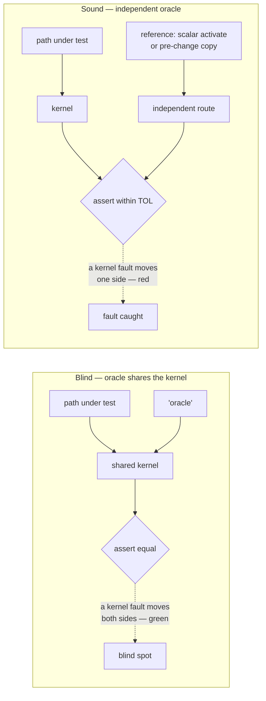
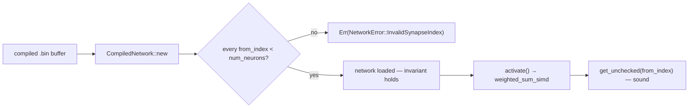
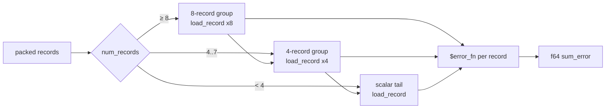
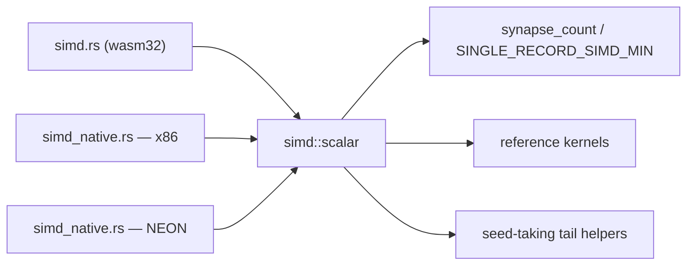
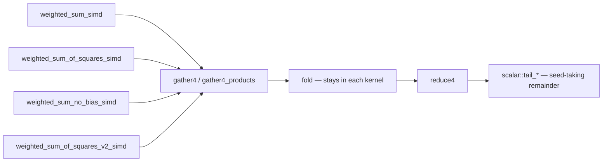

# AGENTS.md

## TDD (required)

- **Test-driven development:** new behaviour or bugfixes start from **failing tests**, then minimal implementation, then refactor. Do not land Rust changes without **tests** in `neat-core` (or the relevant crate) and a green **`cargo test --workspace`**.
- **Characterisation-test exception — pure extractions only.** Collapsing N identical copies into one helper adds no behaviour for a failing-first test to describe, so write the tests against the **pre-change copies**, run them green there, and keep them green through the extraction (that is what proves the refactor behaviour-preserving — `pr-summary-442.md`). The red run you skip is repaid by the mutation evidence below: a characterisation test that never fails is worth nothing.
- Run **`./quality.sh`** before commit/PR.

## Testing: "what" not "how"

All test cases must be **"what" tests** (same rule as **NEAT-AI** `CONTRIBUTING.md`):

- **What tests** run real code paths and assert on **observable outcomes**: return values, errors, compiled structures, numerical results, public invariants.
- **How tests** tie to **implementation detail** and are discouraged: asserting on private fields, internal call order, source greps, line counts, or "this helper was invoked" unless the contract under test is explicitly that wiring.

Name tests after the behaviour or outcome (e.g. `relu_maps_negative_to_zero`), not the mechanism (`relu_calls_clamp_branch`).

## Oracles and mutation evidence

A green test is not evidence. What a reviewer needs is evidence the test **can
fail** — and this repo has repeatedly shipped tests that could not. These five
rules are the de facto merge gate for refactors here, absorbed from the
oracle-integrity campaign: the oracle rules from PRs #409, #476, #478, #479, and
the mutation-evidence practice from PRs #387, #388, #442, #443, #444, #446, #480.

### 1. An oracle **must not share** the code path under test

`flat_record_scoring_parity.rs` compared `score_records_flat` against
`score_records` — both fed the *same* `score_batch_into`, so a fault in the
kernel moved both sides of the assertion and the test stayed green (#409). A
parity oracle must reach the expected value by an **independent** route: score
each record on its own through the scalar `activate` forward pass, or keep the
**pre-change** implementation verbatim in the test module as a
**differential** reference (#387, #388).

Independence has an honest price: the batched path re-associates its sums and
uses the vectorised squash approximations, so the assertion drops from
bit-exact to a stated **tolerance** (`TOL = 1e-3`, matching
`score_squash_simd_parity.rs`). Take the tolerance — a real lane or stride slip
is an O(1) error, far above it. Never buy bit-exactness back by re-pointing the
oracle at the kernel.

### 2. A refactor that collapses N copies must kill **every former site**

Prove the new test reaches each copy *before* merging them: mutate one site at a
time (e.g. `1 => sum.max(0.0)` → `sum.max(0.1)`) and record that the suite goes
red for it. #443's sweep over all eleven copies of the inline-squash rule found
two the suite never reached — the 4-record remainder inside the 8-way macro and
the scattered MSE kernel — and the tests were tightened (alternating input signs,
a mixed aggregate/standard network) until all eleven died. List the per-site
results in the PR summary, and revert every mutation before commit. Two
independent nets are better than one: #446 gets a **compile error** from the
pattern macro *and* test failures from the predicate.

### 3. No **vacuous** oracles — derive the expected value

These shapes have all shipped here and all pass against broken code (#479):

- `assert!(result.is_finite())` and `assert!(result.abs() <= 100000.0)`;
- bare magic lengths (`assert_eq!(result.len(), 28)`);
- a loose inequality on a fixture where the branch under test never fires
  (`count == 1` against sqrt-scaling that only arms at `count > 1`).

Replace each with the value the documented formula requires, and write the
**derivation** beside it — `28` becomes `BATCH_4WAY * WEIGHT_SLOTS_PER_SYNAPSE`,
`is_finite()` becomes `assert_close(result, 1.5)` with the blend/clamp steps
spelled out. If a fixture cannot arm the branch, build one that does, and guard
against a vacuous `0 == 0` pass.

### 4. A gate self-test must compile the **live pattern**, not a private copy

Three bats suites asserted "this regex rejects known-bad input" against a second
copy of the regex, so gutting the live pattern to `.*` failed nothing (#478).
Each pattern gets exactly **one** definition — exported from `setup()` and
compiled by both the sweep over the real files and the good/bad literal check.
Read it in a **quoted** heredoc (`<<'PY'` with `os.environ[...]`), never `<<PY`,
so the shell cannot interpolate or re-escape the pattern text.

### 5. Test the oracle itself with **synthetic** input when production cannot

A hand-copied parity oracle sliced record 2 with record 0's length and stayed
green, because every record in that fixture happened to be the same length
(#476).
When production cannot construct the edge case that would expose an oracle bug,
**test the oracle** directly: a synthetic buffer with distinct per-record
lengths, plus fail-loud assertions for a header that overruns or undercovers the
payload. An oracle with untested edge cases is production code without tests.
`split_batch_records` (#476) walks the batch header loop-derived, so every
record is sliced with its own length — the `len0`/`len2` slip is no longer
expressible, and the synthetic tests catch header-overrun and undercover cases.

`tests/scripts/oracle_mutation_evidence.bats` pins these rules.

## Repository layout

- **`neat-core/`** — shared native library; **WASM** stays in **NEAT-AI** (`wasm_activation`).
- **`training_bin_stream`** (`neat-core/src/training_bin_stream.rs`) — **one** chunked `.bin` scan API: pipelined double-buffer reads on native hosts, sequential `File::read` chunks on `wasm32` (same `for_each_read_chunk` callback). Used by **NEAT-AI-scorer** for production-sized forward-only scoring.
- Root **`Cargo.toml`** is a **virtual workspace**; **`[workspace.package].version`** is what the PR **auto-bump** job edits; **`neat-core`** uses `version.workspace = true`.

## Unsafe & SIMD invariants

The native SIMD hot path (`neat-core/src/simd_native.rs`) carries durable
soundness rules. They are load-bearing — an edit that ignores one either fails
the build or ships undefined behaviour. Absorbed from the SIMD/`unsafe`/
buffer-reuse campaign (PRs #11, #112, #154, #155, #165, #207).

### Load-time index validation is the soundness precondition for `get_unchecked`

The SIMD kernels read the activation buffer (sized to exactly `num_neurons`)
with **unchecked** indexing, `get_unchecked(from_index)`. A compiled network
declaring a synapse with `from_index >= num_neurons` would be an out-of-bounds
read — **undefined behaviour** on every `activate()`. This is guarded **once, at
load time**: `CompiledNetwork::new` rejects any out-of-range `from_index` with
`NetworkError::InvalidSynapseIndex` (`neat-core/src/network.rs:326`). A network
that loads successfully is guaranteed in-range, so the `get_unchecked` calls are
sound and the hot path stays branch-free. **Never remove or bypass that check as
"redundant" — doing so reintroduces UB behind `get_unchecked`.** (See also the
memory-safety note in [`SECURITY.md`](SECURITY.md#memory-safety-of-compiled-network-loading).)

The `wasm32` `gather4` scaffold helper (`simd.rs`) rests on the same invariant
since Issue #509 — it reads four `SynapseData` entries and four indirect
activations unchecked. `checked-gather4` restores the bounds-checked control if
a build ever needs it; the numbers behind that default are in
[`docs/research/wasm-gather4-unchecked-loads.md`](docs/research/wasm-gather4-unchecked-loads.md),
and `neat-core/tests/unchecked_gather_invariant.rs` pins the load-time guard
that makes it sound — including rejection from **every** lane position of a
span, which a 4-wide gather needs and the single-synapse unit tests do not
cover.

### `unsafe` blocks under `unsafe_op_in_unsafe_fn = "deny"`

`Cargo.toml` sets `[workspace.lints.rust] unsafe_op_in_unsafe_fn = "deny"`, and
`neat-core` opts in via `[lints] workspace = true`. Inside a `#[target_feature]`
function this changes how intrinsics must be wrapped:

- A **pure compute intrinsic whose required feature is already enabled** is
  *safe* to call and must **not** be wrapped in `unsafe { … }` — wrapping it
  trips the `unused_unsafe` lint and fails the `-D warnings` build.
- Only these genuinely need an `unsafe { … }` block: `get_unchecked` indexing
  and its pointer derefs; pointer load/store intrinsics (`vld1q_f32` /
  `vst1q_f32`, `_mm_storeu_ps` / `_mm256_storeu_ps`); and intrinsics needing a
  feature the enclosing fn does **not** enable (e.g. `_mm256_fmadd_ps` needs
  `fma` inside an `avx2`-only fn).
- Every SIMD `unsafe` block must carry a `// SAFETY:` note that **names the
  `is_*_feature_detected!` guard** (`is_x86_feature_detected!` /
  `is_aarch64_feature_detected!`) proving the callee's `#[target_feature]`
  precondition.

### Buffer reuse is sound only one-network-per-thread

Promoting scratch buffers to reused `CompiledNetwork` fields (to cut per-call
allocation) forces `&mut self` and is sound **only because each thread owns its
own `CompiledNetwork`** (`#[derive(Clone)]`, one per worker thread). When you do
this you **must**:

- **Reset every reused buffer per call** to the exact state a fresh allocation
  would have had (e.g. `fill(0.0)` then re-copy inputs; `clear()` traces).
  Otherwise a larger neuron's stale entries leak into a smaller one later in the
  same pass.
- **Add a state-leak regression test** asserting the reused-buffer path is
  byte-identical to the fresh-allocation path across differently-sized inputs.

## One activation rule for single-record work (Issue #441)

`neuron_activation_scalar` (`neat-core/src/batch_scoring.rs`) is the single home
of the rule that turns a neuron's synapse range into an activation — constants,
the six aggregate squashes (Minimum/Maximum/If/Hypotenuse/HypotenuseV2/Mean),
the standard weighted-sum fall-through, then `apply_limit_range`. **Every**
batched kernel that drops to one record at a time (the per-lane aggregate loops
and the scalar tails in `loss.rs`) calls it, so a record's activation never
depends on whether it landed in a full SIMD group or in the remainder. Adding a
squash type means editing that helper only — do not re-inline the match.

`CompiledNetwork::activate` / `activate_into` deliberately keep their own copy:
routing them through the helper measured ~30–46% slower on the `forward_pass`
benchmark. Change the helper and those two together, and re-run
`cargo bench --bench hot_paths -- forward_pass` if you touch them.

## One hot-squash dispatch for standard neurons (Issue #443)

`inline_squash` (`neat-core/src/batch_scoring.rs`) is the single home of the
*other* half of that rule: which squash types are hot enough to branch inline
(`0` Identity, `1` ReLU, `6` Logistic, `7` Tanh) and the exact scalar formula
each uses, with everything else deferring to `apply_squash`. Every site that
squashes a standard weighted sum calls it — the three single-record forward
passes in `network.rs`, the 4-way traced batch, and the scalar `None`-fallback
branch of every batched loss and scoring kernel — so the SIMD-batched and
scalar-tail paths agree bit-for-bit. Promoting a fifth type to the inline set,
or reformulating one of the four, is an edit **there and nowhere else**; do not
re-inline the match. `neat-core/tests/inline_squash_dispatch.rs` pins the rule
across every public activation path.

The *vectorised* `squash_x4` / `squash_x8` approximations
(`neat-core/src/squash_simd.rs`) are a different rule and stay where they are —
only their scalar fallback goes through `inline_squash`.

## One aggregate-squash set for dispatch and hints (Issue #446)

`SquashType::is_aggregate` (`neat-core/src/squash.rs`) is the single home of the
rule that says *which squash types are aggregates* — Minimum, Maximum, If,
Hypotenuse, HypotenuseV2, Mean: the six that cannot be lane-vectorised and must
take the exact single-record kernel. That one predicate drives both dispatch
(`has_aggregate_squash`, the 8-record and 4-record group loops in
`batch_scoring.rs`, and the same two tiers inside `batch_8way_activation!`) and
hint semantics (`activate_and_trace` reports the activation itself as the hint;
`apply_unsquash` prefers the caller's hint). Adding a seventh aggregate type is
an edit **there and nowhere else** — do not restate the membership list at a
call site, because a missed site fails **silently**: the new type would be
routed down the lane-vectorised weighted-sum path and produce numbers that
differ from `activate()` with no panic to flag it.

`apply_unsquash` is the one site that needs the set as a *pattern* rather than a
predicate — a guard arm would forfeit the compiler's exhaustiveness check over
`SquashType`. It uses `aggregate_squash_patterns!()`, the `pub(crate)` macro the
predicate itself is built from, so there is still exactly one list.
`neat-core/tests/aggregate_squash_set.rs` pins the rule: membership, batched-vs-
single-record parity for every squash type, and both hint semantics.

## One packed-record scan for every loss entry point (Issue #444)

`packed_record_scan` (`neat-core/src/loss.rs`) is the single home of the rule
that carves a packed `[inputs…, targets…]` buffer into records: the stride is
`input_size + num_outputs` (`packed_layout`), only whole records count, a
record's targets start immediately after its inputs, and each record is
activated statelessly unless the caller declares the network forward-only. All
eight entry points — the seven `*_sum_batch_packed` kernels and `mse_mean_record`
— call it with a closure carrying **only** their per-output reduction, so the
per-record `1/num_outputs` factor lives in the closure (which is what keeps MSLE
and hinge deliberately un-averaged).

The driver takes a closure and **no mode flags**: SIMD dispatch stays at the
callers, where it genuinely differs (MSE falls back through the 8-way *and*
4-way paths; `categorical_error_sum_batch_packed` uses neither and keeps its own
`num_outputs == 0` guard). If unifying a future entry point needs a boolean to
switch the driver's behaviour, leave that entry point out rather than growing a
flag. `neat-core/tests/packed_record_scan.rs` pins the rule across all eight.

## One batched record-scan skeleton for every loss kind (Issue #445)

`batch_8way_activation!` (`neat-core/src/loss.rs`) is the single home of the
rule that walks a packed record buffer: records are grouped **8 → 4 → 1**, each
group's inputs are loaded into per-lane activation buffers, and the per-record
errors accumulate into one `f64` sum. All six loss kinds — MSE included, via
`mse_sum_batch_scattered` — invoke it with a closure carrying **only** their
per-record reduction (`(records, target_base, act, output_start, num_outputs) ->
f64`). Changing the grouping (a 16-lane tier, a different remainder strategy) is
an edit **there and nowhere else**; do not re-inline the skeleton.

The record-**interleaved** 8-group path (`mse_sum_batch_8way_interleaved`,
Issue #384) is a genuinely different memory layout and stays separate — its
`< 8` remainder still runs the same per-lane kernels, so the two are
bit-identical.

`load_record` (`neat-core/src/batch_scoring.rs`) owns the loading sub-rule:
copy `min(record.len(), num_inputs)` values and **zero** every input slot the
record does not cover. Every per-lane loader in the batched scoring and fused
loss kernels calls it, so a record scored in a SIMD group, in the 4-record
remainder, or in the scalar tail sees the same inputs.
`neat-core/tests/batch_record_skeleton.rs` pins the rule across every packed
loss entry point.

The three single-record entry points (`CompiledNetwork::activate`,
`activate_into`, `activate_and_trace`) route their input copy through the same
helper, via the private `load_inputs` (Issue #519). They previously copied
`min(len, num_inputs)` and stopped, so the reused activation buffer left a
**previous call's** values in the slots a narrower record did not cover, and the
same record scored differently through the single-record and batched paths.
`neat-core/tests/short_input_zero_fill.rs` pins the agreement. Only the input
copy is shared — the activation rule itself stays inlined in those entry points
for the performance reason in the Issue #441 section above.

## One ISA-neutral scalar layer for every weighted-sum kernel (Issue #447)

`neat-core/src/simd/scalar.rs` is the single home of the rule that says what a
weighted-sum kernel *means*: the reference scalar semantics of each kernel and
the small-count guard in front of it — the thing every SIMD path must agree with
bit-for-bit. It carries no intrinsics and no `cfg`, so the `wasm32` kernels in
`simd.rs` and the x86/aarch64 kernels in `simd_native.rs` share one copy.

Two layers, deliberately distinct:

- **Reference kernels** (`weighted_sum`, `weighted_sum_of_squares`,
  `weighted_sum_no_bias`, `weighted_sum_of_squares_v2`) seed their own
  accumulator and index safely. Every target's below-threshold count
  (`synapse_count(start, end) < SINGLE_RECORD_SIMD_MIN`) falls back to them.
- **Seed-taking tail helpers** (`tail_sum`, `tail_sum_of_squares`,
  `tail_sum_of_squares_v2`) take the caller's **running** accumulator, so a SIMD
  kernel's 0..3 remainder continues the reference f32 rounding order instead of
  starting a second sum. They cannot be replaced by the reference kernels — that
  would reseed and break the bit-parity the tests rely on. They index with
  `get_unchecked` under the load-time index-validation invariant above, so they
  are `unsafe fn` with a `# Safety` contract; calling them from a
  `#[target_feature]` fn is sound and inlinable because no vector types cross the
  boundary.

`synapse_count` is the count prologue: **saturating**, so a reversed range
(`end < start`) counts as zero instead of underflowing. Every kernel prologue on
both sides uses it — no raw `end - start`, no hard-coded `4`.

Changing the accumulation order, the guard, or the threshold is an edit **there
and nowhere else**; do not re-inline a scalar loop into an ISA module.
`neat-core/tests/simd_scalar_layer.rs` pins the rule: splitting a range at any
point and continuing through a tail helper reproduces the reference result
exactly, and below the threshold the public kernels are bit-identical to the
reference.

## One chunk-walk scaffold for the wasm weighted-sum kernels (Issue #448)

The scaffold helpers at the top of `neat-core/src/simd.rs` — `gather4`,
`gather4_products`, `reduce4` — are the single home of the rule that says *how a
`wasm32` kernel walks a synapse span*: chunk into fours, gather weights and
activations into `f32x4` lanes, fold, reduce the lanes, then finish the 0..3
remainder from the **running** accumulator through the `scalar::tail_*` helpers
(Issue #447). All four single-record kernels — `weighted_sum_simd`,
`weighted_sum_of_squares_simd`, `weighted_sum_no_bias_simd`,
`weighted_sum_of_squares_v2_simd` — call them, so a change to the walk lands on
every kernel at once. It previously did not: the Issue #1197 dual-accumulator
rework reached `weighted_sum_simd` alone and the doc on
`weighted_sum_no_bias_simd` claimed otherwise for four releases.

Two constraints on anyone editing the scaffold:

- **Every helper touching `v128`/`f32x4_*` must repeat
  `#[target_feature(enable = "simd128", enable = "relaxed-simd")]`** — without it
  the intrinsics do not compile and the vector arguments do not inline into the
  caller.
- **The fold stays in each kernel.** These are calls, not a parameterised
  super-helper: plain FMA, square-the-product, and square-the-biased-product are
  genuinely different folds, and unifying them would need a mode flag. If a
  future kernel only fits behind a flag, leave it out of the scaffold instead.

The dual-accumulator form (two chains, chunks of eight) is still on
`weighted_sum_simd` only, and the docs now say so; promoting the other three is
a fold-level edit on top of the shared walk.

`neat-core/tests/simd_chunk_walk_scaffold.rs` pins the rule: every kernel
reproduces its `simd::scalar` reference from **any** offset (not just
`start == 0`), the remainder continues the span rather than restarting it, and a
reversed span yields the kernel's seed. Those assertions run natively against
the `simd_native.rs` kernels; to execute them against the **wasm** kernels, run
them on a real runtime through `wasm-bench/` (Issue #509) — `neat-core`'s own
test targets cannot be built for wasm because its `criterion` dev-dependency
refuses to compile for wasi.

## CI / secrets

- PR pipeline: version bump + **`./bump-deps.sh --quarantine-hours … --skip-build`** (a `cargo update` under the **`VIBE_BUMP_QUARANTINE_HOURS`** release-age quarantine, Issue #76), **`cargo audit`**, dependency review, rustfmt bot, then fmt/clippy/deny/tests/doc. Pushes need **`ACTIONS_PUSH`** (**org-level** PAT with **contents:write**).
- **`cargo upgrade --incompatible` is local-only** — it runs from `quality.sh` (guarded by `command -v cargo-upgrade`) and from **no workflow**. Do not "fix" CI to call it: a direct upgrade bypasses the quarantine `bump-deps.sh` applies, which is why `ci.yml` drops `cargo-edit` and `tests/scripts/ci_workflow_quarantine.bats` fails any unguarded invocation.
- **`ACTIONS_PUSH` is supplied just-in-time** (Issue #483): the `version-increment` / `auto-format` checkouts run with **`persist-credentials: false`** and no `token:`, and the PAT reaches only the one step that pushes, through an explicit `https://x-access-token:…` remote URL. Never hand it to a checkout — those jobs execute PR-authored code (`bump-deps.sh`, `cargo fmt`) that would then be able to read an org-wide credential off `.git/config`.
- **Versioning/release policy:** **`RELEASING.md`** is the single source of truth (Issue #251) — semver, what counts as breaking, and how to signal it. In CI the `version-increment` job bumps minor on a break (patch otherwise); the `version-gate` job **fails** a break shipped on a patch-only bump; `release.yml` cuts a **`v<version>`** tag + GitHub release on `Develop`, decoupled from `wasm-bundle-<sha>`.
- **`clippy::uninlined_format_args`** is not denied in CI until the test corpus is cleaned up; workspace lints still deny **`filter_next`** / **`collapsible_if`**.
