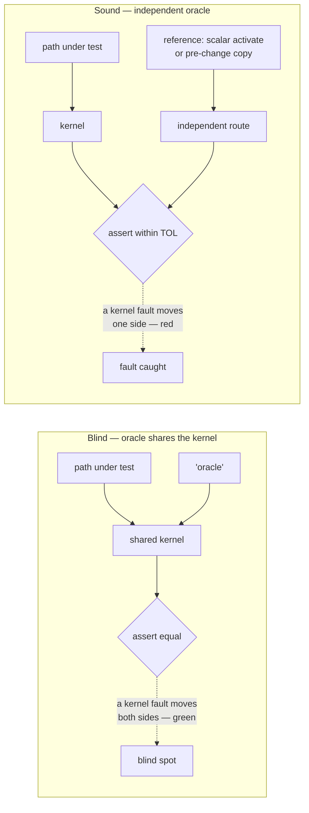
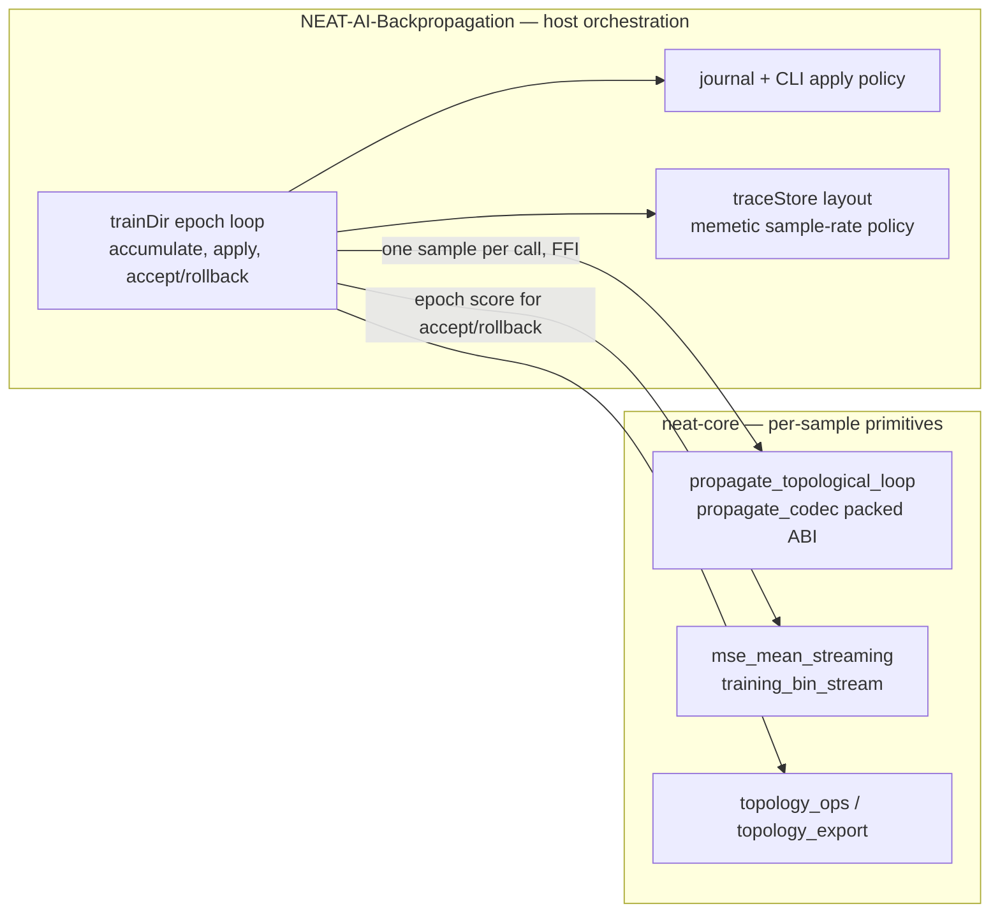
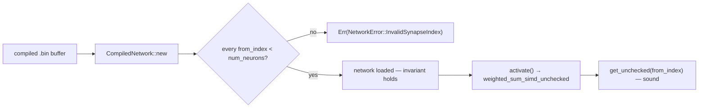
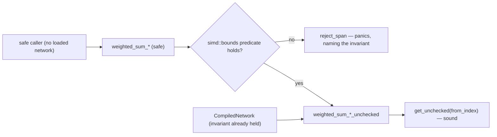
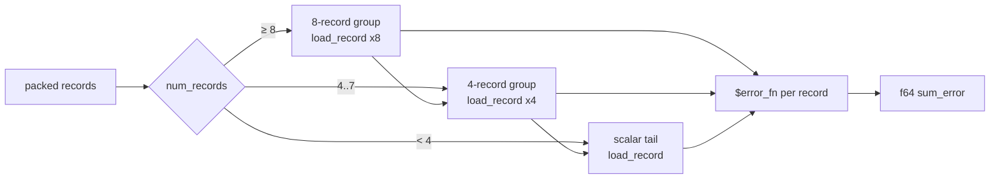
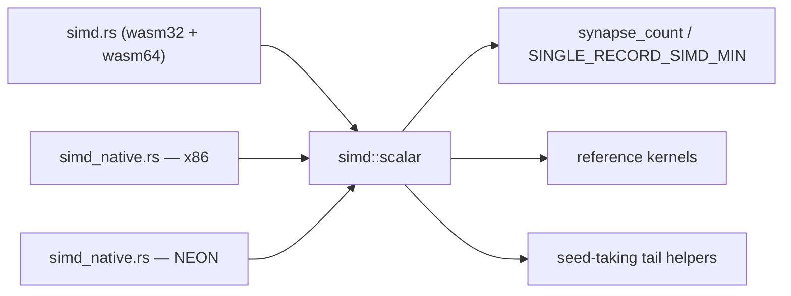
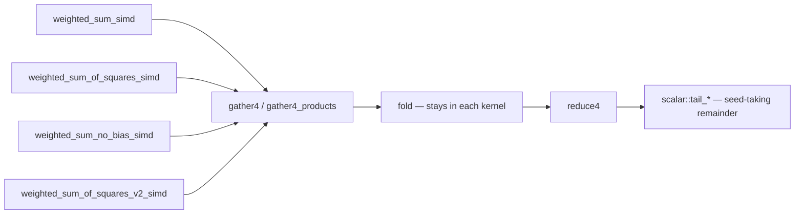
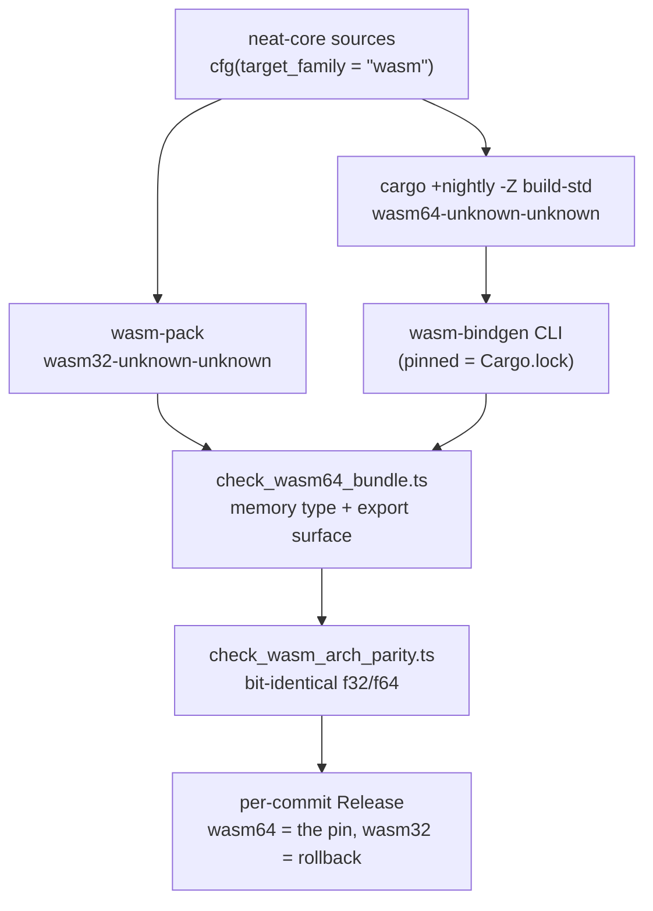

# AGENTS.md

> [!IMPORTANT]
> **Family-wide engineering policy lives once, in
> [`NEAT-AI/docs/ENGINEERING_PRINCIPLES.md`](https://github.com/stSoftwareAU/NEAT-AI/blob/Develop/docs/ENGINEERING_PRINCIPLES.md)** — read it before changing
> behaviour. It is written for human contributors and coding agents equally, so
> there is no agent-only dialect here: this file holds what is specific to
> *this* repository — the Rust/core invariants, the build and gate mechanics,
> and the local reading of the shared rules. Shared policy is linked from here,
> never restated (NEAT-AI#3979).

## Family-wide engineering principles

The canonical policy — TDD, one implementation owner per capability, DRY across
the family, small independently revertible migrations, application-agnostic
public libraries — is
[`NEAT-AI/docs/ENGINEERING_PRINCIPLES.md`](https://github.com/stSoftwareAU/NEAT-AI/blob/Develop/docs/ENGINEERING_PRINCIPLES.md). Read it there. What follows is
only what those rules mean **here**, in the shared native core:

- **Core is the receiving end of a TypeScript → Rust migration**
  ([principles 6–7](https://github.com/stSoftwareAU/NEAT-AI/blob/Develop/docs/ENGINEERING_PRINCIPLES.md#6-migrate-typescript--rust-incrementally-and-finish-each-step)).
  A capability moves only once Rust parity — or a deliberate, tested and
  documented improvement — is proven against the existing TypeScript tests for
  it; ownership then sits with `neat-core`, and the same migration deletes the
  superseded TypeScript implementation together with any helper left without a
  caller. No runtime fallback, shadow execution or long-lived dual path survives
  the cut-over: a consumer that cannot reach the native side
  [fails loud](https://github.com/stSoftwareAU/NEAT-AI/blob/Develop/docs/ENGINEERING_PRINCIPLES.md#7-no-fallback-no-shadow-implementation-no-long-lived-dual-path)
  naming the fix. If core cannot yet serve a scenario, improve core first rather
  than cutting that scenario over.
- **A defect found after a migration starts with the smallest reproducing test**
  ([principle 2](https://github.com/stSoftwareAU/NEAT-AI/blob/Develop/docs/ENGINEERING_PRINCIPLES.md#2-a-post-release-defect-starts-with-the-smallest-reproducing-test)).
  Write the smallest test that reproduces it against `neat-core`, watch it go
  red, then fix the canonical implementation here. Never patch around the defect in a consumer, and never
  revive the deleted TypeScript path to work around it.
- **Rollback is a repin, not a duplicate implementation**
  ([principle 8](https://github.com/stSoftwareAU/NEAT-AI/blob/Develop/docs/ENGINEERING_PRINCIPLES.md#8-rollback-is-versioning-and-pinning-not-duplicate-code)).
  NEAT-AI pins a published revision of this crate — `neatCore.rev` with its
  `assetSha256` — so a bad release is rolled back by re-pinning the last
  known-good revision and rebuilding the bundle. NEAT-AI-scorer takes no pin at
  all: it compiles against the tip of `Develop` through a path dependency
  ([README](README.md#neat-ai-scorer-rust--path-dependency)), so its lever is
  the semver break signal plus a revert here. Either way the recovery is a
  version move in this repository — never a second, parallel implementation
  kept alive as the rollback lever. Version and release mechanics:
  [`RELEASING.md`](RELEASING.md).
- **The ownership fence below is
  [principle 10](https://github.com/stSoftwareAU/NEAT-AI/blob/Develop/docs/ENGINEERING_PRINCIPLES.md#10-shared-logic-belongs-in-the-lowest-sensible-reusable-component)
  in local form** — shared per-sample logic belongs here; host orchestration
  stays with the product that runs it.

## TDD (required)

[Principle 1](https://github.com/stSoftwareAU/NEAT-AI/blob/Develop/docs/ENGINEERING_PRINCIPLES.md#1-test-driven-development-tdd-comes-first) owns the
rule; what follows is only how it is discharged in this crate:

- Do not land Rust changes without **tests** in `neat-core` (or the relevant crate) and a green **`cargo test --workspace`**.
- **Characterisation-test exception — pure extractions only.** Collapsing N identical copies into one helper adds no behaviour for a failing-first test to describe, so write the tests against the **pre-change copies**, run them green there, and keep them green through the extraction (that is what proves the refactor behaviour-preserving — `pr-summary-442.md`). The red run you skip is repaid by the mutation evidence below: a characterisation test that never fails is worth nothing.
- Run **`./quality.sh`** before commit/PR.

## Testing: "what" not "how"

All test cases must be **"what" tests** — [principle 3](https://github.com/stSoftwareAU/NEAT-AI/blob/Develop/docs/ENGINEERING_PRINCIPLES.md#3-tests-describe-behaviour-not-implementation), whose concrete list of what is ruled out in this repository is this one:

- **What tests** run real code paths and assert on **observable outcomes**: return values, errors, compiled structures, numerical results, public invariants.
- **How tests** tie to **implementation detail** and are discouraged: asserting on private fields, internal call order, source greps, line counts, or "this helper was invoked" unless the contract under test is explicitly that wiring.

Name tests after the behaviour or outcome (e.g. `relu_maps_negative_to_zero`), not the mechanism (`relu_calls_clamp_branch`).

## Oracles and mutation evidence

A green test is not evidence. What a reviewer needs is evidence the test **can
fail** — and this repo has repeatedly shipped tests that could not. These five
rules are the de facto merge gate for refactors here, absorbed from the
oracle-integrity campaign: the oracle rules from PRs #409, #476, #478, #479, and
the mutation-evidence practice from PRs #387, #388, #442, #443, #444, #446, #480.

### 1. An oracle **must not share** the code path under test

`flat_record_scoring_parity.rs` compared `score_records_flat` against
`score_records` — both fed the *same* `score_batch_into`, so a fault in the
kernel moved both sides of the assertion and the test stayed green (#409). A
parity oracle must reach the expected value by an **independent** route: score
each record on its own through the scalar `activate` forward pass, or keep the
**pre-change** implementation verbatim in the test module as a
**differential** reference (#387, #388).

Independence has an honest price: the batched path re-associates its sums and
uses the vectorised squash approximations, so the assertion drops from
bit-exact to a stated **tolerance** (`TOL = 1e-3`, matching
`score_squash_simd_parity.rs`). Take the tolerance — a real lane or stride slip
is an O(1) error, far above it. Never buy bit-exactness back by re-pointing the
oracle at the kernel.

### 2. A refactor that collapses N copies must kill **every former site**

Prove the new test reaches each copy *before* merging them: mutate one site at a
time (e.g. `1 => sum.max(0.0)` → `sum.max(0.1)`) and record that the suite goes
red for it. #443's sweep over all eleven copies of the inline-squash rule found
two the suite never reached — the 4-record remainder inside the 8-way macro and
the scattered MSE kernel — and the tests were tightened (alternating input signs,
a mixed aggregate/standard network) until all eleven died. List the per-site
results in the PR summary, and revert every mutation before commit. Two
independent nets are better than one: #446 gets a **compile error** from the
pattern macro *and* test failures from the predicate.

### 3. No **vacuous** oracles — derive the expected value

These shapes have all shipped here and all pass against broken code (#479):

- `assert!(result.is_finite())` and `assert!(result.abs() <= 100000.0)`;
- bare magic lengths (`assert_eq!(result.len(), 28)`);
- a loose inequality on a fixture where the branch under test never fires
  (`count == 1` against sqrt-scaling that only arms at `count > 1`).

Replace each with the value the documented formula requires, and write the
**derivation** beside it — `28` becomes `BATCH_4WAY * WEIGHT_SLOTS_PER_SYNAPSE`,
`is_finite()` becomes `assert_close(result, 1.5)` with the blend/clamp steps
spelled out. If a fixture cannot arm the branch, build one that does, and guard
against a vacuous `0 == 0` pass.

### 4. A gate self-test must compile the **live pattern**, not a private copy

Three bats suites asserted "this regex rejects known-bad input" against a second
copy of the regex, so gutting the live pattern to `.*` failed nothing (#478).
Each pattern gets exactly **one** definition — exported from `setup()` and
compiled by both the sweep over the real files and the good/bad literal check.
Read it in a **quoted** heredoc (`<<'PY'` with `os.environ[...]`), never `<<PY`,
so the shell cannot interpolate or re-escape the pattern text.

### 5. Test the oracle itself with **synthetic** input when production cannot

A hand-copied parity oracle sliced record 2 with record 0's length and stayed
green, because every record in that fixture happened to be the same length
(#476).
When production cannot construct the edge case that would expose an oracle bug,
**test the oracle** directly: a synthetic buffer with distinct per-record
lengths, plus fail-loud assertions for a header that overruns or undercovers the
payload. An oracle with untested edge cases is production code without tests.
`split_batch_records` (#476) walks the batch header loop-derived, so every
record is sliced with its own length — the `len0`/`len2` slip is no longer
expressible, and the synthetic tests catch header-overrun and undercover cases.

`tests/scripts/oracle_mutation_evidence.bats` pins these rules.

## Repository layout

- **`neat-core/`** — shared native library; **WASM** stays in **NEAT-AI** (`wasm_activation`).
- **`training_bin_stream`** (`neat-core/src/training_bin_stream.rs`) — **one** chunked `.bin` scan API: pipelined double-buffer reads on native hosts, sequential `File::read` chunks on the wasm family (same `for_each_read_chunk` callback). Used by **NEAT-AI-scorer** for production-sized forward-only scoring.
- Root **`Cargo.toml`** is a **virtual workspace**; **`[workspace.package].version`** is what the PR **auto-bump** job edits; **`neat-core`** uses `version.workspace = true`.

## Build profiles (Issue #546)

Root `Cargo.toml` owns both profiles, workspace-wide: `[profile.dev]` carries
`debug = "line-tables-only"` (fast rebuilds, panic `file:line` kept) and
`[profile.release]` carries `opt-level = 3`, `lto = "fat"`, `codegen-units = 1`
(most optimised artefact, compile time irrelevant). Stable Rust only — no
nightly profile flags. Never add `-C target-cpu=native` to this repo: the
`wasm32`/`wasm64` bundles and downstream consumers must stay portable, and
because cargo takes profiles from the **crate being built**, a library's
`[profile.*]` never reaches a consumer — each binary crate carries its own
settings and its own target-cpu choice.
`tests/scripts/rust_build_profiles.bats` is the gate; the rationale and the
measured dev-build numbers are in [README "Build profiles"](README.md#build-profiles-issue-546).

## Ownership fence (Issue #544)

Native training is split across two FFI surfaces, and this crate owns exactly
one of them: the **per-sample** primitives. **NEAT-AI-Backpropagation**
(`libneat_ai_backpropagation`) owns the **directory epoch** loop — `trainDir`:
accumulate, apply, MSE accept/rollback, journal — and calls in one sample at a
time.

**Stays here.** Backpropagation and NEAT-AI-scorer depend on these, so they are
never deleted or narrowed as "unused":

- `propagate_topological_loop` (`neat-core/src/topological_backprop.rs`) and the
  byte-packed ABI codec `propagate_codec` — pinned at the out-of-crate boundary
  by `neat-core/tests/backprop_ffi_surface.rs`, which is what fails if either is
  narrowed to `pub(crate)`.
- `mse_mean_streaming` (`neat-core/src/loss.rs`) over `training_bin_stream`
  (`neat-core/tests/mse_streaming_directory.rs`).
- The training-data iterators (`training_data`, `training_state`) and the
  topology helpers (`topology_ops`, `topology_export`).

**Stays in NEAT-AI-Backpropagation.** Do not relocate into `neat-core`:

- the product `train` epoch loop over a directory (`trainDir`) and its
  `train.rs`-style orchestration;
- the journal, the CLI apply policy, the `traceStore` layout, and the
  sample-rate policy for memetic training.

Absorbing the epoch loop would pull journal and CLI apply policy into **every**
core consumer — the scorer and Discovery included — for a loop only the trainer
runs. New NEAT-AI scenarios are reached by FFI *to* Backpropagation, not by
moving host orchestration down here or by removing core primitives.

`tests/scripts/core_ownership_fence.bats` is the gate: it sweeps
`neat-core/src` for host-orchestration **item definitions** (`fn train_dir_…`,
`struct EpochJournal`, `mod trace_store`) and for `train.rs`/`journal.rs`-style
module files, and fails if one lands here. Prose that merely mentions an epoch
is free — the sweep matches definitions, not comments.

## Unsafe & SIMD invariants

The native SIMD hot path (`neat-core/src/simd_native.rs`) carries durable
soundness rules. They are load-bearing — an edit that ignores one either fails
the build or ships undefined behaviour. Absorbed from the SIMD/`unsafe`/
buffer-reuse campaign (PRs #11, #112, #154, #155, #165, #207).

The wasm half of this hot path is **not** compiled by any PR gate — run
`cargo check -p neat-core --target wasm32-unknown-unknown` before you merge a
change to it, per [CI / secrets](#ci--secrets).

### Load-time index validation is the soundness precondition for `get_unchecked`

The SIMD kernels read the activation buffer (sized to exactly `num_neurons`)
with **unchecked** indexing, `get_unchecked(from_index)`. A compiled network
declaring a synapse with `from_index >= num_neurons` would be an out-of-bounds
read — **undefined behaviour** on every `activate()`. This is guarded **once, at
load time**: `CompiledNetwork::new` rejects any out-of-range `from_index` with
`NetworkError::InvalidSynapseIndex` (`neat-core/src/network.rs`). A network
that loads successfully is guaranteed in-range, so the `get_unchecked` calls are
sound and the hot path stays branch-free. **Never remove or bypass that check as
"redundant" — doing so reintroduces UB behind `get_unchecked`.** (See also the
memory-safety note in [`SECURITY.md`](SECURITY.md#memory-safety-of-compiled-network-loading).)

Since Issue #625 the check is the **only** way in, and it cannot be outrun after
the fact: every `CompiledNetwork` field is private, so safe code outside the
crate can neither rewrite a validated `synapses` / `hot_from` / `activations` nor
assemble the struct as a literal. Consumers read the state through borrow-only
accessors (`synapses()`, `hot_from()`, `activations()`, …), and
`CompiledNetwork::from_parts` is the one entry point for parts already in memory
— it re-runs the index check and also rejects a neuron whose
`start_synapse + num_synapses` overruns the synapse table
(`NetworkError::InvalidSynapseSpan`), which is the span half of the same
contract. Never widen a field back to `pub`, and never add a `&mut` accessor for
one: that is the hole #625 closed.
The gate is the `compile_fail` doctest pair on `CompiledNetwork`
(`neat-core/src/network.rs`): a doctest compiles as its own crate linking
`neat_core`, so it is an out-of-crate safe caller. One half must not compile; its
companion reads the same fixture through the accessors and does compile and run,
so the refusal cannot come from a broken fixture.

The wasm `gather4` scaffold helper (`simd.rs`) rests on the same invariant
since Issue #509 — it reads four `SynapseData` entries and four indirect
activations unchecked. `checked-gather4` restores the bounds-checked control if
a build ever needs it; the numbers behind that default are in
[`docs/research/wasm-gather4-unchecked-loads.md`](docs/research/wasm-gather4-unchecked-loads.md),
and `neat-core/tests/unchecked_gather_invariant.rs` pins the load-time guard
that makes it sound — including rejection from **every** lane position of a
span, which a 4-wide gather needs and the single-synapse unit tests do not
cover.

### The kernel a caller reaches depends on who holds the invariant

The load-time validation above only covers callers that **hold a loaded
network**. Nothing establishes it for a downstream crate calling
`neat_core::simd` directly, so every kernel is exported in two forms
(Issue #613) and choosing the wrong one is either unsound or slow:

- `weighted_sum_simd`, `weighted_sum_simd_8records`,
  `weighted_sum_interleaved`, … — **safe** `pub fn`s. Each runs the matching
  `simd::bounds` predicate over the span first and, when it does not hold,
  refuses the call with a panic rather than reaching an unchecked read. These
  are the only kernels safe caller code may reach.
- `weighted_sum_simd_unchecked`, `weighted_sum_simd_8records_unchecked`,
  `weighted_sum_interleaved_unchecked`, … — **`unsafe` `pub fn`s** carrying the
  index precondition as a `# Safety` contract. `CompiledNetwork`'s own forward
  and batched-scoring paths call these, discharging the contract from the
  load-time validation, which is why the hot path pays nothing.

A safe kernel handed a span it may not read **fails loud** — it panics through
`bounds::reject_span` / `bounds::reject_interleaved_span` rather than answering
from a truncated span. Both halves of the contract are refused the same way, on
both targets: an out-of-range `from_index`, and an `end` past the synapse slice.

`simd::bounds` is the **one** home of the predicates. Never re-inline a span
check into a kernel, never bypass one by making a safe kernel reach an
unchecked read, and never widen a hot-path caller to the safe form "to be
tidy" — the pre-pass measured **+33% to +64%** on `forward_pass` when it was
prototyped on the hot path (Issue #613). The isolated cost is reproducible from
the committed tree: `cargo bench -p neat-core --bench hot_paths -- weighted_sum_simd`
reports `single` (the `*_unchecked` hot-path form) beside `single_checked` (the
safe entry point).

### `unsafe` blocks under `unsafe_op_in_unsafe_fn = "deny"`

`Cargo.toml` sets `[workspace.lints.rust] unsafe_op_in_unsafe_fn = "deny"`, and
`neat-core` opts in via `[lints] workspace = true`. Inside a `#[target_feature]`
function this changes how intrinsics must be wrapped:

- A **pure compute intrinsic whose required feature is already enabled** is
  *safe* to call and must **not** be wrapped in `unsafe { … }` — wrapping it
  trips the `unused_unsafe` lint and fails the `-D warnings` build.
- Only these genuinely need an `unsafe { … }` block: `get_unchecked` indexing
  and its pointer derefs, and pointer load/store intrinsics (`vld1q_f32` /
  `vst1q_f32`, `_mm_storeu_ps` / `_mm256_storeu_ps`). An intrinsic needing a
  feature the enclosing fn does **not** enable is **not** on that list: wrapping
  it in `unsafe { … }` does not make it sound. Add the feature to the fn's
  `#[target_feature]` list instead, and detect it at dispatch — see the
  AVX2/FMA bullet below (Issue #605).
- Every SIMD `unsafe` block must be **discharged in writing**, one of two ways
  (Issue #605):
  - a `# Safety` doc on the enclosing `unsafe fn` covers every `unsafe {` block
    in its body. A kernel's index and target-feature preconditions belong in
    that one contract — the caller is who must satisfy them — not re-copied onto
    each of its eight blocks.
  - otherwise the block carries its own `// SAFETY:` note. This is **required**
    for every `unsafe` block in a *safe* fn.

  A written discharge names **the obligation that block actually discharges**.
  There are two, and a note that names the wrong one is as bad as no note
  (Issue #613):
  - **Feature availability** — a block calling a `#[target_feature]` fn names
    the `is_*_feature_detected!` guard (`is_x86_feature_detected!` /
    `is_aarch64_feature_detected!`) proving the callee's precondition.
  - **Index validity** — a block calling a `*_unchecked` kernel or a
    `scalar::tail_*` helper names the load-time `CompiledNetwork::new`
    validation (or the `simd::bounds` predicate that has just run), since those
    kernels' contracts are about indices, not features.

  A block that crosses both obligations names both.

  `tests/scripts/unsafe_block_safety_notes.bats` sweeps the live sources
  (`simd_native.rs`, `simd.rs`, `simd/scalar.rs`, wasm half included) and fails
  on a block with neither, and on an `unsafe fn` with no `# Safety` doc at all —
  the prose gate `unsafe_simd_invariants.bats` reads only AGENTS.md and
  SECURITY.md, never a line of Rust.
- A `#[target_feature]` list must enable **every** feature its intrinsics need,
  and the runtime guard in front of it must detect **every** feature that list
  enables. **AVX2 does not imply FMA**: `_mm256_fmadd_ps` reached through an
  `avx2`-only guard is undefined behaviour on a CPU (or hypervisor) that masks
  FMA, so the AVX2 record kernels carry
  `#[target_feature(enable = "avx2", enable = "fma")]` and dispatch through
  `avx2_fma_kernels_enabled(avx2_detected, fma_detected)` (Issue #605). The same
  bats sweep enforces the guard-covers-the-list half: an `unsafe` block in a
  safe fn that calls a `#[target_feature]` kernel is red unless an
  `is_*_feature_detected!` check for each enabled feature stands between the two.

### Buffer reuse is sound only one-network-per-thread

Promoting scratch buffers to reused `CompiledNetwork` fields (to cut per-call
allocation) forces `&mut self` and is sound **only because each thread owns its
own `CompiledNetwork`** (`#[derive(Clone)]`, one per worker thread). When you do
this you **must**:

- **Reset every reused buffer per call** to the exact state a fresh allocation
  would have had (e.g. `fill(0.0)` then re-copy inputs; `clear()` traces).
  Otherwise a larger neuron's stale entries leak into a smaller one later in the
  same pass.
- **Add a state-leak regression test** asserting the reused-buffer path is
  byte-identical to the fresh-allocation path across differently-sized inputs.

## One IF decision-tree construction rule (Issue #555)

`neat-core/src/if_graft.rs` is the single home of the rule that builds an `IF`
node: which synapse carries which [`SynapseType`] role, that all three roles
must be present, that the node's own constants come first, and where the node
may sit so every edge still points forwards. `graft_if_node`, `graft_if_nodes`,
`graft_if_tree`, `graft_relay_node` and `graft_if_correction` all route through
one internal `NodePlan` — add a node kind there, never a second copy of the
placement rules — and every
rejection is a typed `GraftError` with **no creature produced** — a caller never
hand-edits neuron/synapse JSON to add a decision node, and NEAT-AI-Forests reads
its interpretation of the roles from here rather than inventing one.

`validate_creature_topology` is the gate at both ends. It **reuses**
`validate_creature_width`, `validate_topology_typed`,
`validate_structural_integrity` and `validate_no_duplicate_synapses` — do not
restate their rules here. The last of those is what carries the Issue #577 rule
that only an `IF` target may take two roles from one source. The ordering
gate runs only for `forwardOnly` creatures; a recurrent creature legitimately
carries backward edges, which that gate rejects by design. Those gates read
`u32` widths and indices, so the declared `input` / `output` / node counts are
bounded against `u32::MAX` before anything walks them — past it is
`GraftError::CountNotRepresentable`, never a silent narrowing (Issue #606). The
post-build check
is deliberate defence in depth: it is unreachable while the pre-checks are
complete, so it is exercised directly against synthetic creatures
(`neat-core/tests/if_graft.rs`, AGENTS.md oracle rule 5) rather than through a
graft.

`neat-core/src/decision_tree.rs` holds the canonical fixtures and their
documented expected outputs. `graft_if_correction` on `linear_base_creature()`
must reproduce `residual_correction_creature()` exactly — that equality is what
stops the helper and the fixture drifting apart, so change them together.
`neat-core/tests/decision_tree_fixture.rs` checks every case against a
hand-written reference tree (plain `if x > t` Rust, no shared kernel) through
both the single-record and the batched scoring paths.

## One width check for creature JSON (Issue #550)

`validate_creature_width` (`neat-core/src/creature.rs`) is the single home of
the rule that a `CreatureExport` must declare `input >= 1` and `output >= 1`.
`input` is the authoritative observation count and **cannot be re-derived from
`neurons`** (input neurons are not listed there), so the rule is enforced at
every boundary — `parse_creature_json` (after serde), `compile_creature`
(before any other validation) and `creature_to_json` / `creature_to_json_pretty`
(a widthless creature is never *written*) — with the typed
`CreatureError::InvalidInputCount { found }` / `InvalidOutputCount { found }`.
There is no `#[serde(default)]` on either field and there never will be: a
missing key is a serde error, not a silent zero. Adding a new entry point that
accepts or emits creature JSON means calling the helper there; do not re-inline
the comparison. `neat-core/tests/creature_width_contract.rs` pins the rule at
all four sites (each was mutation-checked individually — dropping any one call
fails its own tests).

## `serde_json` keeps `float_roundtrip` (PR #571)

`neat-core/Cargo.toml` builds `serde_json` with `features = ["float_roundtrip"]`
and that is load-bearing, not tidying. The default number parser is a fast
approximation that can land **1 ULP** from the `f64` a literal names, while
JavaScript `JSON.parse` and `f64::from_str` are exact — so without the feature a
creature weight loaded here differs from the one NEAT-AI's TypeScript loaded and
the two engines score different networks. Nothing fails when that happens; the
number is simply wrong, which is why a dependency-hygiene sweep must never drop
the feature as unused, and why it is not exposed as a crate feature a consumer
could switch off. `neat-core/tests/creature_float_roundtrip.rs` is the gate —
removing the feature turns all five of its tests red.

## One activation rule for single-record work (Issue #441)

`neuron_activation_scalar` (`neat-core/src/batch_scoring.rs`) is the single home
of the rule that turns a neuron's synapse range into an activation — constants,
the six aggregate squashes (Minimum/Maximum/If/Hypotenuse/HypotenuseV2/Mean),
the standard weighted-sum fall-through, then `apply_limit_range`. **Every**
batched kernel that drops to one record at a time (the per-lane aggregate loops
and the scalar tails in `loss.rs`) calls it, so a record's activation never
depends on whether it landed in a full SIMD group or in the remainder. Adding a
squash type means editing that helper only — do not re-inline the match.

`CompiledNetwork::activate` / `activate_into` deliberately keep their own copy:
routing them through the helper measured ~30–46% slower on the `forward_pass`
benchmark. Change the helper and those two together, and re-run
`cargo bench --bench hot_paths -- forward_pass` if you touch them.

## One hot-squash dispatch for standard neurons (Issue #443)

`inline_squash` (`neat-core/src/batch_scoring.rs`) is the single home of the
*other* half of that rule: which squash types are hot enough to branch inline
(`0` Identity, `1` ReLU, `6` Logistic, `7` Tanh) and the exact scalar formula
each uses, with everything else deferring to `apply_squash`. Every site that
squashes a standard weighted sum calls it — the three single-record forward
passes in `network.rs`, the 4-way traced batch, and the scalar `None`-fallback
branch of every batched loss and scoring kernel — so the SIMD-batched and
scalar-tail paths agree bit-for-bit. Promoting a fifth type to the inline set,
or reformulating one of the four, is an edit **there and nowhere else**; do not
re-inline the match. `neat-core/tests/inline_squash_dispatch.rs` pins the rule
across every public activation path.

The *vectorised* `squash_x4` / `squash_x8` approximations
(`neat-core/src/squash_simd.rs`) are a different rule and stay where they are —
only their scalar fallback goes through `inline_squash`.

## One aggregate-squash set for dispatch and hints (Issue #446)

`SquashType::is_aggregate` (`neat-core/src/squash.rs`) is the single home of the
rule that says *which squash types are aggregates* — Minimum, Maximum, If,
Hypotenuse, HypotenuseV2, Mean: the six that cannot be lane-vectorised and must
take the exact single-record kernel. That one predicate drives both dispatch
(`has_aggregate_squash`, the 8-record and 4-record group loops in
`batch_scoring.rs`, and the same two tiers inside `batch_8way_activation!`) and
hint semantics (`activate_and_trace` reports the activation itself as the hint;
`apply_unsquash` prefers the caller's hint). Adding a seventh aggregate type is
an edit **there and nowhere else** — do not restate the membership list at a
call site, because a missed site fails **silently**: the new type would be
routed down the lane-vectorised weighted-sum path and produce numbers that
differ from `activate()` with no panic to flag it.

`apply_unsquash` is the one site that needs the set as a *pattern* rather than a
predicate — a guard arm would forfeit the compiler's exhaustiveness check over
`SquashType`. It uses `aggregate_squash_patterns!()`, the `pub(crate)` macro the
predicate itself is built from, so there is still exactly one list.
`neat-core/tests/aggregate_squash_set.rs` pins the rule: membership, batched-vs-
single-record parity for every squash type, and both hint semantics.

## One packed-record scan for every loss entry point (Issue #444)

`packed_record_scan` (`neat-core/src/loss.rs`) is the single home of the rule
that carves a packed `[inputs…, targets…]` buffer into records: the stride is
`input_size + num_outputs` (`packed_layout`), only whole records count, a
record's targets start immediately after its inputs, and each record is
activated statelessly unless the caller declares the network forward-only. All
eight entry points — the seven `*_sum_batch_packed` kernels and `mse_mean_record`
— call it with a closure carrying **only** their per-output reduction, so the
per-record `1/num_outputs` factor lives in the closure (which is what keeps MSLE
and hinge deliberately un-averaged).

The driver takes a closure and **no mode flags**: SIMD dispatch stays at the
callers, where it genuinely differs (MSE falls back through the 8-way *and*
4-way paths; `categorical_error_sum_batch_packed` uses neither and keeps its own
`num_outputs == 0` guard). If unifying a future entry point needs a boolean to
switch the driver's behaviour, leave that entry point out rather than growing a
flag. `neat-core/tests/packed_record_scan.rs` pins the rule across all eight.

## One scalar per-record MSE reduction (Issue #538)

`mse_record` (`neat-core/src/loss.rs`) is the single home of the squared-error
reduction: mean over outputs of `(target - output)^2`, accumulated in `f64`,
`0.0` for an empty record. The scalar `mse_sum_batch_packed` fallback,
`mse_mean_record`, and the streaming directory helper all call it, and it is
**public** so consumers holding their own activations (the
NEAT-AI-Backpropagation trace pass) stop re-deriving the maths. The SIMD tiles
(`interleaved_tile_mse`, `mse_sum_batch_scattered`) read strided/interleaved
buffers and are bit-parity-critical — they keep their inlined reduction.

`mse_mean_streaming` is the directory entry point built on it: chunked reads via
`training_bin_stream`, whole chunks scored through `mse_sum_batch_packed` so the
tiled SIMD path still runs, and `(0.0, 0)` for a directory with no whole records
— the caller decides whether that is an error.
`neat-core/tests/mse_streaming_directory.rs` and
`neat-core/tests/mse_streaming_chunk_boundary.rs` pin both against a
single-record `activate` oracle.

## One batched record-scan skeleton for every loss kind (Issue #445)

`batch_8way_activation!` (`neat-core/src/loss.rs`) is the single home of the
rule that walks a packed record buffer: records are grouped **8 → 4 → 1**, each
group's inputs are loaded into per-lane activation buffers, and the per-record
errors accumulate into one `f64` sum. All six loss kinds — MSE included, via
`mse_sum_batch_scattered` — invoke it with a closure carrying **only** their
per-record reduction (`(records, target_base, act, output_start, num_outputs) ->
f64`). Changing the grouping (a 16-lane tier, a different remainder strategy) is
an edit **there and nowhere else**; do not re-inline the skeleton.

The record-**interleaved** tiled path (`mse_sum_batch_8way_interleaved` →
`mse_sum_batch_interleaved::<R>`, Issue #384) is a genuinely different memory
layout and stays separate. Its tile width is the single constant
`loss::MSE_TILE_LANES` (Issue #530, `32`); the `< R` remainder steps down whole
8-record interleaved tiles, then the same 4-way and scalar per-lane kernels, so
every tier is bit-identical. Two rules make the width a free knob and both are
load-bearing: `interleaved_tile_mse` is **seed-taking** — it takes the running
`f64 sum_error` and returns it, because a per-tile partial sum re-associates the
reduction and breaks bit-parity — and the tile transpose walks **input-major**,
writing a neuron's `R` lanes to consecutive `mse_inter` slots, because
lane-major revisits the whole `num_inputs * R` region once per lane and stops
fitting in L1 as `R` grows. `loss::interleaved_mse_parity` pins both across
widths 8/16/32/64.

## One struct-of-arrays hot view for the interleaved gather (Issue #533)

`hot_synapse_soa` (`neat-core/src/network.rs`) is the single home of the rule
that says what `CompiledNetwork::hot_weights` / `hot_from` contain: exactly
`synapses[i].weight` and `synapses[i].from_index`, in the order `synapses` holds
them. **Every** construction path calls it — the binary deserialiser
`CompiledNetwork::new` and `compile_creature` — so the two views cannot drift.
The record-interleaved kernels (`weighted_sum_interleaved::<R>` and its
scalar/AVX2/NEON/wasm variants) take the two slices instead of
`&[SynapseData]`, streaming **6 B** per synapse instead of 8; `synapse_type`
stays on `SynapseData` for the aggregate/IF and single-record paths, which are
untouched. Numerics are unchanged — same values, same order.

The redundancy is the hazard. Since Issue #625 the fields are private and
`from_parts` *derives* the hot view rather than accepting one, so no caller
outside the crate can assemble a drifted literal or mutate `synapses` after the
fact — but they are still two vectors, so an in-crate edit can drift them.
`CompiledNetwork::debug_assert_hot_soa` is the fail-loud guard: every entry point
into the interleaved gather calls it, so a drifted view panics in debug and test
builds instead of silently scoring wrong numbers, and compiles away in release.
`neat-core/tests/hot_synapse_soa.rs` pins the invariant across every construction
path and `Clone`; the guard itself is pinned by
`loss::interleaved_mse_parity::a_drifted_hot_view_fails_loud_instead_of_scoring_wrong_numbers`,
which drifts the view in-crate — the only level at which drift is still
expressible.

`load_record` (`neat-core/src/batch_scoring.rs`) owns the loading sub-rule:
copy `min(record.len(), num_inputs)` values and **zero** every input slot the
record does not cover. Every per-lane loader in the batched scoring and fused
loss kernels calls it, so a record scored in a SIMD group, in the 4-record
remainder, or in the scalar tail sees the same inputs.
`neat-core/tests/batch_record_skeleton.rs` pins the rule across every packed
loss entry point.

The three single-record entry points (`CompiledNetwork::activate`,
`activate_into`, `activate_and_trace`) route their input copy through the same
helper, via the private `load_inputs` (Issue #519). They previously copied
`min(len, num_inputs)` and stopped, so the reused activation buffer left a
**previous call's** values in the slots a narrower record did not cover, and the
same record scored differently through the single-record and batched paths.
`neat-core/tests/short_input_zero_fill.rs` pins the agreement. Only the input
copy is shared — the activation rule itself stays inlined in those entry points
for the performance reason in the Issue #441 section above.

## One ISA-neutral scalar layer for every weighted-sum kernel (Issue #447)

`neat-core/src/simd/scalar.rs` is the single home of the rule that says what a
weighted-sum kernel *means*: the reference scalar semantics of each kernel and
the small-count guard in front of it — the thing every SIMD path must agree with
bit-for-bit. It carries no intrinsics and no `cfg`, so the wasm kernels in
`simd.rs` and the x86/aarch64 kernels in `simd_native.rs` share one copy.

Two layers, deliberately distinct:

- **Reference kernels** (`weighted_sum`, `weighted_sum_of_squares`,
  `weighted_sum_no_bias`, `weighted_sum_of_squares_v2`) seed their own
  accumulator and index safely. Every target's below-threshold count
  (`synapse_count(start, end) < SINGLE_RECORD_SIMD_MIN`) falls back to them.
- **Seed-taking tail helpers** (`tail_sum`, `tail_sum_of_squares`,
  `tail_sum_of_squares_v2`) take the caller's **running** accumulator, so a SIMD
  kernel's 0..3 remainder continues the reference f32 rounding order instead of
  starting a second sum. They cannot be replaced by the reference kernels — that
  would reseed and break the bit-parity the tests rely on. They index with
  `get_unchecked` under the load-time index-validation invariant above, so they
  are `unsafe fn` with a `# Safety` contract; calling them from a
  `#[target_feature]` fn is sound and inlinable because no vector types cross the
  boundary.

`synapse_count` is the count prologue: **saturating**, so a reversed range
(`end < start`) counts as zero instead of underflowing. Every kernel prologue on
both sides uses it — no raw `end - start`, no hard-coded `4`.

Changing the accumulation order, the guard, or the threshold is an edit **there
and nowhere else**; do not re-inline a scalar loop into an ISA module.
`neat-core/tests/simd_scalar_layer.rs` pins the rule: splitting a range at any
point and continuing through a tail helper reproduces the reference result
exactly, and below the threshold the public kernels are bit-identical to the
reference.

## One chunk-walk scaffold for the wasm weighted-sum kernels (Issue #448)

The scaffold helpers at the top of `neat-core/src/simd.rs` — `gather4`,
`gather4_products`, `reduce4` — are the single home of the rule that says *how a
wasm kernel walks a synapse span*: chunk into fours, gather weights and
activations into `f32x4` lanes, fold, reduce the lanes, then finish the 0..3
remainder from the **running** accumulator through the `scalar::tail_*` helpers
(Issue #447). All four single-record kernels — `weighted_sum_simd`,
`weighted_sum_of_squares_simd`, `weighted_sum_no_bias_simd`,
`weighted_sum_of_squares_v2_simd` — call them, so a change to the walk lands on
every kernel at once. It previously did not: the Issue #1197 dual-accumulator
rework reached `weighted_sum_simd` alone and the doc on
`weighted_sum_no_bias_simd` claimed otherwise for four releases.

Two constraints on anyone editing the scaffold:

- **Every helper touching `v128`/`f32x4_*` must repeat
  `#[target_feature(enable = "simd128", enable = "relaxed-simd")]`** — without it
  the intrinsics do not compile and the vector arguments do not inline into the
  caller.
- **The fold stays in each kernel.** These are calls, not a parameterised
  super-helper: plain FMA, square-the-product, and square-the-biased-product are
  genuinely different folds, and unifying them would need a mode flag. If a
  future kernel only fits behind a flag, leave it out of the scaffold instead.

The dual-accumulator form (two chains, chunks of eight) is still on
`weighted_sum_simd` only, and the docs now say so; promoting the other three is
a fold-level edit on top of the shared walk.

`neat-core/tests/simd_chunk_walk_scaffold.rs` pins the rule: every kernel
reproduces its `simd::scalar` reference from **any** offset (not just
`start == 0`), the remainder continues the span rather than restarting it, and a
reversed span yields the kernel's seed. Those assertions run natively against
the `simd_native.rs` kernels; to execute them against the **wasm** kernels, run
them on a real runtime through `wasm-bench/` (Issue #509) — `neat-core`'s own
test targets cannot be built for wasm because its `criterion` dev-dependency
refuses to compile for wasi. No PR gate compiles this file at all: check it with
`cargo check -p neat-core --target wasm32-unknown-unknown`, and for a numeric
edit diff the `f32` bit patterns under WASI, per
[CI / secrets](#ci--secrets).

## One wasm cfg for both address sizes (Issue #541)

The crate builds for **two** wasm targets — `wasm32-unknown-unknown` and
`wasm64-unknown-unknown` (Memory64) — and every wasm gate is keyed to
`cfg(target_family = "wasm")`, never `cfg(target_arch = "wasm32")`. On a wasm64
build `target_arch` is `"wasm64"`, so an arch-keyed gate fails **silently and
asymmetrically**: `Cargo.toml`'s dependency tables would drop `wasm-bindgen`
(no bindings) *and* pull in `rayon` (native-only) at the same time, while every
`#[cfg_attr(…, wasm_bindgen)]` export quietly vanished. Widen the family, do
not add a second arch arm.

`wasm_arch` (`neat-core/src/wasm_arch.rs`) is the one exception and the single
home of the split that genuinely is arch-shaped: `core::arch::wasm32` exists
only on wasm32, and the identical SIMD128 intrinsics live at
`core::arch::wasm64` on wasm64 (unstable `simd_wasm64`, enabled from the crate
root for that arch only). Both wasm kernels — `simd.rs` and
`elastic_distribution.rs` — import through it. A second copy is how a wasm64
build comes to compile one kernel and fail the other.

The shipped bundle is **dual-ship**, built and gated by
`scripts/build-wasm-bundle.sh --arch <wasm32|wasm64>`:

- **wasm32** goes through `wasm-pack`, as before.
- **wasm64** cannot: wasm-pack 0.15.0 still hard-codes `wasm32-unknown-unknown`
  as the cargo target it builds and reads back, so the lane drives
  `cargo +nightly … -Z build-std=std,panic_abort` and then the `wasm-bindgen`
  CLI itself. That is the *same* post-processing step wasm-pack would run — the
  July 2026 NO-GO was CLI **skew** (0.2.108 stripped the bindings), not a
  permanent gap, and the workflow now fails loud if the pinned CLI version and
  the `Cargo.lock` crate version disagree.

Three gates stand between a build and a published asset, and each exists
because the corresponding failure is otherwise silent:

1. `scripts/check_wasm64_bundle.ts` — the module's memory index type must match
   `--arch` (an i64 build that regressed to i32 still validates and still
   scores, right up to the 4 GiB wall the port exists to remove), and the
   activation/backprop surface must survive into **both** the `_bg.wasm` and
   the generated glue. A byte-size threshold cannot see a stripped glue.
2. `scripts/check_wasm_arch_parity.ts` — the two bundles share every kernel, so
   the committed fixture (`tests/wasm_arch_parity_fixture.ts`) must produce
   **bit-identical** `f32`/`f64` results across both. No tolerance: a tolerance
   would hide exactly the pointer-width slip this gate is for.
3. `verify-wasm-bundle.sh` — re-downloads each published asset and re-checks it.

This issue does **not** claim to fix V8 exit-133 JS-heap aborts; that ceiling is
the JS heap, and `--max-old-space-size` remains its lever (lane (a), #296).

## CI / secrets

- PR pipeline: version bump + **`./bump-deps.sh --quarantine-hours … --skip-build`** (a `cargo update` under the **`VIBE_BUMP_QUARANTINE_HOURS`** release-age quarantine, Issue #76), its advisory scan (**`cargo deny check advisories`**, falling back to **`cargo audit`**, and skipped-with-the-bump-reverted when neither is installed — Issues #598, #621), dependency review, rustfmt bot, then fmt/clippy/deny/tests/doc. `bump-deps.sh` exits non-zero **only** when the tree it produced must not be kept (cargo missing, an advisory, a build failure, an unrestorable `Cargo.lock`); a crate it cannot bump safely is a **deferral**, not a failure — a run that exits non-zero has its whole bump reverted, which is what disabled bumps here three runs running (Issue #621). Pushes need **`ACTIONS_PUSH`** (**org-level** PAT with **contents:write**).
- **`cargo upgrade --incompatible` is local-only** — it runs from `quality.sh` (guarded by `command -v cargo-upgrade`) and from **no workflow**. Do not "fix" CI to call it: a direct upgrade bypasses the quarantine `bump-deps.sh` applies, which is why `ci.yml` drops `cargo-edit` and `tests/scripts/ci_workflow_quarantine.bats` fails any unguarded invocation.
- **`ACTIONS_PUSH` is supplied just-in-time** (Issue #483): the `version-increment` / `auto-format` checkouts run with **`persist-credentials: false`** and no `token:`, and the PAT reaches only the one step that pushes, through an explicit `https://x-access-token:…` remote URL. Never hand it to a checkout — those jobs execute PR-authored code (`bump-deps.sh`, `cargo fmt`) that would then be able to read an org-wide credential off `.git/config`.
- **Versioning/release policy:** **`RELEASING.md`** is the single source of truth (Issue #251) — semver, what counts as breaking, and how to signal it. In CI the `version-increment` job bumps minor on a break (patch otherwise); the `version-gate` job **fails** a break shipped on a patch-only bump; `release.yml` cuts a **`v<version>`** tag + GitHub release on `Develop`, decoupled from `wasm-bundle-<sha>`.
- **`clippy::uninlined_format_args`** is not denied in CI until the test corpus is cleaned up; workspace lints still deny **`filter_next`** / **`collapsible_if`**.
- **`wasm32` is not gated on PRs — check it yourself before touching wasm-only code.** Neither `quality.sh` nor any `ci.yml` job builds for `wasm32-unknown-unknown` (the `wasm64-memory64-smoke` job is a Deno Memory64 runtime test plus the shipped-bundle gate unit tests, not a wasm32 build); the target compiles only *after* merge — on **push to `Develop`** through `wasm-bundle.yml`, and on the scheduled `upgrade-dependencies.yml` run, whose `bump-deps.sh` dual build the PR lane skips with `--skip-build`. The load-bearing manual check is **`cargo check -p neat-core --target wasm32-unknown-unknown`**. What it catches: deleting the last consumer of a `#[cfg(target_family = "wasm")]` block leaves an orphaned `use crate::wasm_arch::{…}` that every host gate compiles right past and only the bundle build rejects (Issues #422, #423). For **numeric** wasm changes go further, as Issue #448 did — compile to `wasm32-wasip1`, run under Node's WASI with `-C target-feature=+simd128,+relaxed-simd`, and diff the raw `f32` bit patterns before against after.
- **`wasm64` is ungated on PRs for the same reason, and costs more to check.** `wasm64-unknown-unknown` is a Rust **Tier 3** target: no prebuilt `std`, so it needs a nightly toolchain, the `rust-src` component and `-Z build-std` — `rustup target add` refuses it outright. The local check is **`cargo +nightly build -p neat-core --target wasm64-unknown-unknown --release -Z build-std=std,panic_abort`**. Both bundles are built and gated on push to `Develop` (see the wasm64 section below).
- **CI gates must be repo-owned and unconditional.** Never `if:`-gate a step on a file another repository owns: the Mermaid check was conditioned on a path that never exists here, so it skipped **every** run and a broken diagram merged (Issue #379). Its replacement, `scripts/check_mermaid.ts`, is owned by this repo and runs unconditionally from both `quality.sh` and `markdown-lint.yml`. Related budget rule: **GitHub rejects `timeout-minutes:` on a reusable-workflow *caller* job** — put it on the called workflow's own job instead (`ci.yml`'s `security` job calls `security.yml`, whose job carries `timeout-minutes: 30`; Issue #333).
