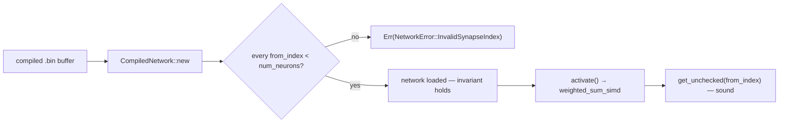

# AGENTS.md

## TDD (required)

- **Test-driven development:** new behaviour or bugfixes start from **failing tests**, then minimal implementation, then refactor. Do not land Rust changes without **tests** in `neat-core` (or the relevant crate) and a green **`cargo test --workspace`**.
- Run **`./quality.sh`** before commit/PR.

## Testing: "what" not "how"

All test cases must be **"what" tests** (same rule as **NEAT-AI** `CONTRIBUTING.md`):

- **What tests** run real code paths and assert on **observable outcomes**: return values, errors, compiled structures, numerical results, public invariants.
- **How tests** tie to **implementation detail** and are discouraged: asserting on private fields, internal call order, source greps, line counts, or "this helper was invoked" unless the contract under test is explicitly that wiring.

Name tests after the behaviour or outcome (e.g. `relu_maps_negative_to_zero`), not the mechanism (`relu_calls_clamp_branch`).

## Repository layout

- **`neat-core/`** — shared native library; **WASM** stays in **NEAT-AI** (`wasm_activation`).
- **`training_bin_stream`** (`neat-core/src/training_bin_stream.rs`) — **one** chunked `.bin` scan API: pipelined double-buffer reads on native hosts, sequential `File::read` chunks on `wasm32` (same `for_each_read_chunk` callback). Used by **NEAT-AI-scorer** for production-sized forward-only scoring.
- Root **`Cargo.toml`** is a **virtual workspace**; **`[workspace.package].version`** is what the PR **auto-bump** job edits; **`neat-core`** uses `version.workspace = true`.

## Unsafe & SIMD invariants

The native SIMD hot path (`neat-core/src/simd_native.rs`) carries durable
soundness rules. They are load-bearing — an edit that ignores one either fails
the build or ships undefined behaviour. Absorbed from the SIMD/`unsafe`/
buffer-reuse campaign (PRs #11, #112, #154, #155, #165, #207).

### Load-time index validation is the soundness precondition for `get_unchecked`

The SIMD kernels read the activation buffer (sized to exactly `num_neurons`)
with **unchecked** indexing, `get_unchecked(from_index)`. A compiled network
declaring a synapse with `from_index >= num_neurons` would be an out-of-bounds
read — **undefined behaviour** on every `activate()`. This is guarded **once, at
load time**: `CompiledNetwork::new` rejects any out-of-range `from_index` with
`NetworkError::InvalidSynapseIndex` (`neat-core/src/network.rs:326`). A network
that loads successfully is guaranteed in-range, so the `get_unchecked` calls are
sound and the hot path stays branch-free. **Never remove or bypass that check as
"redundant" — doing so reintroduces UB behind `get_unchecked`.** (See also the
memory-safety note in [`SECURITY.md`](SECURITY.md#memory-safety-of-compiled-network-loading).)

### `unsafe` blocks under `unsafe_op_in_unsafe_fn = "deny"`

`Cargo.toml` sets `[workspace.lints.rust] unsafe_op_in_unsafe_fn = "deny"`, and
`neat-core` opts in via `[lints] workspace = true`. Inside a `#[target_feature]`
function this changes how intrinsics must be wrapped:

- A **pure compute intrinsic whose required feature is already enabled** is
  *safe* to call and must **not** be wrapped in `unsafe { … }` — wrapping it
  trips the `unused_unsafe` lint and fails the `-D warnings` build.
- Only these genuinely need an `unsafe { … }` block: `get_unchecked` indexing
  and its pointer derefs; pointer load/store intrinsics (`vld1q_f32` /
  `vst1q_f32`, `_mm_storeu_ps` / `_mm256_storeu_ps`); and intrinsics needing a
  feature the enclosing fn does **not** enable (e.g. `_mm256_fmadd_ps` needs
  `fma` inside an `avx2`-only fn).
- Every SIMD `unsafe` block must carry a `// SAFETY:` note that **names the
  `is_*_feature_detected!` guard** (`is_x86_feature_detected!` /
  `is_aarch64_feature_detected!`) proving the callee's `#[target_feature]`
  precondition.

### Buffer reuse is sound only one-network-per-thread

Promoting scratch buffers to reused `CompiledNetwork` fields (to cut per-call
allocation) forces `&mut self` and is sound **only because each thread owns its
own `CompiledNetwork`** (`#[derive(Clone)]`, one per worker thread). When you do
this you **must**:

- **Reset every reused buffer per call** to the exact state a fresh allocation
  would have had (e.g. `fill(0.0)` then re-copy inputs; `clear()` traces).
  Otherwise a larger neuron's stale entries leak into a smaller one later in the
  same pass.
- **Add a state-leak regression test** asserting the reused-buffer path is
  byte-identical to the fresh-allocation path across differently-sized inputs.

## One activation rule for single-record work (Issue #441)

`neuron_activation_scalar` (`neat-core/src/batch_scoring.rs`) is the single home
of the rule that turns a neuron's synapse range into an activation — constants,
the six aggregate squashes (Minimum/Maximum/If/Hypotenuse/HypotenuseV2/Mean),
the standard weighted-sum fall-through, then `apply_limit_range`. **Every**
batched kernel that drops to one record at a time (the per-lane aggregate loops
and the scalar tails in `loss.rs`) calls it, so a record's activation never
depends on whether it landed in a full SIMD group or in the remainder. Adding a
squash type means editing that helper only — do not re-inline the match.

`CompiledNetwork::activate` / `activate_into` deliberately keep their own copy:
routing them through the helper measured ~30–46% slower on the `forward_pass`
benchmark. Change the helper and those two together, and re-run
`cargo bench --bench hot_paths -- forward_pass` if you touch them.

## One hot-squash dispatch for standard neurons (Issue #443)

`inline_squash` (`neat-core/src/batch_scoring.rs`) is the single home of the
*other* half of that rule: which squash types are hot enough to branch inline
(`0` Identity, `1` ReLU, `6` Logistic, `7` Tanh) and the exact scalar formula
each uses, with everything else deferring to `apply_squash`. Every site that
squashes a standard weighted sum calls it — the three single-record forward
passes in `network.rs`, the 4-way traced batch, and the scalar `None`-fallback
branch of every batched loss and scoring kernel — so the SIMD-batched and
scalar-tail paths agree bit-for-bit. Promoting a fifth type to the inline set,
or reformulating one of the four, is an edit **there and nowhere else**; do not
re-inline the match. `neat-core/tests/inline_squash_dispatch.rs` pins the rule
across every public activation path.

The *vectorised* `squash_x4` / `squash_x8` approximations
(`neat-core/src/squash_simd.rs`) are a different rule and stay where they are —
only their scalar fallback goes through `inline_squash`.

## CI / secrets

- PR pipeline: version bump + **`cargo upgrade --incompatible`**, **`cargo audit`**, dependency review, rustfmt bot, then fmt/clippy/deny/tests/doc. Pushes need **`ACTIONS_PUSH`** (PAT with **contents:write**).
- **Versioning/release policy:** **`RELEASING.md`** is the single source of truth (Issue #251) — semver, what counts as breaking, and how to signal it. In CI the `version-increment` job bumps minor on a break (patch otherwise); the `version-gate` job **fails** a break shipped on a patch-only bump; `release.yml` cuts a **`v<version>`** tag + GitHub release on `Develop`, decoupled from `wasm-bundle-<sha>`.
- **`clippy::uninlined_format_args`** is not denied in CI until the test corpus is cleaned up; workspace lints still deny **`filter_next`** / **`collapsible_if`**.
