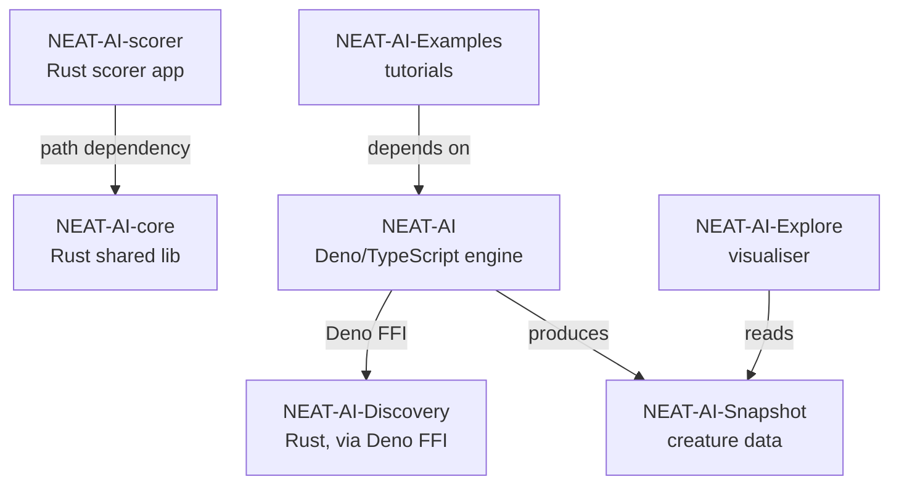
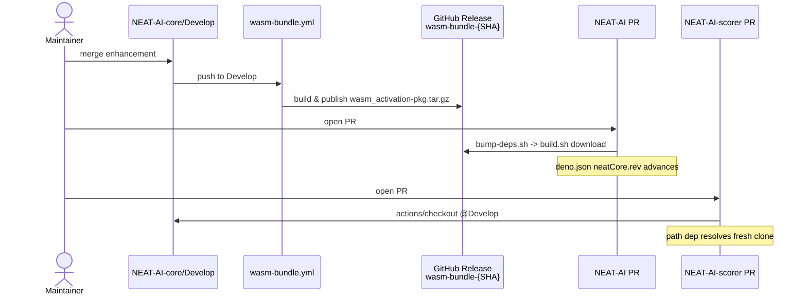

# NEAT-AI-core

**Native shared Rust** for [NEAT-AI](https://github.com/stSoftwareAU/NEAT-AI): the **`neat-core`** crate (tests included) lives here as a Cargo workspace member.

## Test-driven development

Development in this repository follows **TDD**: do not merge behaviour changes unless **`cargo test --workspace`** already covers them (extend tests first when fixing bugs or adding APIs). Run **`./quality.sh`** before every commit/PR.

## WebAssembly

**`wasm_activation`** and **`pkg/`** remain in the **NEAT-AI** repo on `Develop` — not in this repository.

## Layout

| Path | Role |
|------|------|
| `neat-core/` | Shared computation library; **140+** unit tests in `src/**/*.rs` plus integration tests in `neat-core/tests/` (>350 total). |
| `Cargo.toml` | Virtual workspace root; `[workspace.package]` holds semver for release automation. |
| `deny.toml` | `cargo deny` (licences, advisories, bans). |
| `quality.sh` | Local gate (fmt, clippy, tests, doc, deny, bats). |
| `bump-deps.sh` | Cargo dep refresh + audit + native/WASM build (Vibe Coder hook). |
| `tests/scripts/` | `bats` suites for shell helpers (e.g. `bump-deps.sh`). |
| `LICENSE`, `.gitleaks.toml` | Inherited from NEAT-AI `Develop`. |

## Build

```bash
export RUSTFLAGS="-D warnings"
cargo test --workspace
# or full gate:
./quality.sh
```

## Related Repositories

The NEAT-AI project is split across seven public repositories. Each focuses on one concern and composes with the others as shown below.

| Repository | Role |
|------------|------|
| [NEAT-AI](https://github.com/stSoftwareAU/NEAT-AI) | Primary Deno/TypeScript neural-network engine (evolution, training, WASM activation). |
| [NEAT-AI-core](https://github.com/stSoftwareAU/NEAT-AI-core) | Shared native Rust library (`neat-core`) with numerics, topology helpers, and the chunked `.bin` training stream. |
| [NEAT-AI-Discovery](https://github.com/stSoftwareAU/NEAT-AI-Discovery) | Rust discovery module invoked by NEAT-AI via Deno FFI to search architectures and hyper-parameters. |
| [NEAT-AI-Snapshot](https://github.com/stSoftwareAU/NEAT-AI-Snapshot) | Creature/genome snapshot format and fixtures produced by NEAT-AI and consumed by downstream tools. |
| [NEAT-AI-scorer](https://github.com/stSoftwareAU/NEAT-AI-scorer) | Production forward-only scoring application built on `neat-core` via a path dependency. |
| [NEAT-AI-Explore](https://github.com/stSoftwareAU/NEAT-AI-Explore) | Visualiser for creatures that reads NEAT-AI-Snapshot data. |
| [NEAT-AI-Examples](https://github.com/stSoftwareAU/NEAT-AI-Examples) | Worked examples and tutorials that depend on NEAT-AI. |

### Dependency graph



## Propagation to downstream repositories

Once an enhancement merges to `Develop` here, it flows automatically to the
next pull request raised in either consumer repository — no manual SHA bump
is required. The two consumer paths differ in mechanism but share the same
Vibe Coder hook (`bump-deps.sh` runs before `quality.sh` on every PR).

### NEAT-AI (Deno + WASM consumer)

- On every push to `Develop`, [`.github/workflows/wasm-bundle.yml`](.github/workflows/wasm-bundle.yml)
  builds `wasm_activation-pkg.tar.gz` and publishes a per-commit GitHub
  Release tagged `wasm-bundle-<SHA>`.
- NEAT-AI's `bump-deps.sh` invokes `./build.sh`, which downloads the matching
  bundle and updates `deno.json`'s `neatCore.rev` field in lock-step.
- A fresh PR in NEAT-AI is therefore sufficient to pick up the latest
  `Develop` of NEAT-AI-core.

### NEAT-AI-scorer (Rust + path dependency)

- NEAT-AI-scorer's CI uses `actions/checkout` to clone
  `stSoftwareAU/NEAT-AI-core@Develop` into the workspace on every PR.
- `rust_scorer/Cargo.toml`'s `path = "../../NEAT-AI-core/neat-core"` resolves
  against that fresh clone, so the next PR build always compiles against the
  current tip of `Develop`.
- No SHA pin or release artefact is involved on this path.

### End-to-end flow



### Wiring reference

| Consumer | Trigger | Script / workflow |
|----------|---------|-------------------|
| NEAT-AI-core | push to `Develop` | [`.github/workflows/wasm-bundle.yml`](.github/workflows/wasm-bundle.yml) |
| NEAT-AI | PR opened (Vibe Coder hook) | `NEAT-AI/bump-deps.sh` → `NEAT-AI/build.sh` |
| NEAT-AI-scorer | PR opened (CI) | `NEAT-AI-scorer/.github/workflows/ci.yml` (`actions/checkout` of `NEAT-AI-core@Develop`) |

### Race window

`wasm-bundle.yml` typically takes ~30–60 seconds to build and publish the
release after a merge to `Develop`. PRs raised in NEAT-AI inside that
window may transiently fail the bundle download in `build.sh` because the
release tag for the latest `Develop` SHA does not yet exist. Re-run the
PR's checks once the bundle workflow has completed, or wait a minute
before opening the PR.

## License

Apache-2.0 — see `LICENSE`.
