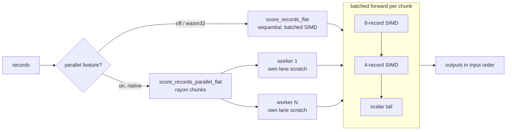
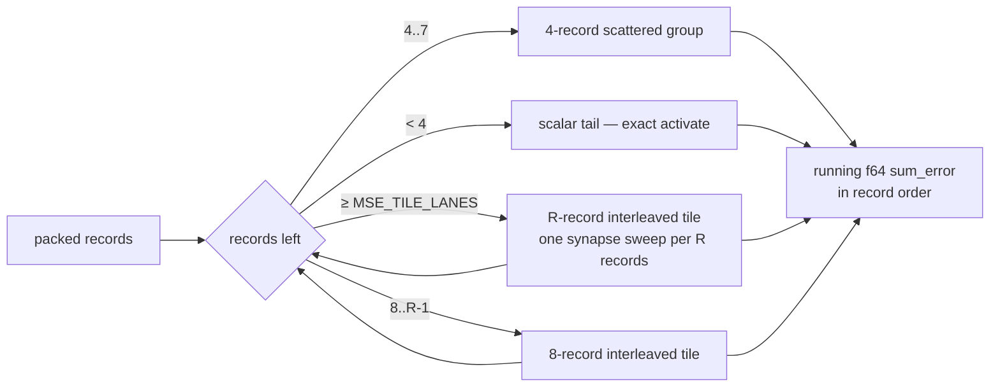
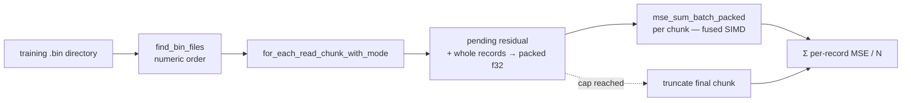
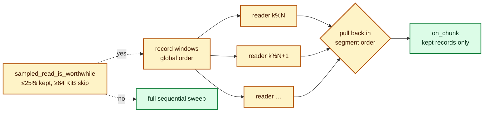
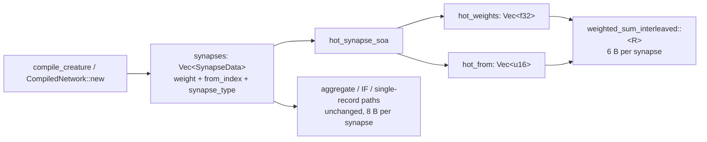
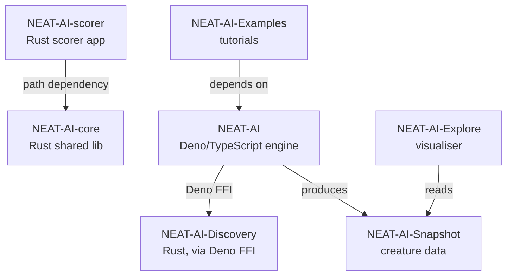
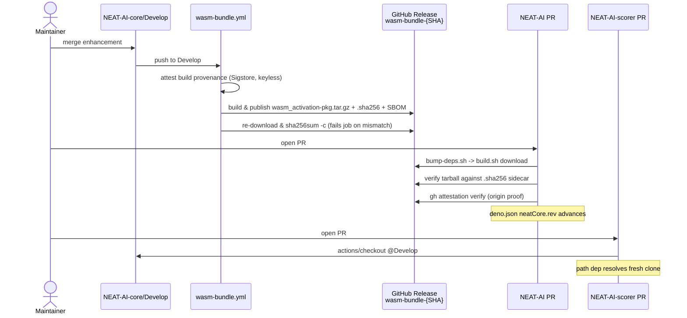
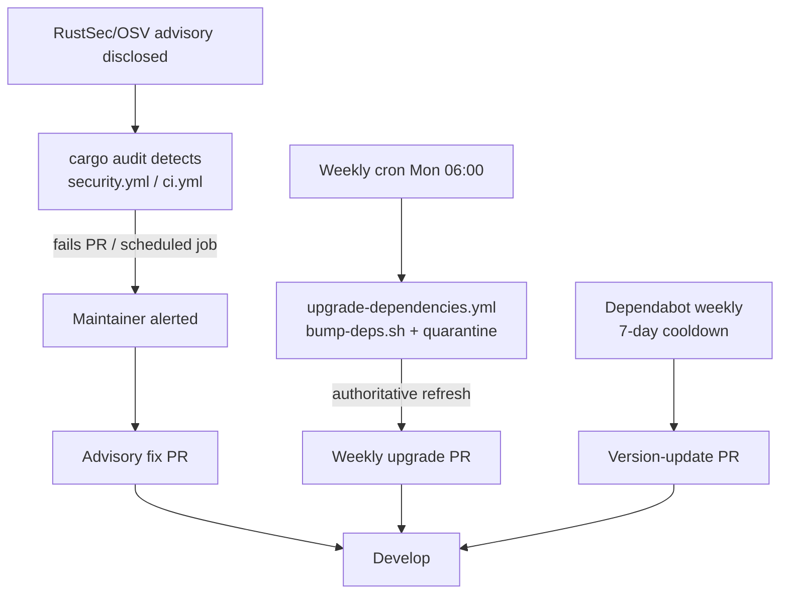

# NEAT-AI-core

**Native shared Rust** for [NEAT-AI](https://github.com/stSoftwareAU/NEAT-AI) — an implementation of [**NEAT** (NeuroEvolution of Augmenting Topologies)](https://en.wikipedia.org/wiki/Neuroevolution_of_augmenting_topologies): the **`neat-core`** crate (tests included) lives here as a Cargo workspace member.

## Glossary

First-use definitions for the project's core terms, an acronym, and its
internal automation name. Standard terms link out; the project's own
vocabulary carries a plain-English gloss.

- <a id="glossary-neat"></a>**NEAT** — [NeuroEvolution of Augmenting Topologies](https://en.wikipedia.org/wiki/Neuroevolution_of_augmenting_topologies), the algorithm that evolves both the weights *and* the topology of a neural network. NEAT-AI is a project built on this idea; this repo is its shared native core.
- <a id="glossary-creature"></a>**creature** — the project's term for a single evolved individual: a [genome](https://en.wikipedia.org/wiki/Artificial_neural_network) compiled to a runnable network. Scoring pushes many records through one creature.
- <a id="glossary-squash"></a>**squash** — a neuron's [activation function](https://en.wikipedia.org/wiki/Activation_function) (the non-linearity applied to its weighted input sum). "Standard-squash" neurons use the project's default activation.
- <a id="glossary-vibe-coder"></a>**Vibe Coder** — the automated agent that raises the routine dependency-bump and quality PRs (it runs `bump-deps.sh` on every such PR; the CI `quality` job then applies the same gates `quality.sh` runs locally).

## Test-driven development

Development in this repository follows **TDD**: do not merge behaviour changes unless **`cargo test --workspace`** already covers them (extend tests first when fixing bugs or adding APIs). Run **`./quality.sh`** before every commit/PR.

## WebAssembly

**`wasm_activation`** and **`pkg/`** remain in the **NEAT-AI** repo on `Develop` — not in this repository.

## Training-data offload (WASM linear memory) — removed, Issue #415

wasm64 milestone #295, lane (c) — Issue #298 — shipped a `wasm_dataset` module
that held the large numeric training arrays in neat-core's own linear memory,
handing JS a `u32` handle instead of the bytes. The `Learn.ts` adoption that
would have consumed it was never done: the milestone and its upstream adoption
issue both closed with the seven `training_data_*` exports unbound, so the module
was **removed as dead code in Issue #415**. Nothing in NEAT-AI or
NEAT-AI-scorer referenced it.

The performance work it carried lives on independently: the flat batched scoring
path (Issue #386, [below](#flat-record-input-issue-386)) is the contract any
future offload lane would drive, and lane (a)'s finding stands — the ~4 GB Learn
ceiling is the **V8 JS heap** (exit-133 / "Reached heap limit"), not WASM linear
memory. Re-adopting the offload means re-landing the module against a live
consumer, not resurrecting an unbound export surface.

Lane (d) — Issue #299 — verifies the downstream adoption end-to-end: the
production trainer's launch script injects a **RAM-aware**
`--v8-flags=--max-old-space-size` (sized by its memory-budget helper, floored
safely below the 8 GB tier) and fails **loud** on a V8 heap abort (exit 133).
The neat-core acceptance model
[`tests/perf/learn_flags_wiring.ts`](tests/perf/learn_flags_wiring.ts) re-derives
that selection lock-step with the production selector and pins the budget-fit /
safe-fall-back invariants; see
[`docs/research/wasm64-lane-d-learn-wiring-verification.md`](docs/research/wasm64-lane-d-learn-wiring-verification.md).

## Layout

| Path | Role |
|------|------|
| `neat-core/` | Shared computation library; **140+** unit tests in `src/**/*.rs` plus integration tests in `neat-core/tests/` (>350 total). |
| `Cargo.toml` | Virtual workspace root; `[workspace.package]` holds semver for release automation. |
| `RELEASING.md` | Single source of truth for the versioning/release policy (Issue #251) — semver, what counts as breaking, and `v<version>` tags/releases on `Develop`. |
| `deny.toml` | `cargo deny` (licences, advisories, bans). |
| `neat-core/benches/` | Opt-in Criterion harnesses: `hot_paths` (core hot paths) and `parallel_scoring` (data-parallel scoring, needs `--features parallel`); see `neat-core/benches/README.md`. |
| `quality.sh` | Local gate (fmt, clippy, tests, doc, deny, bats). |
| `.github/workflows/ci.yml` | CI gate. The `rust-gates` job runs the lint (`cargo clippy -D warnings`) and compile/syntax (`cargo check --all-targets`) gates on **every push to `Develop`** (and `workflow_dispatch`); on pull requests the `quality` job — the full PR pipeline — runs the same clippy gate, so `rust-gates` is skipped there rather than compiling the workspace twice (Issue #337). |
| `bump-deps.sh` | Cargo dep refresh + audit + native/WASM build ([Vibe Coder](#glossary-vibe-coder) hook). |
| `.github/dependabot.yml` | Weekly Cargo **version-updates** channel (7-day `cooldown`, 10-PR limit) — see [Dependency updates](#dependency-updates-two-channels). |
| `tests/scripts/` | `bats` suites for shell helpers (e.g. `bump-deps.sh`) and for the CI workflow contracts. Shared assertions live in `tests/scripts/helpers.bash` (loaded with `load helpers`, unit-tested by `helpers_shared.bats`) — put a new assertion there rather than copying it between suites (Issue #477). |
| `LICENSE`, `.gitleaks.toml` | Inherited from NEAT-AI `Develop`. |

## Build

```bash
export RUSTFLAGS="-D warnings"
cargo test --workspace
# or full gate:
./quality.sh
# opt-in performance benchmarks (not part of the test gate):
cargo bench -p neat-core --bench hot_paths
```

The committed TypeScript helpers under `tests/` carry their own basic-validity
gate (Issue #307): `./scripts/typescript-check.sh` type-checks every `.ts` file
with `deno check`. It runs inside `./quality.sh` and as the CI `typescript-gate`
job on every push and pull request, so a syntax or type error fails the build.
Basic validity only — it is not a style or lint gate, and it requires
[Deno](https://docs.deno.com/runtime/getting_started/installation/).

## Cargo features

| Feature | Default | Effect |
|---------|---------|--------|
| `parallel` | off | Native-only data-parallel record scoring via `rayon` (Issue #179). Adds `CompiledNetwork::score_records_parallel_flat`, which chunks records across the rayon pool. Off by default, so the default build and the `wasm32` build pull in **no** `rayon` symbols and keep their single-thread path. |
| `checked-gather4` | off | Restores bounds-checked indexing in the `wasm32` `gather4` scaffold helper (Issue #509). By default that helper elides the checks under the load-time `InvalidSynapseIndex` invariant — worth ~20% on the isolated kernel and ~2% on production-sized end-to-end inference, bit-identical either way. This is the A/B control and the one-flag way back out; no effect on native builds. See [`docs/research/wasm-gather4-unchecked-loads.md`](docs/research/wasm-gather4-unchecked-loads.md). |

Scoring a production-size dataset pushes many records through one [creature](#glossary-creature) — an
embarrassingly parallel workload *across records*. Both `score_records_flat`
and `score_records_parallel_flat` drive the forward pass through the **8-record
batched SIMD path** (Issue #230): records are grouped into 8s (then a 4-record group,
then a scalar tail) and forwarded through `weighted_sum_simd_8records` /
`weighted_sum_simd_4records`, loading each synapse weight once and applying it
across the lanes. On the gather-bound production topology this cut single-core
scoring time by **~39%** (see `docs/archive/pr-summaries/pr-summary-230.md`).
With the `parallel` feature the throughput additionally scales with core count.

On the exact committed production topology the native lane beats the wasm32 lane
**1.78×** per core (NEON + FMA vs `simd128` + relaxed-madd) and **4.75×** at 12
cores versus a single-threaded wasm32 creature — so where the native `rust_scorer`
is built, production per-creature scoring should use
`score_records_parallel_flat`.
See the native-vs-wasm32 decision, numbers, and the generation-end idle-core
"win zone" in [`neat-core/benches/BASELINE.md`](neat-core/benches/BASELINE.md)
(Issue #288).

Standard-[squash](#glossary-squash) neurons now sum **across records** rather than across synapses,
so their `f32` results match the per-record `activate` reference within a small
tolerance (SIMD re-association), while the sequential and parallel paths agree
bit-for-bit. Output order always matches input order.

```rust
// Off-feature / wasm: transparently runs sequentially (still batched SIMD).
let outputs = net.score_records_flat(&inputs, stride, num_outputs);

// With `--features parallel` on native: batches scored across the rayon pool,
// same results, in input order.
let outputs = net.score_records_parallel_flat(&inputs, stride, num_outputs);
```

### Flat record input (Issue #386)

Both the input and the output of a scoring batch have a flat, contiguous
contract. Record `i`'s inputs are `inputs[i * stride .. i * stride + stride]`
and its outputs are `out[i * num_outputs .. (i + 1) * num_outputs]`. Callers
that already hold a contiguous buffer — anything reading a packed `.bin` shard,
for instance — pass it straight through,
skipping the one-heap-allocation-per-record the `&[Vec<f32>]` signature forces
(4,096 allocations for a ~40 MiB production shard). A `stride` narrower than the
network's input arity zero-fills the uncovered inputs, exactly as a short `Vec`
does.

```rust
// One contiguous buffer of records * stride values — no per-record Vec.
let outputs = net.score_records_flat(&inputs, stride, num_outputs);

// Same, into a caller-owned buffer, or across the rayon pool.
net.score_records_flat_into(&inputs, stride, num_outputs, &mut out);
let outputs = net.score_records_parallel_flat(&inputs, stride, num_outputs);
```

The flat layout is the **only** one supported. The per-record `&[Vec<f32>]`
wrappers (`score_records`, `score_records_parallel`), deprecated in `0.2.28` by
Issue #408, were **removed** in `0.3.0` (Issue #409) — a breaking change; pack
your records into one contiguous buffer and call the `_flat` entry points.
Scoring is asserted against an independent per-record reference (each record
scored on its own through `activate`) across the 8-record group boundary and
both dispatch arms by
[`tests/flat_record_scoring_parity.rs`](neat-core/tests/flat_record_scoring_parity.rs).
A malformed batch (zero `stride`, or a buffer that is not a whole number of
records) **panics** rather than silently mis-slicing every record.


```mermaid
flowchart LR
    R[records] --> S{parallel feature?}
    S -- off / wasm32 --> Q[score_records_flat<br/>sequential, batched SIMD]
    S -- on, native --> P[score_records_parallel_flat<br/>rayon chunks]
    P --> W1[worker 1<br/>own lane scratch]
    P --> Wn[worker N<br/>own lane scratch]
    subgraph B[batched forward per chunk]
        direction TB
        E8[8-record SIMD] --> E4[4-record SIMD] --> E1[scalar tail]
    end
    Q --> B
    W1 --> B
    Wn --> B
    B --> O[outputs in input order]
```

### Fused-MSE record tile (Issue #530)

`mse_sum_batch_packed` — the fused activate + MSE entry point production
scoring calls — walks records in **record-interleaved tiles** of
`loss::MSE_TILE_LANES` (`32`), not the 8 the scoring lane uses. The interleaved
kernel re-streams the network's whole synapse array once per *tile*, so a wider
tile divides per-record synapse traffic by `MSE_TILE_LANES / 8`; the cost is a
proportionally larger `mse_inter` scratch buffer,
`num_neurons * MSE_TILE_LANES * 4` bytes **per compiled network** (~528 KB on
the production creature at 32 lanes, ~132 KB at 8). Directory scoring holds one
compiled network per worker, so budget that against the worker-count RAM ceiling
before raising it.

`MSE_TILE_LANES` is a single constant, must be a non-zero multiple of 8 and at
most `simd::MAX_INTERLEAVED_LANES` (`64`) — both checked at compile time — and
every width is **bit-identical**: each lane accumulates its own
`bias + Σ w·a` in synapse order and every tier reduces in record order.
The `< MSE_TILE_LANES` remainder steps down the unchanged ladder.


```mermaid
flowchart LR
    R["packed records"] --> T{"records left"}
    T -- "&ge; MSE_TILE_LANES" --> A["R-record interleaved tile<br/>one synapse sweep per R records"]
    T -- "8..R-1" --> B["8-record interleaved tile"]
    T -- "4..7" --> C["4-record scattered group"]
    T -- "&lt; 4" --> D["scalar tail — exact activate"]
    A --> T
    B --> T
    C --> S["running f64 sum_error<br/>in record order"]
    D --> S
    A --> S
    B --> S
```

### Streaming directory MSE (Issue #538)

`mse_mean_streaming` scores a whole `.bin` training directory without loading
it into memory, so consumers stop re-implementing the chunk → packed-buffer →
`mse_sum_batch_packed` loop around this crate's MSE maths. It returns
`(mean_mse, record_count)` for
`(1/N) * Σ_records mse_record(targets, outputs)` — the same semantics as
`mse_mean_record` and NEAT-AI's `Costs.MSE` — and `(0.0, 0)` when the directory
yields no whole records, leaving the fail-loud decision to the caller. A
malformed corpus is **not** silent: a missing directory, an unreadable file, or
a trailing partial record returns `Err`.

Records are buffered into packed chunks so the fused SIMD tile above still
does the work; a record straddling a read-chunk or file boundary is carried in
a residual buffer and scored with the next chunk. `max_records` truncates both
the file list and the final chunk, so a capped scan never opens a file it
cannot use.

`mse_record` is the per-record reduction those paths share — the mean over a
record's outputs of `(target - output)^2`, accumulated in `f64`. Both scalar
MSE closures in `loss.rs` call it, and it is exported for consumers (such as a
backpropagation trace pass) that already hold activations and cannot use a
fused batch path. The SIMD tile kernels keep their own bit-parity-critical
reductions. Neither helper is on the `wasm_bindgen` export surface — they are
native-host conveniences.

```rust
use neat_core::mse_mean_streaming;

// (mean per-record MSE, records scored); `None` = the whole corpus.
let (mse, records) = mse_mean_streaming(
    &mut network,
    std::path::Path::new("./training"),
    input_size,
    num_outputs,
    /* forward_only */ true,
    /* max_records */ None,
)?;
```

Chunk boundaries decide which records land in an 8-way SIMD group, so the
result matches `mse_sum_batch_packed(all_records) / N` to floating-point
tolerance rather than bit-for-bit.


```mermaid
flowchart LR
    D["training .bin directory"] --> F["find_bin_files<br/>numeric order"]
    F --> C["for_each_read_chunk_with_mode"]
    C --> P["pending residual<br/>+ whole records → packed f32"]
    P --> M["mse_sum_batch_packed<br/>per chunk — fused SIMD"]
    M --> A["Σ per-record MSE / N"]
    P -. "cap reached" .-> T["truncate final chunk"]
    T --> A
```

### Sampled corpus reads (NEAT-AI-Lamarck#123)

`for_each_read_chunk` reads every byte. A caller scoring a **stratified
subsample** — NEAT-AI-scorer's `--sample-rate`, `0.05` on NEAT-AI-Lamarck's
screen tier — then decodes all of them and discards ~95 %, so a 5 % call costs
very nearly what a full-corpus call costs.

`for_each_sampled_read_chunk` fetches the kept records only:

```rust,ignore
use neat_core::training_bin_stream::{for_each_sampled_read_chunk, sampled_read_is_worthwhile};

// `keep` takes a GLOBAL record index across `bin_files` in order, so the kept
// set never depends on how the corpus is split into files or chunks.
let keep = |index: u64| index % 20 == 19;
if sampled_read_is_worthwhile(record_bytes, 0.05) {
    for_each_sampled_read_chunk(&bin_files, read_buf_len, record_bytes, readers, &keep, |chunk| {
        // Whole records, kept ones only, in corpus order.
        Ok(())
    })?;
}
```

Two properties make it safe to put on an authoritative scoring path:

- **Order is preserved.** Segment `k` is read by reader `k % readers` and pulled
  back in `k` order, so the delivered bytes are identical for every reader count
  and a caller's float accumulation stays **bit-identical**.
- **It declines when it would lose.** Sparse reads trade sequential bandwidth for
  seeks; `sampled_read_is_worthwhile` takes the sampled path only when ≤ 25 % of
  records are kept *and* the mean skip is ≥ 64 KiB.

Measured on the 21 GiB / 10 048 B-per-record production corpus at rate 0.05:

| Read | Bytes fetched | Wall |
|---|---|---|
| full sequential sweep | 21.17 GiB | 5.0–6.2 s |
| sampled, 1 reader | 1.06 GiB | 9.8–31.8 s |
| sampled, 8 readers | 1.06 GiB | 1.73 s |
| sampled, 16 readers | 1.06 GiB | **1.27 s** |

One reader is *slower* than reading everything — the pool is the point, not a
tuning knob.


```mermaid
flowchart LR
    P["record windows<br/>global order"] --> R1["reader k%N"]
    P --> R2["reader k%N+1"]
    P --> R3["reader …"]
    R1 --> Q{"pull back in<br/>segment order"}
    R2 --> Q
    R3 --> Q
    Q --> K["on_chunk<br/>kept records only"]
    G["sampled_read_is_worthwhile<br/>≤25% kept, ≥64 KiB skip"] -. "no" .-> S["full sequential sweep"]
    G -. "yes" .-> P

    classDef stage fill:#fef3c7,stroke:#b45309,stroke-width:2px,color:#451a03
    classDef out fill:#dcfce7,stroke:#15803d,stroke-width:2px,color:#052e16
    class P,R1,R2,R3,Q,G stage
    class K,S out
```

### Struct-of-arrays hot synapse view (Issue #533)

The interleaved gather reads only two of `SynapseData`'s three fields, so
`CompiledNetwork` also carries a parallel **struct-of-arrays** view of them —
`hot_weights: Vec<f32>` and `hot_from: Vec<u16>`, in the same order as
`synapses`. The interleaved kernels take those two slices, streaming 6 B per
synapse instead of the struct's 8 B; `synapse_type` stays on `SynapseData` for
the aggregate/IF and single-record paths, which are unchanged. Values and
accumulation order are identical, so every result stays bit-identical.

Both views are built by `hot_synapse_soa` at every construction path
(`CompiledNetwork::new`, `compile_creature`), and cost **+6 B per synapse per
compiled network** — ~126 KB on the production creature, cloned once per
directory-scoring worker. Because the fields are public they can be made to
drift; `debug_assert_hot_soa` runs at every interleaved entry point and panics
in debug builds if they have.


```mermaid
flowchart LR
    C["compile_creature / CompiledNetwork::new"] --> S["synapses: Vec&lt;SynapseData&gt;<br/>weight + from_index + synapse_type"]
    S --> H["hot_synapse_soa"]
    H --> W["hot_weights: Vec&lt;f32&gt;"]
    H --> F["hot_from: Vec&lt;u16&gt;"]
    W --> G["weighted_sum_interleaved::&lt;R&gt;<br/>6 B per synapse"]
    F --> G
    S --> A["aggregate / IF / single-record paths<br/>unchanged, 8 B per synapse"]
```

```bash
# Run the data-parallel scoring throughput bench (1 vs all cores).
cargo bench -p neat-core --features parallel --bench parallel_scoring

# A/B the fused-MSE tile width (edit MSE_TILE_LANES, rebuild, compare medians).
cargo bench -p neat-core --bench hot_paths -- mse_sum_production
```

## Related Repositories

The NEAT-AI project is split across seven public repositories. Each focuses on one concern and composes with the others as shown below.

| Repository | Role |
|------------|------|
| [NEAT-AI](https://github.com/stSoftwareAU/NEAT-AI) | Primary Deno/TypeScript neural-network engine (evolution, training, WASM activation). |
| [NEAT-AI-core](https://github.com/stSoftwareAU/NEAT-AI-core) | Shared native Rust library (`neat-core`) with numerics, topology helpers, and the chunked `.bin` training stream. |
| [NEAT-AI-Discovery](https://github.com/stSoftwareAU/NEAT-AI-Discovery) | Rust discovery module invoked by NEAT-AI via Deno FFI to search architectures and hyper-parameters. |
| [NEAT-AI-Snapshot](https://github.com/stSoftwareAU/NEAT-AI-Snapshot) | Creature/genome snapshot format and fixtures produced by NEAT-AI and consumed by downstream tools. |
| [NEAT-AI-scorer](https://github.com/stSoftwareAU/NEAT-AI-scorer) | Production forward-only scoring application built on `neat-core` via a path dependency. |
| [NEAT-AI-Explore](https://github.com/stSoftwareAU/NEAT-AI-Explore) | Visualiser for creatures that reads NEAT-AI-Snapshot data. |
| [NEAT-AI-Examples](https://github.com/stSoftwareAU/NEAT-AI-Examples) | Worked examples and tutorials that depend on NEAT-AI. |

### Dependency graph


```mermaid
graph TD
    Core[NEAT-AI-core<br/>Rust shared lib]
    Main[NEAT-AI<br/>Deno/TypeScript engine]
    Discovery[NEAT-AI-Discovery<br/>Rust, via Deno FFI]
    Snapshot[NEAT-AI-Snapshot<br/>creature data]
    Scorer[NEAT-AI-scorer<br/>Rust scorer app]
    Explore[NEAT-AI-Explore<br/>visualiser]
    Examples[NEAT-AI-Examples<br/>tutorials]

    Main -->|Deno FFI| Discovery
    Main -->|produces| Snapshot
    Scorer -->|path dependency| Core
    Explore -->|reads| Snapshot
    Examples -->|depends on| Main
```

## Propagation to downstream repositories

Once an enhancement merges to `Develop` here, it flows automatically to the
next pull request raised in either consumer repository — no manual SHA bump
is required. The two consumer paths differ in mechanism but share the same
Vibe Coder hook (`bump-deps.sh` runs on every PR; the CI `quality` job then
applies the same gates `quality.sh` runs locally).

### NEAT-AI (Deno + WASM consumer)

- On every push to `Develop`, [`.github/workflows/wasm-bundle.yml`](.github/workflows/wasm-bundle.yml)
  builds `wasm_activation-pkg.tar.gz` and publishes a per-commit GitHub
  Release tagged `wasm-bundle-<SHA>`. Each Release carries three assets: the
  tarball, its `wasm_activation-pkg.tar.gz.sha256` sidecar, and the CycloneDX
  SBOM `wasm_activation-pkg.cdx.json`.
- NEAT-AI's `bump-deps.sh` invokes `./build.sh`, which downloads the matching
  bundle, verifies it against the `.sha256` sidecar, and updates `deno.json`'s
  `neatCore.rev` field in lock-step. The sidecar is the per-revision hash
  anchor: it ships with the revision it describes, so a `neatCore.rev` bump
  has a trustworthy hash for the *new* bundle rather than only the pin
  recorded for the old one.
- A fresh PR in NEAT-AI is therefore sufficient to pick up the latest
  `Develop` of NEAT-AI-core.
- The published bundle (and its CycloneDX SBOM) carries a Sigstore-backed
  build-provenance attestation, so a consumer can cryptographically confirm
  the tarball was produced by this workflow from the pinned commit before
  trusting it. Verify in the bump flow with:

  ```bash
  gh attestation verify wasm_activation-pkg.tar.gz \
    --repo stSoftwareAU/NEAT-AI-core
  ```

  Pinning by SHA and the post-publish content re-verification prove the
  bundle's *shape*; the attestation proves its *origin*, closing the
  published-artefact-substitution attack class.

### NEAT-AI-scorer (Rust + path dependency)

- NEAT-AI-scorer's CI uses `actions/checkout` to clone
  `stSoftwareAU/NEAT-AI-core@Develop` into the workspace on every PR.
- `rust_scorer/Cargo.toml`'s `path = "../../NEAT-AI-core/neat-core"` resolves
  against that fresh clone, so the next PR build always compiles against the
  current tip of `Develop`.
- No SHA pin or release artefact is involved on this path.

### End-to-end flow


```mermaid
sequenceDiagram
    actor Dev as Maintainer
    participant Core as NEAT-AI-core/Develop
    participant CI as wasm-bundle.yml
    participant Rel as GitHub Release<br/>wasm-bundle-{SHA}
    participant Main as NEAT-AI PR
    participant Scorer as NEAT-AI-scorer PR

    Dev->>Core: merge enhancement
    Core->>CI: push to Develop
    CI->>CI: attest build provenance (Sigstore, keyless)
    CI->>Rel: build & publish wasm_activation-pkg.tar.gz + .sha256 + SBOM
    CI->>Rel: re-download & sha256sum -c (fails job on mismatch)
    Dev->>Main: open PR
    Main->>Rel: bump-deps.sh -> build.sh download
    Main->>Rel: verify tarball against .sha256 sidecar
    Main->>Rel: gh attestation verify (origin proof)
    Note over Main: deno.json neatCore.rev advances
    Dev->>Scorer: open PR
    Scorer->>Core: actions/checkout @Develop
    Note over Scorer: path dep resolves fresh clone
```

### Wiring reference

| Consumer | Trigger | Script / workflow |
|----------|---------|-------------------|
| NEAT-AI-core | push to `Develop` | [`.github/workflows/wasm-bundle.yml`](.github/workflows/wasm-bundle.yml) |
| NEAT-AI | PR opened (Vibe Coder hook) | `NEAT-AI/bump-deps.sh` → `NEAT-AI/build.sh` |
| NEAT-AI-scorer | PR opened (CI) | `NEAT-AI-scorer/.github/workflows/ci.yml` (`actions/checkout` of `NEAT-AI-core@Develop`) |

### Race window

`wasm-bundle.yml` typically takes ~30–60 seconds to build and publish the
release after a merge to `Develop`. PRs raised in NEAT-AI inside that
window may transiently fail the bundle download in `build.sh` because the
release tag for the latest `Develop` SHA does not yet exist. Re-run the
PR's checks once the bundle workflow has completed, or wait a minute
before opening the PR.

## Dependency updates: two channels

Two committed channels raise routine dependency-bump PRs. Both are weekly;
the quarantine-aware workflow is the authoritative one, because it is the only
channel that applies this project's release-age quarantine before proposing a
bump:

- **Routine bump (authoritative)** — [`.github/workflows/upgrade-dependencies.yml`](.github/workflows/upgrade-dependencies.yml)
  runs `bump-deps.sh` every Monday (`cron "0 6 * * 1"`), applying the
  `VIBE_BUMP_QUARANTINE_HOURS` release-age quarantine, `cargo audit`, and
  dual native/WASM builds before raising a general upgrade PR. The same script
  runs on every PR from the `ci.yml` `version-increment` job.
- **Dependabot version updates** — [`.github/dependabot.yml`](.github/dependabot.yml)
  configures a Cargo **version-updates** entry: `interval: weekly`, a 7-day
  `cooldown` (newly published crates are not proposed until they have aged),
  and `open-pull-requests-limit: 10`. It overlaps the workflow above rather
  than replacing it; its PRs go through the same CI gates.

Dependabot **security updates** — the advisory-triggered fast lane — are a
repository-level setting rather than anything the committed tree configures, so
this README cannot state whether the repository has it switched on. See GitHub's
[about Dependabot security updates](https://docs.github.com/en/code-security/dependabot/dependabot-security-updates/about-dependabot-security-updates)
for what that setting does and how to enable it.

Advisory *detection* is committed and verifiable: it lives in
[`security.yml`](.github/workflows/security.yml) and the `ci.yml` `security`
job (`cargo audit` / `rustsec/audit-check`), which fail the build on a
`Cargo.lock` crate with a known advisory.

When an actively-exploited advisory's fix is newer than the
`VIBE_BUMP_QUARANTINE_HOURS` window, an approver can take the documented
**emergency quarantine override**. The full procedure (both bypass levers, the
runbook, and the mandatory `cargo audit` re-check) lives in
[`SECURITY.md`](SECURITY.md#emergency-quarantine-override).


```mermaid
flowchart TD
    Adv[RustSec/OSV advisory disclosed] --> Detect[cargo audit detects<br/>security.yml / ci.yml]
    Detect -->|fails PR / scheduled job| Alert[Maintainer alerted]
    Alert --> FixPR[Advisory fix PR]
    Cron[Weekly cron Mon 06:00] --> Bump[upgrade-dependencies.yml<br/>bump-deps.sh + quarantine]
    Bump -->|authoritative refresh| GenPR[Weekly upgrade PR]
    DepCron[Dependabot weekly<br/>7-day cooldown] --> DepPR[Version-update PR]
    FixPR --> Develop[Develop]
    GenPR --> Develop
    DepPR --> Develop
```

## License

Apache-2.0 — see `LICENSE`.
