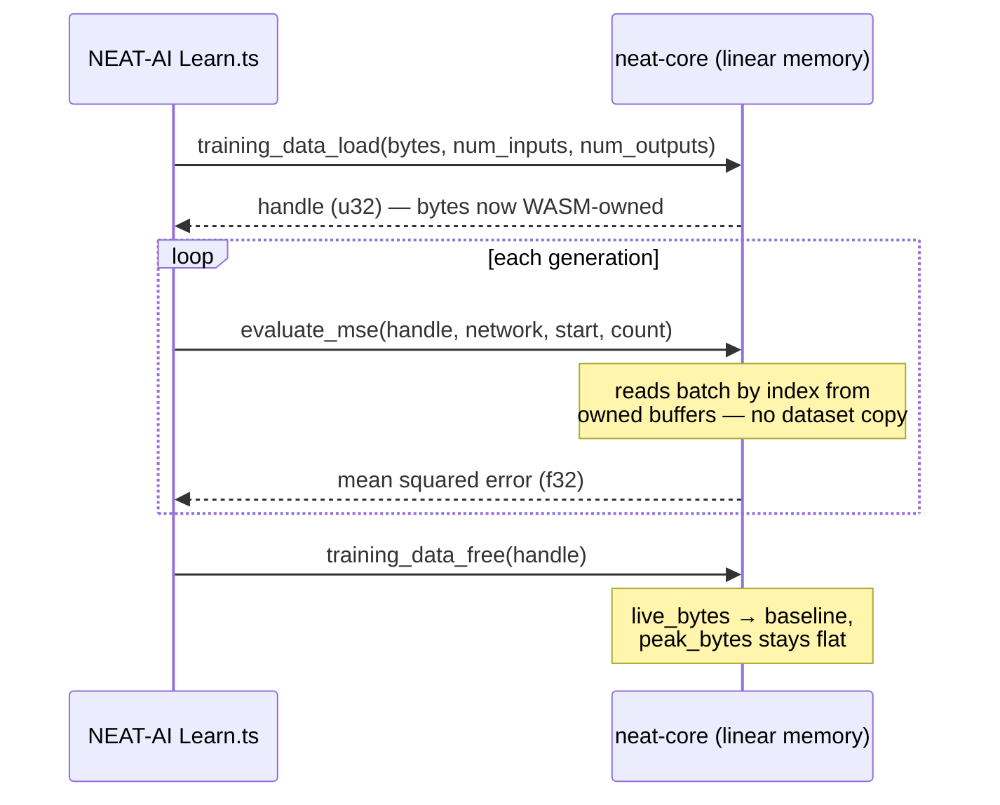
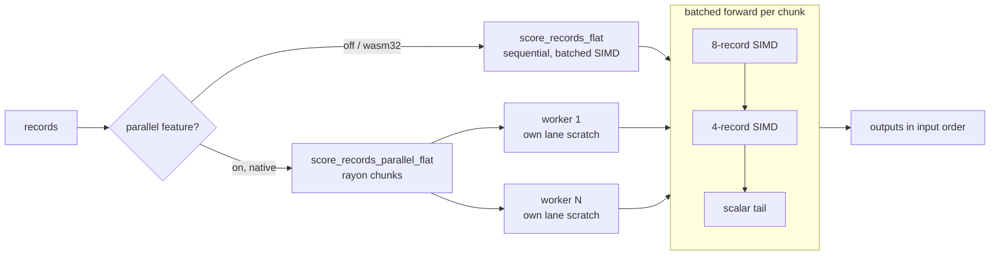
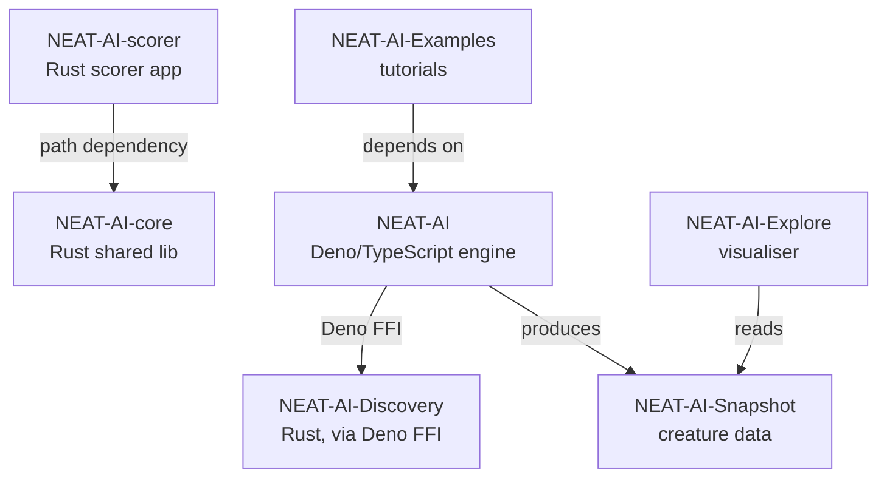
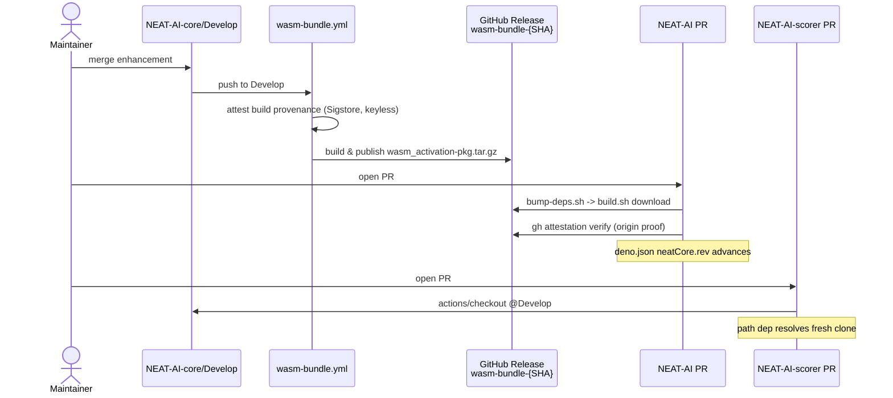
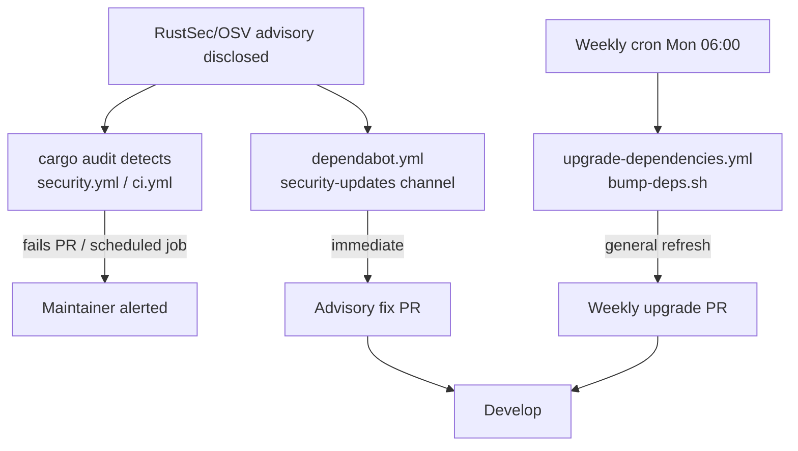

# NEAT-AI-core

**Native shared Rust** for [NEAT-AI](https://github.com/stSoftwareAU/NEAT-AI) — an implementation of [**NEAT** (NeuroEvolution of Augmenting Topologies)](https://en.wikipedia.org/wiki/Neuroevolution_of_augmenting_topologies): the **`neat-core`** crate (tests included) lives here as a Cargo workspace member.

## Glossary

First-use definitions for the project's core terms, an acronym, and its
internal automation name. Standard terms link out; the project's own
vocabulary carries a plain-English gloss.

- <a id="glossary-neat"></a>**NEAT** — [NeuroEvolution of Augmenting Topologies](https://en.wikipedia.org/wiki/Neuroevolution_of_augmenting_topologies), the algorithm that evolves both the weights *and* the topology of a neural network. NEAT-AI is a project built on this idea; this repo is its shared native core.
- <a id="glossary-creature"></a>**creature** — the project's term for a single evolved individual: a [genome](https://en.wikipedia.org/wiki/Artificial_neural_network) compiled to a runnable network. Scoring pushes many records through one creature.
- <a id="glossary-squash"></a>**squash** — a neuron's [activation function](https://en.wikipedia.org/wiki/Activation_function) (the non-linearity applied to its weighted input sum). "Standard-squash" neurons use the project's default activation.
- <a id="glossary-vibe-coder"></a>**Vibe Coder** — the automated agent that raises the routine dependency-bump and quality PRs (it runs `bump-deps.sh` before `quality.sh` on every such PR).

## Test-driven development

Development in this repository follows **TDD**: do not merge behaviour changes unless **`cargo test --workspace`** already covers them (extend tests first when fixing bugs or adding APIs). Run **`./quality.sh`** before every commit/PR.

## WebAssembly

**`wasm_activation`** and **`pkg/`** remain in the **NEAT-AI** repo on `Develop` — not in this repository.

## Training-data offload (WASM linear memory)

wasm64 milestone #295, lane (c) — Issue #298. Lane (a) attributed the ~4 GB
Learn ceiling to the **V8 JS heap** (exit-133 / "Reached heap limit"), not WASM
linear memory. `wasm_dataset` moves the large numeric training arrays **off the
JS heap**: neat-core owns the dataset inside its own linear memory, JS holds only
a `u32` **handle**, and per-generation evaluation reads batches **by index** —
the full dataset never re-crosses the JS↔WASM boundary after the initial load.

- [`TrainingDataset`](neat-core/src/wasm_dataset.rs) de-interleaves the packed
  `.bin` record stream into contiguous structure-of-arrays input/target buffers
  once, at load time.
- [`DatasetRegistry`](neat-core/src/wasm_dataset.rs) is the handle table:
  `load` → handle, `free` → release. It tracks live and peak byte footprint so a
  lifecycle leak (bytes retained past `free`) is observable — the high-water mark
  stays flat across load → evaluate → free cycles.
- WASM shims (`training_data_load` / `_evaluate_mse` / `_free` / `_byte_len` /
  `_peak_bytes`) carry byte counts and record indices as `u64` (JS `BigInt`), so
  the surface is Memory64-ready for the >4 GB jobs the milestone targets.
- `TrainingDataset::evaluate_mse` bounds-checks the batch **once** and hands the
  contiguous SoA input slice straight to the flat batched scoring path
  (Issue #386) — no per-record `Vec`, no per-record bounds check, full 8-record
  interleaved SIMD. That is a **~4–5×** speed-up over the previous
  one-record-at-a-time `activate` loop at production shard volume; see
  [`neat-core/benches/BASELINE.md`](neat-core/benches/BASELINE.md).

Lane (d) — Issue #299 — verifies the downstream adoption end-to-end: the
production trainer's launch script injects a **RAM-aware**
`--v8-flags=--max-old-space-size` (sized by its memory-budget helper, floored
safely below the 8 GB tier) and fails **loud** on a V8 heap abort (exit 133).
The neat-core acceptance model
[`tests/perf/learn_flags_wiring.ts`](tests/perf/learn_flags_wiring.ts) re-derives
that selection lock-step with the production selector and pins the budget-fit /
safe-fall-back invariants; see
[`docs/research/wasm64-lane-d-learn-wiring-verification.md`](docs/research/wasm64-lane-d-learn-wiring-verification.md).


```mermaid
sequenceDiagram
    participant JS as NEAT-AI Learn.ts
    participant WASM as neat-core (linear memory)
    JS->>WASM: training_data_load(bytes, num_inputs, num_outputs)
    WASM-->>JS: handle (u32) — bytes now WASM-owned
    loop each generation
        JS->>WASM: evaluate_mse(handle, network, start, count)
        Note over WASM: reads batch by index from<br/>owned buffers — no dataset copy
        WASM-->>JS: mean squared error (f32)
    end
    JS->>WASM: training_data_free(handle)
    Note over WASM: live_bytes → baseline,<br/>peak_bytes stays flat
```

## Layout

| Path | Role |
|------|------|
| `neat-core/` | Shared computation library; **140+** unit tests in `src/**/*.rs` plus integration tests in `neat-core/tests/` (>350 total). |
| `Cargo.toml` | Virtual workspace root; `[workspace.package]` holds semver for release automation. |
| `RELEASING.md` | Single source of truth for the versioning/release policy (Issue #251) — semver, what counts as breaking, and `v<version>` tags/releases on `Develop`. |
| `deny.toml` | `cargo deny` (licences, advisories, bans). |
| `neat-core/benches/` | Opt-in Criterion harnesses: `hot_paths` (core hot paths) and `parallel_scoring` (data-parallel scoring, needs `--features parallel`); see `neat-core/benches/README.md`. |
| `quality.sh` | Local gate (fmt, clippy, tests, doc, deny, bats). |
| `.github/workflows/ci.yml` | CI gate. The `rust-gates` job runs the lint (`cargo clippy -D warnings`) and compile/syntax (`cargo check --all-targets`) gates on **every push to `Develop`** (and `workflow_dispatch`); on pull requests the `quality` job — the full PR pipeline — runs the same clippy gate, so `rust-gates` is skipped there rather than compiling the workspace twice (Issue #337). |
| `bump-deps.sh` | Cargo dep refresh + audit + native/WASM build ([Vibe Coder](#glossary-vibe-coder) hook). |
| `.github/dependabot.yml` | Advisory-triggered security-update fast lane — raises a fix PR the moment a RustSec/OSV advisory lands, independent of the weekly bump. |
| `tests/scripts/` | `bats` suites for shell helpers (e.g. `bump-deps.sh`). |
| `LICENSE`, `.gitleaks.toml` | Inherited from NEAT-AI `Develop`. |

## Build

```bash
export RUSTFLAGS="-D warnings"
cargo test --workspace
# or full gate:
./quality.sh
# opt-in performance benchmarks (not part of the test gate):
cargo bench -p neat-core --bench hot_paths
```

The committed TypeScript helpers under `tests/` carry their own basic-validity
gate (Issue #307): `./scripts/typescript-check.sh` type-checks every `.ts` file
with `deno check`. It runs inside `./quality.sh` and as the CI `typescript-gate`
job on every push and pull request, so a syntax or type error fails the build.
Basic validity only — it is not a style or lint gate, and it requires
[Deno](https://docs.deno.com/runtime/getting_started/installation/).

## Cargo features

| Feature | Default | Effect |
|---------|---------|--------|
| `parallel` | off | Native-only data-parallel record scoring via `rayon` (Issue #179). Adds `CompiledNetwork::score_records_parallel_flat`, which chunks records across the rayon pool. Off by default, so the default build and the `wasm32` build pull in **no** `rayon` symbols and keep their single-thread path. |

Scoring a production-size dataset pushes many records through one [creature](#glossary-creature) — an
embarrassingly parallel workload *across records*. Both `score_records_flat`
and `score_records_parallel_flat` drive the forward pass through the **8-record
batched SIMD path** (Issue #230): records are grouped into 8s (then a 4-record group,
then a scalar tail) and forwarded through `weighted_sum_simd_8records` /
`weighted_sum_simd_4records`, loading each synapse weight once and applying it
across the lanes. On the gather-bound production topology this cut single-core
scoring time by **~39%** (see `docs/archive/pr-summaries/pr-summary-230.md`).
With the `parallel` feature the throughput additionally scales with core count.

On the exact committed production topology the native lane beats the wasm32 lane
**1.78×** per core (NEON + FMA vs `simd128` + relaxed-madd) and **4.75×** at 12
cores versus a single-threaded wasm32 creature — so where the native `rust_scorer`
is built, production per-creature scoring should use
`score_records_parallel_flat`.
See the native-vs-wasm32 decision, numbers, and the generation-end idle-core
"win zone" in [`neat-core/benches/BASELINE.md`](neat-core/benches/BASELINE.md)
(Issue #288).

Standard-[squash](#glossary-squash) neurons now sum **across records** rather than across synapses,
so their `f32` results match the per-record `activate` reference within a small
tolerance (SIMD re-association), while the sequential and parallel paths agree
bit-for-bit. Output order always matches input order.

```rust
// Off-feature / wasm: transparently runs sequentially (still batched SIMD).
let outputs = net.score_records_flat(&inputs, stride, num_outputs);

// With `--features parallel` on native: batches scored across the rayon pool,
// same results, in input order.
let outputs = net.score_records_parallel_flat(&inputs, stride, num_outputs);
```

### Flat record input (Issue #386)

Both the input and the output of a scoring batch have a flat, contiguous
contract. Record `i`'s inputs are `inputs[i * stride .. i * stride + stride]`
and its outputs are `out[i * num_outputs .. (i + 1) * num_outputs]`. Callers
that already hold a contiguous buffer — the `TrainingDataset` offload lane
above, or anything reading a packed `.bin` shard — pass it straight through,
skipping the one-heap-allocation-per-record the `&[Vec<f32>]` signature forces
(4,096 allocations for a ~40 MiB production shard). A `stride` narrower than the
network's input arity zero-fills the uncovered inputs, exactly as a short `Vec`
does.

```rust
// One contiguous buffer of records * stride values — no per-record Vec.
let outputs = net.score_records_flat(&inputs, stride, num_outputs);

// Same, into a caller-owned buffer, or across the rayon pool.
net.score_records_flat_into(&inputs, stride, num_outputs, &mut out);
let outputs = net.score_records_parallel_flat(&inputs, stride, num_outputs);
```

The per-record `&[Vec<f32>]` entry points (`score_records`,
`score_records_parallel`) are **deprecated** since `0.2.28` (Issue #408) and
scheduled for removal (Issue #409); every in-repo caller now uses the flat ones.
They still drive the identical kernel, so the two layouts are
**bit-identical** — asserted across the 8-record group boundary and both
dispatch arms by
[`tests/flat_record_scoring_parity.rs`](neat-core/tests/flat_record_scoring_parity.rs).
A malformed batch (zero `stride`, or a buffer that is not a whole number of
records) **panics** rather than silently mis-slicing every record.


```mermaid
flowchart LR
    R[records] --> S{parallel feature?}
    S -- off / wasm32 --> Q[score_records_flat<br/>sequential, batched SIMD]
    S -- on, native --> P[score_records_parallel_flat<br/>rayon chunks]
    P --> W1[worker 1<br/>own lane scratch]
    P --> Wn[worker N<br/>own lane scratch]
    subgraph B[batched forward per chunk]
        direction TB
        E8[8-record SIMD] --> E4[4-record SIMD] --> E1[scalar tail]
    end
    Q --> B
    W1 --> B
    Wn --> B
    B --> O[outputs in input order]
```

```bash
# Run the data-parallel scoring throughput bench (1 vs all cores).
cargo bench -p neat-core --features parallel --bench parallel_scoring
```

## Related Repositories

The NEAT-AI project is split across seven public repositories. Each focuses on one concern and composes with the others as shown below.

| Repository | Role |
|------------|------|
| [NEAT-AI](https://github.com/stSoftwareAU/NEAT-AI) | Primary Deno/TypeScript neural-network engine (evolution, training, WASM activation). |
| [NEAT-AI-core](https://github.com/stSoftwareAU/NEAT-AI-core) | Shared native Rust library (`neat-core`) with numerics, topology helpers, and the chunked `.bin` training stream. |
| [NEAT-AI-Discovery](https://github.com/stSoftwareAU/NEAT-AI-Discovery) | Rust discovery module invoked by NEAT-AI via Deno FFI to search architectures and hyper-parameters. |
| [NEAT-AI-Snapshot](https://github.com/stSoftwareAU/NEAT-AI-Snapshot) | Creature/genome snapshot format and fixtures produced by NEAT-AI and consumed by downstream tools. |
| [NEAT-AI-scorer](https://github.com/stSoftwareAU/NEAT-AI-scorer) | Production forward-only scoring application built on `neat-core` via a path dependency. |
| [NEAT-AI-Explore](https://github.com/stSoftwareAU/NEAT-AI-Explore) | Visualiser for creatures that reads NEAT-AI-Snapshot data. |
| [NEAT-AI-Examples](https://github.com/stSoftwareAU/NEAT-AI-Examples) | Worked examples and tutorials that depend on NEAT-AI. |

### Dependency graph


```mermaid
graph TD
    Core[NEAT-AI-core<br/>Rust shared lib]
    Main[NEAT-AI<br/>Deno/TypeScript engine]
    Discovery[NEAT-AI-Discovery<br/>Rust, via Deno FFI]
    Snapshot[NEAT-AI-Snapshot<br/>creature data]
    Scorer[NEAT-AI-scorer<br/>Rust scorer app]
    Explore[NEAT-AI-Explore<br/>visualiser]
    Examples[NEAT-AI-Examples<br/>tutorials]

    Main -->|Deno FFI| Discovery
    Main -->|produces| Snapshot
    Scorer -->|path dependency| Core
    Explore -->|reads| Snapshot
    Examples -->|depends on| Main
```

## Propagation to downstream repositories

Once an enhancement merges to `Develop` here, it flows automatically to the
next pull request raised in either consumer repository — no manual SHA bump
is required. The two consumer paths differ in mechanism but share the same
Vibe Coder hook (`bump-deps.sh` runs before `quality.sh` on every PR).

### NEAT-AI (Deno + WASM consumer)

- On every push to `Develop`, [`.github/workflows/wasm-bundle.yml`](.github/workflows/wasm-bundle.yml)
  builds `wasm_activation-pkg.tar.gz` and publishes a per-commit GitHub
  Release tagged `wasm-bundle-<SHA>`.
- NEAT-AI's `bump-deps.sh` invokes `./build.sh`, which downloads the matching
  bundle and updates `deno.json`'s `neatCore.rev` field in lock-step.
- A fresh PR in NEAT-AI is therefore sufficient to pick up the latest
  `Develop` of NEAT-AI-core.
- The published bundle (and its CycloneDX SBOM) carries a Sigstore-backed
  build-provenance attestation, so a consumer can cryptographically confirm
  the tarball was produced by this workflow from the pinned commit before
  trusting it. Verify in the bump flow with:

  ```bash
  gh attestation verify wasm_activation-pkg.tar.gz \
    --repo stSoftwareAU/NEAT-AI-core
  ```

  Pinning by SHA and the post-publish content re-verification prove the
  bundle's *shape*; the attestation proves its *origin*, closing the
  published-artefact-substitution attack class.

### NEAT-AI-scorer (Rust + path dependency)

- NEAT-AI-scorer's CI uses `actions/checkout` to clone
  `stSoftwareAU/NEAT-AI-core@Develop` into the workspace on every PR.
- `rust_scorer/Cargo.toml`'s `path = "../../NEAT-AI-core/neat-core"` resolves
  against that fresh clone, so the next PR build always compiles against the
  current tip of `Develop`.
- No SHA pin or release artefact is involved on this path.

### End-to-end flow


```mermaid
sequenceDiagram
    actor Dev as Maintainer
    participant Core as NEAT-AI-core/Develop
    participant CI as wasm-bundle.yml
    participant Rel as GitHub Release<br/>wasm-bundle-{SHA}
    participant Main as NEAT-AI PR
    participant Scorer as NEAT-AI-scorer PR

    Dev->>Core: merge enhancement
    Core->>CI: push to Develop
    CI->>CI: attest build provenance (Sigstore, keyless)
    CI->>Rel: build & publish wasm_activation-pkg.tar.gz
    Dev->>Main: open PR
    Main->>Rel: bump-deps.sh -> build.sh download
    Main->>Rel: gh attestation verify (origin proof)
    Note over Main: deno.json neatCore.rev advances
    Dev->>Scorer: open PR
    Scorer->>Core: actions/checkout @Develop
    Note over Scorer: path dep resolves fresh clone
```

### Wiring reference

| Consumer | Trigger | Script / workflow |
|----------|---------|-------------------|
| NEAT-AI-core | push to `Develop` | [`.github/workflows/wasm-bundle.yml`](.github/workflows/wasm-bundle.yml) |
| NEAT-AI | PR opened (Vibe Coder hook) | `NEAT-AI/bump-deps.sh` → `NEAT-AI/build.sh` |
| NEAT-AI-scorer | PR opened (CI) | `NEAT-AI-scorer/.github/workflows/ci.yml` (`actions/checkout` of `NEAT-AI-core@Develop`) |

### Race window

`wasm-bundle.yml` typically takes ~30–60 seconds to build and publish the
release after a merge to `Develop`. PRs raised in NEAT-AI inside that
window may transiently fail the bundle download in `build.sh` because the
release tag for the latest `Develop` SHA does not yet exist. Re-run the
PR's checks once the bundle workflow has completed, or wait a minute
before opening the PR.

## Dependency updates: two channels

Dependency refresh runs on two complementary channels so the urgent
"patch this advisory now" path is decoupled from the routine weekly bump:

- **Routine bump** — [`.github/workflows/upgrade-dependencies.yml`](.github/workflows/upgrade-dependencies.yml)
  runs `bump-deps.sh` every Monday (`cron "0 6 * * 1"`), applying the
  `VIBE_BUMP_QUARANTINE_HOURS` release-age quarantine, `cargo audit`, and
  dual native/WASM builds before raising a general upgrade PR.
- **Security fast lane** — [`.github/dependabot.yml`](.github/dependabot.yml)
  enables Dependabot's Cargo **security-updates** channel. When a
  RustSec/OSV advisory lands against a crate already in `Cargo.lock`,
  Dependabot raises a fix PR immediately — independent of the weekly window.

Advisory *detection* still lives in [`security.yml`](.github/workflows/security.yml)
and the `ci.yml` `security` job (`cargo audit` / `rustsec/audit-check`); the
new channel is what *raises* the remediation PR rather than waiting for Monday.

When an actively-exploited advisory's fix is newer than the
`VIBE_BUMP_QUARANTINE_HOURS` window, an approver can take the documented
**emergency quarantine override**. The full procedure (both bypass levers, the
runbook, and the mandatory `cargo audit` re-check) lives in
[`SECURITY.md`](SECURITY.md#emergency-quarantine-override).


```mermaid
flowchart TD
    Adv[RustSec/OSV advisory disclosed] --> Detect[cargo audit detects<br/>security.yml / ci.yml]
    Detect -->|fails PR / scheduled job| Alert[Maintainer alerted]
    Adv --> Dependabot[dependabot.yml<br/>security-updates channel]
    Dependabot -->|immediate| FixPR[Advisory fix PR]
    Cron[Weekly cron Mon 06:00] --> Bump[upgrade-dependencies.yml<br/>bump-deps.sh]
    Bump -->|general refresh| GenPR[Weekly upgrade PR]
    FixPR --> Develop[Develop]
    GenPR --> Develop
```

## License

Apache-2.0 — see `LICENSE`.
