# NEAT-AI-core

<p align="center">
  
</p>

**Native shared Rust** for [NEAT-AI](https://github.com/stSoftwareAU/NEAT-AI) — an implementation of [**NEAT** (NeuroEvolution of Augmenting Topologies)](https://en.wikipedia.org/wiki/Neuroevolution_of_augmenting_topologies): the **`neat-core`** crate (tests included) lives here as a Cargo workspace member.

## Glossary

First-use definitions for the project's core terms, an acronym, and its
internal automation name. Standard terms link out; the project's own
vocabulary carries a plain-English gloss.

- <a id="glossary-neat"></a>**NEAT** — [NeuroEvolution of Augmenting Topologies](https://en.wikipedia.org/wiki/Neuroevolution_of_augmenting_topologies), the algorithm that evolves both the weights *and* the topology of a neural network. NEAT-AI is a project built on this idea; this repo is its shared native core.
- <a id="glossary-creature"></a>**creature** — the project's term for a single evolved individual: a [genome](https://en.wikipedia.org/wiki/Artificial_neural_network) compiled to a runnable network. Scoring pushes many records through one creature.
- <a id="glossary-squash"></a>**squash** — a neuron's [activation function](https://en.wikipedia.org/wiki/Activation_function) (the non-linearity applied to its weighted input sum). "Standard-squash" neurons use the project's default activation.
- <a id="glossary-vibe-coder"></a>**Vibe Coder** — the automated agent that raises the routine dependency-bump and quality PRs (it runs `bump-deps.sh` on every such PR; the CI `quality` job then applies the same gates `quality.sh` runs locally).

## Test-driven development

Development in this repository follows **TDD**, the first of the family-wide [engineering principles](https://github.com/stSoftwareAU/NEAT-AI/blob/Develop/docs/ENGINEERING_PRINCIPLES.md) that govern every NEAT-AI repository: do not merge behaviour changes unless **`cargo test --workspace`** already covers them (extend tests first when fixing bugs or adding APIs). Run **`./quality.sh`** before every commit/PR.

Those principles — one implementation owner per capability, the TypeScript → Rust migration rules, and rollback by re-pinning a published revision rather than keeping a duplicate implementation — are canonical for humans and coding agents alike, and are linked rather than restated here. [`AGENTS.md`](AGENTS.md#family-wide-engineering-principles) carries what they mean for this crate, alongside the Rust/core invariants that are specific to it.

## WebAssembly

**`wasm_activation`** and **`pkg/`** remain in the **NEAT-AI** repo on `Develop` — not in this repository.

### wasm64 (Memory64) bundle — dual-ship, Issue #541

Every push to `Develop` publishes **two** bundles on the per-commit
`wasm-bundle-<sha>` Release:

| Asset | Target | Role |
|-------|--------|------|
| `wasm_activation-wasm64-pkg.tar.gz` | `wasm64-unknown-unknown` | Genuine Memory64 `(memory i64 …)` build — **the pin new `neatCore.rev` revisions take**. Linear memory grows past the wasm32 65536-page (4 GiB) ceiling. |
| `wasm_activation-pkg.tar.gz` | `wasm32-unknown-unknown` | Unchanged wasm32 build, retained as the rollback window until NEAT-AI's Memory64 loader lands. |

Each carries its own `.sha256` sidecar and a CycloneDX SBOM resolved against
its own target triple, and both are covered by the build-provenance attestation.

The July 2026 spike recorded the production `wasm-bindgen` path as a wasm64
**NO-GO**. That was **CLI skew, not a permanent gap**: CLI `0.2.108` exited 0
while stripping the bindings, and CLI ≥ `0.2.120` ships Memory64 codegen
([wasm-bindgen#5004](https://github.com/wasm-bindgen/wasm-bindgen/pull/5004)).
Re-measured **2026-08-14** against CLI `0.2.127` — the production path emits the
full activation/backprop surface. See
[`docs/research/wasm64-lane-b-build-lane-feasibility.md`](docs/research/wasm64-lane-b-build-lane-feasibility.md).

This does **not** fix V8 exit-133 JS-heap aborts: that ceiling is the JS heap,
not WASM linear memory, and `--max-old-space-size` remains its lever (lane (a),
Issue #296).

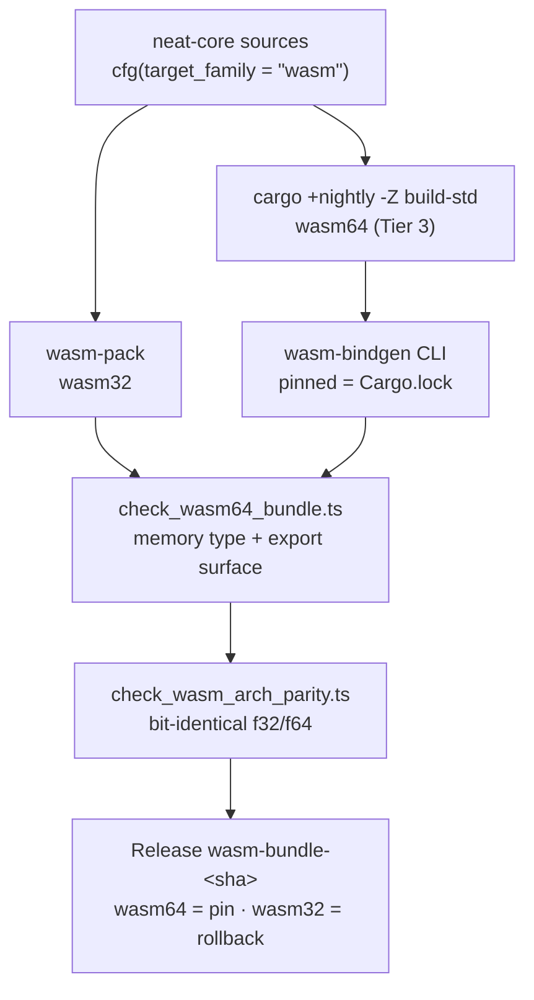
```mermaid
flowchart TD
    S["neat-core sources<br/>cfg(target_family = &quot;wasm&quot;)"] --> A["wasm-pack<br/>wasm32"]
    S --> B["cargo +nightly -Z build-std<br/>wasm64 (Tier 3)"]
    B --> C["wasm-bindgen CLI<br/>pinned = Cargo.lock"]
    A --> G1["check_wasm64_bundle.ts<br/>memory type + export surface"]
    C --> G1
    G1 --> G2["check_wasm_arch_parity.ts<br/>bit-identical f32/f64"]
    G2 --> R["Release wasm-bundle-&lt;sha&gt;<br/>wasm64 = pin · wasm32 = rollback"]
```

Building locally:

```bash
# wasm32 (needs wasm-pack)
./scripts/build-wasm-bundle.sh --arch wasm32 --rev "$(git rev-parse HEAD)"

# wasm64 (needs nightly + rust-src + the wasm-bindgen CLI matching Cargo.lock)
rustup toolchain install nightly --profile minimal --component rust-src
./scripts/build-wasm-bundle.sh --arch wasm64 --rev "$(git rev-parse HEAD)" \
  --out wasm_activation-wasm64-pkg.tar.gz
```

Both invocations gate the built `pkg/` before packaging, so a stripped glue or
a wrong-arch memory type fails the build instead of shipping.

## Training-data offload (WASM linear memory) — removed, Issue #415

wasm64 milestone #295, lane (c) — Issue #298 — shipped a `wasm_dataset` module
that held the large numeric training arrays in neat-core's own linear memory,
handing JS a `u32` handle instead of the bytes. The `Learn.ts` adoption that
would have consumed it was never done: the milestone and its upstream adoption
issue both closed with the seven `training_data_*` exports unbound, so the module
was **removed as dead code in Issue #415**. Nothing in NEAT-AI or
NEAT-AI-scorer referenced it.

The performance work it carried lives on independently: the flat batched scoring
path (Issue #386, [below](#flat-record-input-issue-386)) is the contract any
future offload lane would drive, and lane (a)'s finding stands — the ~4 GB Learn
ceiling is the **V8 JS heap** (exit-133 / "Reached heap limit"), not WASM linear
memory. Re-adopting the offload means re-landing the module against a live
consumer, not resurrecting an unbound export surface.

Lane (d) — Issue #299 — verifies the downstream adoption end-to-end: the
production trainer's launch script injects a **RAM-aware**
`--v8-flags=--max-old-space-size` (sized by its memory-budget helper, floored
safely below the 8 GB tier) and fails **loud** on a V8 heap abort (exit 133).
The neat-core acceptance model
[`tests/perf/learn_flags_wiring.ts`](tests/perf/learn_flags_wiring.ts) re-derives
that selection lock-step with the production selector and pins the budget-fit /
safe-fall-back invariants; see
[`docs/research/wasm64-lane-d-learn-wiring-verification.md`](docs/research/wasm64-lane-d-learn-wiring-verification.md).

## Layout

| Path | Role |
|------|------|
| `neat-core/` | Shared computation library; **140+** unit tests in `src/**/*.rs` plus integration tests in `neat-core/tests/` (>350 total). |
| `Cargo.toml` | Virtual workspace root; `[workspace.package]` holds semver for release automation. |
| `RELEASING.md` | Single source of truth for the versioning/release policy (Issue #251) — semver, what counts as breaking, and `v<version>` tags/releases on `Develop`. |
| `deny.toml` | `cargo deny` (licences, advisories, bans). |
| `neat-core/benches/` | Opt-in Criterion harnesses: `hot_paths` (core hot paths) and `parallel_scoring` (data-parallel scoring, needs `--features parallel`); see `neat-core/benches/README.md`. |
| `quality.sh` | Local gate (fmt, clippy, tests, doc, deny, bats). `bats` is required, not optional: it is the only gate that *runs* the shell scripts (`bash -n` and shellcheck only read them), so a missing binary — or a missing/empty `tests/scripts` suite — fails the run rather than warning and continuing (Issue #631). Install with `brew install bats-core` or `sudo apt-get install -y bats`. |
| `.github/workflows/ci.yml` | CI gate. Runs on **pull requests** and `workflow_dispatch` only — `Develop` is PR-only, so a push to it is the merge of an already-gated PR and re-running there duplicated the gating run (Issue #580). On pull requests the `quality` job — the full PR pipeline — runs the lint gate (`cargo clippy -D warnings`), which compiles the workspace; the `rust-gates` job carries the same lint gate plus the explicit compile/syntax gate (`cargo check --all-targets`) and is skipped on PRs rather than compiling the workspace twice (Issue #337), leaving `workflow_dispatch` as its on-demand lane. |
| `bump-deps.sh` | Cargo dep refresh + advisory scan (`cargo deny check advisories`, falling back to `cargo audit`) + native/WASM build ([Vibe Coder](#glossary-vibe-coder) hook). Exits non-zero only when the tree it produced must not be kept — see [Dependency updates](#dependency-updates-two-channels). |
| `.github/dependabot.yml` | Weekly Cargo **version-updates** channel for both lockfiles (7-day `cooldown`, 10-PR limit) — see [Dependency updates](#dependency-updates-two-channels). |
| `deno.json` | Deno/JSR supply-chain config (Issue #603): a 24h `minimumDependencyAge` release-age quarantine for external JSR/npm specifiers (internal `@stsoftware/*` scopes excluded, they bump at 0h), a **frozen** `deno.lock`, and the `imports` map holding the pinned version of every JSR dependency the `.ts` gates use (Issue #646) — see [JSR (Deno) dependencies](#jsr-deno-dependencies). |
| `.github/workflows/deno-outdated.yml` | Weekly JSR/Deno dependency-update PR (Issue #646) — `deno outdated --update --latest` under the `deno.json` quarantine, verified against the frozen lockfile before the PR is opened. The Deno counterpart of `upgrade-dependencies.yml`. |
| `deno.lock` | Committed integrity pin for every JSR dependency the `.ts` gates import. Frozen: `deno check`/`deno test` fail rather than re-resolve a floating range. |
| `tests/scripts/` | `bats` suites for shell helpers (e.g. `bump-deps.sh`) and for the CI workflow contracts. Shared assertions live in `tests/scripts/helpers.bash` (loaded with `load helpers`, unit-tested by `helpers_shared.bats`) — put a new assertion there rather than copying it between suites (Issue #477). Any suite that parses YAML must `load helpers`, which is what makes `import yaml` work everywhere (next row). |
| `tests/scripts/lib/yaml_fallback/` | Vendored YAML subset parser, used **only** when `import yaml` fails (Issue #642). The workflow-contract suites parse YAML with PyYAML, which the unattended worker container's python3 does not ship: 121 of 535 tests failed with `ModuleNotFoundError` instead of running, and `./quality.sh` never reached its later stages. `helpers.bash` puts this directory on `PYTHONPATH` when PyYAML is missing — loudly, on stderr — so the assertions are still *made* rather than skipped; where PyYAML is installed (CI included) it is still what parses. `yaml_fallback.bats` pins the parser against PyYAML — over every YAML file in the repository, and over a corpus of constructs the workflows here do not yet contain — so a divergence fails the suite; on CI, where PyYAML is the oracle, that sweep fails rather than skips if PyYAML ever goes missing. |
| `LICENSE`, `.gitleaks.toml` | Inherited from NEAT-AI `Develop`. |

## Build

```bash
export RUSTFLAGS="-D warnings"
cargo test --workspace
# or full gate:
./quality.sh
# opt-in performance benchmarks (not part of the test gate):
cargo bench -p neat-core --bench hot_paths
```

The committed TypeScript helpers under `tests/` carry their own basic-validity
gate (Issue #307): `./scripts/typescript-check.sh` type-checks every `.ts` file
with `deno check`. It runs inside `./quality.sh` and as the CI `typescript-gate`
job on every push and pull request, so a syntax or type error fails the build.
It requires [Deno](https://docs.deno.com/runtime/getting_started/installation/).

Style is gated beside it (Issue #647): the same `typescript-gate` job and the
same `./quality.sh` run `deno lint` and `deno fmt --check`, so an unformatted or
lint-broken helper cannot land either. `fmt.include` in `deno.json` gives the
formatter JavaScript and TypeScript only: Markdown keeps its single
implementation owner in the `markdown-lint` workflow's markdownlint-cli2, and
two formatters never fight over the same file. The top-level `exclude` drops the
generated wasm-pack output under `neat-core/wasm_activation/pkg/`, which
`.gitignore` does not cover, so a local bundle build does not redden the gate
with code nobody wrote. Fix a formatting failure with `deno fmt`.

### Build profiles (Issue #546)

Fleet decision (`stSoftwareAU/VibeCoding#4159`): **dev builds compile as fast as
possible; release builds produce the most optimised artefact possible and
compile time is irrelevant.** Stable Rust only — no nightly, no `-Zthreads`, no
Cranelift. The root `Cargo.toml` carries both profiles workspace-wide:

| Profile | Settings | Why |
|---------|----------|-----|
| `[profile.dev]` | `debug = "line-tables-only"` (plus cargo's defaults: `opt-level = 0`, incremental on) | Keeps panic and backtrace `file:line`, drops the rest of the DWARF. Measured here: rebuild after a one-line edit **1.87s → 1.50s**, clean `cargo build --workspace --all-targets` **8.37s → 6.72s**, `target/debug` **1.4G → 1.1G**. |
| `[profile.release]` | `opt-level = 3`, `lto = "fat"`, `codegen-units = 1` | One codegen unit per crate with fat LTO across the whole graph — the most optimised artefact, whatever it costs to compile. |

**Cargo profiles come from the crate being built.** `neat-core` is a library, so
its `[profile.*]` tables govern only this workspace's own tests, benches and
`cargo build --release` — they never reach a consumer. Every binary crate
downstream (the scorer, the Lamarck and backpropagation consumers, the private
trainer) must carry the same release settings in its own manifest, or it links
`neat-core` unoptimised no matter what is written here.

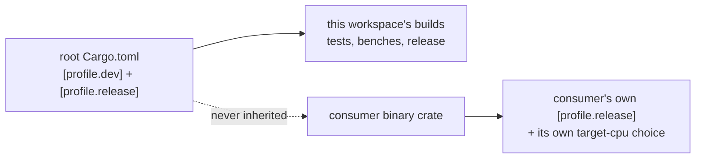
```mermaid
flowchart LR
    P["root Cargo.toml<br/>[profile.dev] + [profile.release]"] --> W["this workspace's builds<br/>tests, benches, release"]
    P -. "never inherited" .-> C["consumer binary crate"]
    C --> O["consumer's own [profile.release]<br/>+ its own target-cpu choice"]
```

**`-C target-cpu=native` is consumer-owned and deliberately absent here.**
Recommended for a binary built and run on the same host (the fleet pattern:
`cargo build --release` on the machine that runs the artefact); never for a
published crate and never for the `wasm32`/`wasm64` bundles, which must stay
portable. Stable Cargo has no per-profile rustflags, so a consumer sets it in
its own `.cargo/config.toml` under a target-scoped key —
`[target.'cfg(not(target_arch = "wasm32"))'] rustflags = ["-C", "target-cpu=native"]`
— or in the build invocation's `RUSTFLAGS`; note that an exported `RUSTFLAGS`
**replaces** config rustflags entirely rather than adding to them.

`tests/scripts/rust_build_profiles.bats` is the gate: it asserts the manifest's
values and then splices the live `[profile.*]` tables into a throwaway crate to
check the flags **cargo itself** passes rustc (`-C debuginfo=line-tables-only`;
`-C opt-level=3 -C lto=fat -C codegen-units=1`), and fails if any build input
under `.cargo/`, `scripts/` or `.github/workflows/` pins `target-cpu=native`.

## Cargo features

| Feature | Default | Effect |
|---------|---------|--------|
| `parallel` | off | Native-only data-parallel record scoring via `rayon` (Issue #179). Adds `CompiledNetwork::score_records_parallel_flat`, which chunks records across the rayon pool. Off by default, so the default build and the `wasm32` build pull in **no** `rayon` symbols and keep their single-thread path. |
| `checked-gather4` | off | Restores bounds-checked indexing in the `wasm32` `gather4` scaffold helper (Issue #509). By default that helper elides the checks under the load-time `InvalidSynapseIndex` invariant — worth ~20% on the isolated kernel and ~2% on production-sized end-to-end inference, bit-identical either way. This is the A/B control and the one-flag way back out; no effect on native builds. See [`docs/research/wasm-gather4-unchecked-loads.md`](docs/research/wasm-gather4-unchecked-loads.md). |

Scoring a production-size dataset pushes many records through one [creature](#glossary-creature) — an
embarrassingly parallel workload *across records*. Both `score_records_flat`
and `score_records_parallel_flat` drive the forward pass through the **8-record
batched SIMD path** (Issue #230): records are grouped into 8s (then a 4-record group,
then a scalar tail) and forwarded through
`weighted_sum_simd_8records_unchecked` /
`weighted_sum_simd_4records_unchecked`, loading each synapse weight once and
applying it across the lanes. On the gather-bound production topology this cut single-core
scoring time by **~39%** (see `docs/archive/pr-summaries/pr-summary-230.md`).
With the `parallel` feature the throughput additionally scales with core count.

Every kernel in `neat_core::simd` ships in two forms (Issue #613). The plain
name — `weighted_sum_simd`, `weighted_sum_simd_8records`,
`weighted_sum_interleaved`, … — is a **safe** `pub fn` that validates the span
through `neat_core::simd::bounds` and **panics** if it does not hold, so no safe
caller can drive an out-of-bounds read. The `*_unchecked` twin is an `unsafe fn`
whose `# Safety` contract is the load-time `InvalidSynapseIndex` invariant; use
it only where that invariant is already held — as `CompiledNetwork`'s own
forward and scoring paths do, which is why the hot path pays nothing for the
safe half. The pre-pass is `O(end - start)` and is not free: on the committed
64-synapse bench it costs **+68%** over the unchecked kernel
(`weighted_sum_simd/single_checked` beside `weighted_sum_simd/single`), so a
downstream consumer with its own load-time validation should call the
`*_unchecked` form on its hot path.

### `CompiledNetwork` is read-only after construction (Issue #625)

The `*_unchecked` kernels above are sound in `CompiledNetwork`'s own forward and
scoring paths because `new` validated every source index at load time. That
discharge only holds while nothing can rewrite the validated values afterwards,
so **every field is private** and the state is read through borrow-only
accessors:

```rust
let net = CompiledNetwork::new(&bytes)?;

net.num_neurons();   // usize            net.num_inputs();  // usize
net.neurons();       // &[NeuronData]    net.synapses();    // &[SynapseData]
net.hot_weights();   // &[f32]           net.hot_from();    // &[u16]
net.activations();   // &[f32]
net.hint_values();   // &[f32]           net.trace_data();  // &[f32]
```

To build a network from parts already in memory — rather than from a serialised
buffer — use `CompiledNetwork::from_parts(num_inputs, neurons, synapses)`. It
runs the same validation as `new` and additionally rejects a neuron whose
`start_synapse + num_synapses` overruns the synapse table
(`NetworkError::InvalidSynapseSpan`). To change a network, rebuild it; there is
no in-place edit.

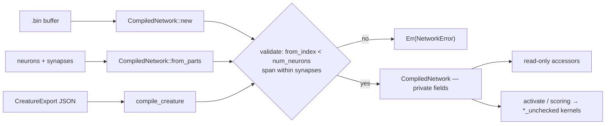
```mermaid
flowchart LR
    B[".bin buffer"] --> N["CompiledNetwork::new"]
    P["neurons + synapses"] --> F["CompiledNetwork::from_parts"]
    C["CreatureExport JSON"] --> G["compile_creature"]
    N --> V{"validate: from_index &lt; num_neurons<br/>span within synapses"}
    F --> V
    G --> V
    V -- no --> E["Err(NetworkError)"]
    V -- yes --> K["CompiledNetwork — private fields"]
    K --> R["read-only accessors"]
    K --> A["activate / scoring → *_unchecked kernels"]
```

**Consumer break.** Reads that were `net.synapses` become `net.synapses()`, and
writes are no longer expressible — the semver bump for this change is a
`0.11.x → 0.12.0` minor (major-equivalent pre-1.0). It reaches
**NEAT-AI-scorer** (reads `neurons` / `synapses` / `num_neurons` / `num_inputs`
on its GPU upload path) and **NEAT-AI-Backpropagation** (reads `activations`).
`NetworkError` also gains an `InvalidSynapseSpan` variant and `CreatureError` an
`InvalidNetwork` variant, which break an exhaustive `match` on either. The full
migration is in
[`RELEASING.md`](RELEASING.md#0120--compilednetworks-fields-are-private-issue-625).

On the exact committed production topology the native lane beats the wasm32 lane
**1.78×** per core (NEON + FMA vs `simd128` + relaxed-madd) and **4.75×** at 12
cores versus a single-threaded wasm32 creature — so where the native `rust_scorer`
is built, production per-creature scoring should use
`score_records_parallel_flat`.
See the native-vs-wasm32 decision, numbers, and the generation-end idle-core
"win zone" in [`neat-core/benches/BASELINE.md`](neat-core/benches/BASELINE.md)
(Issue #288).

Standard-[squash](#glossary-squash) neurons now sum **across records** rather than across synapses,
so their `f32` results match the per-record `activate` reference within a small
tolerance (SIMD re-association), while the sequential and parallel paths agree
bit-for-bit. Output order always matches input order.

```rust
// Off-feature / wasm: transparently runs sequentially (still batched SIMD).
let outputs = net.score_records_flat(&inputs, stride, num_outputs);

// With `--features parallel` on native: batches scored across the rayon pool,
// same results, in input order.
let outputs = net.score_records_parallel_flat(&inputs, stride, num_outputs);
```

### Flat record input (Issue #386)

Both the input and the output of a scoring batch have a flat, contiguous
contract. Record `i`'s inputs are `inputs[i * stride .. i * stride + stride]`
and its outputs are `out[i * num_outputs .. (i + 1) * num_outputs]`. Callers
that already hold a contiguous buffer — anything reading a packed `.bin` shard,
for instance — pass it straight through,
skipping the one-heap-allocation-per-record the `&[Vec<f32>]` signature forces
(4,096 allocations for a ~40 MiB production shard). A `stride` narrower than the
network's input arity zero-fills the uncovered inputs, exactly as a short `Vec`
does.

```rust
// One contiguous buffer of records * stride values — no per-record Vec.
let outputs = net.score_records_flat(&inputs, stride, num_outputs);

// Same, into a caller-owned buffer, or across the rayon pool.
net.score_records_flat_into(&inputs, stride, num_outputs, &mut out);
let outputs = net.score_records_parallel_flat(&inputs, stride, num_outputs);
```

The flat layout is the **only** one supported. The per-record `&[Vec<f32>]`
wrappers (`score_records`, `score_records_parallel`), deprecated in `0.2.28` by
Issue #408, were **removed** in `0.3.0` (Issue #409) — a breaking change; pack
your records into one contiguous buffer and call the `_flat` entry points.
Scoring is asserted against an independent per-record reference (each record
scored on its own through `activate`) across the 8-record group boundary and
both dispatch arms by
[`tests/flat_record_scoring_parity.rs`](neat-core/tests/flat_record_scoring_parity.rs).
A malformed batch (zero `stride`, or a buffer that is not a whole number of
records) **panics** rather than silently mis-slicing every record.

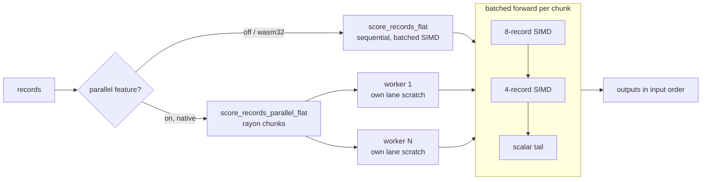
```mermaid
flowchart LR
    R[records] --> S{parallel feature?}
    S -- off / wasm32 --> Q[score_records_flat<br/>sequential, batched SIMD]
    S -- on, native --> P[score_records_parallel_flat<br/>rayon chunks]
    P --> W1[worker 1<br/>own lane scratch]
    P --> Wn[worker N<br/>own lane scratch]
    subgraph B[batched forward per chunk]
        direction TB
        E8[8-record SIMD] --> E4[4-record SIMD] --> E1[scalar tail]
    end
    Q --> B
    W1 --> B
    Wn --> B
    B --> O[outputs in input order]
```

### Fused-MSE record tile (Issue #530)

`mse_sum_batch_packed` — the fused activate + MSE entry point production
scoring calls — walks records in **record-interleaved tiles** of
`loss::MSE_TILE_LANES` (`32`), not the 8 the scoring lane uses. The interleaved
kernel re-streams the network's whole synapse array once per *tile*, so a wider
tile divides per-record synapse traffic by `MSE_TILE_LANES / 8`; the cost is a
proportionally larger `mse_inter` scratch buffer,
`num_neurons * MSE_TILE_LANES * 4` bytes **per compiled network** (~528 KB on
the production creature at 32 lanes, ~132 KB at 8). Directory scoring holds one
compiled network per worker, so budget that against the worker-count RAM ceiling
before raising it.

`MSE_TILE_LANES` is a single constant, must be a non-zero multiple of 8 and at
most `simd::MAX_INTERLEAVED_LANES` (`64`) — both checked at compile time — and
every width is **bit-identical**: each lane accumulates its own
`bias + Σ w·a` in synapse order and every tier reduces in record order.
The `< MSE_TILE_LANES` remainder steps down the unchanged ladder.

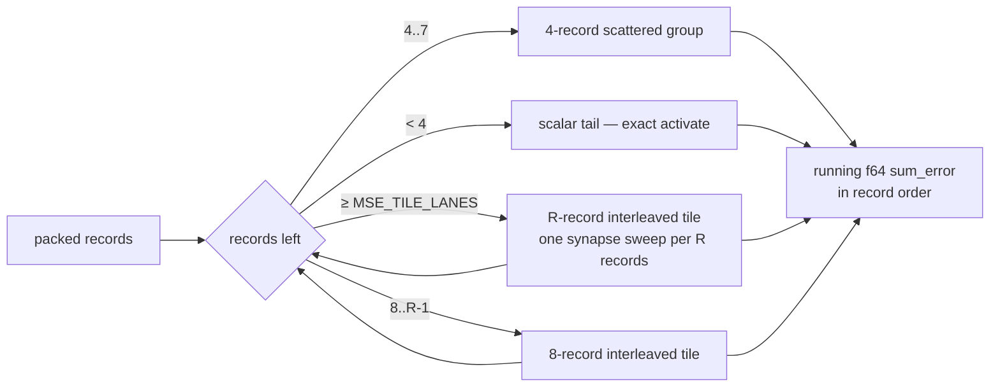
```mermaid
flowchart LR
    R["packed records"] --> T{"records left"}
    T -- "&ge; MSE_TILE_LANES" --> A["R-record interleaved tile<br/>one synapse sweep per R records"]
    T -- "8..R-1" --> B["8-record interleaved tile"]
    T -- "4..7" --> C["4-record scattered group"]
    T -- "&lt; 4" --> D["scalar tail — exact activate"]
    A --> T
    B --> T
    C --> S["running f64 sum_error<br/>in record order"]
    D --> S
    A --> S
    B --> S
```

### Streaming directory MSE (Issue #538)

`mse_mean_streaming` scores a whole `.bin` training directory without loading
it into memory, so consumers stop re-implementing the chunk → packed-buffer →
`mse_sum_batch_packed` loop around this crate's MSE maths. It returns
`(mean_mse, record_count)` for
`(1/N) * Σ_records mse_record(targets, outputs)` — the same semantics as
`mse_mean_record` and NEAT-AI's `Costs.MSE` — and `(0.0, 0)` when the directory
yields no whole records, leaving the fail-loud decision to the caller. A
malformed corpus is **not** silent: a missing directory, an unreadable file, or
a trailing partial record returns `Err`.

Records are buffered into packed chunks so the fused SIMD tile above still
does the work; a record straddling a read-chunk or file boundary is carried in
a residual buffer and scored with the next chunk. `max_records` truncates both
the file list and the final chunk, so a capped scan never opens a file it
cannot use.

`mse_record` is the per-record reduction those paths share — the mean over a
record's outputs of `(target - output)^2`, accumulated in `f64`. Both scalar
MSE closures in `loss.rs` call it, and it is exported for consumers (such as a
backpropagation trace pass) that already hold activations and cannot use a
fused batch path. The SIMD tile kernels keep their own bit-parity-critical
reductions. Neither helper is on the `wasm_bindgen` export surface — they are
native-host conveniences.

```rust
use neat_core::mse_mean_streaming;

// (mean per-record MSE, records scored); `None` = the whole corpus.
let (mse, records) = mse_mean_streaming(
    &mut network,
    std::path::Path::new("./training"),
    input_size,
    num_outputs,
    /* forward_only */ true,
    /* max_records */ None,
)?;
```

Chunk boundaries decide which records land in an 8-way SIMD group, so the
result matches `mse_sum_batch_packed(all_records) / N` to floating-point
tolerance rather than bit-for-bit.

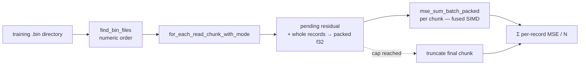
```mermaid
flowchart LR
    D["training .bin directory"] --> F["find_bin_files<br/>numeric order"]
    F --> C["for_each_read_chunk_with_mode"]
    C --> P["pending residual<br/>+ whole records → packed f32"]
    P --> M["mse_sum_batch_packed<br/>per chunk — fused SIMD"]
    M --> A["Σ per-record MSE / N"]
    P -. "cap reached" .-> T["truncate final chunk"]
    T --> A
```

### Struct-of-arrays hot synapse view (Issue #533)

The interleaved gather reads only two of `SynapseData`'s three fields, so
`CompiledNetwork` also carries a parallel **struct-of-arrays** view of them —
`hot_weights: Vec<f32>` and `hot_from: Vec<u16>`, in the same order as
`synapses`. The interleaved kernels take those two slices, streaming 6 B per
synapse instead of the struct's 8 B; `synapse_type` stays on `SynapseData` for
the aggregate/IF and single-record paths, which are unchanged. Values and
accumulation order are identical, so every result stays bit-identical.

Both views are built by `hot_synapse_soa` at every construction path
(`CompiledNetwork::new`, `CompiledNetwork::from_parts`, `compile_creature`), and
cost **+6 B per synapse per compiled network** — ~126 KB on the production
creature, cloned once per directory-scoring worker. Since Issue #625 the fields
are private, so a caller outside the crate cannot drift them at all; they are
still two vectors, so `debug_assert_hot_soa` runs at every interleaved entry
point and panics in debug builds if an in-crate edit has let them drift.

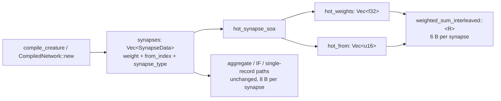
```mermaid
flowchart LR
    C["compile_creature / CompiledNetwork::new"] --> S["synapses: Vec&lt;SynapseData&gt;<br/>weight + from_index + synapse_type"]
    S --> H["hot_synapse_soa"]
    H --> W["hot_weights: Vec&lt;f32&gt;"]
    H --> F["hot_from: Vec&lt;u16&gt;"]
    W --> G["weighted_sum_interleaved::&lt;R&gt;<br/>6 B per synapse"]
    F --> G
    S --> A["aggregate / IF / single-record paths<br/>unchanged, 8 B per synapse"]
```

```bash
# Run the data-parallel scoring throughput bench (1 vs all cores).
cargo bench -p neat-core --features parallel --bench parallel_scoring

# A/B the fused-MSE tile width (edit MSE_TILE_LANES, rebuild, compare medians).
cargo bench -p neat-core --bench hot_paths -- mse_sum_production
```

### Creature JSON observation-width contract (Issue #550)

`CreatureExport` (`neat-core/src/creature.rs`) is the Rust mirror of the
TypeScript `CreatureExport` interface: top-level `input` / `output` integers,
then `neurons` and `synapses`. The two counts are the **width contract** for
the whole fleet — `input` is the observation count and `output` the target
count — and `neurons` deliberately lists only *non-input* neurons, so **`input`
cannot be re-derived from the neuron list**: lose it and the width is gone.

`input < 1` or `output < 1` is therefore never accepted anywhere in this crate.
`validate_creature_width` is the single home of the rule and every entry point
calls it:

| Entry point | `input: 0` / `output: 0` | missing key | `-1` |
|-------------|--------------------------|-------------|------|
| `parse_creature_json` | `CreatureError::InvalidInputCount { found }` / `InvalidOutputCount { found }` | `CreatureError::Json` (no `#[serde(default)]`) | `CreatureError::Json` |
| `compile_creature` | same typed error, checked **before** any other validation | — | — |
| `creature_to_json` / `creature_to_json_pretty` | same typed error — a widthless creature is never *written* | — | — |

**The rule is bounded at the top as well (Issue #622).** `input` is a *declared*
count with no backing data in the JSON, and three of the callers that trust it
go on to turn it into one owned `String` UUID per declared input —
`compile_creature`, `validate_creature_topology` (and so every `graft_*` helper)
and `cleanup_creature_with` each build that map. The other three
(`parse_creature_json` and the two serialisers) allocate nothing per input, and
take the ceiling so that a width no site can honour is never parsed in or
written back out. Sizing an allocation by
a number the payload never backed is what lets `{"input": 100000000, …}` — under
100 bytes — cost a hundred million map entries, and a large enough literal abort
the process on the allocation instead of returning. So the ceiling lives in
`validate_creature_width`, ahead of them all: a declared `input` above
`MAX_NODE_COUNT` (65 536, the widest network a `u16` source index can address)
is `CreatureError::TooManyNodes { count }`, the same typed error a creature
whose *total* node count overflows the index space already earns (Issue #177).
The ceiling is inclusive, and `count` is the declared **node** count — the
declared width plus the listed neurons, added with a saturating sum because the
declaration is untrusted — so the shared `Display` ("Creature has N nodes,
exceeding the maximum of 65536…") says the same thing whichever of the two
checks spoke. Counting the listed neurons costs nothing: they are a real vector,
already in memory. It is the *declared* width, which backs no data, that is
never walked. `output` needs no companion bound: it sizes no allocation, and the
output neurons it declares are counted from `neurons`, so an unreachable value
is already `CreatureError::OutputCountMismatch`.

`creature_validate` walks the declared width the same way but is deliberately
**not** a caller: it reports rule violations in NEAT-AI's wording rather than a
typed width error. It therefore carries the same ceiling as a rule of its own,
ahead of the walk, reading it from `oversized_detail` / `MAX_REQUEST_NEURONS` —
the one home the WASM and `prune_json` boundaries already ask (Issue #639). A
native Rust caller handing a `CreatureExport { input: 100_000_000, .. }`
straight to `creature_validate`, or to its standalone synapse half
`validate_synapse_and_memetic_rules`, is refused in bounded time with
`ValidationError` / `OTHER` carrying that boundary's wording, instead of buying
one `NeuronView` per declared input. The JSON boundaries still refuse the same
creature first, as a *malformed request* rather than a verdict — see the
boundary table in `creature_validate_json`. `MemeticExport::prune_to` — and so
`CreatureExport::prune_memetic` — answers with `()`, so a refusal has nowhere
to go without a public signature change; it is bounded the other way instead
(Issue #650). The implicit input neurons take their own index as their runtime
id, so that half of the id lookup is the identity function: `NeuronIdIndex`
stores only the listed neurons and derives the input range arithmetically. The
prune therefore costs what the payload costs, needs no ceiling of its own, and
resolves every reference exactly as it did before.

The Display text (`Must have at least one input neurons was: 0`) mirrors
NEAT-AI `src/architecture/CreatureValidate.ts` so logs line up across the TS
and Rust stacks. A valid creature round-trips `input` / `output` byte-identically
through parse → serialise (`neat-core/tests/creature_width_contract.rs`).

Consumers (NEAT-AI-scorer, -Backpropagation, -Lamarck, -Discovery and the
downstream trainers) read
the top-level counts and never re-derive them from `neurons`; a hand-built
`CreatureExport` should go through `validate_creature_width` at the boundary.

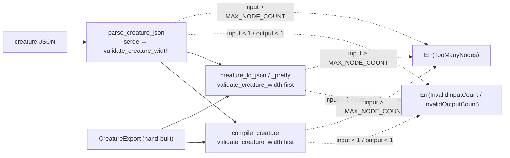
```mermaid
flowchart LR
    J["creature JSON"] --> P["parse_creature_json<br/>serde → validate_creature_width"]
    E["CreatureExport (hand-built)"] --> C["compile_creature<br/>validate_creature_width first"]
    P --> C
    E --> S["creature_to_json / _pretty<br/>validate_creature_width first"]
    P --> S
    P -. "input &lt; 1 / output &lt; 1" .-> X["Err(InvalidInputCount / InvalidOutputCount)"]
    C -. "input &lt; 1 / output &lt; 1" .-> X
    S -. "input &lt; 1 / output &lt; 1" .-> X
    P -. "input &gt; MAX_NODE_COUNT" .-> Y["Err(TooManyNodes)"]
    C -. "input &gt; MAX_NODE_COUNT" .-> Y
    S -. "input &gt; MAX_NODE_COUNT" .-> Y
```

The ceiling is what makes that check order load-bearing rather than tidy — the
width is bounded before anything is sized by it:

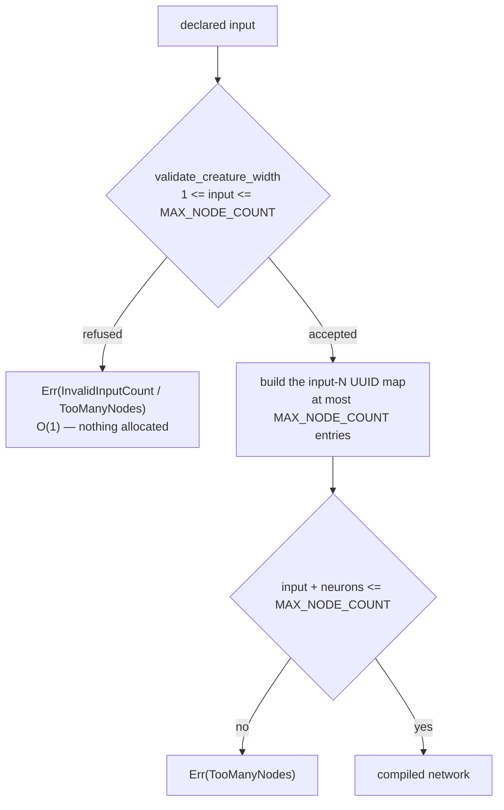
```mermaid
flowchart TD
    W["declared input"] --> V{"validate_creature_width<br/>1 &lt;= input &lt;= MAX_NODE_COUNT"}
    V -- "refused" --> E["Err(InvalidInputCount / TooManyNodes)<br/>O(1) — nothing allocated"]
    V -- "accepted" --> M["build the input-N UUID map<br/>at most MAX_NODE_COUNT entries"]
    M --> N{"input + neurons &lt;= MAX_NODE_COUNT"}
    N -- "no" --> T["Err(TooManyNodes)"]
    N -- "yes" --> O["compiled network"]
```

### Duplicate `(fromUUID, toUUID, type)` synapses are rejected (Issues #556, #577)

NEAT-AI's TypeScript loader keys synapses by the `(fromUUID, toUUID, type)`
triple, so a creature carrying that triple twice loses every copy but one before
it is scored. `compile_creature` used to resolve each synapse independently and
**sum** them, so the same JSON scored differently under the two engines —
observed in production as `rust_scorer` 0.356183 against `Creature.scoreDir`
0.353147.

Which copy TypeScript keeps falls out of its map insertion order, so there is
no value this crate could reproduce and no safe way to dedupe.
`validate_no_duplicate_synapses` is the single home of the rule and
`compile_creature` calls it right after `validate_creature_width`: a repeated
triple is `CreatureError::DuplicateSynapse { from_uuid, to_uuid }`, naming the
first one that repeats in declaration order. Distinct pairs that share one
endpoint — fan-out from a source, fan-in to a target — are untouched.

**The role is part of the key, and only an `IF` target may use it**
(Issue #577). An `IF` neuron keeps a sum per role, so one source may feed two of
its branches: the contribution that must apply whichever way the node branches
lands in both sums from one neuron, where it used to need an IDENTITY relay
purely to be a second distinct source. Measured on a production creature, 455
such relays had accumulated; removing 415 of them was worth **+4.96e-5** of
score for behaviour identical to 1.5e-9. Every other squash sums its inward
synapses regardless of role, so two synapses from one source there are exactly
one with the summed weight — redundancy with no meaning, rejected as
`CreatureError::TypedDuplicateSynapse { from_uuid, to_uuid }`. The two variants
are deliberately distinct: a caller can tell "you repeated yourself" from "that
target cannot mean what you wrote".

Many synapses may still carry the same role into one neuron — two `condition`
edges into an `IF` neuron are what a decision stump is built from — as long as
their sources differ (Issue #572). The wire format is unchanged: `type` is
already in the JSON, and every previously valid creature stays valid.

Consumers that assemble a `CreatureExport` in Rust rather than parsing one
should call `validate_no_duplicate_synapses` at their own boundary
(NEAT-AI-Forests already guards this itself).

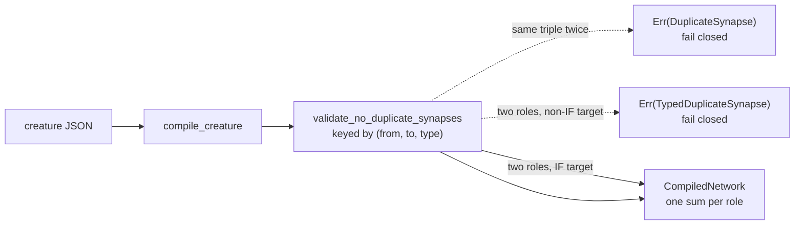
```mermaid
flowchart LR
    J["creature JSON"] --> R["compile_creature"]
    R --> V["validate_no_duplicate_synapses<br/>keyed by (from, to, type)"]
    V -. "same triple twice" .-> X["Err(DuplicateSynapse)<br/>fail closed"]
    V -. "two roles, non-IF target" .-> Y["Err(TypedDuplicateSynapse)<br/>fail closed"]
    V -- "two roles, IF target" --> C["CompiledNetwork<br/>one sum per role"]
    V --> C
```

### Creature weights parse to the exact `f64`

`serde_json`'s **default** number parser is a fast approximation that can land
1 ULP from the `f64` a decimal literal names; the exact algorithm is behind its
opt-in `float_roundtrip` feature. JavaScript `JSON.parse` — and Rust's own
`f64::from_str` — are always exact, so without that feature the Rust engines
(Backpropagation, scorer, Lamarck) trained and scored a *slightly different
network* from the one NEAT-AI's TypeScript loaded. Unlike the duplicate-synapse
gap above, nothing failed: the number was just marginally wrong.

`neat-core` therefore builds `serde_json` with `float_roundtrip` **always on**
(`neat-core/Cargo.toml`). It is not a Cargo feature of this crate and must not
become one — a consumer that turned it off would get the silent drift back.
Round-tripping a production trainer sampler creature (24,232 synapses) is the
measure: exactly one synapse weight differed before
(`2.2985736498644322e-8` loaded as `2.298573649864432e-8`), none after, and
`parse -> serialise -> parse` is now an identity as the `creature.rs` module
docs have always claimed. The cost is ~0.7 ms on a one-off 3 MB creature load
(5.4 ms → 6.1 ms best-of-25, release build).

`neat-core/tests/creature_float_roundtrip.rs` is the gate: ten literals the
fast parser gets wrong across the exponent range, every `f64` field on the wire
(synapse weight, neuron bias, `memetic` weights and biases), the round-trip
contract, and a 4,000-value sweep asserting that the shortest-form text of
**any** finite `f64` parses back to that same `f64`. The oracles are the bit
pattern the sweep started from and `f64::from_str` — neither shares a code path
with `serde_json`.

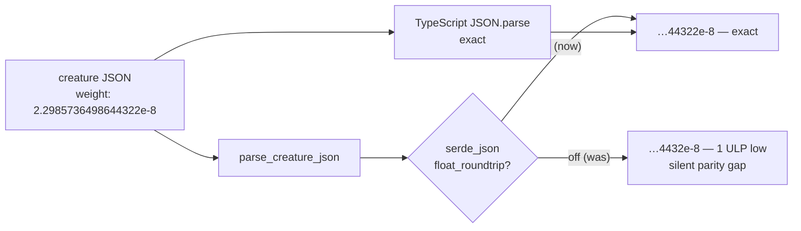
```mermaid
flowchart LR
    J["creature JSON<br/>weight: 2.2985736498644322e-8"] --> T["TypeScript JSON.parse<br/>exact"]
    J --> R["parse_creature_json"]
    R --> F{"serde_json<br/>float_roundtrip?"}
    F -- "off (was)" --> D["…4432e-8 — 1 ULP low<br/>silent parity gap"]
    F -- "on (now)" --> E["…44322e-8 — exact"]
    T --> E
```

### Canonical IF decision trees and the graft helper (Issue #555)

`neat-core` owns the fleet's one interpretation of a decision tree built from
the `IF` aggregate. **NEAT-AI-Forests and every other consumer read it from
here** rather than inventing their own reading of the synapse roles.

An `IF` neuron sums its `Condition` inputs. When that sum is **strictly**
greater than zero it emits the sum of its `Positive` inputs, otherwise the sum
of its `Negative` inputs; the neuron's bias is added either way. So a split test
`x > t` is a condition sum of `x * 1.0 + 1.0 * (-t)`, with a constant neuron
supplying the `1.0`. A creature may not carry two synapses between the same
ordered pair of neurons, so one node cannot take all three roles from a single
constant — each grafted node brings its own trio of `1.0` constants, leaving the
threshold and the leaf values in the trainable **weights**.

**Fixtures** — `neat-core/src/decision_tree.rs`, with documented expected
outputs beside each builder:

| Builder | Shape | Covers |
|---------|-------|--------|
| `stump_creature()` | `x > 0.5 ? 3.0 : 0.0` | single split, zero/default branch (`STUMP_CASES`) |
| `depth2_tree_creature()` | root on `x0 > 0.5`, both children on `x1 > 0.25` | nested depth-2, all four leaves (`DEPTH2_CASES`) |
| `linear_base_creature()` | `2x`, no `IF` at all | the pre-graft base |
| `residual_correction_creature()` | `2x + (x > 0.75 ? 1.5 : 0)` | non-zero residual/correction leaf (`RESIDUAL_CASES`) |

**Graft helper** — `neat-core/src/if_graft.rs`. A caller describes the node
(`IfNodeSpec`, or `IfCorrectionSpec` for the common depth-1 correction) and
`graft_if_node` / `graft_if_nodes` / `graft_if_tree` / `graft_if_correction`
return a **new** validated `CreatureExport`; the source is never mutated. Placement is chosen so
the node is evaluated after every source and before every target, which is what
preserves the `forwardOnly` reading order the compiled forward pass relies on.
Every rejection is a typed `GraftError` and **no creature is produced** —
unknown or duplicate UUID, a missing `IF` role, no outward edge, an edge to an
input or a constant, a self edge, a duplicate edge (same pair in the same role,
or two roles into a target that is not an `IF` neuron), a non-finite weight or
bias,
or no position that keeps every edge pointing forwards. `graft_if_correction`
on `linear_base_creature()` reproduces `residual_correction_creature()` exactly,
which is how the helper and the fixture keep each other honest.

**Whole trees and both-branch corrections** (NEAT-AI-Forests #48) —
`graft_if_nodes` grafts a post-order batch as one all-or-nothing change, where a
node may leave its outward edge to a later node in the same batch (the nested
child feeding a parent that does not exist yet); only the assembled creature is
validated. `IfNodeSpec::with_target_role` emits a **typed** outward edge, which
is how a correction reaches one named branch of an `IF` destination, and
a node reaches **both** branches of one `IF` destination by listing it once per
role (Issue #577) — the IDENTITY relay `graft_relay_node` adds is no longer
needed for that, and remains only for a caller that wants the relayed sum
itself.

`validate_creature_topology` is the shared gate both ends run: it reuses
`validate_creature_width`, `validate_topology_typed`,
`validate_structural_integrity` and `validate_no_duplicate_synapses` rather than
restating their rules. The ordering gate only runs for `forwardOnly` creatures,
because a recurrent creature legitimately carries backward edges.

Those gates read `u32` widths and `u32` neuron indices, so a declared count is
bounded **before** the UUID map names one entry per declared input. A count past
`u32::MAX` earns `GraftError::CountNotRepresentable` and is never narrowed
(Issue #606, which is what a declared `output` of `4_294_967_297` read as `1`
before). Since Issue #622 the narrower `MAX_NODE_COUNT` ceiling on `input` runs
ahead of it, so through a creature only `output` still reaches that gate:
an over-wide `input`, and the node count it drives, come back as
`GraftError::Creature(CreatureError::TooManyNodes)` instead.

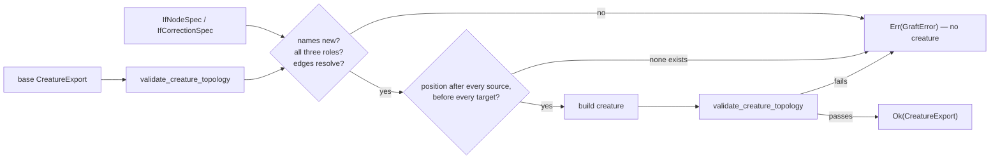
```mermaid
flowchart LR
    B["base CreatureExport"] --> V["validate_creature_topology"]
    S["IfNodeSpec / IfCorrectionSpec"] --> K{"names new?<br/>all three roles?<br/>edges resolve?"}
    V --> K
    K -- no --> E["Err(GraftError) — no creature"]
    K -- yes --> P{"position after every source,<br/>before every target?"}
    P -- none exists --> E
    P -- yes --> G["build creature"]
    G --> V2["validate_creature_topology"]
    V2 -- fails --> E
    V2 -- passes --> O["Ok(CreatureExport)"]
```

### Pruning parity fixtures (Issue #588)

`neat-core/src/prune_fixtures.rs` captures NEAT-AI's battle-tested **removal**
semantics — remove a hidden neuron or one synapse, then repair whatever the
removal broke — as `(before, request, after)` triples where `after` is the
creature the TypeScript operators actually produced. It is step 1 of the
canonical pruning rewrite engine (Issue #587): the fixtures are the acceptance
oracle the shared Rust helpers (Issues #590 / #591) are graded against, so a
rewrite has a recorded "before" to be graded on.

Nothing in this module prunes. `PRUNE_PARITY_CASES` is walked by
`neat-core/tests/prune_parity.rs`, which asserts the rules each capture
encodes: the orphan cascade to a fixed point, a target that loses its last
inward edge becoming a constant whose bias is its own squash of its old bias, a
source left with nothing to feed being removed, typed edge identity (only the
requested `(from, to, role)` triple goes), `IF` repair with its coalesced rows
summed, constants-then-hiddens ordering with the synapses re-sorted, the
content-derived `memetic` record dropped, and the discovery bias fold that
leaves a creature scoring identically. Every pair is re-checked through
`creature_validate`, `validate_creature_topology` and `compile_creature` —
a successful rewrite never returns an invalid creature.

The full mapping from each TypeScript behaviour and test to its fixture, how
the captures were taken, and what is deliberately **not** captured are in
[`docs/research/pruning-parity-matrix.md`](docs/research/pruning-parity-matrix.md).

### Canonical pruning cleanup (Issue #589)

`neat-core/src/prune_cleanup.rs` is the cleanup engine every prune operation
calls after its requested deletion. `cleanup_creature(&creature)` takes the
creature **as the caller left it** — one neuron or one typed edge short, and
very possibly invalid because of it — repairs it to a fixed point, and validates
the stable result before returning it. A successful call never returns an
invalid creature.

```rust
pub fn cleanup_creature(creature: &CreatureExport)
    -> Result<CleanupOutcome, CleanupError>;
```

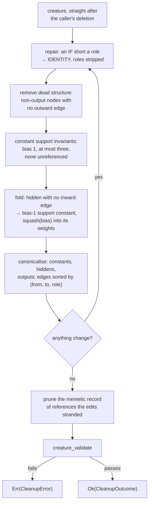
```mermaid
flowchart TD
    I["creature, straight after<br/>the caller's deletion"] --> R["repair: an IF short a role<br/>→ IDENTITY, roles stripped"]
    R --> D["remove dead structure:<br/>non-output nodes with<br/>no outward edge"]
    D --> C["constant support invariants:<br/>bias 1, at most three,<br/>none unreferenced"]
    C --> F["fold: hidden with no inward edge<br/>→ bias-1 support constant,<br/>squash(bias) into its weights"]
    F --> N["canonicalise: constants, hiddens,<br/>outputs; edges sorted by (from, to, role)"]
    N --> Q{"anything change?"}
    Q -- yes --> R
    Q -- no --> M["prune the memetic record<br/>of references the edits stranded"]
    M --> V["creature_validate"]
    V -- fails --> E["Err(CleanupError)"]
    V -- passes --> O["Ok(CleanupOutcome)"]
```

The stable creature is put through **both** shared gates before it is
returned — `creature_validate` (the TypeScript rule table) and
`validate_creature_topology` (the index-space and order-independent legs,
including `validate_no_duplicate_synapses`) — so a creature that fails either is
reported as a `CleanupError`, never handed back.

`CleanupOutcome` carries the creature plus what the cleanup cost: the neurons
and synapses removed, the hidden neurons folded into constant support, the
constants rescaled or merged, the `IF` neurons downgraded (or, under
`IfRepair::Rewrite`, flattened and role-restored), and how many passes the fixed
point took. Callers own *which* neuron or synapse to try and any
statistical compensation (Issues #590 / #591); cleanup owns the exact structural
repair.

#### Every rewrite is exact

Cleanup removes only structure nothing reads, or rewrites structure into a form
that computes the **same number on every record**. It never approximates — the
one deliberate exception is the `IF` repair, where a neuron that has lost a
required role can no longer branch at all.

| Rewrite | Why it is exact |
|---------|-----------------|
| dead structure removed | nothing reads it, so no output depends on it |
| hidden with no inward edge → constant | it sums nothing, so its activation is `squash(bias)` on every record; that value moves into its outward **weights** |
| constant of value `b` → bias-1 constant | `1 · (w · b)` is the term `b · w` was |
| two edges from one constant merged | summed at a summing target; the smaller/larger weight at `MINIMUM`/`MAXIMUM`, where a constant term is the weight itself |
| roles stripped at a non-`IF` target | only an `IF` keeps a sum per role; anywhere else the role is unread |

A `MEAN` target divides by its inward **count** and a `HYPOT` squares each term,
so merging two edges there would change the value — cleanup refuses, keeps the
constants apart, and never trades correctness for the constant budget.

#### Two `IF` repair policies (Issue #591)

The inexact `IF` repair above is a **policy**, not a fixed rule.
`cleanup_creature` keeps TypeScript parity (`IfRepair::Downgrade`), which is what
the `prune_fixtures.rs` captures record and what Issue #590's neuron removal
uses. `cleanup_creature_with(&creature, CleanupOptions { if_repair: … })` lets a
caller ask for `IfRepair::Rewrite` instead — the exact rewrites synapse pruning
uses, described under [Synapse pruning](#synapse-pruning-issue-591). Under that
policy `CleanupOutcome::downgraded_if_neurons` is always empty and
`static_if_neurons` / `restored_if_roles` carry the rewrites that replaced it.

#### Constants are support nodes

Constants exist to carry a fixed value into the legal synapse roles, not to be
optimised (Ockham #180). Cleanup holds four invariants: every constant has bias
exactly `SUPPORT_CONSTANT_BIAS` (`1.0`), a fold **reuses** an existing
compatible constant rather than minting one, a constant nothing references is
removed, and a creature carries at most `MAX_SUPPORT_CONSTANTS` (`3`) of them.

That is a **deliberate divergence** from the TypeScript captures in
`prune_fixtures.rs`, which carry the folded value in the constant's *bias*
(`LOGISTIC(0.4)` and friends). The two forms are the same function of the
inputs, and `neat-core/tests/prune_cleanup.rs` proves it by activating both
halves — but only this one holds the support-node invariants, so parity with the
captures is asserted on the numbers the creatures produce rather than on their
bytes. The cascade and `IF`-repair captures carry no constants, and cleanup
reproduces those byte for byte.

### Hidden-neuron pruning (Issue #590)

`neat-core/src/prune_neuron.rs` is the shared answer to "remove this hidden
neuron and give me back something I can score". It cuts the requested neuron
out, optionally compensates the targets that read it with the **caller's** own
statistics, runs the Issue #589 cleanup fixed point over the wreckage, and
validates the stable result before returning it.

```rust
pub fn prune_neuron(
    creature: &CreatureExport,
    neuron_uuid: &str,
    stats: Option<&PruneStats>,
) -> Result<PruneResult, PruneError>;
```

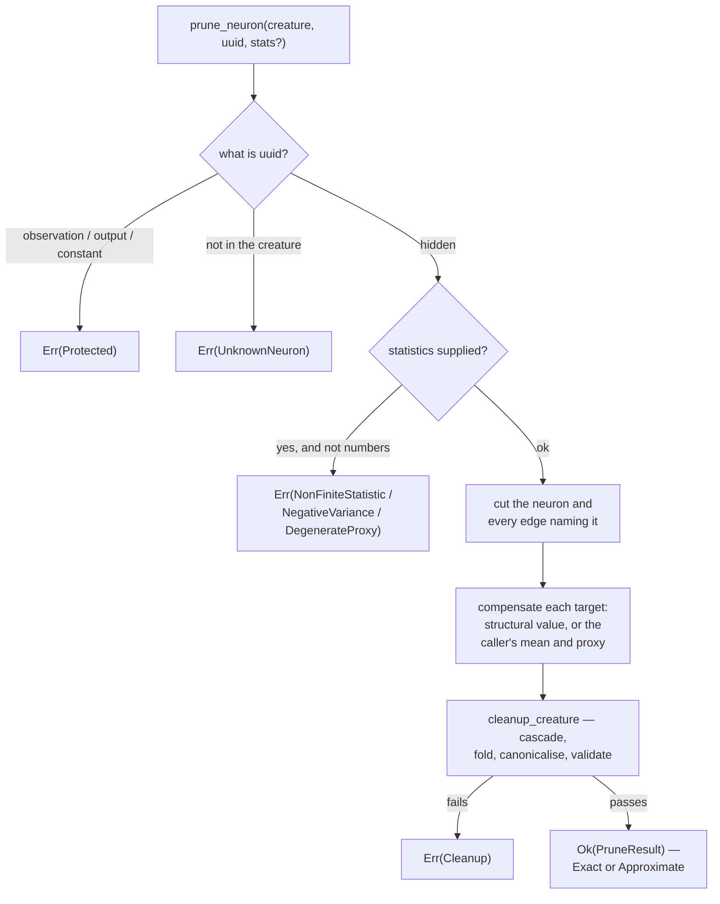
```mermaid
flowchart TD
    Q["prune_neuron(creature, uuid, stats?)"] --> C{"what is uuid?"}
    C -- "observation / output / constant" --> P["Err(Protected)"]
    C -- "not in the creature" --> U["Err(UnknownNeuron)"]
    C -- hidden --> S{"statistics supplied?"}
    S -- "yes, and not numbers" --> N["Err(NonFiniteStatistic /<br/>NegativeVariance / DegenerateProxy)"]
    S -- ok --> X["cut the neuron and<br/>every edge naming it"]
    X --> F["compensate each target:<br/>structural value, or the<br/>caller's mean and proxy"]
    F --> L["cleanup_creature — cascade,<br/>fold, canonicalise, validate"]
    L -- fails --> E["Err(Cleanup)"]
    L -- passes --> R["Ok(PruneResult) —<br/>Exact or Approximate"]
```

**Only a hidden neuron is a direct target.** Observation (input) and output
neurons carry the declared widths (Issue #550) and a constant is canonical
support structure (Ockham #180), so all three are refused with
`PruneError::Protected` before anything is rewritten. They still *disappear* as
a consequence — a constant nothing references any more is dead structure the
cascade removes — but never on request.

#### The compensation, spelled out

Write `a` for the removed neuron's activation, `μ` and `σ²` for the mean and
variance the caller measured, and `W` for the total weight the neuron carried
into one target.

| Compensation | Rewrite | Residual |
|---|---|---|
| mean bias fold (`DiscoveryNeuronRemoval.ts::applyMeanBiasFold`) | `target.bias += W · μ` | variance `W² σ²` |
| correlated survivor `s`, `β = cov / σₛ²` (`removeNeuronCompensation`) | `weight(s → target) += β · W`, `target.bias += W · (μ − β μₛ)` | variance `W² (σ² − cov²/σₛ²)` |

Every fold, share and residual is reported per target on `PruneResult`, so a
caller sees exactly what it accepted. A proxy must have `σₛ² > 0`, must survive
the removal, and must already feed each target it has a non-zero share to carry
into, or the request is refused rather than half-applied. Statistics that break
the Cauchy–Schwarz bound `cov² <= σ² σₛ²` cannot have come from one sample, so
they are refused too rather than turned into a negative residual variance.

**Where a bias fold means nothing, it is not attempted.** A point-wise squash
computes `squash(bias + Σ w·a)`, so `W · μ` in the bias stands where the removed
term was. An aggregate does not — `MINIMUM` takes the smallest inward term,
`MEAN` divides by its inward count, `HYPOT` squares each term, and an `IF` reads
its condition sum to pick a branch — so those targets are named on
`PruneResult::uncompensated` instead, with the same entry recording a target
left bare because no statistics were supplied at all. The entry is per
**readable key**, not per target: an `IF` fed on two roles is reported once per
role, because it never sums its arms into the single term a total would imply.

#### `Exact` is earned, never assumed

`PruneResult::transform` is the honest label on what came back. It is `Exact`
only where the creature itself proves the removal changed nothing: either
nothing read the neuron, or the neuron had **no inward edge**, so it activated to
one value on every record and that value folds into each target's bias. A
supplied mean never buys the label and never overrides the structural value —
though a bad one is still *refused*, so the same request cannot succeed here and
fail on every other neuron. "Same number" means to the `f32` precision the
forward pass itself works in: the folded value is the very value that pass would
have produced, but the fold re-associates the sum.
Everything else is `Approximate` — including an `IF` that lost a role, which can
no longer branch at all.

**Any hidden neuron prunes** — see
[Total prunability](#total-prunability-any-candidate-always-a-valid-creature-ockham-195)
below, which governs this entry point as much as the synapse one.

**The memetic record is pruned, not dropped** — Issue #590's call on the choice
`docs/research/pruning-parity-matrix.md` left open. TypeScript drops `memetic`
wholesale on every removal; this crate applies rule 31's inverse
(`CreatureExport::prune_memetic`, NEAT-AI-Lamarck#197) through cleanup, so every
entry that still names live structure survives and exactly the dangling ones go.

### Synapse pruning (Issue #591)

`neat-core/src/prune_synapse.rs` is the shared answer to "remove this one edge
and give me back something I can score". It cuts exactly the requested
`(from, to, role)` triple, compensates the target that read it with the
**caller's** statistics, rewrites whatever `IF` structure the removal made
statically decidable, runs the Issue #589 cleanup fixed point, and validates the
stable result before returning it.

```rust
pub fn prune_synapse(
    creature: &CreatureExport,
    key: &SynapseKey,
    stats: Option<&PruneStats>,
) -> Result<PruneResult, PruneError>;
```

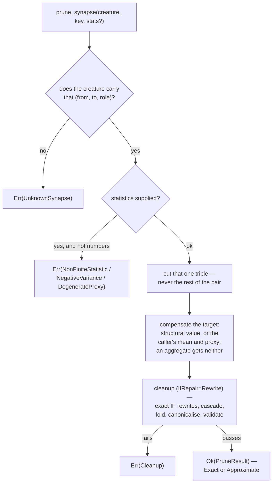
```mermaid
flowchart TD
    Q["prune_synapse(creature, key, stats?)"] --> F{"does the creature carry<br/>that (from, to, role)?"}
    F -- no --> U["Err(UnknownSynapse)"]
    F -- yes --> S{"statistics supplied?"}
    S -- "yes, and not numbers" --> N["Err(NonFiniteStatistic /<br/>NegativeVariance / DegenerateProxy)"]
    S -- ok --> X["cut that one triple —<br/>never the rest of the pair"]
    X --> C["compensate the target:<br/>structural value, or the<br/>caller's mean and proxy;<br/>an aggregate gets neither"]
    C --> R["cleanup (IfRepair::Rewrite) —<br/>exact IF rewrites, cascade,<br/>fold, canonicalise, validate"]
    R -- fails --> E["Err(Cleanup)"]
    R -- passes --> O["Ok(PruneResult) —<br/>Exact or Approximate"]
```

**The role is part of what names an edge.** An `IF` keeps a sum per role, so one
source may feed two of its branches (Issue #577, NEAT-AI #3873); removing "the
`h-a → if-1` synapse" would delete a branch the caller never mentioned. The
request therefore names the triple and only that triple goes. At an `IF`,
`positive` and an **untyped** row are one branch rather than two — the forward
pass adds an untyped inward edge to the positive accumulator and `IfRoles::tally`
counts it as positive — so either spelling of the request names the same edge.
Everywhere else a role means nothing: every other squash sums whatever reaches
it, so the readable key is the pair. All of that is the same reading cleanup
takes (`canonical_role`), so a request and a canonicalisation can never
disagree. An edge sourced at an observation neuron, or targeting an output
neuron, is an ordinary candidate.

#### `IF` structure is rewritten, never refused

NEAT-AI's `SubConnection.ts::#wouldBreakIfNeuron` declines to remove an edge that
would leave an `IF` short a role, so a whole class of typed structure is
unreachable to the mutation operators. This crate rewrites instead
(`CleanupOptions { if_repair: IfRepair::Rewrite }`), and both rewrites compute
the **same number on every record**:

| What the removal left | Rewrite | Why it is exact |
|---|---|---|
| no condition edge, or every condition source structurally fixed | the branch the condition always takes, as an `IDENTITY` sum; the condition edges and the unreachable branch go, and their feeders cascade | the forward pass could never take the other branch |
| a `positive` / `negative` branch with nothing left in it, condition still varying | a **zero-weight** edge from a support constant into that role | an empty branch sum is `0`, and so is `0 · 1` |

Both are reported, on `CleanupOutcome` and again on `PruneResult`:
`static_if_neurons` names the `IF` and the branch that survived,
`restored_if_roles` names the support edges added — including the constant a
rewrite had to mint when the creature carried none, so new structure is never
left to be discovered. `downgraded_if_neurons` is correspondingly always empty
for a synapse prune. Neither rewrite is a compensation: they restore what the
creature already computed once the requested edge was gone, so
`PruneResult::transform` still grades only the loss of the term itself.
`cleanup_creature` keeps the TypeScript-parity `IfRepair::Downgrade` default, so
Issue #590's neuron removal is unchanged.

#### What the removal cost

The edge carried `w · a` into its target, where `a` is the **source's**
activation, so the same compensation table as Issue #590 applies with `W = w`:

| Case | What happens |
|---|---|
| the creature fixes `a` (a constant, or a source with nothing to sum) | `target.bias += w · a`, exactly; no statistic is needed and a supplied mean never overrides it — `TransformClass::Exact` |
| `a` varies and `PruneStats` are supplied | `w · μ` folds into the bias, and a supplied correlated survivor takes `β · w` on its own edge |
| the target aggregates (`MINIMUM`, `MAXIMUM`, `MEAN`, `HYPOT`, or an `IF` reading one role's sum) | no fold stands in for the term, so none is attempted and the target is named on `PruneResult::uncompensated` with the **role** it lost |

`PruneResult::removed_neuron` is `None` for a synapse prune and
`removed_synapses` carries the one requested triple; for `prune_neuron` it is
`Some(uuid)` and every edge naming that neuron.

### Total prunability: any candidate, always a valid creature (Ockham #195)

This section governs **both** entry points above.

A caller that screens candidates cannot be asked to guess which of them the
shared helpers will refuse, so the contract is total: **every hidden neuron and
every listed `(from, to, role)` triple of a valid creature prunes to `Ok`, and
what comes back passes `creature_validate`.**

That does not make `Err(PruneError::Cleanup)` unreachable, and the flowcharts
above are right to show it: `InexactMerge`, `NotStable` and `Invalid` are real
outcomes for a creature a caller built by hand — `InexactMerge`, for instance,
needs duplicate-role rows into a `MINIMUM` / `MAXIMUM` from a hidden source,
which is not a shape a canonical creature carries. What the contract says is
that a **valid** creature never reaches one, so a `Cleanup` refusal there is a
defect in this crate rather than a refusal for callers to code around.

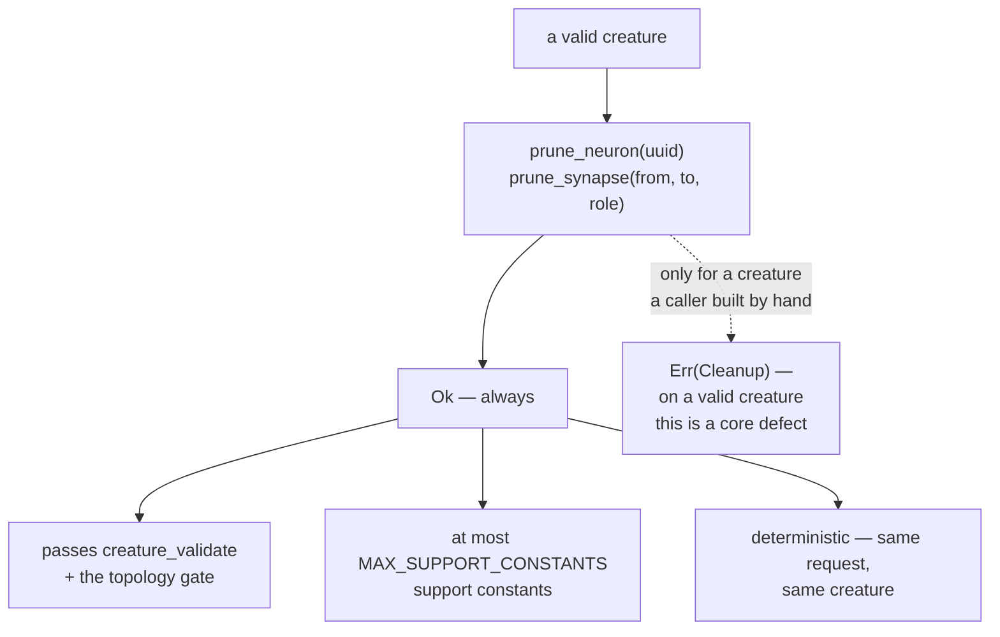
```mermaid
flowchart TD
    C["a valid creature"] --> P["prune_neuron(uuid)<br/>prune_synapse(from, to, role)"]
    P --> O["Ok — always"]
    O --> V["passes creature_validate<br/>+ the topology gate"]
    O --> K["at most MAX_SUPPORT_CONSTANTS<br/>support constants"]
    O --> D["deterministic — same request,<br/>same creature"]
    P -. "only for a creature<br/>a caller built by hand" .-> E["Err(Cleanup) —<br/>on a valid creature<br/>this is a core defect"]
```

`neat-core/tests/prune_total.rs` is what proves that rather than asserting it.
It sweeps three fixture homes, deduplicated by creature: every `before` of
`PRUNE_PARITY_CASES`, every creature carried by `prune_golden_cases()`, and a
short inline list for the shapes neither home holds. `prune_cleanup.rs`'s own
fixtures are not enumerated — they address `cleanup_creature` directly rather
than the two prune entry points. For every hidden neuron and every listed
triple of every fixture, with no statistics and with a mean-only `PruneStats`,
the sweep checks the call returns `Ok`, the request was actually carried out,
the result validates, it carries no more than `MAX_SUPPORT_CONSTANTS`
constants, and the rewrite is deterministic. Each home is counted separately so
one going empty cannot hide behind the others.

Three structural rules the contract rests on are pinned in the same file:

| Rule | Behaviour |
|---|---|
| a hidden neuron left with **no outward** edge | removed, recursively — a three-deep chain collapses in the one `prune_synapse` call that cuts its last edge |
| a hidden neuron left with **no inward** edge | folded to a **bias-1** support constant, its value moved into the reading edges' weights (`fold_zero_inward_hidden`) |
| wiring rules 16-18 of the [`creature_validate` rule table](neat-core/src/creature_validate.rs) | unchanged — an outward-free constant and a hidden neuron missing either direction are invalid, while an **inward-free output is valid**, which is what makes cutting the last edge into an output an ordinary candidate |

### Pruning over the WASM boundary (Issue #592)

The rewrites above are one Rust implementation with **two entry surfaces**.
Rust consumers call `prune_neuron` / `prune_synapse` directly; NEAT-AI calls the
same code over the existing WASM boundary as
`prune_neuron(request: string) -> string` and
`prune_synapse(request: string) -> string`. Nothing about pruning is decided on
the wasm side: `neat-core/src/prune_json.rs` parses the request, calls the
native function and writes the answer down, and `wasm_exports.rs` is a
`#[wasm_bindgen]` rename over it.

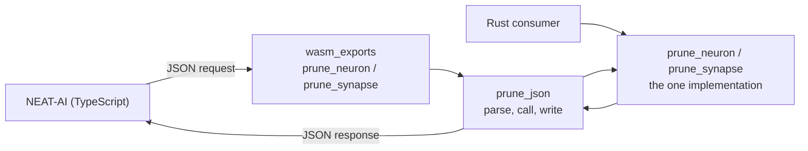
```mermaid
flowchart LR
    TS["NEAT-AI (TypeScript)"] -->|"JSON request"| W["wasm_exports<br/>prune_neuron / prune_synapse"]
    W --> J["prune_json<br/>parse, call, write"]
    R["Rust consumer"] --> P["prune_neuron / prune_synapse<br/>the one implementation"]
    J --> P
    P --> J
    J -->|"JSON response"| TS
```

The ABI is **JSON in, JSON out**, on the `CreatureExport` wire shape NEAT-AI
already exchanges — a creature file goes in and a creature file comes out:

```jsonc
// in — a neuron removal, with the caller's optional statistics
{ "creature": { /* CreatureExport */ }, "uuid": "h-1",
  "stats": { "meanActivation": 0.5, "variance": 0.04,
             "proxy": { "uuid": "h-2", "meanActivation": 0.4,
                        "variance": 0.02, "covariance": 0.01 } } }

// in — a synapse removal; `type` is optional and defaults to the untyped role
{ "creature": { /* CreatureExport */ },
  "synapse": { "fromUUID": "h-a", "toUUID": "if-1", "type": "negative" } }

// out — one of
{ "ok": true, "creature": { /* CreatureExport */ }, "transform": "exact", "passes": 2,
  "removedNeuron": "h-1", "removedSynapses": [ /* … */ ], "cascadeNeurons": [ /* … */ ],
  "staticIfNeurons": [ /* … */ ], "biasFolds": [ /* … */ ], "weightShares": [ /* … */ ],
  "uncompensated": [ /* … */ ] }
{ "ok": false, "failure": { "reason": "PROTECTED_NEURON",
                            "message": "Neuron output-0 is a output node and is protected from direct removal",
                            "malformed": false } }
```

Empty report lists are omitted rather than written as `[]`. `transform` is the
same honest `"exact"` / `"approximate"` label `PruneResult::transform` carries
natively, and a successful call always answers with a creature the shared
`creature_validate` accepts — there is **no scorer and no acceptance policy**
here or in the native crate, because deciding whether to keep the result is the
caller's half of the Issue #587 boundary.

`ok: false` covers two different things and the wire keeps them apart:
`malformed: false` is a request that was understood and **refused** (an unknown
UUID, a protected neuron, an unusable statistic), carrying one of the stable
`reason` codes; `malformed: true` is a payload that never reached the rewrite,
led by `MALFORMED_REQUEST:` — the same convention `creature_validate` uses, and
for the same reason: a panic on wasm aborts the module and `catch_unwind` is
unavailable there. A role spelling the wire does not carry (`"POSITIVE"`) is a
boundary fault rather than a silent `"standard"`, so a typo can never delete an
edge the caller did not name.

#### Native / WASM parity, and what it means exactly

`neat-core/tests/golden/prune_wasm_parity.json` is the shared record: the
Issue #588 fixtures — the same creatures Issues #589-#591 were graded on,
including the `IF`/typed edge cases and the cascade — plus the request shapes
only a boundary has (a refusal, a malformed payload, a static-`IF` rewrite, the
correlated-survivor statistics payload), each with the answer **native** gives
it. Regenerate it with
`UPDATE_PRUNE_GOLDEN=1 cargo test -p neat-core --test prune_json`.

| Gate | Where | What it proves |
|---|---|---|
| `neat-core/tests/prune_json.rs` | `cargo test` | the native ABI answers exactly what the native call answers, and still answers the record |
| `tests/wasm_prune_parity_test.ts` | `quality.sh`, every PR | the record still covers the wire shapes, and the comparator still reports a difference when there is one |
| `scripts/check_wasm_prune_parity.ts` | `wasm-bundle.yml`, both arches | the **published bytes** answer the same requests the same way |

Parity is byte-exact where the representation allows: the keys present, the
array lengths, every uuid, role, squash name, reason code, message, boolean and
integer must match character for character. Floats are compared to
`1e-9 · max(1, |native|)` — relative above `1`, an absolute `1e-9` floor below
it — because folding a fixed neuron's activation runs its squash and a
transcendental is resolved by the host libm natively and by the bundle's own
implementation on wasm — each correct to within an ulp, neither obliged to agree
on the last bit. Every structural claim stays exact, so anything wider than
rounding fails loudly.

### Creature validation contract (Issue #559)

`neat-core/src/creature_validate.rs` is the Rust home of NEAT-AI's
`src/architecture/CreatureValidate.ts` — the fleet's one definition of a valid
creature. NEAT-AI-Forests shipped an invalid creature that `Creature.validate()`
would have caught; the fix is a single definition Rust consumers call natively
and NEAT-AI calls over the existing WASM boundary.

**This issue lands the contract only** — the types, the error model, the rule
order and the input format — so the two rule ports can be worked in parallel
against a fixed interface.

```rust
pub fn creature_validate(creature: &CreatureExport, options: &ValidateOptions)
    -> Result<ValidationStats, ValidationFailure>;
```

| Piece | What it fixes |
|-------|---------------|
| `ValidateOptions` | `forward_only` forces `feedback_loop` to `Some(false)`; otherwise only an explicit `Some(false)` rejects `from > to`. `neurons: Some(0)` is **skipped** (TypeScript truthiness) while `connections: Some(0)` **is** checked (`Number.isInteger`) |
| `ValidationStats` | the `stats` object `creatureValidate` returns: `input`, `constant`, `hidden`, `output`, `connections` |
| `ValidationFailure` | `class` (`TopologyError` / `ValidationError`), the verbatim `reason`, the human-readable `message`, and the `neuron_index` / `synapse_index` it stopped on |
| `VALIDATION_REASONS` / `TOPOLOGY_REASONS` | the `ValidationErrorName` and `TopologyErrorReason` unions verbatim, so NEAT-AI rehydrates the right error type with no translation table |

The reason lists are the single home of the permitted `reason` values and are
checked at **compile time**: each list is internally distinct and the two are
disjoint, so a name copied into the wrong union fails the build. The failure
constructors reject a reason outside their class rather than sending NEAT-AI a
string it cannot rehydrate. Rule evaluation order is part of the contract — the
numbered table in the module documentation is what both ports implement, first
failure wins.

**Input format.** A creature arrives as the `CreatureExport` this crate already
parses, extended by two optional fields — `NeuronExport::id` (signed: output
neurons carry negative ids, NEAT-AI #1958) and `CreatureExport::memetic`
(`biases`, `weights`, with every other key preserved verbatim). Both default to
absent and are skipped on output, so existing `parse_creature_json` callers and
already-written creature files round trip byte-identically. The export form is
index-free, so indices are derived exactly as `compile_creature` derives them:
`0..input` are the implicit input neurons (`input-N`, `id == index`), and
`input + i` is `neurons[i]`.

**What stays host-side** (NEAT-AI#3802): `neuron.creature !== creature`, the
`neuron.index` vs loop-position check, `neuron.validate()` and the `debugWrite` diagnostics
dump all depend on JavaScript object identity or the host filesystem. The
failure's neuron/synapse index is what lets the host run those against the same
neuron the shared rules stopped on.

Both halves of the table are ported, so `creature_validate` evaluates every
rule and returns `ValidationStats` for a creature that breaks none of them. It
is reachable natively and over the WASM boundary, and replayed against the
TypeScript conformance corpus — Issue #562, below.

### Neuron rules ported (Issue #560)

Rules 1–22 — everything `CreatureValidate.ts` evaluates before its synapse walk
— now run in Rust, in the TypeScript's own order, with the message text
reproduced verbatim so NEAT-AI's error-message tests keep passing across the
boundary. Rules 23–31 (synapses, `forwardOnly`, memetic) are Issue #561 and run
straight after them.

Two derivations make the port work on the index-free, id-optional export form:

| Derivation | Rule |
|------------|------|
| Indices — `0..input` are the implicit input neurons, `input + i` is `neurons[i]` (as `compile_creature` derives them) | the walk position every rule reads |
| Ids — input `= index`, output `= -(outputIndex + 1)`, everything else its exported `id` or a deterministic hash of its UUID | rules 4–7, mirroring NEAT-AI's loader, which assigns ids *before* `creatureValidate` runs |

Without the id derivation every modern export — NEAT-AI writes UUIDs, not ids —
would fail rule 4. Because inputs and outputs take derived ids, rules 7, 10 and
21 cannot fail for a `CreatureExport`, and rule 19 is unreachable in both stacks
behind rule 8; all four are ported and covered anyway so the two files stay
line-for-line comparable.

**One implementation per invariant.** `creature_validate` and
`validate_structural_integrity` ask the same wiring questions but answer them
differently — a TypeScript message here, a numeric code and neuron index there —
so neither can call the other. What they share now lives in
`neat-core/src/topology_invariants.rs`: `ConnectionIndex` (inward/outward degree
and the inward synapse list, built once in `O(neurons + synapses)` so no caller
rescans the synapse list per neuron), `hidden_wiring_fault` and
`if_neuron_fault`. Mutating any of the three fails tests on **both** sides.

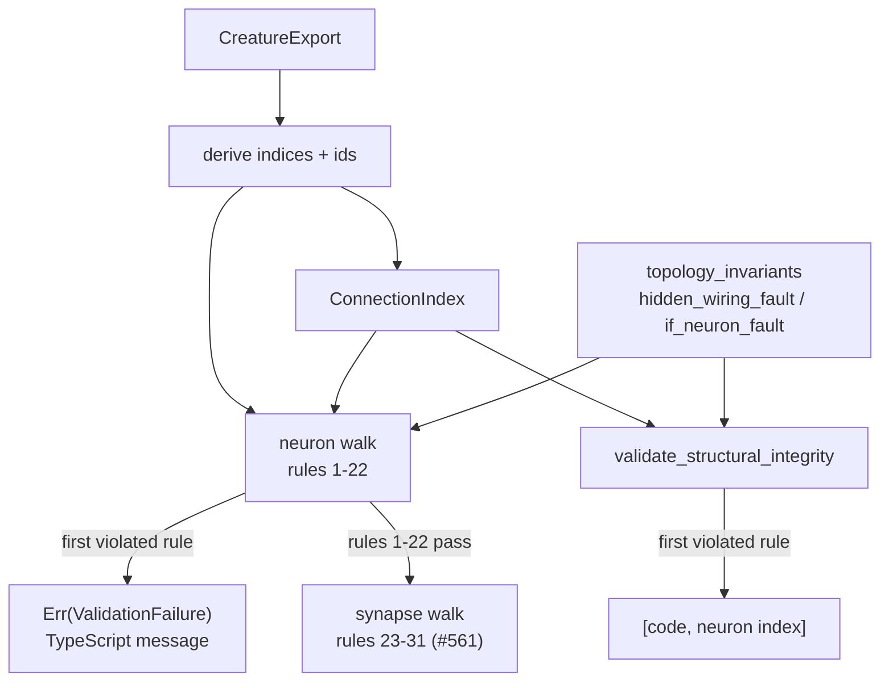
```mermaid
flowchart TD
    CE["CreatureExport"] --> D["derive indices + ids"]
    D --> W["neuron walk<br/>rules 1-22"]
    D --> CI["ConnectionIndex"]
    CI --> W
    CI --> VSI["validate_structural_integrity"]
    SI["topology_invariants<br/>hidden_wiring_fault / if_neuron_fault"] --> W
    SI --> VSI
    W -->|"first violated rule"| F["Err(ValidationFailure)<br/>TypeScript message"]
    VSI -->|"first violated rule"| C["[code, neuron index]"]
    W -->|"rules 1-22 pass"| N["synapse walk<br/>rules 23-31 (#561)"]
```

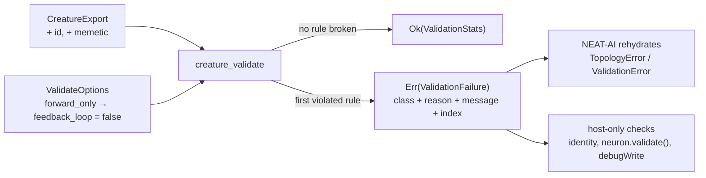
```mermaid
flowchart LR
    C["CreatureExport<br/>+ id, + memetic"] --> V["creature_validate"]
    O["ValidateOptions<br/>forward_only → feedback_loop = false"] --> V
    V -->|"no rule broken"| S["Ok(ValidationStats)"]
    V -->|"first violated rule"| F["Err(ValidationFailure)<br/>class + reason + message + index"]
    F --> T["NEAT-AI rehydrates<br/>TopologyError / ValidationError"]
    F --> H["host-only checks<br/>identity, neuron.validate(), debugWrite"]
```

#### Synapse, forward-only and memetic rules (Issue #561)

Rules 23–31 of that table run behind `creature_validate` and are callable on
their own:

```rust
pub fn validate_synapse_and_memetic_rules(
    creature: &CreatureExport,
    options: &ValidateOptions,
    stats: &mut ValidationStats,
) -> Result<(), ValidationFailure>;
```

`stats` is the same object the neuron walk fills — this half adds the
connection tally and leaves the neuron counters alone, exactly as the
TypeScript threads one `stats` literal through both halves. It evaluates, first
failure wins: the single synapse pass (no synapse into an input neuron; no self
connection under `forward_only`; sorted by `(from, to, type)`; no duplicate
triple, and a pair repeated only into an `IF` target; no
`from > to` when `feedback_loop` is an explicit `Some(false)`), then the
`connections` count, then — for a forward-only creature — `topology_ops`'
`validate_topology_typed`, `validate_structural_integrity` and `detect_cycles`,
and
finally the memetic cross-references.

Two details a caller can trip over:

- **`feedback_loop` is a tri-state.** `None` and `Some(true)` both allow a
  recursive synapse; only `Some(false)` rejects one, and `forward_only: true`
  forces that `Some(false)` whatever the caller asked for.
- **Memetic entries match on neuron identity, not position.** A reference names
  its neuron by runtime **id** or by wire **UUID** (see below), never by array
  index, so a creature whose ids differ from its positions still resolves.

##### Both memetic weight forms

`memetic.weights` is written by NEAT-AI in **two** shapes, and neither is
legacy:

| Form | Shape | Written by |
|------|-------|------------|
| `MemeticWeights::Rows` | `[{ "fromUUID": …, "toUUID": …, "weight": … }, …]` | `MemeticWireExport.ts` — any JSON that leaves the process |
| `MemeticWeights::ById` | `{ "<fromId>": [{ "toId": …, "weight": … }, …] }` | the in-memory `MemeticWeightsInterface` `creatureValidate` sees host-side |

`MemeticWeights` is the single home of that either/or: it dispatches on the
JSON shape (so a value that is neither names both shapes it could have been),
and serialises back in **whichever form was read**, keeping the byte-identical
round trip. Rule 31 resolves the rows by wire UUID — `input-N`, `output-N`, or
the stable `uuid`, the same vocabulary the synapses use — and the map by
runtime id. `biases` keys are read in both vocabularies for the same reason. A
reference that resolves in neither is still `Validation` / `MEMETIC`: accepting
both forms never accepts a neuron that does not exist.

Modelling only the map caused a production failure where a sampler creature
carrying the row form could not parse, exiting with `Creature JSON error:
invalid type: sequence, expected a map`. Supporting both forms resolved the
issue.

##### Pruning — rule 31's inverse (NEAT-AI-Lamarck#197)

Rule 31 refuses a creature whose memetic record names structure that is gone,
so **any** consumer pass that removes a neuron or a synapse must prune the
record with it. That prune lives here, beside the rule:

| Call | Use |
|------|-----|
| `CreatureExport::prune_memetic()` | prune the record the creature carries |
| `MemeticExport::prune_to(&creature)` | prune a record held separately |

Both drop **only dangling** references — a bias whose neuron is gone, a weight
whose synapse is gone — resolved through the same id-or-UUID vocabulary rule 31
reads. Everything else survives: `MemeticExport::extra` (`generation`, `score`,
`ancestry`) verbatim, every still-resolving delta, and the record itself even
when it empties. A *malformed* row or entry (missing `toUUID`, `toId` or
`weight`) is a defect in the record as supplied rather than something a removal
caused, so it is left for rule 31 to report instead of being silently deleted.
Adding structure resolves every existing key, so a prune after a pure append is
a no-op; the operation is idempotent.

Without a shared prune every downstream repo hand-rolls one, and the blunt
version (`memetic = None`) throws away the fine-tuning history the record
exists to carry — which is what NEAT-AI-Lamarck#197 hit when an unpruned
synapse removal made rule 31 refuse the rewire and a whole candidate strategy
silently produced nothing.

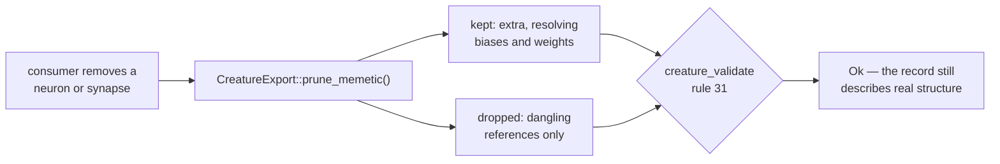
```mermaid
flowchart LR
    R["consumer removes a<br/>neuron or synapse"] --> P["CreatureExport::prune_memetic()"]
    P --> K["kept: extra, resolving<br/>biases and weights"]
    P --> D["dropped: dangling<br/>references only"]
    K --> V{"creature_validate<br/>rule 31"}
    D --> V
    V --> OK["Ok — the record still<br/>describes real structure"]
```

```mermaid
flowchart LR
    W["synapse walk<br/>rules 23–27"] --> N["connections count<br/>rule 28"]
    N --> FWD{"forward_only?"}
    FWD -- yes --> T["topology_ops<br/>validate_topology_typed →<br/>validate_structural_integrity →<br/>detect_cycles"]
    FWD -- no --> M["memetic rules<br/>rule 31"]
    T --> M
    M --> S["Ok(()) — stats.connections tallied"]
```

#### Both consumers, and conformance (Issue #562)

The ported rules are now reachable by both consumer kinds, and proven to agree
with the TypeScript they replace.

**Rust consumers** call `creature_validate` straight off the crate root
(NEAT-AI-Forests and friends); the entry point carries worked doctests for a
valid creature and a rejected one, and `cargo test --doc` is part of the gate.

**NEAT-AI** calls the same code over the WASM boundary as
`creature_validate(request: string) -> string`. The ABI is **JSON in, JSON
out** — the existing exports split between packed byte buffers
(`propagate_topological`) and scalar arguments, and neither fits a whole
creature in and a structured failure out:

```jsonc
// in
{ "creature": { /* CreatureExport */ },
  "options": { "neurons": 3, "connections": 2, "feedbackLoop": false, "forwardOnly": true } }

// out — one of
{ "ok": true,  "stats": { "input": 1, "constant": 0, "hidden": 1, "output": 1, "connections": 2 } }
{ "ok": false, "failure": { "class": "ValidationError", "reason": "NO_INWARD_CONNECTIONS",
                            "message": "hidden neuron h1 has no inward connections",
                            "neuronIndex": 1, "synapseIndex": null, "malformed": false } }
```

Keys the creature carries beyond `CreatureExport` are ignored, but an **unknown
option key is a failure** — silently ignoring `forwardonly` would validate a
production creature under the wrong rules and call it healthy. The creature is
deserialised with serde alone, deliberately not through `parse_creature_json`,
whose width check would shadow rules 2 and 3.

**Malformed input cannot panic.** A panic in WASM aborts the module and
`catch_unwind` is unavailable there, so the boundary is built not to panic:
anything that is not a request comes back as an ordinary structured failure
carrying `"malformed": true` and a `MALFORMED_REQUEST:` message — the JSON twin
of `topology_ops`' `MALFORMED_BUFFER`. Two faults are refused before a rule
runs: a payload serde cannot read, and a creature declaring more than
`MAX_REQUEST_NEURONS` neurons (the ceiling `compile_creature` already enforces),
because the walk allocates one entry per neuron before the first rule. The whole
ABI lives in `neat-core/src/creature_validate_json.rs`, so it is covered by
`cargo test` rather than only in a browser; `wasm_exports.rs` is a rename over
it.

```mermaid
flowchart LR
    JS["NEAT-AI TypeScript"] -->|request JSON| W["wasm_exports<br/>creature_validate"]
    RS["Rust consumers"] -->|CreatureExport| V["creature_validate"]
    W --> J["creature_validate_json"]
    J -->|"not a request,<br/>or too many neurons"| MF["failure<br/>malformed: true"]
    J --> V
    V -->|"Ok(stats)"| OK["ok: true + stats"]
    V -->|"Err(failure)"| ERR["ok: false + class,<br/>reason, message, indices"]
```

**Conformance.** NEAT-AI's language-neutral corpus (NEAT-AI#3801) is vendored
under `neat-core/tests/fixtures/creature_validate/` — bytes, source commit and
checksums recorded there — and replayed by
`neat-core/tests/creature_validate_conformance.rs`. Every replayed case must
produce the same error class, the same `reason` and the same message text; the
happy paths must produce the same five counters.

Ten of the 47 cases describe something the wire shape cannot express, all of
them consequences of the input format Issue #559 fixed rather than of a rule
that was dropped: a non-integer count or id serde rejects at the parse
boundary, an input neuron carrying its own id (inputs are implicit), an output
neuron's declared id (ids are derived), and the host-only `neuron.index` check.
None is skipped — each is declared in the runner with why it diverges *and*
what this crate does instead, and that behaviour is asserted too, so a stale
declaration or a changed outcome fails the test.

**What stays host-side** is unchanged: `neuron.creature !== creature`,
`neuron.index`, `neuron.validate()` and the `debugWrite` diagnostics dump all
read JavaScript object identity or the host filesystem. The failure's
`neuronIndex` / `synapseIndex` is what lets NEAT-AI run those against the same
neuron the shared rules stopped on.

## Related Repositories

The NEAT-AI project is split across seven public repositories. Each focuses on one concern and composes with the others as shown below.

`neat-core` keeps the **per-sample** training primitives (`propagate_topological_loop`, the packed propagate ABI, `mse_mean_streaming`, the topology helpers); the `trainDir` **epoch** loop and its journal, CLI apply policy and `traceStore` layout stay in NEAT-AI-Backpropagation. The rule and the gate that enforces it live in [`AGENTS.md`](AGENTS.md#ownership-fence-issue-544) (Issue #544).

| Repository | Role |
|------------|------|
| [NEAT-AI](https://github.com/stSoftwareAU/NEAT-AI) | Primary Deno/TypeScript neural-network engine (evolution, training, WASM activation). |
| [NEAT-AI-core](https://github.com/stSoftwareAU/NEAT-AI-core) | Shared native Rust library (`neat-core`) with numerics, topology helpers, and the chunked `.bin` training stream. |
| [NEAT-AI-Discovery](https://github.com/stSoftwareAU/NEAT-AI-Discovery) | Rust discovery module invoked by NEAT-AI via Deno FFI to search architectures and hyper-parameters. |
| [NEAT-AI-Snapshot](https://github.com/stSoftwareAU/NEAT-AI-Snapshot) | Creature/genome snapshot format and fixtures produced by NEAT-AI and consumed by downstream tools. |
| [NEAT-AI-scorer](https://github.com/stSoftwareAU/NEAT-AI-scorer) | Production forward-only scoring application built on `neat-core` via a path dependency. |
| [NEAT-AI-Explore](https://github.com/stSoftwareAU/NEAT-AI-Explore) | Visualiser for creatures that reads NEAT-AI-Snapshot data. |
| [NEAT-AI-Examples](https://github.com/stSoftwareAU/NEAT-AI-Examples) | Worked examples and tutorials that depend on NEAT-AI. |

### Dependency graph

```mermaid
graph TD
    Core[NEAT-AI-core<br/>Rust shared lib]
    Main[NEAT-AI<br/>Deno/TypeScript engine]
    Discovery[NEAT-AI-Discovery<br/>Rust, via Deno FFI]
    Snapshot[NEAT-AI-Snapshot<br/>creature data]
    Scorer[NEAT-AI-scorer<br/>Rust scorer app]
    Explore[NEAT-AI-Explore<br/>visualiser]
    Examples[NEAT-AI-Examples<br/>tutorials]

    Main -->|Deno FFI| Discovery
    Main -->|produces| Snapshot
    Scorer -->|path dependency| Core
    Explore -->|reads| Snapshot
    Examples -->|depends on| Main
```

## Propagation to downstream repositories

Once an enhancement merges to `Develop` here, it flows automatically to the
next pull request raised in a consumer repository — no manual SHA bump is
required. The two consumer paths differ in mechanism but share the same Vibe
Coder hook (`bump-deps.sh` runs on every PR; the CI `quality` job then applies
the same gates `quality.sh` runs locally). The flow is guarded in the other
direction too: every pull request here compiles each registered
path-dependency consumer against the candidate core (the `downstream-consumers`
job, Issue #644), so a change that would break one cannot merge before that
consumer is migrated — see
[`RELEASING.md`](RELEASING.md#changing-or-removing-public-api-the-three-phase-flow).

### NEAT-AI (Deno + WASM consumer)

- On every push to `Develop`, [`.github/workflows/wasm-bundle.yml`](.github/workflows/wasm-bundle.yml)
  builds `wasm_activation-pkg.tar.gz` and publishes a per-commit GitHub
  Release tagged `wasm-bundle-<SHA>`. Each Release carries three assets: the
  tarball, its `wasm_activation-pkg.tar.gz.sha256` sidecar, and the CycloneDX
  SBOM `wasm_activation-pkg.cdx.json`.
- NEAT-AI's `bump-deps.sh` invokes `./build.sh`, which downloads the matching
  bundle, verifies it against the `.sha256` sidecar, and updates `deno.json`'s
  `neatCore.rev` field in lock-step. The sidecar is the per-revision hash
  anchor: it ships with the revision it describes, so a `neatCore.rev` bump
  has a trustworthy hash for the *new* bundle rather than only the pin
  recorded for the old one.
- A fresh PR in NEAT-AI is therefore sufficient to pick up the latest
  `Develop` of NEAT-AI-core.
- The published bundle (and its CycloneDX SBOM) carries a Sigstore-backed
  build-provenance attestation, so a consumer can cryptographically confirm
  the tarball was produced by this workflow from the pinned commit before
  trusting it. Verify in the bump flow with:

  ```bash
  gh attestation verify wasm_activation-pkg.tar.gz \
    --repo stSoftwareAU/NEAT-AI-core
  ```

  Pinning by SHA and the post-publish content re-verification prove the
  bundle's *shape*; the attestation proves its *origin*, closing the
  published-artefact-substitution attack class.

### NEAT-AI-scorer (Rust + path dependency)

- NEAT-AI-scorer is one of the registered path-dependency consumers in
  [`scripts/downstream-consumers.txt`](scripts/downstream-consumers.txt) —
  with NEAT-AI-Backpropagation, NEAT-AI-Rebase, NEAT-AI-Forests, NEAT-AI-Ockham
  and NEAT-AI-Lamarck — that the `downstream-consumers` gate compiles against
  every pull request here before it can merge (Issue #644).
- NEAT-AI-scorer's CI uses `actions/checkout` to clone
  `stSoftwareAU/NEAT-AI-core@Develop` into the workspace on every PR.
- `rust_scorer/Cargo.toml`'s `path = "../../NEAT-AI-core/neat-core"` resolves
  against that fresh clone, so the next PR build always compiles against the
  current tip of `Develop`.
- No SHA pin or release artefact is involved on this path.

### End-to-end flow

```mermaid
sequenceDiagram
    actor Dev as Maintainer
    participant Core as NEAT-AI-core/Develop
    participant CI as wasm-bundle.yml
    participant Rel as GitHub Release<br/>wasm-bundle-{SHA}
    participant Main as NEAT-AI PR
    participant Scorer as NEAT-AI-scorer PR

    Dev->>Core: merge enhancement
    Core->>CI: push to Develop
    CI->>CI: attest build provenance (Sigstore, keyless)
    CI->>Rel: build & publish wasm_activation-pkg.tar.gz + .sha256 + SBOM
    CI->>Rel: re-download & sha256sum -c (fails job on mismatch)
    Dev->>Main: open PR
    Main->>Rel: bump-deps.sh -> build.sh download
    Main->>Rel: verify tarball against .sha256 sidecar
    Main->>Rel: gh attestation verify (origin proof)
    Note over Main: deno.json neatCore.rev advances
    Dev->>Scorer: open PR
    Scorer->>Core: actions/checkout @Develop
    Note over Scorer: path dep resolves fresh clone
```

### Wiring reference

| Consumer | Trigger | Script / workflow |
|----------|---------|-------------------|
| NEAT-AI-core | push to `Develop` | [`.github/workflows/wasm-bundle.yml`](.github/workflows/wasm-bundle.yml) |
| NEAT-AI | PR opened (Vibe Coder hook) | `NEAT-AI/bump-deps.sh` → `NEAT-AI/build.sh` |
| NEAT-AI-scorer | PR opened (CI) | `NEAT-AI-scorer/.github/workflows/ci.yml` (`actions/checkout` of `NEAT-AI-core@Develop`) |

### Race window

`wasm-bundle.yml` typically takes ~30–60 seconds to build and publish the
release after a merge to `Develop`. PRs raised in NEAT-AI inside that
window may transiently fail the bundle download in `build.sh` because the
release tag for the latest `Develop` SHA does not yet exist. Re-run the
PR's checks once the bundle workflow has completed, or wait a minute
before opening the PR.

## Dependency updates: two channels

Two committed channels raise routine dependency-bump PRs. Both are weekly;
the quarantine-aware workflow is the authoritative one, because it is the only
channel that applies this project's release-age quarantine before proposing a
bump:

- **Routine bump (authoritative)** — [`.github/workflows/upgrade-dependencies.yml`](.github/workflows/upgrade-dependencies.yml)
  runs `bump-deps.sh` every Monday (`cron "0 6 * * 1"`), applying the
  `VIBE_BUMP_QUARANTINE_HOURS` release-age quarantine, the advisory scan
  (`cargo deny check advisories`, falling back to `cargo audit`), and
  dual native/WASM builds before raising a general upgrade PR. The same script
  runs on every PR from the `ci.yml` `version-increment` job.

  `bump-deps.sh` is deliberately resilient (Issue #621), because a run that
  exits non-zero has its whole bump reverted by the caller and, repeated,
  disables dependency updates for the repository. A crate that cannot be
  bumped **safely** — rejected by `cargo update`, still inside the quarantine
  window, of a release age the registry would not name, or reverted because
  its update dragged an out-of-plan transitive crate onto a version that had
  not itself cleared the window (Issue #627) — is reported as a **deferral**,
  left on the version it is already on, and the run carries on.
  A release age nobody could establish is counted apart from a quarantine wait
  (`… , N release age unknown`), because that is a host or registry fault
  rather than a routine hold — a run where every crate lands there has quietly
  stopped bumping anything, and the summary has to say so.
  Non-zero is reserved for a tree that must not be kept: `cargo` missing, an
  advisory found, a build failure, or a `Cargo.lock` that could not be
  restored. With **no** advisory scanner installed the scan cannot vouch for
  the bump, so the run warns, restores the `Cargo.lock` it started with and
  reports the resulting no-op. The restore is driven by comparing the file
  against a pre-run snapshot rather than by the bump counter, so a transitive
  entry `cargo update` rewrote on its own way past the plan is dropped too —
  nothing lands unscanned, and a missing tool never fails the run:

  ```mermaid
  flowchart TD
      Plan["cargo update --dry-run"] -->|plan unread| Report["external: plan unavailable — exit 0"]
      Plan -->|plan read| Crate{"crate bumpable safely?"}
      Crate -->|no| Defer["defer: crate — left as it is"]
      Crate -->|yes| Bump["bump: crate -> target"]
      Defer --> Scan
      Bump --> Scan{"advisory scanner on PATH?"}
      Scan -->|no| Revert["warn, revert this run's bumps — exit 0"]
      Scan -->|yes, clean| Build{"native + wasm build"}
      Scan -->|yes, advisory| Fail["audit: FAILED — exit 1"]
      Build -->|ok| Done["exit 0"]
      Build -->|broken| Fail
  ```

- **Dependabot version updates** — [`.github/dependabot.yml`](.github/dependabot.yml)
  configures one Cargo **version-updates** entry per lockfile — the workspace
  root and the excluded `wasm-bench` harness (Issue #607) — each with
  `interval: weekly`, a 7-day `cooldown` (newly published crates are not
  proposed until they have aged), and `open-pull-requests-limit: 10`. They
  overlap the workflow above rather than replacing it; their PRs go through the
  same CI gates.

Dependabot **security updates** — the advisory-triggered fast lane — are a
repository-level setting rather than anything the committed tree configures, so
this README cannot state whether the repository has it switched on. See GitHub's
[about Dependabot security updates](https://docs.github.com/en/code-security/dependabot/dependabot-security-updates/about-dependabot-security-updates)
for what that setting does and how to enable it.

Advisory *detection* is committed and verifiable: it lives in
[`security.yml`](.github/workflows/security.yml) and the `ci.yml` `security`
job (`cargo audit` / `rustsec/audit-check`), which fail the build on a
`Cargo.lock` crate with a known advisory. Both committed lockfiles are in
scope — the root one and `wasm-bench/Cargo.lock`; the per-lockfile wiring is
tabulated in [`SECURITY.md`](SECURITY.md#supply-chain-audit-scope).

When an actively-exploited advisory's fix is newer than the
`VIBE_BUMP_QUARANTINE_HOURS` window, an approver can take the documented
**emergency quarantine override**. The full procedure (both bypass levers, the
runbook, and the mandatory `cargo audit` re-check) lives in
[`SECURITY.md`](SECURITY.md#emergency-quarantine-override).

### JSR (Deno) dependencies

The two channels above cover **Cargo**. The `.ts` gates in this repository
(`typescript-gate`, the Mermaid gate, the wasm64 smoke tests) pull a second
ecosystem — **JSR** — and it gets the same two defences, expressed in Deno's own
tooling rather than in `bump-deps.sh` (Issue #603):

- **Release-age quarantine** — [`deno.json`](deno.json) sets
  `minimumDependencyAge` to `P1D` (24 hours, the `VIBE_BUMP_QUARANTINE_HOURS`
  default), so a freshly published external JSR/npm release is not resolvable
  until it has aged. Internal `jsr:@stsoftware/*` / `npm:@stsoftware/*` scopes
  are excluded and bump immediately.
- **Single declaration point** — the helpers import the bare specifier
  `@std/assert`, which [`deno.json`](deno.json) maps to `jsr:@std/assert@1`
  (Issue #647). One place records the range, `deno lint`'s `no-import-prefix`
  rule keeps an inline `jsr:` URL from reintroducing a second, unquarantined
  one, and the quarantine and pin below apply to it.
- **Integrity pin** — [`deno.lock`](deno.lock) is committed and the config marks
  it **frozen**, so every `deno check` / `deno test` resolves the exact,
  integrity-verified versions recorded there. A specifier the lockfile does not
  pin fails the run (`The lockfile is out of date`) instead of silently
  re-resolving a floating `@1` range on the runner.
- **Managed versions** — the versions live in `deno.json`'s `imports` map and
  the `.ts` gates import the mapped name (`@std/assert`), never an inline
  `jsr:` specifier. `deno outdated` only sees dependencies the config declares,
  so an inline specifier would be invisible to the updater below and never bump
  (Issue #646).

Bumping is scheduled, not remembered —
[`.github/workflows/deno-outdated.yml`](.github/workflows/deno-outdated.yml)
runs every Monday (`cron "0 6 * * 1"`, the slot `upgrade-dependencies.yml`
uses) and on `workflow_dispatch`:

```bash
deno outdated --update --latest --minimum-dependency-age=P1D --frozen=false
deno install --frozen=true        # the refreshed lockfile must satisfy the gate
```

`--frozen=false` is load-bearing: the lockfile is frozen, so without it the
update rewrites `deno.json` and then refuses to write `deno.lock`, leaving a
tree whose every Deno gate fails while the step still exits 0. The workflow
verifies the refreshed lockfile before opening its PR, and commits `deno.json`
and `deno.lock` only. Run the same two commands by hand for an out-of-band bump.

`tests/deno_supply_chain_test.ts` is the gate — run by `quality.sh` and by the
CI `typescript-gate` job, it fails if the quarantine, the frozen lockfile or the
import map is removed or weakened.
`tests/scripts/deno_outdated_workflow.bats` executes the workflow's own refresh
step against a throwaway workspace, so a bump that would leave the lockfile
stale fails there rather than on `Develop`.

```mermaid
flowchart LR
    Src["tests/*.ts<br/>@std/assert"] --> Map["deno.json imports<br/>jsr:@std/assert@1"]
    Map --> Res{deno resolves}
    Lock["deno.lock (frozen)<br/>exact version + integrity"] --> Res
    Res -->|pinned version| Pass[Gate runs]
    Res -->|specifier not pinned| Fail["Fails: lockfile is out of date"]
    Cron["deno-outdated.yml<br/>weekly cron"] --> Bump["deno outdated --update --latest"]
    Bump --> Age{"minimumDependencyAge<br/>P1D"}
    Age -->|"external release &lt; 24h old"| Defer[Deferred]
    Age -->|"aged, or internal @stsoftware/*"| Map
```

```mermaid
flowchart TD
    Adv[RustSec/OSV advisory disclosed] --> Detect[cargo audit detects<br/>security.yml / ci.yml]
    Detect -->|fails PR / scheduled job| Alert[Maintainer alerted]
    Alert --> FixPR[Advisory fix PR]
    Cron[Weekly cron Mon 06:00] --> Bump[upgrade-dependencies.yml<br/>bump-deps.sh + quarantine]
    Bump -->|authoritative refresh| GenPR[Weekly upgrade PR]
    DepCron[Dependabot weekly<br/>7-day cooldown] --> DepPR[Version-update PR]
    FixPR --> Develop[Develop]
    GenPR --> Develop
    DepPR --> Develop
```

## License

Apache-2.0 — see `LICENSE`.
