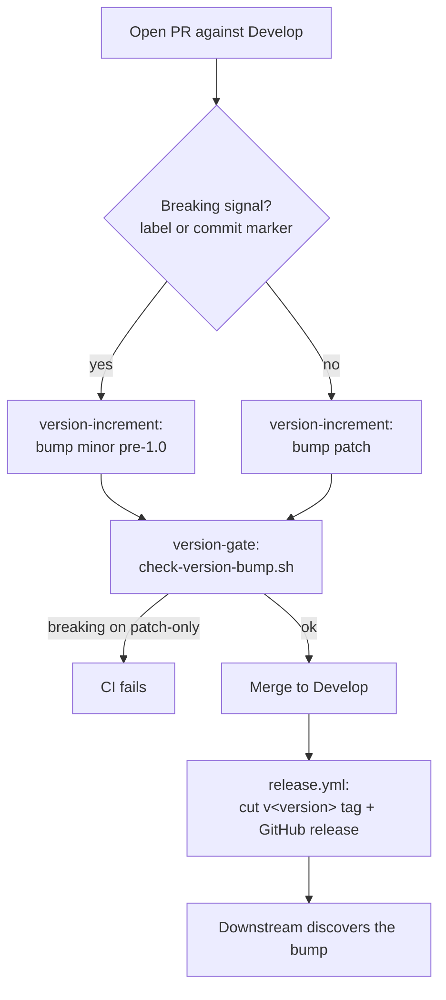

# Releasing NEAT-AI-core

This document defines how `neat-core` is versioned and released so that
downstream consumers (notably
[NEAT-AI-scorer](https://github.com/stSoftwareAU/NEAT-AI-scorer), which tracks
the `neat-core` path dependency at head) can **discover breaking changes through
semantic versioning** rather than being broken silently (Issue #251, part of the
release-process redesign epic #248).

## Versioning policy

`neat-core` follows [Semantic Versioning](https://semver.org/). The single
source of truth is `[workspace.package].version` in the root `Cargo.toml`; the
`neat-core` crate inherits it via `version.workspace = true`.

The repository is **pre-1.0**, so the *major-equivalent* slot is the **minor**:

| Change kind  | Bump (pre-1.0)        | Bump (post-1.0) | Example                    |
|--------------|-----------------------|-----------------|----------------------------|
| Breaking     | minor (`0.1.x → 0.2.0`) | major (`1.x → 2.0.0`) | public type narrowing |
| Non-breaking | patch (`0.1.4 → 0.1.5`) | patch           | new additive API, perf fix |

A **breaking change is a major-equivalent bump**; everything else is a patch.

### What counts as breaking

A change is breaking if it can stop a downstream consumer that compiled and ran
against the previous version from compiling or behaving correctly, for example:

- Narrowing or changing a **public type**, including struct field types — e.g.
  `SynapseData::from_index` changing from `u32` to `u16` (neat-core #177, the
  change that motivated this policy).
- Changing a **public function/method signature**, return type, or trait bound.
- **Removing or renaming** any public item (function, type, field, module,
  feature flag).
- Changing the **serialised layout** or wire/binary format of data shared with
  consumers (e.g. the `.bin` training-stream format).
- Changing documented runtime **behaviour** in a way callers may rely on.

Additive, backwards-compatible changes (new public items, internal refactors,
performance work that preserves behaviour, doc fixes) are **non-breaking** and
bump the patch.

## How a version bump happens

Bumping is automated by the `version-increment` job in
`.github/workflows/ci.yml`, which runs on every pull request:

- By default it bumps the **patch**.
- When a **breaking signal** is present it bumps the **minor** (pre-1.0) instead,
  via `scripts/next-version.sh`.

### Signalling a breaking change

Signal a breaking change in **either** of these ways:

- Add the **`breaking-change` label** to the pull request; **or**
- Use a [Conventional Commit](https://www.conventionalcommits.org/) breaking
  marker in any commit on the PR — a `type!:` / `type(scope)!:` subject (e.g.
  `perf(network)!: narrow from_index to u16`) or a `BREAKING CHANGE:` footer.

`scripts/detect-breaking.sh` reads the commit markers; the label is read from the
PR metadata. Either signal triggers the major-equivalent bump.

## Enforcement: breaking cannot ship on a patch-only bump

The `version-gate` job in `.github/workflows/ci.yml` is a **required check** that
fails the PR if a breaking change is shipping on a patch-only (or no) bump. It
compares the base-branch version against the head version using
`scripts/check-version-bump.sh`:

- a **breaking** PR must increase the minor (pre-1.0) or major (post-1.0);
- a downgrade is always rejected;
- a non-breaking PR may bump the patch (over-bumping is allowed).

These scripts are pure and unit-tested under `tests/scripts/`
(`next_version.bats`, `check_version_bump.bats`, `detect_breaking.bats`), so the
policy logic is verified independently of CI.

## Tags and GitHub releases

On every push to `Develop`, the `release` job in `.github/workflows/release.yml`
reads the workspace version and, if no `v<major.minor.patch>` tag/release exists
yet, cuts a **git tag + GitHub release** named `v<version>` (e.g. `v0.2.0`). It is
idempotent and **decoupled from the per-commit `wasm-bundle-<sha>` artifacts**:

- `wasm-bundle-<sha>` releases address **commits by SHA** (immutable bundles).
- `v<version>` releases address **versions** so consumers can pin and compare
  semver and react to breaking bumps.

## Retroactive decision for #177

neat-core #177 (`SynapseData::from_index` `u32 → u16`) was breaking but shipped on
patch bumps (`0.1.43 → 0.1.46`) with no signal, silently breaking the scorer. The
decision is to **retro-bump**, not apply the policy forward-only: this PR sets the
workspace version to **`0.2.0`** so the current breaking state is reflected by a
`0.2.0`-class version, and the `release` workflow will cut `v0.2.0` on merge to
`Develop`. The #177 `u16` narrowing itself is **not** reverted.

## Release flow

