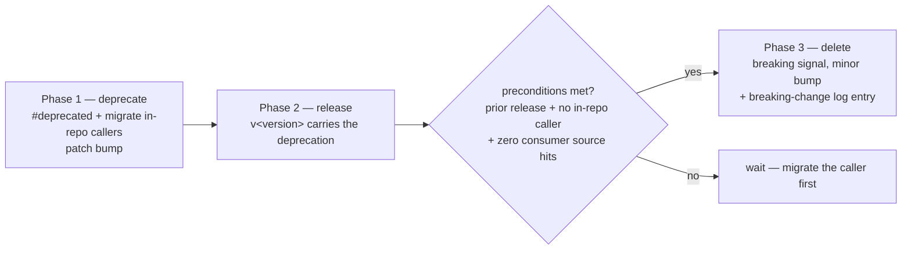
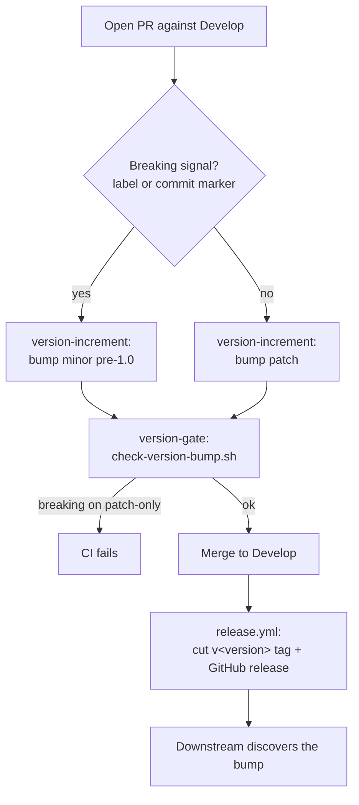

# Releasing NEAT-AI-core

This document defines how `neat-core` is versioned and released so that
downstream consumers (notably
[NEAT-AI-scorer](https://github.com/stSoftwareAU/NEAT-AI-scorer), which tracks
the `neat-core` path dependency at head) can **discover breaking changes through
semantic versioning** rather than being broken silently (Issue #251, part of the
release-process redesign epic #248).

## Versioning policy

`neat-core` follows [Semantic Versioning](https://semver.org/). The single
source of truth is `[workspace.package].version` in the root `Cargo.toml`; the
`neat-core` crate inherits it via `version.workspace = true`.

The repository is **pre-1.0**, so the *major-equivalent* slot is the **minor**:

| Change kind  | Bump (pre-1.0)        | Bump (post-1.0) | Example                    |
|--------------|-----------------------|-----------------|----------------------------|
| Breaking     | minor (`0.1.x → 0.2.0`) | major (`1.x → 2.0.0`) | public type narrowing |
| Non-breaking | patch (`0.1.4 → 0.1.5`) | patch           | new additive API, perf fix |

A **breaking change is a major-equivalent bump**; everything else is a patch.

### What counts as breaking

A change is breaking if it can stop a downstream consumer that compiled and ran
against the previous version from compiling or behaving correctly, for example:

- Narrowing or changing a **public type**, including struct field types — e.g.
  `SynapseData::from_index` changing from `u32` to `u16` (neat-core #177, the
  change that motivated this policy).
- Changing a **public function/method signature**, return type, or trait bound.
- **Removing or renaming** any public item (function, type, field, module,
  feature flag).
- Changing the **serialised layout** or wire/binary format of data shared with
  consumers (e.g. the `.bin` training-stream format).
- Changing documented runtime **behaviour** in a way callers may rely on.

Additive, backwards-compatible changes (new public items, internal refactors,
performance work that preserves behaviour, doc fixes) are **non-breaking** and
bump the patch.

## How a version bump happens

Bumping is automated by the `version-increment` job in
`.github/workflows/ci.yml`, which runs on every pull request:

- By default it bumps the **patch**.
- When a **breaking signal** is present it bumps the **minor** (pre-1.0) instead,
  via `scripts/next-version.sh`.

### Signalling a breaking change

Signal a breaking change in **either** of these ways:

- Add the **`breaking-change` label** to the pull request; **or**
- Use a [Conventional Commit](https://www.conventionalcommits.org/) breaking
  marker in any commit on the PR — a `type!:` / `type(scope)!:` subject (e.g.
  `perf(network)!: narrow from_index to u16`) or a `BREAKING CHANGE:` footer.

`scripts/detect-breaking.sh` reads the commit markers; the label is read from the
PR metadata. Either signal triggers the major-equivalent bump.

## Enforcement: breaking cannot ship on a patch-only bump

The `version-gate` job in `.github/workflows/ci.yml` is a **required check** that
fails the PR if a breaking change is shipping on a patch-only (or no) bump. It
compares the base-branch version against the head version using
`scripts/check-version-bump.sh`:

- a **breaking** PR must increase the minor (pre-1.0) or major (post-1.0);
- a downgrade is always rejected;
- a non-breaking PR may bump the patch (over-bumping is allowed).

These scripts are pure and unit-tested under `tests/scripts/`
(`next_version.bats`, `check_version_bump.bats`, `detect_breaking.bats`), so the
policy logic is verified independently of CI.

## Tags and GitHub releases

On every push to `Develop`, the `release` job in `.github/workflows/release.yml`
reads the workspace version and, if no `v<major.minor.patch>` tag/release exists
yet, cuts a **git tag + GitHub release** named `v<version>` (e.g. `v0.2.0`). It is
idempotent and **decoupled from the per-commit `wasm-bundle-<sha>` artifacts**:

- `wasm-bundle-<sha>` releases address **commits by SHA** (immutable bundles).
- `v<version>` releases address **versions** so consumers can pin and compare
  semver and react to breaking bumps.

## Removing public API: the three-phase flow

A public item is removed in three phases — **deprecate → migrate → delete** —
staged across separate releases and separate PRs, as #386 → #408 → #409 did for
the per-record scoring wrappers. Four properties of this repo shape the flow:

- **`#[deprecated]` is a hard error in-repo.** CI builds with
  `RUSTFLAGS="-D warnings"`, so the deprecating PR must migrate **every in-repo
  caller in the same PR** — a missed one fails the build rather than warning.
  A test that must keep calling the old API (a parity oracle, typically) carries
  an explicit `#[allow(deprecated)]` whose comment **names the deletion issue**.
- **There is no `CHANGELOG.md`.** The `v<version>` GitHub release cut by
  `release.yml` is the release note, so a deprecation is recorded by the version
  bump plus a note in `README.md` and the module docs. Deprecating is additive,
  so it ships on a **patch**; only the delete is breaking.
- **Deletion preconditions**, all verified before the delete PR (as #409 did):
  the item carried `#[deprecated]` in a **prior released version**, at most one
  in-repo caller remains, and a `gh` **code search across the consumer repos**
  (NEAT-AI, NEAT-AI-Discovery, NEAT-AI-scorer, NEAT-AI-Examples, NEAT-AI-Explore)
  returns **zero source hits** — markdown hits do not count as callers.
- **Sibling removals take successive minors.** Several breaking removals on one
  milestone branch must be **rebased in sequence** so each takes the next
  major-equivalent slot (`0.6.0` → `0.7.0` → `0.8.0`) instead of colliding on a
  single version, which the `version-gate` job would otherwise let through as one
  bump covering several breaks.


```mermaid
flowchart LR
    A["Phase 1 — deprecate<br/>#deprecated + migrate in-repo callers<br/>patch bump"]
    B["Phase 2 — release<br/>v&lt;version&gt; carries the deprecation"]
    C{"preconditions met?<br/>prior release + no in-repo caller<br/>+ zero consumer source hits"}
    D["Phase 3 — delete<br/>breaking signal, minor bump<br/>+ breaking-change log entry"]
    E["wait — migrate the caller first"]
    A --> B --> C
    C -- "yes" --> D
    C -- "no" --> E
```

A removal with **no** consumer at all (a dead module) still ends at phase 3 and
still needs a log entry — `0.4.0` and `0.5.0` below are that shape.

## Breaking-change log

Each major-equivalent bump is recorded here so downstream consumers can see what
changed without diffing the API. The generated `v<version>` GitHub release notes
point back at this file.

### `0.10.0` — `MemeticExport::weights` is a two-form enum (GRQ#4257)

`MemeticExport::weights` changes type from
`BTreeMap<String, Vec<MemeticWeightExport>>` to the new `MemeticWeights` enum.
NEAT-AI writes `memetic.weights` two ways and **both are current**: a
UUID-keyed array of `{fromUUID, toUUID, weight}` rows
(`src/creature/MemeticWireExport.ts`, the form every creature that leaves a
NEAT-AI process carries) and the id-keyed map
(`{"<fromId>": [{toId, weight}, …]}`). Modelling only the map made every
sampler creature carrying the row form fail to parse — `invalid type: sequence,
expected a map` — which exited the GRQ Backprop stage 1.

The enum is deliberately not flattened into one canonical shape: a creature is
written back out in the form it was read, so this crate never rewrites one
valid form into the other. `MemeticExport::biases` keys and the map form's keys
now also resolve as wire UUIDs, not just as id text.

**Migration** — reach the map through `by_id()` (or match, and handle rows):

```rust
// Before (0.9.x)
let entries = memetic.weights.get("0");

// After (0.10.0) — `None` when the creature carried the row form
let entries = memetic.weights.by_id().and_then(|by_id| by_id.get("0"));

// or handle both forms explicitly
match &memetic.weights {
    MemeticWeights::Rows(rows) => { /* {fromUUID, toUUID, weight} */ }
    MemeticWeights::ById(by_id) => { /* {"<fromId>": [{toId, weight}]} */ }
}
```

`MemeticWeightExport` is unchanged; the row form has its own
`MemeticWeightRowExport`.

### `0.8.0` — `get_training_state_num_neurons` / `get_training_state_num_synapses` removed (Issue #424)

The public `neat_core::get_training_state_num_neurons` and
`neat_core::get_training_state_num_synapses` — and the WASM exports of the same
names — are **removed**. A dead-code audit (Issue #416, from #413) found no
caller in NEAT-AI, NEAT-AI-Discovery, NEAT-AI-scorer, NEAT-AI-Examples or
NEAT-AI-Explore; `WasmModuleLoader.ts` never bound either export. Both accessors
survive inside `training_state.rs` as `#[cfg(test)]` helpers, so the
init-and-free assertions on the recorded counts are unchanged.

**Migration** — track the sizes you passed to `init_training_state` yourself, or
derive them from the state readers:

```rust
// Before (0.7.x)
let num_synapses = get_training_state_num_synapses();
let num_neurons = get_training_state_num_neurons();

// After (0.8.0) — the caller already owns these values
init_training_state(num_synapses, num_neurons);
```

The rest of `training_state.rs` is untouched: `init_training_state`,
`free_training_state`, `reset_training_state`, the `read_*_state` readers and
the `accumulate_*_persistent_*way` exports are all live.

### `0.7.0` — `apply_calculate_error_batch_4way` / `calculate_error_batch_4way` removed (Issue #423)

The public `neat_core::apply_calculate_error_batch_4way` (both the `wasm32` SIMD
arm and the scalar fallback) and the `calculate_error_batch_4way` WASM export
that wrapped it are **deleted**. A dead-code audit (Issue #416, from #413) found
no caller in NEAT-AI, NEAT-AI-Discovery, NEAT-AI-scorer, NEAT-AI-Examples or
NEAT-AI-Explore — `WasmModuleLoader.ts` never bound the export.

**Migration** — call the scalar `apply_calculate_error` per lane; the numerics
are identical (the scalar fallback arm was exactly this, and the SIMD arm's
non-trivial squash types already delegated to it):

```rust
// Before (0.6.x)
let (e0, e1, e2, e3) =
    apply_calculate_error_batch_4way(squash_type, &curr_acts, &tgt_acts, &curr_vals);

// After (0.7.0)
let e0 = apply_calculate_error(squash_type, curr_acts[0], tgt_acts[0], curr_vals[0]);
let e1 = apply_calculate_error(squash_type, curr_acts[1], tgt_acts[1], curr_vals[1]);
let e2 = apply_calculate_error(squash_type, curr_acts[2], tgt_acts[2], curr_vals[2]);
let e3 = apply_calculate_error(squash_type, curr_acts[3], tgt_acts[3], curr_vals[3]);
```

The sibling `accumulate_*_batch_4way` and `calculate_{weight,bias}_batch_4way`
exports are live and unchanged.

### `0.6.0` — `apply_derivative_simd_4way` / `derivative_batch_4way` removed (Issue #422)

The public `neat_core::apply_derivative_simd_4way` (both the `wasm32` SIMD arm
and the scalar fallback) and the `derivative_batch_4way` WASM export that
wrapped it are **deleted**. A dead-code audit (Issue #416, from #413) found no
caller in NEAT-AI, NEAT-AI-Discovery, NEAT-AI-scorer, NEAT-AI-Examples or
NEAT-AI-Explore — `WasmModuleLoader.ts` never bound the export.

**Migration** — call the scalar `apply_derivative` per lane; the numerics are
identical (the SIMD arm's non-trivial squash types already delegated to it):

```rust
// Before (0.5.x)
let (d0, d1, d2, d3) = apply_derivative_simd_4way(squash_type, x0, x1, x2, x3);

// After (0.6.0)
let d0 = apply_derivative(squash_type, x0);
let d1 = apply_derivative(squash_type, x1);
let d2 = apply_derivative(squash_type, x2);
let d3 = apply_derivative(squash_type, x3);
```

The sibling `accumulate_*_batch_4way` and `calculate_{weight,bias}_batch_4way`
exports are live and unchanged.

This list also named `calculate_error_batch_4way`, which was still present at
`0.6.0`; the `0.7.0` entry above removed it one release later.

### `0.5.0` — `wasm_dataset` training-data offload removed (Issue #415)

The public `neat_core::wasm_dataset` module, the crate-root re-exports
`DatasetError`, `DatasetRegistry` and `TrainingDataset`, and the seven
`training_data_load` / `_free` / `_num_records` / `_byte_len` / `_evaluate_mse` /
`_live_bytes` / `_peak_bytes` WASM exports are **removed**. The offload shipped
as lane (c) of the wasm64 milestone (#295) on the understanding that the
`Learn.ts` adoption was owned upstream by NEAT-AI#3410; that issue closed without
the wiring, and no consumer ever bound an export.

**Migration** — none needed: the module had no caller in any repository, so no
downstream code can break. Training data still reaches the crate through the flat
batched scoring path (Issue #386) — `score_records_flat` /
`score_records_parallel_flat` — which is public, tested and unchanged. See
[README § Training-data offload](README.md#training-data-offload-wasm-linear-memory--removed-issue-415).

### `0.4.0` — `PredictiveCodingEngine` (`pc_inference` / `pc_learning`) removed (Issue #414)

The public `neat_core::pc_inference` and `neat_core::pc_learning` modules, the
crate-root re-exports `PredictiveCodingEngine` and `PcEngineError`, and the
`predictivecodingengine_infer_wasm` / `_infer_batch_wasm` /
`_compute_gradients_wasm` WASM exports are **removed**. A consumer sweep
(Issue #416, from #413) found no caller outside the engine's own tests in
NEAT-AI, NEAT-AI-Discovery, NEAT-AI-scorer, NEAT-AI-Examples or NEAT-AI-Explore.

**Migration** — none needed: the engine had no caller in any repository.
Predictive coding is implemented in TypeScript in NEAT-AI
(`src/predictiveCoding/`), which never called the Rust engine and is unaffected.

### `0.3.0` — per-record scoring entry points removed (Issue #409)

`CompiledNetwork::score_records` and `CompiledNetwork::score_records_parallel`
(both `cfg` arms) are **deleted**, along with the internal
`RecordBatch::PerRecord` variant only they constructed. They were deprecated in
`0.2.28` by Issue #408.

**Migration** — pack the records into one contiguous buffer and call the `_flat`
entry points (Issue #386); only the input layout changes, the output layout and
the numerics are unchanged:

```rust
// Before (0.2.x)
let outputs = net.score_records(&records, num_outputs);
let outputs = net.score_records_parallel(&records, num_outputs);

// After (0.3.0)
let stride = net.num_inputs();
let inputs: Vec<f32> = records.iter().flat_map(|r| r.iter().copied()).collect();
let outputs = net.score_records_flat(&inputs, stride, num_outputs);
let outputs = net.score_records_parallel_flat(&inputs, stride, num_outputs);
```

## Retroactive decision for #177

neat-core #177 (`SynapseData::from_index` `u32 → u16`) was breaking but shipped on
patch bumps (`0.1.43 → 0.1.46`) with no signal, silently breaking the scorer. The
decision is to **retro-bump**, not apply the policy forward-only: this PR sets the
workspace version to **`0.2.0`** so the current breaking state is reflected by a
`0.2.0`-class version, and the `release` workflow will cut `v0.2.0` on merge to
`Develop`. The #177 `u16` narrowing itself is **not** reverted.

## Release flow


```mermaid
flowchart TD
    A[Open PR against Develop] --> B{Breaking signal?<br/>label or commit marker}
    B -- "yes" --> C[version-increment:<br/>bump minor pre-1.0]
    B -- "no" --> D[version-increment:<br/>bump patch]
    C --> E[version-gate:<br/>check-version-bump.sh]
    D --> E
    E -- "breaking on patch-only" --> F[CI fails]
    E -- "ok" --> G[Merge to Develop]
    G --> H[release.yml:<br/>cut v&lt;version&gt; tag + GitHub release]
    H --> I[Downstream discovers the bump]
```

A release ships **source**, not a compiled artefact: this repo's
`[profile.release]` (`opt-level = 3`, `lto = "fat"`, `codegen-units = 1`) governs
its own builds only, because cargo takes profiles from the crate being built. A
consumer that wants the same optimisation must declare it in its own manifest —
see [Build profiles](README.md#build-profiles-issue-546) in the README.
