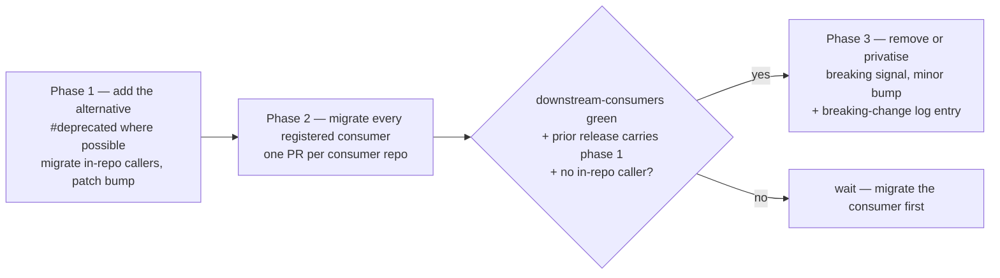
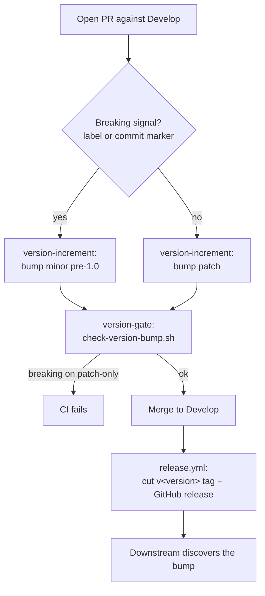

# Releasing NEAT-AI-core

This document defines how `neat-core` is versioned and released so that
downstream consumers (notably
[NEAT-AI-scorer](https://github.com/stSoftwareAU/NEAT-AI-scorer), which tracks
the `neat-core` path dependency at head) can **discover breaking changes through
semantic versioning** rather than being broken silently (Issue #251, part of the
release-process redesign epic #248).

## Versioning policy

Versioning is how this crate makes rollback possible without a second copy of
anything:
[principle 8 — rollback is versioning and pinning, not duplicate code](https://github.com/stSoftwareAU/NEAT-AI/blob/Develop/docs/ENGINEERING_PRINCIPLES.md#8-rollback-is-versioning-and-pinning-not-duplicate-code)
of the family-wide
[engineering principles](https://github.com/stSoftwareAU/NEAT-AI/blob/Develop/docs/ENGINEERING_PRINCIPLES.md).
NEAT-AI recovers from a bad release by re-pinning the last known-good revision
— its `neatCore.rev` and `assetSha256` — and NEAT-AI-scorer, which takes no pin
and tracks the path dependency at head, recovers through the semver break
signal below plus a revert here. Neither reaches for a superseded
implementation kept alive as a fallback.
[`AGENTS.md`](AGENTS.md#family-wide-engineering-principles) reads those
principles for this crate.

`neat-core` follows [Semantic Versioning](https://semver.org/). The single
source of truth is `[workspace.package].version` in the root `Cargo.toml`; the
`neat-core` crate inherits it via `version.workspace = true`.

The repository is **pre-1.0**, so the *major-equivalent* slot is the **minor**:

| Change kind  | Bump (pre-1.0)        | Bump (post-1.0) | Example                    |
|--------------|-----------------------|-----------------|----------------------------|
| Breaking     | minor (`0.1.x → 0.2.0`) | major (`1.x → 2.0.0`) | public type narrowing |
| Non-breaking | patch (`0.1.4 → 0.1.5`) | patch           | new additive API, perf fix |

A **breaking change is a major-equivalent bump**; everything else is a patch.

### What counts as breaking

A change is breaking if it can stop a downstream consumer that compiled and ran
against the previous version from compiling or behaving correctly, for example:

- Narrowing or changing a **public type**, including struct field types — e.g.
  `SynapseData::from_index` changing from `u32` to `u16` (neat-core #177, the
  change that motivated this policy).
- Changing a **public function/method signature**, return type, or trait bound.
- **Removing or renaming** any public item (function, type, field, module,
  feature flag).
- Changing the **serialised layout** or wire/binary format of data shared with
  consumers (e.g. the `.bin` training-stream format).
- Changing documented runtime **behaviour** in a way callers may rely on.

Additive, backwards-compatible changes (new public items, internal refactors,
performance work that preserves behaviour, doc fixes) are **non-breaking** and
bump the patch.

## How a version bump happens

Bumping is automated by the `version-increment` job in
`.github/workflows/ci.yml`, which runs on every pull request:

- By default it bumps the **patch**.
- When a **breaking signal** is present it bumps the **minor** (pre-1.0) instead,
  via `scripts/next-version.sh`.
- It skips the bump only when the head version **already satisfies the policy**
  for that signal, decided by `scripts/version-bump-needed.sh`. A bump commit
  already sitting on the branch is not proof on its own: a milestone branch
  collects patch bumps from its sub-PRs and may then acquire a breaking commit,
  so the branch still owes a minor bump.

### Signalling a breaking change

Signal a breaking change in **either** of these ways:

- Add the **`breaking-change` label** to the pull request; **or**
- Use a [Conventional Commit](https://www.conventionalcommits.org/) breaking
  marker in any commit on the PR — a `type!:` / `type(scope)!:` subject (e.g.
  `perf(network)!: narrow from_index to u16`) or a `BREAKING CHANGE:` footer.

`scripts/detect-breaking.sh` reads the commit markers; the label is read from the
PR metadata. Either signal triggers the major-equivalent bump. Its single
argument is a revision range and nothing else: an option-shaped value exits 2
with a diagnostic on stderr rather than reaching `git log` as a flag, and the
range is passed behind `--end-of-options` so git would refuse it even then
(Issue #608). `tests/scripts/detect_breaking.bats` is the gate. Both CI callers
capture the answer and the exit status separately and fail the step when the
script exits non-zero or prints anything other than `true` / `false`, so a
failed detector can never be read as "not breaking" (Issue #634);
`tests/scripts/ci_detect_breaking_exit_status.bats` drives the real step bodies
against a failing stub to pin that.

## Enforcement: breaking cannot ship on a patch-only bump

The `version-gate` job in `.github/workflows/ci.yml` is a **required check** that
fails the PR if a breaking change is shipping on a patch-only (or no) bump. It
compares the base-branch version against the head version using
`scripts/check-version-bump.sh`:

- a **breaking** PR must increase the minor (pre-1.0) or major (post-1.0);
- a downgrade is always rejected;
- a non-breaking PR may bump the patch (over-bumping is allowed).

These scripts are pure and unit-tested under `tests/scripts/`
(`next_version.bats`, `check_version_bump.bats`, `detect_breaking.bats`,
`version_bump_needed.bats`), so the policy logic is verified independently of
CI.

## Tags and GitHub releases

On every push to `Develop`, the `release` job in `.github/workflows/release.yml`
reads the workspace version and, if no `v<major.minor.patch>` tag/release exists
yet, cuts a **git tag + GitHub release** named `v<version>` (e.g. `v0.2.0`). It is
idempotent and **decoupled from the per-commit `wasm-bundle-<sha>` artifacts**:

- `wasm-bundle-<sha>` releases address **commits by SHA** (immutable bundles).
- `v<version>` releases address **versions** so consumers can pin and compare
  semver and react to breaking bumps.

## Changing or removing public API: the three-phase flow

This is a working system. **A change to core that breaks a registered
downstream consumer does not merge until that consumer is fixed** — however
good the idea (Issue #644). That covers every shape of break in
[What counts as breaking](#what-counts-as-breaking): removing or renaming a
public item, making a field or function private, narrowing a type, changing a
signature or documented behaviour. The rule is the same for all of them —
**add the alternative → migrate every consumer → remove the old surface** — as
three separate PRs, in that order, as #386 → #408 → #409 did for the
per-record scoring wrappers.

| Phase | What lands | Bump | Proof |
|-------|------------|------|-------|
| 1 — add | The replacement in core (an accessor, a new signature, a new module). The old surface keeps working; where the language allows, it carries `#[deprecated]` naming the deletion issue. | patch | `downstream-consumers` stays green — nothing broke |
| 2 — migrate | One PR per registered consumer moving it onto the replacement; each merges and moves its `neat-core.expected-version` if it needs to. | consumer's own | each consumer's own CI |
| 3 — remove | Delete the old surface or make the field private, with the breaking signal, the minor bump and a [breaking-change log](#breaking-change-log) entry. | minor (major-equivalent) | `downstream-consumers` is green **because** phase 2 is complete |

**The consumer list is a registry, not prose.**
[`scripts/downstream-consumers.txt`](scripts/downstream-consumers.txt) names
every repository that takes the `../../NEAT-AI-core/neat-core` path
dependency.
[`scripts/check-downstream-consumers.sh`](scripts/check-downstream-consumers.sh)
clones each of them at `Develop` beside the candidate core and runs
`cargo check --workspace --all-targets`; the `downstream-consumers` job in
`ci.yml` runs it on every pull request and is a required check on `Develop`,
and `tests/scripts/check_downstream_consumers.bats` pins the gate's own
behaviour. A consumer that no longer compiles fails the core PR by name. A
repository is added to the registry in the same PR that gives it the path
dependency — an unlisted consumer is an unprotected one. Locally,
`scripts/check-downstream-consumers.sh --workspace ..` compiles the sibling
checkouts you already have against the core you are editing.

Why the order matters: `0.12.0` (#633) shipped phase 3 with phase 1 folded into
the same PR and no phase 2 at all. It was signalled correctly and `version-gate`
passed — until Issue #644 the policy only checked *how* a break was labelled,
never *whether anyone still depended on the old surface*. The production fleet
builds the Rust consumers from this repository's `Develop` at head, so
`rust_scorer` stopped compiling on every host within minutes of the merge, and
the prose consumer list this section used to carry named two of the six
repositories that broke.

Four properties of this repo shape the flow:

- **`#[deprecated]` is a hard error in-repo.** CI builds with
  `RUSTFLAGS="-D warnings"`, so the deprecating PR must migrate **every in-repo
  caller in the same PR** — a missed one fails the build rather than warning.
  A test that must keep calling the old API (a parity oracle, typically) carries
  an explicit `#[allow(deprecated)]` whose comment **names the deletion issue**.
  The downstream gate deliberately compiles consumers **without** `-D warnings`:
  a phase-1 deprecation must warn them, not break them.
- **There is no `CHANGELOG.md`.** The `v<version>` GitHub release cut by
  `release.yml` is the release note, so a deprecation is recorded by the version
  bump plus a note in `README.md` and the module docs. Adding the alternative is
  additive, so it ships on a **patch**; only the removal is breaking.
- **Removal preconditions**, all verified before the phase-3 PR (as #409 did):
  the replacement shipped in a **prior released version** and, where it could
  be expressed, the old item carried `#[deprecated]` there (a field going
  private cannot be deprecated — its phase 1 is the accessor, and its phase 2
  is every consumer reading through it); at most one in-repo caller remains;
  and `downstream-consumers` is green with every registered consumer already
  on the replacement. A `gh` code search across the consumer repos in the
  registry is a useful preview of phase 2; the gate is the proof.
- **Sibling removals take successive minors.** Several breaking removals on one
  milestone branch must be **rebased in sequence** so each takes the next
  major-equivalent slot (`0.6.0` → `0.7.0` → `0.8.0`) instead of colliding on a
  single version, which the `version-gate` job would otherwise let through as one
  bump covering several breaks.


```mermaid
flowchart LR
    A["Phase 1 — add the alternative<br/>#deprecated where possible<br/>migrate in-repo callers, patch bump"]
    B["Phase 2 — migrate every registered consumer<br/>one PR per consumer repo"]
    C{"downstream-consumers green<br/>+ prior release carries phase 1<br/>+ no in-repo caller?"}
    D["Phase 3 — remove or privatise<br/>breaking signal, minor bump<br/>+ breaking-change log entry"]
    E["wait — migrate the consumer first"]
    A --> B --> C
    C -- "yes" --> D
    C -- "no" --> E
```

A removal with **no** consumer at all (a dead module) still ends at phase 3 and
still needs a log entry — `0.4.0` and `0.5.0` below are that shape — and the
gate still runs, which is what proves there was no consumer.

## Breaking-change log

Each major-equivalent bump is recorded here so downstream consumers can see what
changed without diffing the API. The generated `v<version>` GitHub release notes
point back at this file.

### `0.16.0` — the pruning report gains fields, and a single-edge aggregate is rewritten (Ockham #197)

Two breaking shapes, both in the pruning surface:

1. **Public structs gain public fields.** `PruneResult` gains
   `converted_neurons: Vec<SquashConversion>` and `UncompensatedTarget` gains
   `dropped_mean: Option<f64>`; on the wire, `PruneResponse` gains
   `converted_neurons` (`convertedNeurons`) and `UncompensatedJson` gains
   `dropped_mean` (`droppedMean`). None of the four is `#[non_exhaustive]`, so a
   downstream struct literal or exhaustive destructure of any of them stops
   compiling — `prune_json::PruneResponse::from_result` destructures
   `PruneResult` for exactly that reason and is updated here.
2. **Documented runtime behaviour moved.** `prune_neuron` and `prune_synapse`
   used to return a target's squash exactly as the caller wrote it. A non-`IF`
   aggregate the cut leaves with a **single** inward edge is now rewritten to the
   point-wise squash that computes the same number — `MINIMUM`/`MAXIMUM`/`MEAN`
   to `IDENTITY`, `HYPOTv2` (and `HYPOT` at bias `0`) to `ABSOLUTE`, bias
   unchanged — because reducing one term is that term. The rewrite is reported
   rather than silent, and `transform` is unmoved by it. `neat-core/src/prune_rewrite.rs`
   owns the rule, names the two boundaries where the equality stops, and keeps
   its hands off `IF` (`IfRepair` owns a lost role).

Additive on the JSON wire: both new keys are `skip_serializing_if`, so a payload
with neither is byte-identical to the one `0.15.x` wrote, and a reader that
ignores unknown keys is unaffected.

**Migration** — read the new fields, or ignore them:

```rust
// A struct literal or exhaustive destructure needs the new fields.
let PruneResult { converted_neurons, .. } = result;
for conversion in &converted_neurons {
    println!("{} rewritten from {} to {}", conversion.uuid, conversion.from, conversion.to);
}
// An aggregate the cut left bare of all but one edge now reports a magnitude.
for target in &result.uncompensated {
    if let Some(dropped) = target.dropped_mean {
        println!("{} lost a term worth {dropped}", target.target_uuid);
    }
}
```

A consumer that only reads `PruneResult` field by field — which is every
registered consumer today — needs no change.

### `0.16.0` — `prune_neuron` rewrites an `IF` short a role (Ockham #198)

No public item moved: this is a **documented runtime behaviour** change callers
rely on.

`prune_neuron` ran cleanup under the TypeScript-parity `IfRepair::Downgrade`
policy, so an `IF` the removal left short of a role came back as the `IDENTITY`
sum of everything still reaching it — cleanup's one inexact rewrite — and was
named on `PruneResult::downgraded_if_neurons`. It now asks for
`IfRepair::Rewrite`, the exact repair `prune_synapse` has used since Issue #591:
the `IF` is flattened onto the arm a statically decided condition always takes,
or given back the emptied arm on a zero-weight support edge.

Two consequences reach a caller:

- **the creature is different.** For the shape `prune_fixtures`'s
  `IF_REPAIR_COALESCES_ROLES` captures, the old answer summed both arms into one
  untyped row; the new answer keeps the arm the forward pass would have read and
  drops the other. A caller grading `prune_neuron` byte-for-byte against that
  capture must re-grade on the numbers, or drive `cleanup_creature` — whose
  default policy is **unchanged** — to reproduce it.
- **`downgraded_if_neurons` is now always empty**, on both entry points and on
  the JSON/WASM `downgradedIfNeurons` key. `staticIfNeurons` and
  `restoredIfRoles` carry what happened instead. That key is serialised with
  `skip_serializing_if = "Vec::is_empty"`, so in practice it is **no longer
  emitted at all**: a consumer that requires it to be present will not find it,
  and must treat its absence as normal. The field itself stays, so the shape
  stays parseable and a future policy change that reinstated the downgrade would
  cross the wire rather than be dropped in silence.

`PruneResult::transform` also reaches `Exact` in one shape it could not before:
an `IF` whose condition **the creature itself decided the same way before and
after the cut** never read the term the removal took away, so the shortfall it is
still named for costs nothing. Both entry points ask the same predicate, so a
neuron removal and the synapse removal that takes the same term away agree.

**Migration** — nothing to compile. A caller that asserted on
`downgradedIfNeurons` should read `staticIfNeurons` / `restoredIfRoles`; a caller
that compared a neuron prune to the `IF_REPAIR_COALESCES_ROLES` capture should
compare activations, or call `cleanup_creature` for the parity form.

### `0.15.0` — `NetworkError::InvalidInputCount` (Issue #601)

`NetworkError` gains a variant. The enum is not `#[non_exhaustive]`, so a
downstream exhaustive `match` on it stops compiling until it handles
`InvalidInputCount { num_inputs: usize, num_neurons: usize }`.

`CompiledNetwork::new` read `num_neurons` and `num_inputs` from the 8-byte
header and computed `num_neurons - num_inputs` without comparing them. That is a
`usize` subtraction, so a buffer declaring more inputs than nodes — minimally
`num_neurons = 0`, `num_inputs = 1` — wrapped to a value near `usize::MAX` under
the release profile's Cargo-default `overflow-checks = false`, and the following
`Vec::with_capacity` aborted the whole WASM module. The header is now validated
before anything is allocated from it, and the new variant is what such a buffer
returns. A buffer whose `num_inputs <= num_neurons` — every buffer this crate
emits — is unaffected.

**Migration** — add an arm (or a `_ =>` catch-all) for the new variant:

```rust
match err {
    // … existing arms …
    NetworkError::InvalidInputCount {
        num_inputs,
        num_neurons,
    } => {
        eprintln!("header declares {num_inputs} inputs but only {num_neurons} nodes");
    }
}
```

### `0.14.0` — the declared observation width carries a ceiling (Issue #622)

`validate_creature_width` refuses a declared `input` above `MAX_NODE_COUNT`, so
`parse_creature_json`, `compile_creature`, `creature_to_json`,
`creature_to_json_pretty`, `validate_creature_topology` and
`cleanup_creature_with` reject creature JSON they previously accepted, with
`CreatureError::TooManyNodes`.

The declared width has no backing data, and those entry points each built one
owned UUID per declared input before anything bounded it — so a sub-100-byte
creature declaring a hundred million inputs cost a hundred million map entries,
and a large enough literal aborted on the allocation. The ceiling sits in
`validate_creature_width`, the single home of the width rule, so every caller
gained it at once.

**Migration** — a creature declaring more inputs than `MAX_NODE_COUNT` was never
compilable; it now fails at the boundary instead of during allocation. Handle
`CreatureError::TooManyNodes` from these entry points, and cap any generated
`input` at `MAX_NODE_COUNT`.

### `0.13.0` — `GraftError::CountNotRepresentable` (Issue #606)

`GraftError` gains a variant. The enum is not `#[non_exhaustive]`, so a
downstream exhaustive `match` on it stops compiling until it handles
`CountNotRepresentable { field: &'static str, found: u64 }`.

`validate_creature_topology` passed `creature.input` / `creature.output` to the
index gates through `as u32`, so a declared `output` of `4_294_967_297` arrived
as `1` and a creature no compiler could accept passed the gate. The counts are
now checked with `u32::try_from` before anything reads them, and the new variant
is what a count past `u32::MAX` returns. A creature whose declared widths fit
`u32` — every creature this crate can compile, which caps at `MAX_NODE_COUNT` —
is unaffected.

The same change made `training_state`'s packed-record indexing checked. A record
index whose start offset overflows `usize` is now out of range rather than
wrapping onto a live record, and `init_training_state` panics rather than
silently allocating a wrapped, far-too-small buffer.

**Migration** — add an arm (or a `_ =>` catch-all) for the new variant:

```rust
match err {
    // … existing arms …
    GraftError::CountNotRepresentable { field, found } => {
        eprintln!("declared {field} count {found} is past the u32 index space");
    }
}
```

### `0.12.0` — `CompiledNetwork`'s fields are private (Issue #625)

Every field of `CompiledNetwork` becomes private. The forward and batched-scoring
paths call the `simd::*_unchecked` kernels and discharge their index contract
from the load-time `InvalidSynapseIndex` check in `new`; while the fields were
`pub`, safe code could rewrite `synapses` / `hot_from` / `activations` after that
check and turn the next `activate()` into an out-of-bounds read. Closing them is
what makes the discharge hold for the life of the value rather than only at
construction.

`NetworkError` gains an `InvalidSynapseSpan` variant, and `CreatureError` gains
`InvalidNetwork(NetworkError)` — both are additional breaks for a consumer that
matches either enum exhaustively.

**Affected consumers.** **NEAT-AI-scorer** reads `neurons` / `synapses` /
`num_neurons` / `num_inputs` on its GPU upload path (`rust_scorer/src/gpu/
forward_mse_batched.rs`, `if_tree_fixture.rs`, `dual_role_fixture.rs`) and
mutates them in its own tests. **NEAT-AI-Backpropagation** reads `activations`
(`backpropagation/src/propagate_layout.rs`).

**Migration** — reads become accessor calls; writes and struct literals are
replaced by a rebuild through `from_parts`:

```rust
// Before (0.11.x)
let n = net.num_neurons;
for s in &net.synapses { /* … */ }
let net = CompiledNetwork { num_neurons, num_inputs, neurons, synapses, /* … */ };

// After (0.12.0)
let n = net.num_neurons();
for s in net.synapses() { /* … */ }
let net = CompiledNetwork::from_parts(num_inputs, neurons, synapses)?;
```

`from_parts` derives every hot view and scratch buffer and re-runs the same
validation as `new`, plus a span check rejecting a neuron whose
`start_synapse + num_synapses` overruns the synapse table. The full read surface
is `neurons()`, `synapses()`, `hot_weights()`, `hot_from()`, `activations()`,
`hint_values()`, `trace_data()`, `num_neurons()`, `num_inputs()` and
`num_synapses()` — every one hands out a shared borrow, never `&mut`.

**Postscript (Issue #644).** The two consumers named above were not the only
two that broke: NEAT-AI-scorer, NEAT-AI-Lamarck, NEAT-AI-Forests, NEAT-AI-Ockham
and NEAT-AI-Backpropagation all read the fields directly, none had been migrated
when this merged, and the production fleet — which builds them from this
repository's `Develop` at head — stopped compiling `rust_scorer` within minutes.
Each was migrated after the fact. This release is why the three-phase flow above
now covers every public-API change, why the consumer list is a registry, and why
`downstream-consumers` is a required check.

### `0.11.0` — an untyped `IF` row reads as the positive arm (Issue #591)

`canonical_role` folds `Standard` and `Positive` to one answer at an `IF`
target, matching what the forward pass and `IfRoles::tally` already do with an
untyped inward edge. Before this, asking `prune_synapse` for the positive arm of
a creature that wrote that arm untyped came back `Err(UnknownSynapse)` — a
blanket refusal of exactly the removal the API exists to perform. `PruneResult`
and the `IfRepair::Rewrite` cleanup policy landed in the same milestone.

**Migration** — no signature changed; the behaviour did. A caller that relied on
the refusal (treating `UnknownSynapse` as "this IF row is untouchable") now gets
a successful, exact rewrite instead and should drop that special case.

**Recorded retrospectively** in the Issue #625 PR: the `0.11.0` bump
(commit `c15ac0e`, PR #619) shipped without a log entry, and the completeness
gate in `tests/scripts/releasing_breaking_change_log.bats` only surfaced the gap
once `0.12.0` gave it a newer neighbour.

### `0.10.0` — `MemeticExport::weights` is a two-form enum

`MemeticExport::weights` changes type from
`BTreeMap<String, Vec<MemeticWeightExport>>` to the new `MemeticWeights` enum.
NEAT-AI writes `memetic.weights` two ways and **both are current**: a
UUID-keyed array of `{fromUUID, toUUID, weight}` rows
(`src/creature/MemeticWireExport.ts`, the form every creature that leaves a
NEAT-AI process carries) and the id-keyed map
(`{"<fromId>": [{toId, weight}, …]}`). Modelling only the map caused
production creatures carrying the row form to fail parsing with
`invalid type: sequence, expected a map`, which exited a production backpropagation stage.

The enum is deliberately not flattened into one canonical shape: a creature is
written back out in the form it was read, so this crate never rewrites one
valid form into the other. `MemeticExport::biases` keys and the map form's keys
now also resolve as wire UUIDs, not just as id text.

**Migration** — reach the map through `by_id()` (or match, and handle rows):

```rust
// Before (0.9.x)
let entries = memetic.weights.get("0");

// After (0.10.0) — `None` when the creature carried the row form
let entries = memetic.weights.by_id().and_then(|by_id| by_id.get("0"));

// or handle both forms explicitly
match &memetic.weights {
    MemeticWeights::Rows(rows) => { /* {fromUUID, toUUID, weight} */ }
    MemeticWeights::ById(by_id) => { /* {"<fromId>": [{toId, weight}]} */ }
}
```

`MemeticWeightExport` is unchanged; the row form has its own
`MemeticWeightRowExport`.

### `0.9.0` — struct-of-arrays hot synapse fields (Issue #533)

`CompiledNetwork` gains two public fields — `hot_weights: Vec<f32>` and
`hot_from: Vec<u16>` — a parallel struct-of-arrays view built by `hot_synapse_soa`
at every construction path. The interleaved gather kernels
(`weighted_sum_interleaved` / `weighted_sum_interleaved_8`) now take those two
slices instead of `&[SynapseData]`.

**Superseded by `0.12.0`** — struct-literal construction is no longer possible;
use `CompiledNetwork::from_parts`, which derives both fields for you. The
snippet below is kept as the historical record of the 0.9.0 break.

**Migration** — callers constructing `CompiledNetwork` literals must supply
the two fields; `hot_synapse_soa` is exported for that:

```rust
// Before (0.8.x)
let net = CompiledNetwork {
    synapses: vec![...],
    neurons: vec![...],
    // ...
};

// After (0.9.0)
let net = CompiledNetwork {
    synapses: vec![...],
    neurons: vec![...],
    hot_weights: hot_synapse_soa(&synapses).0,
    hot_from: hot_synapse_soa(&synapses).1,
    // ...
};
```

The fields are public and must stay in sync with `synapses`; `debug_assert_hot_soa`
runs at every interleaved entry point and panics in debug builds if they drift.
Consumers only using the aggregated and single-record paths are unaffected — those
paths still take the full `SynapseData` and the struct-of-arrays view never
changes their results, only the bandwidth to the interleaved hot path.

### `0.8.0` — `get_training_state_num_neurons` / `get_training_state_num_synapses` removed (Issue #424)

The public `neat_core::get_training_state_num_neurons` and
`neat_core::get_training_state_num_synapses` — and the WASM exports of the same
names — are **removed**. A dead-code audit (Issue #416, from #413) found no
caller in NEAT-AI, NEAT-AI-Discovery, NEAT-AI-scorer, NEAT-AI-Examples or
NEAT-AI-Explore; `WasmModuleLoader.ts` never bound either export. Both accessors
survive inside `training_state.rs` as `#[cfg(test)]` helpers, so the
init-and-free assertions on the recorded counts are unchanged.

**Migration** — track the sizes you passed to `init_training_state` yourself, or
derive them from the state readers:

```rust
// Before (0.7.x)
let num_synapses = get_training_state_num_synapses();
let num_neurons = get_training_state_num_neurons();

// After (0.8.0) — the caller already owns these values
init_training_state(num_synapses, num_neurons);
```

The rest of `training_state.rs` is untouched: `init_training_state`,
`free_training_state`, `reset_training_state`, the `read_*_state` readers and
the `accumulate_*_persistent_*way` exports are all live.

### `0.7.0` — `apply_calculate_error_batch_4way` / `calculate_error_batch_4way` removed (Issue #423)

The public `neat_core::apply_calculate_error_batch_4way` (both the `wasm32` SIMD
arm and the scalar fallback) and the `calculate_error_batch_4way` WASM export
that wrapped it are **deleted**. A dead-code audit (Issue #416, from #413) found
no caller in NEAT-AI, NEAT-AI-Discovery, NEAT-AI-scorer, NEAT-AI-Examples or
NEAT-AI-Explore — `WasmModuleLoader.ts` never bound the export.

**Migration** — call the scalar `apply_calculate_error` per lane; the numerics
are identical (the scalar fallback arm was exactly this, and the SIMD arm's
non-trivial squash types already delegated to it):

```rust
// Before (0.6.x)
let (e0, e1, e2, e3) =
    apply_calculate_error_batch_4way(squash_type, &curr_acts, &tgt_acts, &curr_vals);

// After (0.7.0)
let e0 = apply_calculate_error(squash_type, curr_acts[0], tgt_acts[0], curr_vals[0]);
let e1 = apply_calculate_error(squash_type, curr_acts[1], tgt_acts[1], curr_vals[1]);
let e2 = apply_calculate_error(squash_type, curr_acts[2], tgt_acts[2], curr_vals[2]);
let e3 = apply_calculate_error(squash_type, curr_acts[3], tgt_acts[3], curr_vals[3]);
```

The sibling `accumulate_*_batch_4way` and `calculate_{weight,bias}_batch_4way`
exports are live and unchanged.

### `0.6.0` — `apply_derivative_simd_4way` / `derivative_batch_4way` removed (Issue #422)

The public `neat_core::apply_derivative_simd_4way` (both the `wasm32` SIMD arm
and the scalar fallback) and the `derivative_batch_4way` WASM export that
wrapped it are **deleted**. A dead-code audit (Issue #416, from #413) found no
caller in NEAT-AI, NEAT-AI-Discovery, NEAT-AI-scorer, NEAT-AI-Examples or
NEAT-AI-Explore — `WasmModuleLoader.ts` never bound the export.

**Migration** — call the scalar `apply_derivative` per lane; the numerics are
identical (the SIMD arm's non-trivial squash types already delegated to it):

```rust
// Before (0.5.x)
let (d0, d1, d2, d3) = apply_derivative_simd_4way(squash_type, x0, x1, x2, x3);

// After (0.6.0)
let d0 = apply_derivative(squash_type, x0);
let d1 = apply_derivative(squash_type, x1);
let d2 = apply_derivative(squash_type, x2);
let d3 = apply_derivative(squash_type, x3);
```

The sibling `accumulate_*_batch_4way` and `calculate_{weight,bias}_batch_4way`
exports are live and unchanged.

This list also named `calculate_error_batch_4way`, which was still present at
`0.6.0`; the `0.7.0` entry above removed it one release later.

### `0.5.0` — `wasm_dataset` training-data offload removed (Issue #415)

The public `neat_core::wasm_dataset` module, the crate-root re-exports
`DatasetError`, `DatasetRegistry` and `TrainingDataset`, and the seven
`training_data_load` / `_free` / `_num_records` / `_byte_len` / `_evaluate_mse` /
`_live_bytes` / `_peak_bytes` WASM exports are **removed**. The offload shipped
as lane (c) of the wasm64 milestone (#295) on the understanding that the
`Learn.ts` adoption was owned upstream by NEAT-AI#3410; that issue closed without
the wiring, and no consumer ever bound an export.

**Migration** — none needed: the module had no caller in any repository, so no
downstream code can break. Training data still reaches the crate through the flat
batched scoring path (Issue #386) — `score_records_flat` /
`score_records_parallel_flat` — which is public, tested and unchanged. See
[README § Training-data offload](README.md#training-data-offload-wasm-linear-memory--removed-issue-415).

### `0.4.0` — `PredictiveCodingEngine` (`pc_inference` / `pc_learning`) removed (Issue #414)

The public `neat_core::pc_inference` and `neat_core::pc_learning` modules, the
crate-root re-exports `PredictiveCodingEngine` and `PcEngineError`, and the
`predictivecodingengine_infer_wasm` / `_infer_batch_wasm` /
`_compute_gradients_wasm` WASM exports are **removed**. A consumer sweep
(Issue #416, from #413) found no caller outside the engine's own tests in
NEAT-AI, NEAT-AI-Discovery, NEAT-AI-scorer, NEAT-AI-Examples or NEAT-AI-Explore.

**Migration** — none needed: the engine had no caller in any repository.
Predictive coding is implemented in TypeScript in NEAT-AI
(`src/predictiveCoding/`), which never called the Rust engine and is unaffected.

### `0.3.0` — per-record scoring entry points removed (Issue #409)

`CompiledNetwork::score_records` and `CompiledNetwork::score_records_parallel`
(both `cfg` arms) are **deleted**, along with the internal
`RecordBatch::PerRecord` variant only they constructed. They were deprecated in
`0.2.28` by Issue #408.

**Migration** — pack the records into one contiguous buffer and call the `_flat`
entry points (Issue #386); only the input layout changes, the output layout and
the numerics are unchanged:

```rust
// Before (0.2.x)
let outputs = net.score_records(&records, num_outputs);
let outputs = net.score_records_parallel(&records, num_outputs);

// After (0.3.0)
let stride = net.num_inputs();
let inputs: Vec<f32> = records.iter().flat_map(|r| r.iter().copied()).collect();
let outputs = net.score_records_flat(&inputs, stride, num_outputs);
let outputs = net.score_records_parallel_flat(&inputs, stride, num_outputs);
```

## Retroactive decision for #177

neat-core #177 (`SynapseData::from_index` `u32 → u16`) was breaking but shipped on
patch bumps (`0.1.43 → 0.1.46`) with no signal, silently breaking the scorer. The
decision is to **retro-bump**, not apply the policy forward-only: this PR sets the
workspace version to **`0.2.0`** so the current breaking state is reflected by a
`0.2.0`-class version, and the `release` workflow will cut `v0.2.0` on merge to
`Develop`. The #177 `u16` narrowing itself is **not** reverted.

## Release flow


```mermaid
flowchart TD
    A[Open PR against Develop] --> B{Breaking signal?<br/>label or commit marker}
    B -- "yes" --> C[version-increment:<br/>bump minor pre-1.0]
    B -- "no" --> D[version-increment:<br/>bump patch]
    C --> E[version-gate:<br/>check-version-bump.sh]
    D --> E
    E -- "breaking on patch-only" --> F[CI fails]
    E -- "ok" --> G[Merge to Develop]
    G --> H[release.yml:<br/>cut v&lt;version&gt; tag + GitHub release]
    H --> I[Downstream discovers the bump]
```

A release ships **source**, not a compiled artefact: this repo's
`[profile.release]` (`opt-level = 3`, `lto = "fat"`, `codegen-units = 1`) governs
its own builds only, because cargo takes profiles from the crate being built. A
consumer that wants the same optimisation must declare it in its own manifest —
see [Build profiles](README.md#build-profiles-issue-546) in the README.
