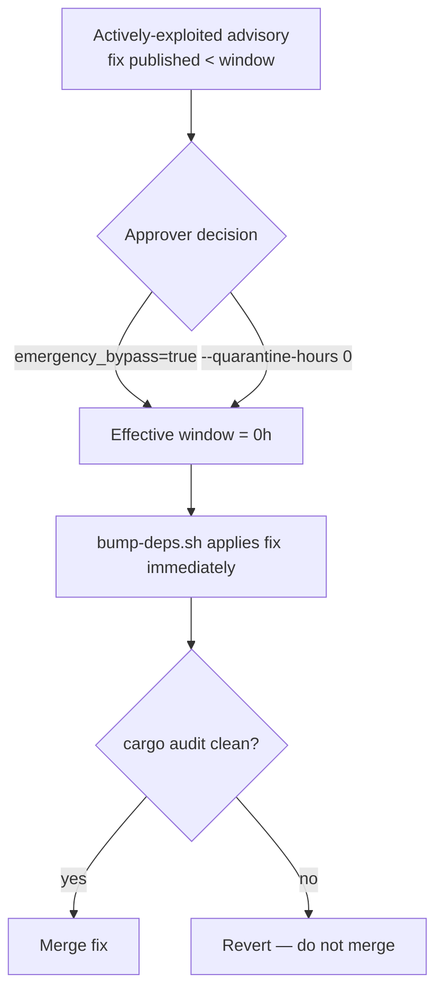

# Security policy

This document covers operational security procedures for NEAT-AI-core. It
complements the automated supply-chain defences described in
[`README.md`](README.md#dependency-updates-two-channels) — the weekly
quarantine-aware bump, the Dependabot security fast lane, and `cargo audit`
detection.

## Reporting a vulnerability

If you discover a vulnerability — in this code or in one of its dependencies —
report it privately so a fix can be prepared before any public disclosure:

- **Email** [security@stsoftware.com.au](mailto:security@stsoftware.com.au)
  with the affected version, a description, and reproduction steps where
  practical.
- **Or** open a private advisory via **GitHub Security Advisories**
  (*Security → Advisories → Report a vulnerability* on this repository).

Please **do not file a public issue** for an embargoed or unpatched
vulnerability — a public issue leaks the advisory before a fix is available.
Public issues are fine once an advisory is published and remediated.

We aim to acknowledge a report within two working days and to agree a
disclosure timeline with the reporter.

## Dependency bump quarantine

Dependency bumps honour a release-age **quarantine window**
(`VIBE_BUMP_QUARANTINE_HOURS`, default 24h — Issue #76). Crates.io versions
published less than that many hours ago are deferred, which defends against
fast-flagged malicious publishes that are later yanked. `bump-deps.sh` applies
the window, and the *Upgrade Cargo Dependencies* workflow feeds it from the
`VIBE_BUMP_QUARANTINE_HOURS` repository variable.

## Emergency quarantine override

The quarantine window is a deliberate trade-off: it defers brand-new crate
versions for 24h. That same delay can *block* the urgent case — when the only
patched version of a vulnerable crate was published minutes ago and the
advisory is being actively exploited now.

When an actively-exploited advisory's fix is newer than the quarantine window,
an approver may run the upgrade with the window disabled:

- **Via the workflow** — dispatch *Upgrade Cargo Dependencies*
  (`workflow_dispatch`) with the `emergency_bypass` input set to `true`. This
  collapses the effective window to `VIBE_BUMP_QUARANTINE_HOURS=0` for that run
  so the freshly-published fix is applied immediately.
- **Locally** — run `./bump-deps.sh --quarantine-hours 0`.

After bypassing the window you **must** manually confirm `cargo audit` reports
no advisories against the bumped tree before merge. The bypass disables only
the release-age deferral; it does not relax the audit or build gates.

Use this path only for an actively-exploited advisory whose fix falls inside
the quarantine window. Routine bumps must continue to honour the default
window.

## Emergency dependency bump

When an advisory needs an out-of-cycle fix, follow this runbook rather than
waiting for the weekly bump:

1. **Triage.** Confirm the advisory affects a crate in `Cargo.lock` and that a
   patched version exists. `cargo audit` (run locally or via the `security`
   job) names the advisory and the fixed version.
2. **Dispatch the bump.** Trigger the *Upgrade Cargo Dependencies* workflow
   ([`upgrade-dependencies.yml`](.github/workflows/upgrade-dependencies.yml))
   via `workflow_dispatch`. If the patched version is newer than the
   `VIBE_BUMP_QUARANTINE_HOURS` window, set `emergency_bypass: true` to collapse
   the window to 0h (see *Emergency quarantine override* above). Locally, the
   equivalent is `./bump-deps.sh --quarantine-hours 0`.
3. **Verify.** Confirm `cargo audit` reports no advisories against the bumped
   tree and that the native and WASM builds pass. The bypass relaxes only the
   release-age deferral — never the audit or build gates.
4. **Fast-track the PR.** Mark the upgrade PR as security-driven, get an
   approver review, and merge to `Develop` ahead of the routine queue.
5. **Close the loop.** Once merged and released, the advisory may be discussed
   publicly; update or publish the GitHub Security Advisory accordingly.

For the routine (non-urgent) refresh channels, see
[`README.md`](README.md#dependency-updates-two-channels).
