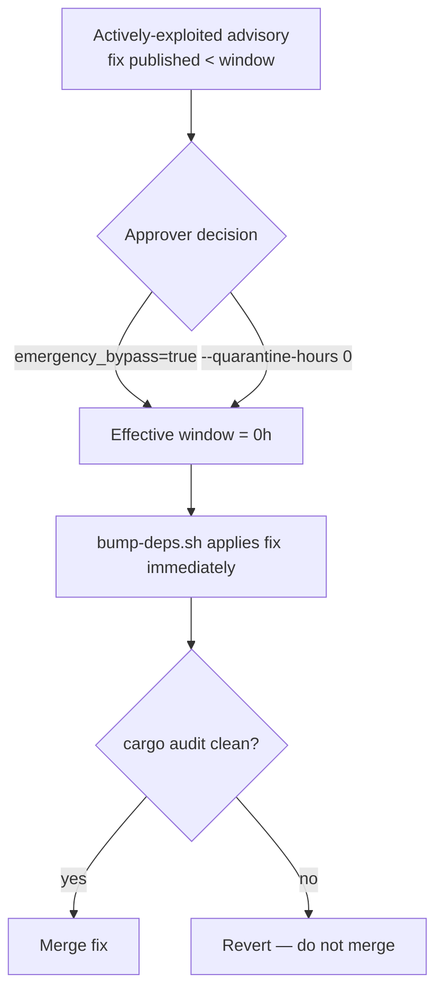

# Security policy

This document covers operational security procedures for NEAT-AI-core. It
complements the automated supply-chain defences described in
[`README.md`](README.md#dependency-updates-two-channels) — the weekly
quarantine-aware bump, the Dependabot security fast lane, and `cargo audit`
detection.

## Dependency bump quarantine

Dependency bumps honour a release-age **quarantine window**
(`VIBE_BUMP_QUARANTINE_HOURS`, default 24h — Issue #76). Crates.io versions
published less than that many hours ago are deferred, which defends against
fast-flagged malicious publishes that are later yanked. `bump-deps.sh` applies
the window, and the *Upgrade Cargo Dependencies* workflow feeds it from the
`VIBE_BUMP_QUARANTINE_HOURS` repository variable.

## Emergency quarantine override

The quarantine window is a deliberate trade-off: it defers brand-new crate
versions for 24h. That same delay can *block* the urgent case — when the only
patched version of a vulnerable crate was published minutes ago and the
advisory is being actively exploited now.

When an actively-exploited advisory's fix is newer than the quarantine window,
an approver may run the upgrade with the window disabled:

- **Via the workflow** — dispatch *Upgrade Cargo Dependencies*
  (`workflow_dispatch`) with the `emergency_bypass` input set to `true`. This
  collapses the effective window to `VIBE_BUMP_QUARANTINE_HOURS=0` for that run
  so the freshly-published fix is applied immediately.
- **Locally** — run `./bump-deps.sh --quarantine-hours 0`.

After bypassing the window you **must** manually confirm `cargo audit` reports
no advisories against the bumped tree before merge. The bypass disables only
the release-age deferral; it does not relax the audit or build gates.

Use this path only for an actively-exploited advisory whose fix falls inside
the quarantine window. Routine bumps must continue to honour the default
window.
