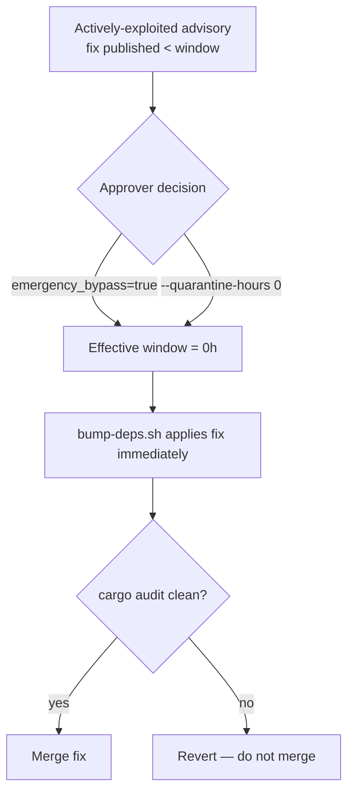
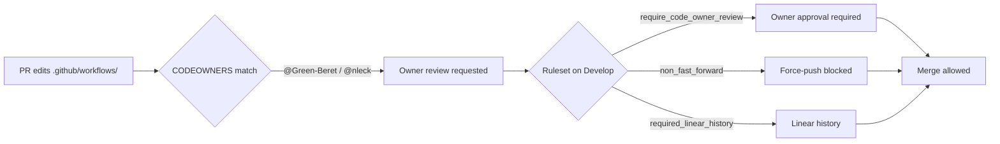

# Security policy

This document covers operational security procedures for NEAT-AI-core. It
complements the automated supply-chain defences described in
[`README.md`](README.md#dependency-updates-two-channels) — the weekly
quarantine-aware bump, the Dependabot security fast lane, and `cargo audit`
detection.

## Reporting a vulnerability

If you discover a vulnerability — in this code or in one of its dependencies —
report it privately so a fix can be prepared before any public disclosure:

- **Email** [security@stsoftware.com.au](mailto:security@stsoftware.com.au)
  with the affected version, a description, and reproduction steps where
  practical.
- **Or** open a private advisory via **GitHub Security Advisories**
  (*Security → Advisories → Report a vulnerability* on this repository).

Please **do not file a public issue** for an embargoed or unpatched
vulnerability — a public issue leaks the advisory before a fix is available.
Public issues are fine once an advisory is published and remediated.

We aim to acknowledge a report within two working days and to agree a
disclosure timeline with the reporter.

## Memory safety of compiled-network loading

Untrusted compiled-network input (a `.bin` buffer) is made safe for the native
SIMD forward pass by a single load-time validation. The SIMD kernels in
`neat-core/src/simd_native.rs` index the activation buffer — sized to exactly
`num_neurons` — with **unchecked** indexing (`get_unchecked(from_index)`) for
speed. A synapse whose `from_index >= num_neurons` would therefore be an
out-of-bounds read (undefined behaviour: heap information disclosure or a fault)
on every `activate()`.

`CompiledNetwork::new` upholds the precondition once, at deserialisation time:
it rejects any synapse referencing an index outside `0..num_neurons` with
`NetworkError::InvalidSynapseIndex` (`neat-core/src/network.rs:326`, Issue #207).
A network that loads successfully is guaranteed to have every `from_index` in
range, which is what makes the downstream `get_unchecked` calls sound.

**This `from_index < num_neurons` check must never be removed or bypassed.**
It is the whole memory-safety guarantee for the SIMD hot path — deleting it as
"redundant" reintroduces the out-of-bounds read. See the engineering-facing
statement of this invariant in
[`AGENTS.md`](AGENTS.md#unsafe--simd-invariants).

## Dependency bump quarantine

Dependency bumps honour a release-age **quarantine window**
(`VIBE_BUMP_QUARANTINE_HOURS`, default 24h — Issue #76). Crates.io versions
published less than that many hours ago are deferred, which defends against
fast-flagged malicious publishes that are later yanked. `bump-deps.sh` applies
the window, and the *Upgrade Cargo Dependencies* workflow feeds it from the
`VIBE_BUMP_QUARANTINE_HOURS` repository variable.

## Emergency quarantine override

The quarantine window is a deliberate trade-off: it defers brand-new crate
versions for 24h. That same delay can *block* the urgent case — when the only
patched version of a vulnerable crate was published minutes ago and the
advisory is being actively exploited now.

When an actively-exploited advisory's fix is newer than the quarantine window,
an approver may run the upgrade with the window disabled:

- **Via the workflow** — dispatch *Upgrade Cargo Dependencies*
  (`workflow_dispatch`) with the `emergency_bypass` input set to `true`. This
  collapses the effective window to `VIBE_BUMP_QUARANTINE_HOURS=0` for that run
  so the freshly-published fix is applied immediately.
- **Locally** — run `./bump-deps.sh --quarantine-hours 0`.

After bypassing the window you **must** manually confirm `cargo audit` reports
no advisories against the bumped tree before merge. The bypass disables only
the release-age deferral; it does not relax the audit or build gates.

```mermaid
flowchart TD
    Adv[Actively-exploited advisory<br/>fix published &lt; window] --> Approver{Approver decision}
    Approver -->|emergency_bypass=true| Zero[Effective window = 0h]
    Approver -->|--quarantine-hours 0| Zero
    Zero --> Bump[bump-deps.sh applies fix immediately]
    Bump --> Audit{cargo audit clean?}
    Audit -->|yes| Merge[Merge fix]
    Audit -->|no| Revert[Revert — do not merge]
```

Use this path only for an actively-exploited advisory whose fix falls inside
the quarantine window. Routine bumps must continue to honour the default
window.

## Emergency dependency bump

When an advisory needs an out-of-cycle fix, follow this runbook rather than
waiting for the weekly bump:

1. **Triage.** Confirm the advisory affects a crate in `Cargo.lock` and that a
   patched version exists. `cargo audit` (run locally or via the `security`
   job) names the advisory and the fixed version.
2. **Dispatch the bump.** Trigger the *Upgrade Cargo Dependencies* workflow
   ([`upgrade-dependencies.yml`](.github/workflows/upgrade-dependencies.yml))
   via `workflow_dispatch`. If the patched version is newer than the
   `VIBE_BUMP_QUARANTINE_HOURS` window, set `emergency_bypass: true` to collapse
   the window to 0h (see *Emergency quarantine override* above). Locally, the
   equivalent is `./bump-deps.sh --quarantine-hours 0`.
3. **Verify.** Confirm `cargo audit` reports no advisories against the bumped
   tree and that the native and WASM builds pass. The bypass relaxes only the
   release-age deferral — never the audit or build gates.
4. **Fast-track the PR.** Mark the upgrade PR as security-driven, get an
   approver review, and merge to `Develop` ahead of the routine queue.
5. **Close the loop.** Once merged and released, the advisory may be discussed
   publicly; update or publish the GitHub Security Advisory accordingly.

For the routine (non-urgent) refresh channels, see
[`README.md`](README.md#dependency-updates-two-channels).

## Review governance (CODEOWNERS + branch protection)

The workflows in [`.github/workflows/`](.github/workflows/) are privileged:
`wasm-bundle.yml` runs with `id-token: write` (OIDC keyless Sigstore signing),
`ci.yml` and `upgrade-dependencies.yml` use the `ACTIONS_PUSH` PAT, and
`semgrep.yml` uses `SEMGREP_APP_TOKEN`. An unreviewed edit to any of them is a
secret-exfiltration / artefact-signing attack path, so changes there require a
designated owner's review. Two controls enforce that:

- **[`.github/CODEOWNERS`](.github/CODEOWNERS)** assigns the repo admins
  `@Green-Beret` and `@nleck` as owners of the privileged CI paths
  (`.github/workflows/`, `.github/actions/`, `.github/rulesets/`, and the
  CODEOWNERS file itself). Concrete accounts are used rather than a team
  because no team holds write access to this repository, so a team owner would
  be silently ignored by GitHub. GitHub auto-requests an owner review on any
  matching change.
- **[`.github/rulesets/develop.json`](.github/rulesets/develop.json)** is a
  settings-as-code mirror of the live branch-protection ruleset on the default
  branch (`Develop`). It sets `require_code_owner_review: true` (so the
  CODEOWNERS rules are enforced at merge), keeps the existing ≥1-approval
  requirement and required status checks, blocks force-pushes
  (`non_fast_forward`), and requires linear history.

Required **signed commits** are deliberately *not* enabled: the *Auto-format
Code* and *Auto-increment Versions* CI jobs push unsigned commits with the
`ACTIONS_PUSH` PAT, and a signed-commit rule would reject them.

```mermaid
flowchart LR
    A[PR edits .github/workflows/] --> B{CODEOWNERS match}
    B -->|"@Green-Beret / @nleck"| C[Owner review requested]
    C --> D{Ruleset on Develop}
    D -->|require_code_owner_review| E[Owner approval required]
    D -->|non_fast_forward| F[Force-push blocked]
    D -->|required_linear_history| G[Linear history]
    E --> H[Merge allowed]
    F --> H
    G --> H
```

**Applying the ruleset is an admin action.** Editing `develop.json` does not
change the live ruleset. A repository admin must `PUT` the payload to
`/repos/stSoftwareAU/NEAT-AI-core/rulesets/15236989` (GET the current ruleset
first to confirm the id) — or apply the equivalent settings via
*Settings → Rules → Rulesets* in the GitHub UI.
