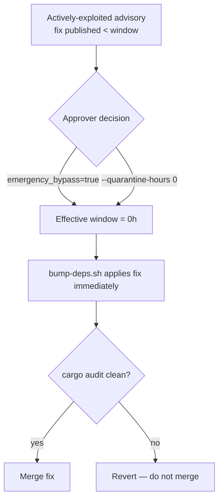
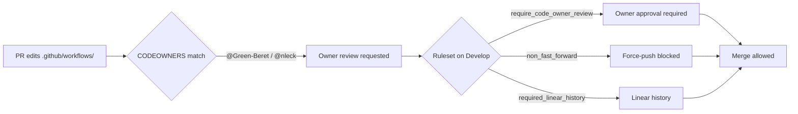

# Security policy

This document covers operational security procedures for NEAT-AI-core. It
complements the automated supply-chain defences described in
[`README.md`](README.md#dependency-updates-two-channels) — the weekly
quarantine-aware bump, the weekly Dependabot version-updates channel, and
`cargo audit` detection.

## Reporting a vulnerability

If you discover a vulnerability — in this code or in one of its dependencies —
report it privately so a fix can be prepared before any public disclosure:

- **Email** [security@stsoftware.com.au](mailto:security@stsoftware.com.au)
  with the affected version, a description, and reproduction steps where
  practical.
- **Or** open a private advisory via **GitHub Security Advisories**
  (*Security → Advisories → Report a vulnerability* on this repository).

Please **do not file a public issue** for an embargoed or unpatched
vulnerability — a public issue leaks the advisory before a fix is available.
Public issues are fine once an advisory is published and remediated.

We aim to acknowledge a report within two working days and to agree a
disclosure timeline with the reporter.

## Memory safety of compiled-network loading

Untrusted compiled-network input (a `.bin` buffer) is made safe for the native
SIMD forward pass by a single load-time validation. The SIMD kernels in
`neat-core/src/simd_native.rs` index the activation buffer — sized to exactly
`num_neurons` — with **unchecked** indexing (`get_unchecked(from_index)`) for
speed. A synapse whose `from_index >= num_neurons` would therefore be an
out-of-bounds read (undefined behaviour: heap information disclosure or a fault)
on every `activate()`.

`CompiledNetwork::new` upholds the precondition once, at deserialisation time:
it rejects any synapse referencing an index outside `0..num_neurons` with
`NetworkError::InvalidSynapseIndex` (`neat-core/src/network.rs:326`, Issue #207).
A network that loads successfully is guaranteed to have every `from_index` in
range, which is what makes the downstream `get_unchecked` calls sound.

**This `from_index < num_neurons` check must never be removed or bypassed.**
It is the whole memory-safety guarantee for the SIMD hot path — deleting it as
"redundant" reintroduces the out-of-bounds read. See the engineering-facing
statement of this invariant in
[`AGENTS.md`](AGENTS.md#unsafe--simd-invariants).

### Callers that hold no loaded network (Issue #613)

The load-time validation covers callers holding a `CompiledNetwork`. It cannot
cover a downstream crate that calls `neat_core::simd` with slices of its own, so
the public kernels are split in two:

- The **safe** kernels (`weighted_sum_simd`, `weighted_sum_simd_8records`,
  `weighted_sum_interleaved`, and the rest of the family) validate the span
  through `neat_core::simd::bounds` before dispatching and **panic** when it
  does not hold — both halves of the contract, an out-of-range `from_index` and
  an `end` past the synapse slice, are refused the same way rather than answered
  from a truncated span. No combination of safe arguments reaches an unchecked
  read, on either the native or the `wasm` target.
- The **`unsafe`** `*_unchecked` kernels carry the index precondition as a
  `# Safety` contract for callers — `CompiledNetwork` among them — that have
  already discharged it, so the forward-pass hot path is unchanged.

`neat-core/tests/simd_public_bounds.rs` pins the safe half: the out-of-range
reproducer from Issue #613 fails loud on every kernel instead of reading past
the activation buffer, an over-long `end` is refused rather than truncated, and
each safe entry point is asserted bit-identical to its `*_unchecked` twin on
spans that do satisfy the precondition.

### The struct itself holds the invariant (Issue #625)

That split left one residual path: `CompiledNetwork`'s fields were `pub`, so
safe code could write `synapses` / `hot_from` / `activations` after `new` had
validated them and then call `activate*`, which reaches the `*_unchecked`
kernels on the strength of the now-stale check. Issue #625 closed it **by
construction** rather than by prose:

- Every field is private, so no safe caller outside the crate can write one, and
  no struct literal can skip the validation.
- Consumers read the same state through borrow-only accessors
  (`neurons()`, `synapses()`, `hot_weights()`, `hot_from()`, `activations()`,
  `hint_values()`, `trace_data()`, `num_neurons()`, `num_inputs()`), which hand
  out `&[T]` and never `&mut`.
- `CompiledNetwork::from_parts` is the one way to build a network from parts
  already in memory. It re-runs the `from_index < num_neurons` check and also
  rejects a neuron whose `start_synapse + num_synapses` runs past the synapse
  table (`NetworkError::InvalidSynapseSpan`) — the other half of the kernels'
  contract, which `new` could never violate but a caller-supplied span could.

The gate is the `compile_fail` doctest pair on `CompiledNetwork`
(`neat-core/src/network.rs`). A doctest is compiled as its own crate linking
`neat_core`, so it is an out-of-crate safe caller — the exact threat model. One
half performs the Issue #625 mutation and must not compile; the other reads the
same fixture through the accessors and compiles **and runs**, so a refusal can
never come from a broken fixture. Widening either field back to `pub` makes the
first half fail, which is what proves the gate can fail at all.

The consumers this closed API break reaches are **NEAT-AI-scorer** (reads
`neurons` / `synapses` / `num_neurons` / `num_inputs` on its GPU upload path) and
**NEAT-AI-Backpropagation** (reads `activations`); both move to the accessors.
The migration is recorded in [`RELEASING.md`](RELEASING.md#0120--compilednetworks-fields-are-private).

## Dependency bump quarantine

Dependency bumps honour a release-age **quarantine window**
(`VIBE_BUMP_QUARANTINE_HOURS`, default 24h — Issue #76). Crates.io versions
published less than that many hours ago are deferred, which defends against
fast-flagged malicious publishes that are later yanked. `bump-deps.sh` applies
the window, and the *Upgrade Cargo Dependencies* workflow feeds it from the
`VIBE_BUMP_QUARANTINE_HOURS` repository variable.

Deferring a version is not enough on its own: `cargo update` is free to move
crates the bump plan never named. Both update passes therefore snapshot
`Cargo.lock` and verify it afterwards — an update that drags a deferred crate
off the version it was held at, or any planned crate off its approved target,
is reverted and named in the log rather than left in the lock (Issue #614).

## Emergency quarantine override

This is the single authoritative home for the emergency override / out-of-cycle
**emergency dependency bump** procedure; other docs link here rather than
restate it.

The quarantine window is a deliberate trade-off: it defers brand-new crate
versions for 24h. That same delay can *block* the urgent case — when the only
patched version of a vulnerable crate was published minutes ago and the
advisory is being actively exploited now. When an advisory needs an
out-of-cycle fix an approver may run the upgrade with the window disabled,
following the runbook below rather than waiting for the weekly bump.

The window is disabled with either lever:

- **Via the workflow** — dispatch *Upgrade Cargo Dependencies*
  (`workflow_dispatch`) with the `emergency_bypass` input set to `true`. This
  collapses the effective window to `VIBE_BUMP_QUARANTINE_HOURS=0` for that run
  so the freshly-published fix is applied immediately.
- **Locally** — run `./bump-deps.sh --quarantine-hours 0`.

### Runbook

1. **Triage.** Confirm the advisory affects a crate in `Cargo.lock` and that a
   patched version exists. `cargo audit` (run locally or via the `security`
   job) names the advisory and the fixed version.
2. **Dispatch the bump.** Trigger the *Upgrade Cargo Dependencies* workflow
   ([`upgrade-dependencies.yml`](.github/workflows/upgrade-dependencies.yml))
   via `workflow_dispatch` (or the local `./bump-deps.sh` equivalent), using
   either lever above to collapse the window to 0h when the patched version is
   newer than the `VIBE_BUMP_QUARANTINE_HOURS` window.
3. **Verify.** After bypassing the window you **must** confirm `cargo audit`
   reports no advisories against the bumped tree and that the native and WASM
   builds pass. The bypass relaxes only the release-age deferral — never the
   audit or build gates.
4. **Fast-track the PR.** Mark the upgrade PR as security-driven, get an
   approver review, and merge to `Develop` ahead of the routine queue.
5. **Close the loop.** Once merged and released, the advisory may be discussed
   publicly; update or publish the GitHub Security Advisory accordingly.

```mermaid
flowchart TD
    Adv[Actively-exploited advisory<br/>fix published &lt; window] --> Approver{Approver decision}
    Approver -->|emergency_bypass=true| Zero[Effective window = 0h]
    Approver -->|--quarantine-hours 0| Zero
    Zero --> Bump[bump-deps.sh applies fix immediately]
    Bump --> Audit{cargo audit clean?}
    Audit -->|yes| Merge[Merge fix]
    Audit -->|no| Revert[Revert — do not merge]
```

Use this path only for an actively-exploited advisory whose fix falls inside
the quarantine window. Routine bumps must continue to honour the default
window. For the routine (non-urgent) refresh channels, see
[`README.md`](README.md#dependency-updates-two-channels).

## Review governance (CODEOWNERS + branch protection)

The workflows in [`.github/workflows/`](.github/workflows/) are privileged:
`wasm-bundle.yml` runs with `id-token: write` (OIDC keyless Sigstore signing),
`ci.yml` and `upgrade-dependencies.yml` use the `ACTIONS_PUSH` PAT, and
`semgrep.yml` uses `SEMGREP_APP_TOKEN`. An unreviewed edit to any of them is a
secret-exfiltration / artefact-signing attack path, so changes there require a
designated owner's review.

`ACTIONS_PUSH` resolves from the **organisation** (this repository defines no
Actions secrets of its own), so a leak of it is an org-wide, not repo-wide,
event. The two `ci.yml` jobs that push — *Auto-increment Versions* and
*Auto-format Code* — check out the **PR head** and then execute code from it
(`./bump-deps.sh`, `cargo fmt`). They therefore run with
`persist-credentials: false` and no `token:` on the checkout, and the PAT is
handed only to the single pushing step through an explicit
`https://x-access-token:…` remote URL (Issue #483). Handing the PAT to a
checkout would write it into `.git/config`, where PR-authored code could read it
for the whole job — the credential-theft pattern behind the 2025–2026 CI
attacks. `tests/scripts/ci_push_credential_persistence.bats` pins that rule.

Two controls enforce the owner-review requirement:

- **[`.github/CODEOWNERS`](.github/CODEOWNERS)** assigns the repo admins
  `@Green-Beret` and `@nleck` as owners of the privileged CI paths
  (`.github/workflows/`, `.github/actions/`, `.github/rulesets/`, and the
  CODEOWNERS file itself). Concrete accounts are used rather than a team
  because no team holds write access to this repository, so a team owner would
  be silently ignored by GitHub. GitHub auto-requests an owner review on any
  matching change.
- **[`.github/rulesets/develop.json`](.github/rulesets/develop.json)** is a
  settings-as-code mirror of the live branch-protection ruleset on the default
  branch (`Develop`). It sets `require_code_owner_review: true` (so the
  CODEOWNERS rules are enforced at merge), keeps the existing ≥1-approval
  requirement and required status checks, blocks force-pushes
  (`non_fast_forward`), and requires linear history.

Required **signed commits** are deliberately *not* enabled: the *Auto-format
Code* and *Auto-increment Versions* CI jobs push unsigned commits with the
`ACTIONS_PUSH` PAT, and a signed-commit rule would reject them.

```mermaid
flowchart LR
    A[PR edits .github/workflows/] --> B{CODEOWNERS match}
    B -->|"@Green-Beret / @nleck"| C[Owner review requested]
    C --> D{Ruleset on Develop}
    D -->|require_code_owner_review| E[Owner approval required]
    D -->|non_fast_forward| F[Force-push blocked]
    D -->|required_linear_history| G[Linear history]
    E --> H[Merge allowed]
    F --> H
    G --> H
```

**Applying the ruleset is an admin action.** Editing `develop.json` does not
change the live ruleset. A repository admin must `PUT` the payload to
`/repos/stSoftwareAU/NEAT-AI-core/rulesets/15236989` (GET the current ruleset
first to confirm the id) — or apply the equivalent settings via
*Settings → Rules → Rulesets* in the GitHub UI.
