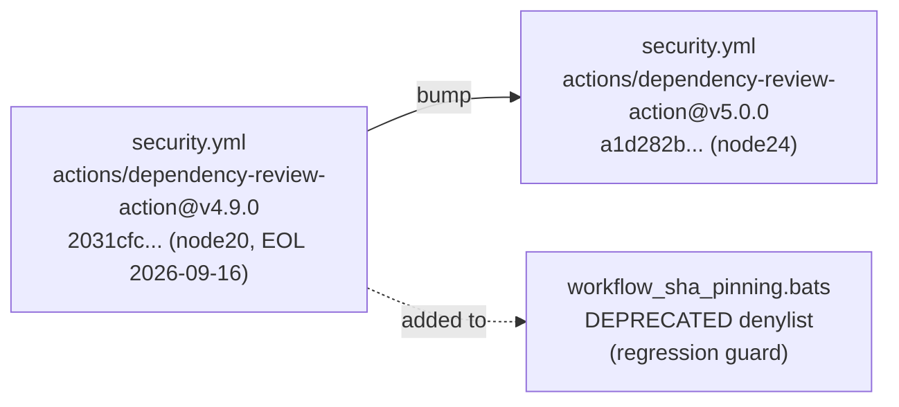

## Summary

Bumped `actions/dependency-review-action` from v4.9.0 (node20, runtime EOL 2026-09-16) to v5.0.0 (node24) in `.github/workflows/security.yml`, and added the deprecated v4.9.0 SHA to the Node-runtime denylist in `tests/scripts/workflow_sha_pinning.bats` so the regression cannot reappear. Closes #100.

The v4.9.0 release `action.yml` declares `using: 'node20'`; v5.0.0 declares `using: 'node24'` and requires Actions Runner v2.327.1+ (already available on GitHub-hosted runners).

## Evidence

CLI-only change — no UI to screenshot. Runtime declarations verified directly against the upstream `action.yml` files at each pinned SHA:

- `2031cfc080254a8a887f58cffee85186f0e49e48` (v4.9.0) → `using: 'node20'` (deprecated)
- `a1d282b36b6f3519aa1f3fc636f609c47dddb294` (v5.0.0) → `using: 'node24'` (current)

## Test Plan

- `tests/scripts/workflow_sha_pinning.bats` — `no workflow uses an action pinned to a deprecated Node runtime` now also rejects the v4.9.0 SHA `2031cfc080254a8a887f58cffee85186f0e49e48`. The test passes with the bumped workflow and would fail if a future change re-introduced the old SHA.
- Pre-existing failures in `quality.sh` (tests 31, 32, 33, 37, 78) are on the base branch and unrelated to this change — none reference `dependency-review-action`.
