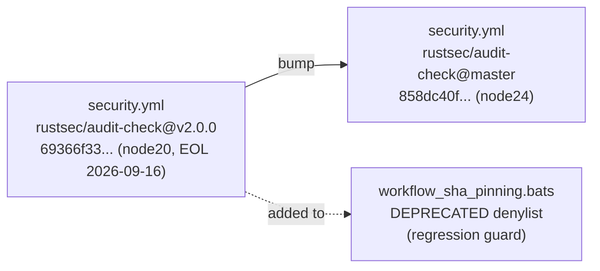

## Summary

Bumped `rustsec/audit-check` from `69366f33` (v2.0.0, node20, runtime EOL 2026-09-16) to `858dc40f` (post-v2.0.0 master, node24) in `.github/workflows/security.yml`, and added the deprecated v2.0.0 SHA to the Node-runtime denylist in `tests/scripts/workflow_sha_pinning.bats` so the regression cannot reappear. Closes #101.

The v2.0.0 release `action.yml` declares `using: 'node20'`; the current master tip (`858dc40f`, "Update to use Node 24 (#48)", 2026-03-20) declares `using: 'node24'`. Upstream has not yet cut a v2.1.0 / v3.0.0 release, so the pin tracks the master commit. The commit is two months old, comfortably outside the 24h quarantine window.

## Evidence

CLI-only change — no UI to screenshot. Runtime declarations verified directly against the upstream `action.yml` files at each pinned SHA:

- `69366f33c96575abad1ee0dba8212993eecbe998` (v2.0.0) → `using: 'node20'` (deprecated)
- `858dc40f52ca2b8570b7a997c1c4e35c6fc9a432` (master) → `using: 'node24'` (current)

## Test Plan

- `tests/scripts/workflow_sha_pinning.bats` — `no workflow uses an action pinned to a deprecated Node runtime` now also rejects the v2.0.0 SHA `69366f33c96575abad1ee0dba8212993eecbe998`. The test passes with the bumped workflow and would fail if a future change re-introduced the old SHA. Verified TDD red-then-green: with the denylist updated but `security.yml` still pinned to v2.0.0 the test failed; after bumping the pin it passes.
- Pre-existing failures in `quality.sh` (tests 31, 32, 33, 37, 78) are on the base branch and unrelated to this change — none reference `rustsec/audit-check`.
