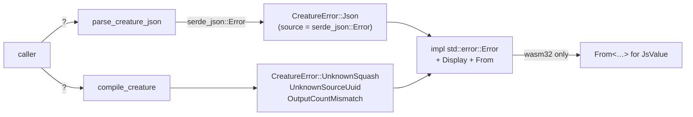

# Use typed errors instead of `Result<_, String>` for public creature/network APIs

## Summary

Replaced the stringly-typed `Result<_, String>` returns on the public,
crate-root re-exported creature/network APIs with custom error types that
implement `std::error::Error`. This mirrors the existing `TrainingDataError` /
`DecodeError` idiom already on the same public surface, so callers can match on
the failure by variant, traverse the `source()` chain, and `?`-propagate into
their own error type (Rust API Guidelines C-GOOD-ERR). Closes #115.

Three error types were introduced:

| Type | Module | Replaces `String` on |
| --- | --- | --- |
| `CreatureError` | `creature.rs` | `parse_squash_name`, `parse_creature_json`, `creature_to_json`, `creature_to_json_pretty`, `compile_creature` |
| `NetworkError` | `network.rs` | `CompiledNetwork::new` |
| `PcEngineError` | `pc_inference.rs` | `PredictiveCodingEngine::new` |

`CreatureError::Json` wraps the underlying `serde_json::Error` and exposes it via
`Error::source()`, so a JSON parse failure stays programmatically distinguishable
from a structural compile failure (`UnknownSquash`, `UnknownSourceUuid`,
`OutputCountMismatch`). All three types are re-exported from the crate root.

`CompiledNetwork::new` and `PredictiveCodingEngine::new` are
`#[wasm_bindgen(constructor)]` on `wasm32`, which requires the error type to
convert into `JsValue`. Each error type therefore has a `cfg(wasm32)`-gated
`From<…> for JsValue` impl that preserves the human-readable message. The
`wasm32-unknown-unknown` build was verified to still compile.

### Error-flow overview

## Evidence

Backend/library change only — no web interface to screenshot. Verified via the
test suite and toolchain checks:

- `cargo test --workspace` — all suites green (incl. the new `typed_errors`
  suite and the updated `creature_compile` assertions).
- `cargo fmt --all --check`, `cargo clippy --workspace --all-targets`,
  `RUSTDOCFLAGS="-D warnings" cargo doc` — clean.
- `cargo build -p neat-core --target wasm32-unknown-unknown` — compiles, so the
  `#[wasm_bindgen(constructor)]` error conversions are intact.

### Deno regression avoided

Not applicable — this is a Rust-only crate with no Deno tooling.

## Test Plan

New `neat-core/tests/typed_errors.rs` (8 tests) exercises the new contract via
real calls and observable outcomes:

- `parse_creature_json_error_is_std_error_with_serde_source` — error is a
  `CreatureError::Json` whose `source()` downcasts to `serde_json::Error`.
- `parse_squash_name_unknown_returns_typed_variant` — `UnknownSquash` variant,
  no source chain.
- `compile_creature_output_mismatch_returns_typed_variant` — `OutputCountMismatch
  { expected, found }` carries the structured counts.
- `compile_creature_unknown_source_uuid_returns_typed_variant` — `UnknownSourceUuid`
  carries the offending UUID.
- `creature_round_trip_helpers_return_ok` — `creature_to_json` /
  `creature_to_json_pretty` return `Result<String, CreatureError>`.
- `creature_error_propagates_via_question_mark` — `CreatureError` `?`-propagates
  into a caller's `Box<dyn Error>`.
- `compiled_network_new_truncated_returns_typed_error` /
  `pc_engine_new_truncated_returns_typed_error` — truncated buffers yield
  `TruncatedData`, which implements `std::error::Error`.

Updated (business-logic change, documented): two assertions in
`neat-core/tests/creature_compile.rs` that previously called `.contains(...)`
directly on a `String` error now call `.to_string().contains(...)` on the typed
error's preserved `Display` message. No existing tests were removed or disabled.
