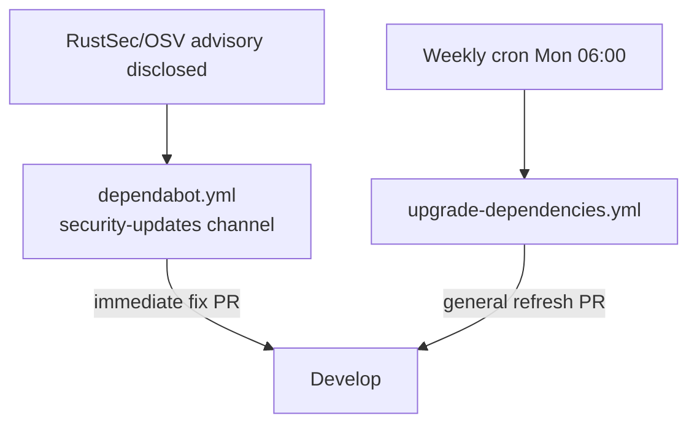

## Summary

Added an advisory-triggered security-update channel so a freshly-disclosed
RustSec/OSV advisory no longer waits up to six days for the Monday-morning
weekly bump. A minimal `.github/dependabot.yml` enables Dependabot's Cargo
**security-updates** channel, which opens a fix PR the moment an advisory lands
against a crate already in `Cargo.lock` — independent of the weekly
`upgrade-dependencies.yml` cron and the 24h `VIBE_BUMP_QUARANTINE_HOURS`
release-age window. Detection still lives in `security.yml` / `ci.yml`
(`cargo audit` / `rustsec/audit-check`); this change adds the missing channel
that *raises* the remediation PR. Closes #121.

## Change detail

- **`.github/dependabot.yml`** (new) — `version: 2`, Cargo ecosystem at root
  `/`, weekly routine schedule (mirrors `upgrade-dependencies.yml`),
  `open-pull-requests-limit: 10` so the advisory fast-lane is not throttled to
  the default of 5. Security-update PRs are raised immediately on advisory
  disclosure, outside the weekly window.
- **`tests/scripts/dependabot_config.bats`** (new) — "what" tests that parse
  the YAML and assert observable configuration: file exists, schema version 2,
  cargo ecosystem targets `/`, a schedule interval is declared, and a positive
  `open-pull-requests-limit` is set.
- **`README.md`** — documented the new config in the repository-layout table
  and added a "Dependency updates: two channels" section with a Mermaid
  flowchart of the routine-bump vs security-fast-lane model.

## Evidence

Backend/CI-config change — no web interface to screenshot. Verified via the
bats suite (TDD: tests written first, confirmed red, then green):

```
ok 39 dependabot config file exists
ok 40 dependabot config is valid YAML using schema version 2
ok 41 dependabot enables the cargo ecosystem at the workspace root
ok 42 cargo ecosystem entry declares an update schedule
ok 43 cargo ecosystem entry sets an open-pull-requests-limit
```

`markdownlint-cli2` (0 errors) and `codespell` (clean) pass against the changed
files.



## Test Plan

- Added `tests/scripts/dependabot_config.bats` — 5 "what" tests covering the
  presence, schema, ecosystem, schedule, and PR-limit of the new config.
- Full `bats tests/scripts` suite: the 5 new tests pass; all other suites
  unchanged.

## Pre-existing failures (out of scope)

`./quality.sh` reports 4 failures in `tests/scripts/ci_workflow_quarantine.bats`
(tests 31–33, 37) about `ci.yml` calling `cargo upgrade --incompatible` /
`cargo update` directly at lines 104–106. These were confirmed present on the
clean base branch (via `git stash -u`) and concern `ci.yml`, which this PR does
not touch. They are unrelated to issue #121 and are left for a dedicated fix.
