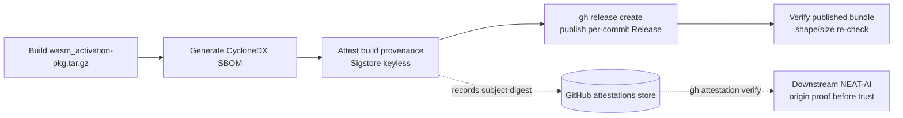

# SCR-PROVENANCE: attest build provenance for the published wasm_activation bundle

## Summary

The per-commit `wasm_activation` bundle published by `wasm-bundle.yml` carried
**no build-provenance attestation**, so a downstream consumer (NEAT-AI pins
`neatCore.rev` to a Develop SHA) could not cryptographically verify that the
tarball it downloaded was produced by this CI pipeline from the pinned source
commit. Pinning by SHA and the post-publish content re-verification prove the
bundle's *shape*; nothing proved its *origin*, leaving the
published-artefact-substitution attack class open (anyone with
`contents:write` could swap the Release asset for a malicious tarball of the
right shape and downstream `build.sh` checks would still pass).

This change wires a Sigstore-backed, keyless build-provenance attestation into
the publish job:

- Grants the token scopes attestation requires — `id-token: write` (OIDC
  signing identity) and `attestations: write` (record the attestation) —
  alongside the existing `contents: write`.
- Adds an `actions/attest-build-provenance` step, SHA-pinned to
  `a2bbfa25375fe432b6a289bc6b6cd05ecd0c4c32` (v4.1.0) per the repo's
  SHA-pinning rule (Issue #77), attesting both published assets
  (`wasm_activation-pkg.tar.gz` and the CycloneDX SBOM
  `wasm_activation-pkg.cdx.json`). It runs after the bundle is built and
  before publish, so the signed subject digest matches the bytes consumers
  download.
- Documents the downstream verification one-liner
  (`gh attestation verify wasm_activation-pkg.tar.gz --repo stSoftwareAU/NEAT-AI-core`)
  in the README propagation section and reflects the attest step in the
  end-to-end sequence diagram.

Closes #122.

## Evidence

This is a CI/supply-chain change with no web interface to screenshot. Evidence
is the new behavioural ("what") bats suite that parses `wasm-bundle.yml` and
asserts the observable outcomes, plus the unchanged-and-still-green
SHA-pinning, actionlint, and SBOM suites.

Flow added to the publish job:



Selected test run (`bats tests/scripts/wasm_bundle_provenance.bats`):

```
ok 1 wasm-bundle workflow file exists
ok 2 wasm-bundle workflow grants the token scopes attestation requires
ok 3 publish job has a step that attests build provenance
ok 4 provenance attestation covers the published bundle tarball
ok 5 attest-build-provenance action is SHA-pinned for supply-chain hygiene
ok 6 provenance is attested only after the bundle is built
```

The existing `workflow_sha_pinning.bats`, `actionlint_workflow.bats`, and
`wasm_bundle_sbom.bats` suites continue to pass against the modified workflow
(the new action is SHA-pinned with a version comment and actionlint validates
the YAML).

## Test Plan

- **Added** `tests/scripts/wasm_bundle_provenance.bats` — six "what" tests:
  - workflow file exists;
  - token scopes (`id-token: write`, `attestations: write`, retained
    `contents: write`) are granted;
  - a step uses `actions/attest-build-provenance`;
  - the attestation's `subject-path` covers `wasm_activation-pkg.tar.gz`;
  - the action is SHA-pinned to a 40-char commit SHA;
  - provenance is attested only after the bundle is built.
- **Regression coverage**: tests 2–6 fail against the unfixed workflow and
  pass after the change.

## Quality gate note

`./quality.sh` reports four **pre-existing, unrelated** failures in
`tests/scripts/ci_workflow_quarantine.bats` (tests about `ci.yml` calling
`cargo upgrade`/`cargo update` directly — finding-id unrelated to provenance).
These fail identically on a clean `HEAD` with my changes stashed, concern
`ci.yml` which this PR does not touch, and are therefore out of scope for
#122. All shellcheck, actionlint, SHA-pinning, SBOM, verify-bundle, and the
new provenance suites pass.
