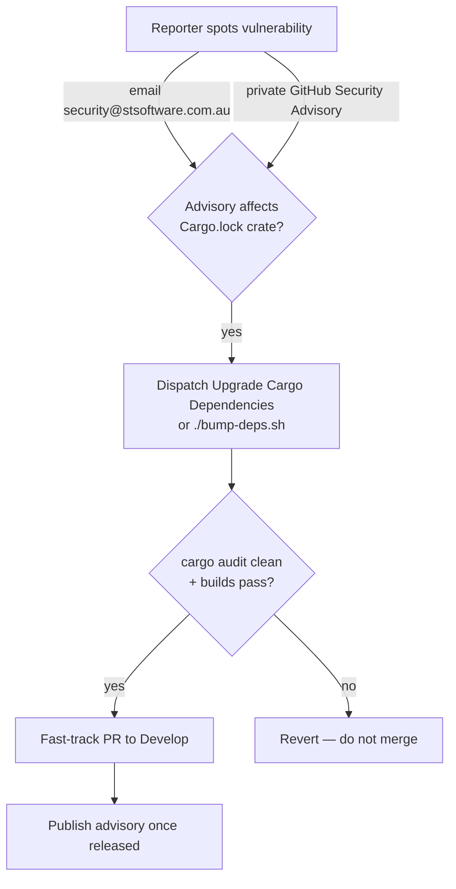

# SCR-RUNBOOK: add disclosure contact and emergency-bump runbook to SECURITY.md

## Summary

`SECURITY.md` existed but only documented the dependency-bump quarantine and
its emergency override (SCR-QUARANTINE-OVERRIDE). It had **no named disclosure
contact** and **no written emergency-bump response procedure**, so vulnerability
reports defaulted to public issues and the response steps lived only in
maintainers' heads.

This PR closes the SCR-RUNBOOK posture gap by adding two sections to
`SECURITY.md`:

- **Reporting a vulnerability** — names a disclosure contact
  (`security@stsoftware.com.au`), offers the private GitHub Security Advisories
  channel, and warns reporters not to file public issues for embargoed
  advisories.
- **Emergency dependency bump** — a 5-step runbook a responder can follow to
  triage, dispatch the *Upgrade Cargo Dependencies* workflow (or run
  `./bump-deps.sh`), verify `cargo audit`/builds, fast-track the PR, and close
  the loop on the advisory. It cross-links the existing *Emergency quarantine
  override* section and the README's routine refresh channels.

No code paths changed — this is a documentation/posture fix.

Closes #123.



## Evidence

Backend/docs change — no web interface to screenshot. Verified via bats tests
mirroring the repo's existing `security_quarantine_override.bats` pattern:

```
$ bats tests/scripts/security_runbook.bats
1..7
ok 1 SECURITY.md exists
ok 2 SECURITY.md has a vulnerability-reporting section
ok 3 SECURITY.md names a disclosure contact address
ok 4 SECURITY.md offers a private GitHub Security Advisory channel
ok 5 SECURITY.md warns against public issues for embargoed advisories
ok 6 SECURITY.md documents an emergency dependency-bump procedure
ok 7 the emergency-bump runbook names the workflow and the bump-deps.sh fallback
```

`markdownlint-cli2 SECURITY.md` and `codespell` both pass clean.

> Note: `./quality.sh` reports four pre-existing, unrelated failures in
> `tests/scripts/ci_workflow_quarantine.bats` (ci.yml invoking `cargo upgrade`/
> `cargo update` directly). These fail on the branch with this PR's changes
> stashed and are a separate finding — out of scope for #123.

## Test Plan

- Added `tests/scripts/security_runbook.bats` — 7 "what" assertions on the
  observable content of `SECURITY.md` (disclosure section, contact address,
  private advisory channel, public-issue warning, emergency-bump runbook, and
  the workflow + `bump-deps.sh` fallback being named).
- Confirmed the new tests fail against the pre-change `SECURITY.md` (TDD) and
  pass after the edit.
- Re-ran `tests/scripts/security_quarantine_override.bats` to confirm the
  existing override assertions still hold.
