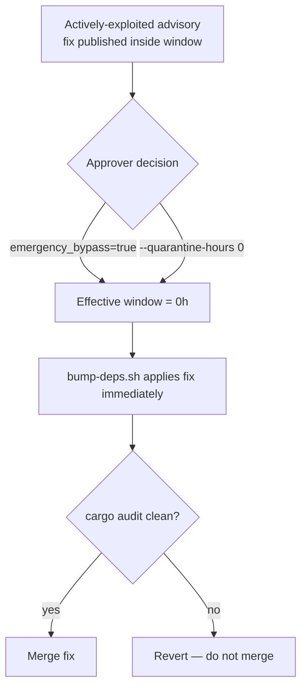

# PR Summary — Issue #124 (SCR-QUARANTINE-OVERRIDE)

## Summary

The repo enforces a release-age quarantine on dependency bumps
(`VIBE_BUMP_QUARANTINE_HOURS`, default 24h — Issue #76) but had **no documented
emergency-override / fast-lane procedure** for bypassing that window when an
actively-exploited advisory's fix is a freshly-published crate. The override
capability already existed (`bump-deps.sh --quarantine-hours 0`) but was
undocumented and not surfaced in the *Upgrade Cargo Dependencies* workflow.

This PR makes the safe escape hatch explicit and auditable:

- Adds **`SECURITY.md`** with an *Emergency quarantine override* section: when an
  actively-exploited advisory's fix is newer than the window, an approver runs
  the upgrade with the window disabled (`VIBE_BUMP_QUARANTINE_HOURS=0` /
  `./bump-deps.sh --quarantine-hours 0`) and must confirm `cargo audit` is clean
  before merge.
- Adds a self-documenting **`emergency_bypass` `workflow_dispatch` input** to
  `upgrade-dependencies.yml`, wired so that `emergency_bypass: true` collapses the
  effective window to `0` for that run. The input is cosmetic-proof — the env
  expression actually feeds `bump-deps.sh`.
- Cross-links the procedure from `README.md`'s dependency-updates section.

The bypass disables only the release-age deferral — the `cargo audit` and dual
native/WASM build gates still run.

Closes #124.

## Evidence

Backend/CLI/docs change — no web interface to screenshot. Verified via the bats
suite and the local quality gates (bash syntax, shellcheck, codespell,
markdownlint) which all pass.

New TDD test `tests/scripts/security_quarantine_override.bats` — failing before
the change (no `SECURITY.md`, no `emergency_bypass` input), passing after:

```
1..7
ok 1 SECURITY.md exists
ok 2 SECURITY.md documents the emergency quarantine override section
ok 3 SECURITY.md spells out the zero-hour bypass mechanism
ok 4 SECURITY.md requires a clean cargo audit before merge on the fast lane
ok 5 SECURITY.md scopes the override to approver / actively-exploited cases
ok 6 upgrade-dependencies.yml exposes an emergency_bypass workflow_dispatch input
ok 7 upgrade-dependencies.yml wires emergency_bypass to a zero-hour window
```

Override decision flow documented in `SECURITY.md`:



## Test Plan

- Added `tests/scripts/security_quarantine_override.bats` (7 cases) covering the
  documented override path and the workflow input wiring.
- `bats tests/scripts/security_quarantine_override.bats` — 7/7 pass.
- Pre-existing failures in `ci_workflow_quarantine.bats` (ci.yml not invoking
  bump-deps.sh) are unrelated to this issue and present on the base branch — left
  untouched per change-scope.
- Local gates pass for the changed files: bash syntax, shellcheck, codespell,
  markdownlint.

## Notes

`actionlint` reports three pre-existing `SC2016` info-level findings on the
unrelated "Build summary" step (single-quoted literal markdown echoes); these
predate this PR and are out of scope.
