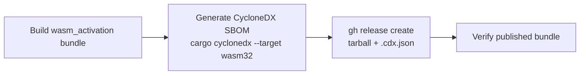

# SCR-SBOM: ship a CycloneDX SBOM with the wasm_activation bundle

## Summary

`wasm-bundle.yml` publishes a built `wasm_activation` tarball as a per-commit
GitHub Release that downstream consumers pin by SHA, but shipped **no SBOM** —
so a consumer received an opaque binary blob with no machine-readable inventory
of the crates it was built from. This PR adds a CycloneDX SBOM, generated from
the locked dependency graph and published as a second asset on the same
Release. When the next advisory drops, responders can answer "is the vulnerable
crate inside a bundle we shipped?" by reading the attached SBOM instead of
rebuilding each pinned commit.

Because the SBOM derives from `Cargo.lock` it is **exact, not approximate**, and
it is resolved against the `wasm32-unknown-unknown` target (the artefact's
actual triple) so it captures `wasm-bindgen` and the other wasm-only crates
that ship in the bundle.

Closes #125.

## Changes

- **`.github/workflows/wasm-bundle.yml`**
  - New **Generate CycloneDX SBOM** step: installs `cargo-cyclonedx`
    version-pinned and `--locked` (mirrors the wasm-pack supply-chain hygiene
    from Issue #78), runs `cargo cyclonedx --format json --target
    wasm32-unknown-unknown`, and copies the result to a deterministic asset
    name `wasm_activation-pkg.cdx.json`.
  - **Publish per-commit Release** step now uploads the `.cdx.json` alongside
    the tarball in the same `gh release create` call.
- **`.gitignore`** — ignore `*.cdx.json` (generated in CI and by the SBOM test;
  it is a Release asset, never committed).
- **`tests/scripts/wasm_bundle_sbom.bats`** — new "what" tests (see below).

## Flow

## Evidence

Backend/CI-only change — no web interface to screenshot. Verified by:

- New bats suite passes (7/7), including a **behavioural** test that installs
  nothing extra but, when `cargo-cyclonedx` is present, generates a real SBOM
  from this repo's manifest and asserts `bomFormat == "CycloneDX"`, a non-empty
  `specVersion`, and that `serde` appears in the components.
- `actionlint .github/workflows/wasm-bundle.yml` passes.
- Existing workflow guards still pass: SHA-pinning, script-injection,
  wasm-pack pinning suites all green.
- Manual confirmation that `cargo cyclonedx --target wasm32-unknown-unknown`
  produces a SBOM containing `wasm-bindgen` (the wasm-only dep), proving the
  inventory is exact for the published artefact.

## Test Plan

Added `tests/scripts/wasm_bundle_sbom.bats`:

- `publish job has a step that generates a CycloneDX SBOM`
- `cargo-cyclonedx install is version-pinned for supply-chain hygiene`
- `SBOM is published as a Release asset (.cdx.json)`
- `SBOM is generated before the Release is published`
- `cargo-cyclonedx produces valid CycloneDX JSON from this repo's manifest`
  (behavioural; skips cleanly if `cargo-cyclonedx` is not installed)
- plus workflow-exists / valid-YAML guards.

## Known pre-existing failures (out of scope)

`./quality.sh` reports 4 failures in `tests/scripts/ci_workflow_quarantine.bats`
(`ci.yml` version-increment / `bump-deps.sh` wiring). These pre-exist on the
base branch — confirmed by stashing this PR's changes and re-running the suite —
and concern `ci.yml`, not the wasm-bundle workflow, so they are outside this
issue's scope. The Rust gate (`cargo build` / `clippy` / `test` / build
release) is green.
