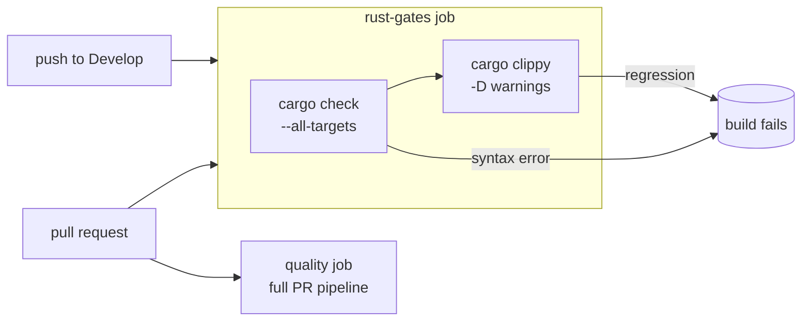

# Add CI lint + compile gates for Rust (Issue #143)

## Summary

Added explicit Rust **lint** and **compile/syntax** gates to CI that run on
**every push to `Develop` and every pull request**, so lint regressions and
syntax errors fail the build regardless of how a change reaches `Develop`.
Closes #143.

A `ci.yml` workflow already existed (the finding's "no workflows found" note
was stale), and it ran `cargo clippy -D warnings` — but **only** inside the
`quality` job, which is gated `if: github.event_name == 'pull_request'` and
depends on the PR-only auto-bump / auto-format jobs. Two real gaps remained:

1. **No CI ran on `push` to `Develop`** — every job was restricted to
   `pull_request`, so a direct push to `Develop` got zero lint/compile
   coverage.
2. **No explicit compile/syntax gate** — only a comment
   ("skip redundant cargo check / cargo build").

### Change

Added a self-contained `rust-gates` job to `.github/workflows/ci.yml`:

- **Compile gate** — `cargo check --workspace --all-targets --all-features`.
- **Lint gate** — `cargo clippy --workspace --all-targets --all-features -- -D warnings`.
- Runs on both push (to `Develop`) and pull request, with `RUSTFLAGS=-D warnings`.
- Deliberately **independent** of the PR-only auto-bump / auto-format jobs, so
  direct pushes to `Develop` are gated too. The existing `quality` job remains
  the comprehensive PR pipeline and is left untouched.

## Evidence

Backend/CI change — no web interface to screenshot. Verified locally with the
same commands the new job runs, plus the workflow tooling CI uses:

- `cargo fmt --all -- --check` → clean.
- `cargo check --workspace --all-targets --all-features` → compiles (`neat-core v0.1.38`).
- `cargo clippy --workspace --all-targets --all-features -- -D warnings` → clean.
- `cargo test --workspace --lib --tests --all-features` → 9 passed, 0 failed.
- `actionlint -no-color -ignore 'SC2016' .github/workflows/ci.yml` → passes.
- `bats tests/scripts` → 120 tests pass (includes the new suite and the
  repo-wide SHA-pin / tainted-context security scans, which now also cover the
  new job's actions).

## Test Plan

Added `tests/scripts/rust_gates_workflow.bats` — a contract test for the CI
wiring (the issue's requirement *is* the wiring). It asserts on observable
outcomes by parsing `ci.yml`:

- the workflow triggers on PRs and on pushes to `Develop`;
- a job runs the clippy lint gate with `-D warnings`;
- a job runs an explicit compile/syntax gate (`cargo check`/`cargo build` with `--all-targets`);
- a single job carries **both** gates and is **not** restricted to
  `pull_request` only (so pushes to `Develop` are gated) — this assertion
  failed before the change and passes after;
- third-party actions in the workflow are SHA-pinned.

All existing tests remain unmodified.
