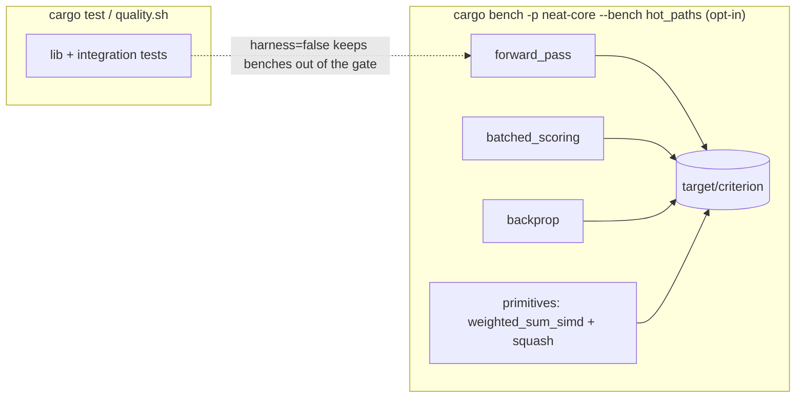

# Add a Criterion benchmark harness for core hot paths

## Summary

Adds an **opt-in** [Criterion](https://github.com/bheisler/criterion.rs)
benchmark harness for `neat-core`'s hottest paths so future performance work
(the #151 sub-issues) can be validated against reproducible numbers instead of
reasoning alone. This is additive tooling only — no library behaviour changes.
Closes #152.

Changes:

- `neat-core/Cargo.toml` — add `criterion` (with `html_reports`) as a
  dev-dependency and register a `harness = false` `[[bench]]` target named
  `hot_paths`.
- `neat-core/benches/hot_paths.rs` — deterministic benchmark groups for the
  forward pass, batched scoring, backprop, and activation primitives.
- `neat-core/benches/README.md` — how to run the benches and compare
  before/after with Criterion baselines.
- `README.md` — layout/build pointers to the opt-in harness.
- `Cargo.lock` — criterion + transitive dev-dependencies (licences/advisories
  pass `cargo deny check`).

### Coverage

| Group | Functions under test | Sizes |
| --- | --- | --- |
| `forward_pass` | `CompiledNetwork::activate` | small ~50, medium ~500, large ~5000 |
| `batched_scoring` | `activate_and_trace_batch_4way`, 8-record `mse_sum_batch_packed` | same three |
| `backprop` | one `propagate_topological_loop` step | same three |
| `weighted_sum_simd` | `weighted_sum_simd` family (single / no-bias / squares / 4- & 8-record) | 64-synapse block |
| `squash` | `apply_squash` / `apply_unsquash` over a spread of `SquashType`s | scalar |

Networks and inputs are built **once** outside the timed closure from a
fixed-seed PRNG with fixed topologies; `criterion::black_box` guards inputs and
outputs. The harness is deterministic so before/after comparisons are
meaningful.



## Evidence

Backend/CLI tooling — no web interface to screenshot. Evidence is the harness
running and producing stable numbers.

`cargo bench -p neat-core --bench hot_paths` (abbreviated, short measurement
window — representative magnitudes, not a tuned baseline):

```text
forward_pass/small_50      time:   [409.60 ns 412.41 ns 417.45 ns]
forward_pass/medium_500    time:   [5.3811 µs 5.4147 µs 5.4434 µs]
forward_pass/large_5000    time:   [81.874 µs 82.240 µs 82.676 µs]
batched_scoring/trace_batch_4way/medium_500  time: [10.776 µs 10.857 µs 10.951 µs]
batched_scoring/mse_sum_8records/medium_500  time: [19.161 µs 19.380 µs 19.599 µs]
backprop/medium_500        time:   [151.56 µs 152.61 µs 154.26 µs]
weighted_sum_simd/single   time:   [16.958 ns 17.042 ns 17.111 ns]
weighted_sum_simd/batch_8records  time: [70.350 ns 70.726 ns 70.986 ns]
squash/apply_squash/Tanh   time:   [1.7994 ns 1.8199 ns 1.8430 ns]
```

This issue is the foundation for #151 — it establishes the baseline so later
perf changes can be measured. It introduces no perf change of its own, so there
is no before/after delta to report here.

## Test Plan

- `cargo bench -p neat-core --bench hot_paths` runs all four groups and reports
  stable numbers (acceptance criterion 1).
- Benches stay out of the test gate: `cargo test --workspace --lib --tests`
  does not run them (`harness = false` + opt-in `[[bench]]`), so `quality.sh`
  runtime is unaffected (acceptance criterion 2).
- `cargo clippy --workspace --all-targets --all-features -- -D warnings` — clean
  (the bench compiles under the lint gate).
- `cargo check --all-targets`, `cargo test --workspace --lib --tests`,
  `cargo doc`, and `cargo build --release` all pass.
- `cargo deny check` — `advisories ok, bans ok, licenses ok, sources ok` with
  the new criterion dependency tree.

### Note on the local gate

`./quality.sh` reports 4 **pre-existing** `bats` failures in
`tests/scripts/ci_workflow_quarantine.bats` (about `ci.yml` calling
`cargo upgrade`/`cargo update` directly). These are present on the clean base
branch, are unrelated to this change, and were left untouched per change-scope
rules. All Rust gates that follow were run individually and pass.

This is additive tooling (a benchmark target), so there is no library behaviour
to add unit tests for; the harness compiling under the clippy `--all-targets`
gate and running cleanly is the verification.
