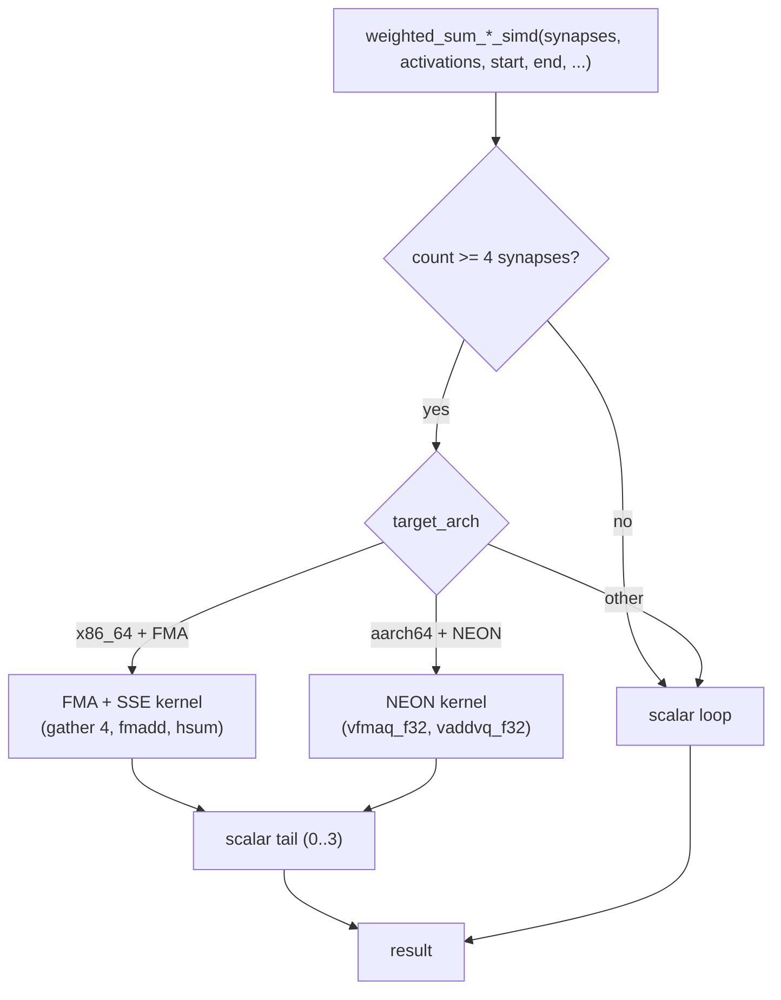

# [perf] Native SIMD for single-record weighted-sum primitives

## Summary

The four **single-record** weighted-sum primitives on the primary `activate()`
forward-pass hot path were pure scalar loops on every native target, while only
the batched 4/8-record scoring paths had native SIMD. This change gives the
single-record primitives the same native-SIMD dispatch the multi-record kernels
already use:

- **x86_64**: FMA + SSE path (gather 4 indexed `from_index` activations, multiply
  by 4 weights, FMA-accumulate; the sum-of-squares variants square then accumulate).
- **aarch64**: NEON path (`vfmaq_f32`, lane-gather, `vaddvq_f32` reduce).
- **Scalar fallback** for other arches and the 0..3-synapse tail.

All four — `weighted_sum_simd`, `weighted_sum_no_bias_simd`,
`weighted_sum_of_squares_simd`, `weighted_sum_of_squares_v2_simd` — now live in
`simd_native.rs` beside the multi-record kernels, behind the same
`is_x86_feature_detected!` / `is_aarch64_feature_detected!` guards. The stale
*"for testing"* doc comments are gone — these are documented as production
hot-path functions. Every `unsafe` block carries a `// SAFETY:` comment matching
the precedent set by #112.

Closes #153.

## Evidence

This is a backend/library performance change — no web interface to screenshot.
Verified via the benchmark below plus the correctness tests in
`tests/simd_weighted_sums.rs`.

### Benchmark (perf workflow, before/after)

Measured on this host (`aarch64-apple-darwin`, NEON) with
`cargo run --release --example bench_single_record_weighted_sums`
(64-synapse single-record neuron, 2,000,000 iterations, inputs `black_box`-ed
each call so the loop-invariant result cannot be hoisted out of the timing loop).
The **before** numbers were captured by running the identical harness against the
scalar code (SIMD changes stashed):

| Primitive | Scalar (before) | Native SIMD (after) | Speed-up |
|---|---|---|---|
| `weighted_sum_simd` | 108.5 ns/call | 19.2 ns/call | ~5.6× |
| `weighted_sum_no_bias_simd` | 108.7 ns/call | 19.0 ns/call | ~5.7× |
| `weighted_sum_of_squares_simd` | 108.6 ns/call | 19.0 ns/call | ~5.7× |
| `weighted_sum_of_squares_v2_simd` | 109.3 ns/call | 19.3 ns/call | ~5.7× |

No regression on the scalar fallback: counts below one SIMD lane (<4 synapses)
and non-x86_64/aarch64 targets keep the original scalar loop.

### Dispatch flow

## Test Plan

- **Existing** `neat-core/tests/simd_weighted_sums.rs` — all 20 pre-existing cases
  still pass unchanged (empty range, single synapse, exact-4, remainder, offset,
  negative values, sum-of-squares, no-bias, v2, plus the 4/8-record cases).
- **Added** `simd_and_scalar_agree_across_counts` — sweeps synapse counts 0..=40
  (covers sub-SIMD `<4`, exact multiples of 4, and every tail remainder 1/2/3) and
  asserts each public SIMD primitive agrees with an independent scalar reference
  within f32 tolerance.
- **Added** `simd_and_scalar_agree_with_offset` — non-zero `start` (SIMD body
  begins mid-slice) with assorted `end` values, asserting SIMD ≡ scalar.
- **Added** `neat-core/examples/bench_single_record_weighted_sums.rs` — the
  benchmark harness used for the numbers above (benchmark, not a unit test;
  correctness lives in the test file).

Full `cargo test --workspace --lib --tests --all-features`, `cargo clippy
--all-targets --all-features -D warnings`, `cargo fmt --check`, and
`cargo doc -D warnings` all pass.

## Notes

- The pre-existing bats failures in `tests/scripts` (`ci.yml … bump-deps.sh`
  wiring, tests 31/32/33/37) reproduce on the base commit with this change
  stashed and are unrelated to this issue — no workflow files were touched.

### Deno regression avoided

N/A — this is a Rust-only repository; no Node/Deno tooling involved.
