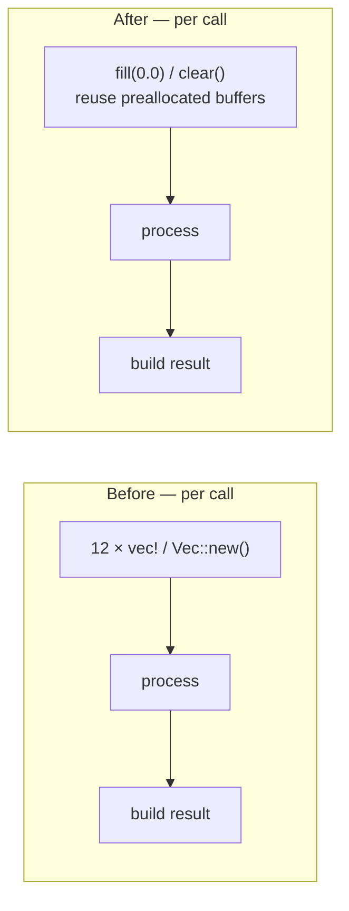

# [perf] Reuse buffers in `activate_and_trace_batch_4way`

## Summary

`activate_and_trace_batch_4way` previously allocated **12 fresh vectors on every
call** — 4 activation buffers, 4 hint buffers and 4 trace buffers. This extends
the buffer-reuse precedent established for the single-record path (#1173, which
added `hint_values_buffer` / `trace_data_buffer`) to the 4-way batch path.

The 12 scratch buffers are now stored on `CompiledNetwork` as `[Vec<f32>; 4]`
fields (`batch_activations`, `batch_hints`, `batch_traces`), pre-allocated in the
constructor and **reused** across calls. Each invocation resets the buffers to
the exact initial state a fresh allocation would have had — activations zeroed
then inputs re-copied, hints zeroed, traces cleared — so output is byte-identical
to the previous behaviour.

The method now takes `&mut self`, consistent with the other buffered methods
(`activate`, `activate_and_trace`). Per the `CompiledNetwork` struct doc, batch
scoring runs with each thread owning its own `CompiledNetwork`, so `&mut self` is
compatible with the threading model. The only non-test caller (the Criterion
bench) was updated to a `mut` binding; `pc_inference.rs` merely references the
method by name in a doc comment.

Closes #155.

## Allocation change

| Buffer set        | Before (per call)        | After (per call)              |
|-------------------|--------------------------|-------------------------------|
| activations (×4)  | `vec![0.0; num_neurons]` | `fill(0.0)` + re-copy inputs  |
| hints (×4)        | `vec![0.0; num_non_inputs]` | `fill(0.0)`                |
| traces (×4)       | `Vec::new()`             | `clear()`                     |

## Evidence — benchmark (Issue #152 harness)

Backend / CLI change — no UI to screenshot. Measured with the existing Criterion
harness: `cargo bench --bench hot_paths -- batched_scoring/trace_batch_4way`
(`--warm-up-time 1 --measurement-time 3`), same machine, before vs after.

| Network      | Before (median) | After (median) | Change        |
|--------------|-----------------|----------------|---------------|
| small_50     | 982.31 ns       | 846.45 ns      | **~13.8% faster** |
| medium_500   | 11.196 µs       | 10.985 µs      | ~1.9% faster  |
| large_5000   | 262.23 µs       | 262.41 µs      | unchanged (compute-bound) |

The win is largest on small networks, where the 12 eliminated allocations
dominate runtime. On large networks per-call compute dwarfs allocation, so the
result is unchanged (within noise) — i.e. no regression. The acceptance
criterion of reduced per-call allocation is met: 12 heap allocations are removed
from every invocation.

## Test Plan

- **New regression test** `neat-core/tests/network_activate_trace_batch.rs::test_batch_4way_buffer_reuse_no_state_leak`
  — calls the method twice (then a third time) on the **same** `&mut` network with
  different interleaved inputs, and asserts each output equals that of a fresh
  network for the same input. This fails if the reused buffers are not correctly
  reset between calls (state leak), and passes with the implementation.
- All existing batch parity tests (`test_batch_4way_matches_single_*`,
  `*_aggregate`, `*_constant_neuron`, `*_multi_layer`) continue to pass,
  confirming identical output (8/8 in the batch suite).
- `cargo test --workspace` — all green.
- `cargo fmt --all --check` and `cargo clippy --workspace --all-targets --all-features -- -D warnings` — clean.

> Note: `./quality.sh` reports 4 pre-existing `bats` failures (tests 31, 32, 33,
> 37) about `.github/workflows/ci.yml` / `bump-deps.sh`, which are unrelated to
> this change and also fail on the base branch (verified via `git stash`). No
> files under `.github/` or `bump-deps.sh` were touched. The Rust gates
> (fmt/clippy/check/test) all pass.

## Pre-PR Security Self-Check

- Input handling unchanged; the method reads the same `inputs` slice ranges as
  before. No new external input, SQL, shell, filesystem, or HTTP surface.
- No secrets or hidden files staged.
