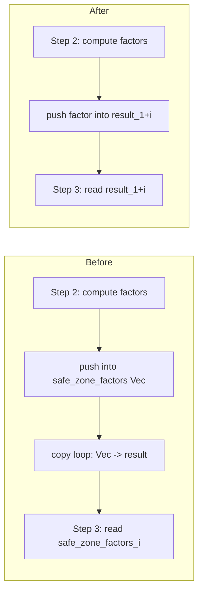

# [perf] Remove redundant intermediate allocation/copy in fused error distribution

## Summary

`apply_fused_error_distribution` (called per-neuron during backprop) built a
`safe_zone_factors: Vec<f32>` in Step 2, then copied it into `result` in a
**separate second loop** — a redundant allocation (`count` elements) plus a
full extra pass per neuron.

This change pushes each safe-zone factor **straight into `result`** as it is
computed, so the factors live at `result[1 .. 1 + count]`. The Step-3 scores
loop now reads each factor back from `result[1 + i]` instead of the removed
`safe_zone_factors` vec. This eliminates one `Vec<f32>` allocation and one copy
loop per call. The arithmetic is unchanged — only the read source moves — so
results are **numerically identical** (verified bit-for-bit by a new test).

The `scores` vector is kept as-is; it is genuinely needed for the two-pass
denominator normalisation.

Closes #156.

## Evidence

Backend/Rust change — no web interface to screenshot. Verified via the
Criterion `backprop` benchmark (#152) and the workspace test suite.

### Benchmark (`cargo bench --bench hot_paths -- backprop`)

Before vs after, same machine, Criterion baseline comparison
(`--save-baseline before` then `--baseline before`):

| Network        | Before (median) | After (median) | Change (time) |
|----------------|-----------------|----------------|---------------|
| `small_50`     | 11.568 µs       | 10.647 µs      | **−8.35 %**   |
| `medium_500`   | 150.25 µs       | 139.92 µs      | **−6.14 %**   |
| `large_5000`   | 2.1938 ms       | 2.0511 ms      | **−6.50 %**   |

All three sizes improved with `p < 0.05` ("Performance has improved"), matching
the issue's expectation of a small allocation/throughput win on the per-neuron
backprop path.

## Test Plan

- **Added** `neat-core/tests/fused_error.rs::test_fused_wide_neuron_layout_bit_for_bit`
  — a wide-neuron (6 inward synapses, mixed squash types) regression guard. It
  independently recomputes the entire expected output (error, all safe-zone
  factors, all proportional shares) using the public `apply_calculate_error` and
  `apply_safe_zone_adjustment` primitives, and asserts a **bit-for-bit** match
  against `apply_fused_error_distribution`. This catches any change to the stored
  or read-back factor values, not just an arithmetic regression.
- **Existing** fused-error tests (`test_fused_basic_identity`,
  `test_fused_zero_error`, `test_fused_empty_synapses`,
  `test_fused_single_synapse`) all still pass unchanged.
- `cargo test --workspace` — all 145+ tests pass.
- `cargo fmt --check` and `cargo clippy --workspace --all-targets -D warnings`
  pass clean.

### Pre-existing unrelated failures

`./quality.sh` reports 4 failing bats tests in
`tests/scripts/ci_workflow_quarantine.bats` (#31, #32, #33, #37 — about
`ci.yml`/`bump-deps.sh` wiring). These fail identically on the base branch
before this change (confirmed by stashing the change and re-running) and are
unrelated to the fused-error path. They are left untouched, per change-scope
guidance.
