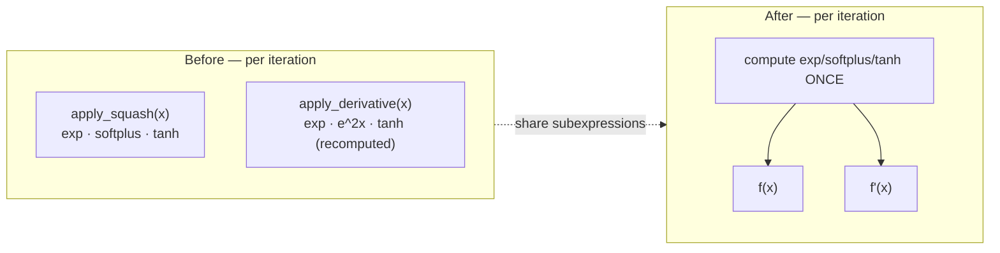

# [perf] Share f(x)/f'(x) subexpressions in Mish/Gelu Newton-Raphson unsquash

## Summary

`apply_unsquash` inverts the non-invertible Mish and Gelu activations with
Newton-Raphson iteration (up to 100 iterations). Previously each iteration
called `apply_squash` **and** `apply_derivative` as two independent full
evaluations, recomputing the same `exp`/`softplus`/`tanh` transcendentals
twice per step. The Swish branch already avoided this by deriving both `f(x)`
and `f'(x)` from shared intermediates computed once per iteration.

This change rewrites the Mish and Gelu loops to the same pattern — the shared
transcendentals are computed once and both `f` and `f'` are assembled from them,
removing the redundant second evaluation. Swish is left untouched as the
reference implementation.

- **Mish**: compute `exp_x = e^x`, `softplus = ln(1+e^x)`, `t = tanh(softplus)`
  once. Then `f(x) = x·t` and `f'(x) = t + x·(1−t²)·sigmoid(x)` where
  `sigmoid(x) = e^x/(1+e^x)` reuses `exp_x`. This is the analytically exact
  Mish derivative (`tanh(softplus) + x·sech²(softplus)·sigmoid`), and it
  collapses the previous two `exp` calls plus a separate `e^{2x}` in the old
  derivative path down to a single `exp` per iteration.
- **Gelu**: compute `inner = √(2/π)·(x + c·x³)` and `tanh(inner)` once, then
  assemble `f(x) = 0.5·x·(1+tanh(inner))` and `f'(x) = cdf + pdf` from the
  shared `inner`/`tanh(inner)` — matching the existing `apply_derivative`
  formula exactly but without recomputing the tanh.

Round-trip accuracy is preserved: the iteration's convergence test still keys
off the exact `f(x) − activation` error, so the recovered root is unchanged
within tolerance.

Closes #157.

## Evidence

Backend/CLI change — no UI to screenshot. Verified by the activation-primitive
benchmark (#152) and round-trip unit tests.

### Benchmark (`cargo bench -p neat-core --bench hot_paths`)

`squash/apply_unsquash`, criterion median of 100 samples, same machine,
`--save-baseline before` then `--baseline before`:

| Activation | Before  | After   | Change          |
|------------|---------|---------|-----------------|
| Mish       | ~353 ns | ~125 ns | **−67%**        |
| Gelu       | ~85 ns  | ~63 ns  | **−30%**        |
| Swish      | ~394 ns | ~404 ns | no change (control, untouched) |

Both targeted activations show a clear, statistically significant improvement
(`p < 0.05`); the untouched Swish control is within noise.

## Test Plan

- Added `neat-core/tests/unsquash.rs::test_unsquash_mish_roundtrip` — asserts
  `squash(unsquash(y)) ≈ y` (tolerance `1e-3`) across a spread of inputs,
  using the raw `x` as the Newton-Raphson hint to steer onto the correct branch.
- Added `neat-core/tests/unsquash.rs::test_unsquash_gelu_roundtrip` — same
  round-trip invariant for Gelu.
- Both tests pass against the original implementation (behaviour baseline) and
  the refactored implementation, guarding accuracy across the change.
- `cargo test --workspace` green; `cargo clippy -p neat-core --all-targets`
  clean; `./quality.sh` shows no new failures (the 4 pre-existing
  `ci_workflow_quarantine.bats` failures are unrelated to this change and also
  fail on the base commit).
