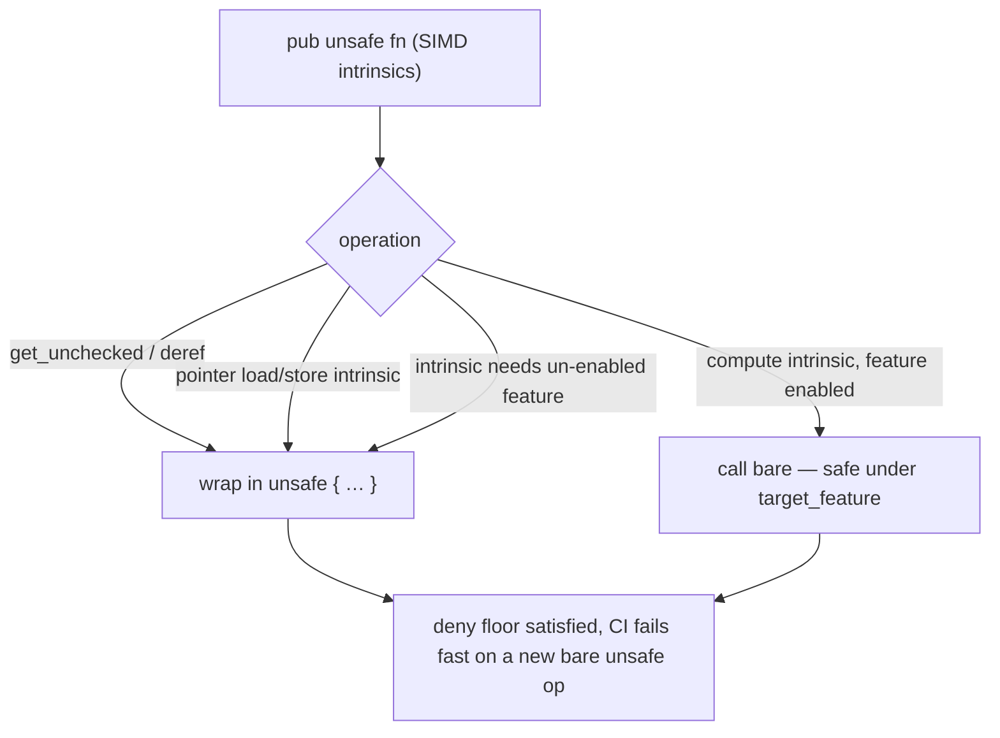

## Summary

Adopted the `unsafe_op_in_unsafe_fn` **deny floor** for the unsafe-heavy `neat-core`
crate, bringing it in line with the convention already established in
`NEAT-AI-Discovery`. Closes #165.

Two coordinated changes:

1. **Workspace lint floor** — added `[workspace.lints.rust] unsafe_op_in_unsafe_fn = "deny"`
   to the root `Cargo.toml`. `neat-core` already opts in via `[lints] workspace = true`,
   so the deny floor now applies crate-wide. CI (and a plain `cargo build`) fails fast
   if a contributor introduces a bare `unsafe` op inside an `unsafe fn`.
2. **Satisfied the lint in `src/simd_native.rs`** — removed the file-level
   `#![allow(unsafe_op_in_unsafe_fn)]` escape hatch that was silently suppressing the
   lint, and wrapped every genuinely-unsafe operation in the 10 `pub unsafe fn` SIMD
   intrinsics (AVX2/FMA on x86_64, NEON on aarch64) in an explicit `unsafe { … }` block.

### What needs `unsafe` (and what does not)

Within a `#[target_feature]` function, a pure compute intrinsic whose required feature
is already enabled is **safe to call** and must *not* be wrapped (doing so trips the
`unused_unsafe` lint). The operations that genuinely require an `unsafe { … }` block are:

- **`get_unchecked` indexing / its pointer derefs** — rely on the documented bounds
  invariant (always unsafe).
- **Pointer load/store intrinsics** — `vld1q_f32` / `vst1q_f32` (NEON),
  `_mm_storeu_ps` / `_mm256_storeu_ps` (x86) — dereference raw pointers.
- **Intrinsics needing a feature the fn does not enable** — e.g. `_mm256_fmadd_ps`
  (needs `fma`) inside the `avx2`-only `weighted_sum_simd_8records_avx2`.

This keeps each unsafe operation explicit and reviewable while staying lint-clean on
both architectures. The pre-existing `/// # Safety` docs already document the invariants
each block upholds.

## Evidence

Backend/library change with no web interface — verification is via the compiler and tests.

- **Deny floor is independently enforced** (not just via `-D warnings`): temporarily
  unwrapping one `get_unchecked` and running a plain `cargo build` (empty `RUSTFLAGS`)
  fails with `error[E0133] … requested on the command line with -D unsafe-op-in-unsafe-fn`.
  Restoring the wrap builds cleanly.
- **Both architectures lint-clean** under `cargo clippy --all-targets --all-features -- -D warnings`:
  - `aarch64-apple-darwin` — clean (host).
  - `x86_64-apple-darwin` — clean (cross-checked, since the `x86` module is `cfg`-gated
    and not compiled on the arm64 host).
- Workspace `cargo clippy`, `cargo check`, `cargo test`, and `RUSTDOCFLAGS="-D warnings" cargo doc`
  all pass.

## Test Plan

Added four behavioural ("what") tests in `neat-core/src/simd_native.rs` that exercise the
rewrapped single-record SIMD `unsafe fn` paths (one full 4-wide SIMD chunk + a 2-element
scalar tail) and assert numerical equivalence to the scalar reference within tolerance:

- `weighted_sum_simd_matches_scalar`
- `weighted_sum_no_bias_simd_matches_scalar`
- `weighted_sum_of_squares_simd_matches_scalar`
- `weighted_sum_of_squares_v2_simd_matches_scalar`

The existing multi-record tests (`native_8_matches_scalar_small`, `native_4_matches_scalar_small`)
continue to pass unchanged.

### Deno regression avoided

N/A — this is a Rust-only repository; no Deno or Node tooling was involved.
