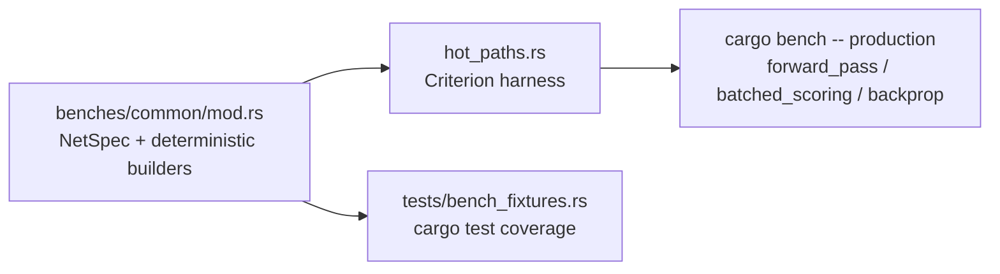

## Summary

Adds production-scale **wide/shallow** creature fixtures to the `hot_paths`
Criterion harness so #175's optimisations can be validated against the real
production topology, not just the dense synthetic nets. Closes #176.

The real production creature has a huge input layer (2461), a modest neuron
count (1673 non-input) and a sparse ~13 average fan-in (~21677 synapses). That
shape is **gather-bound** in a way the existing dense feedforward shapes are
not, so before/after deltas measured only on the synthetic shapes can be
misleading.

### What changed

- **New shapes** `production` and `production_2x` ("or larger creatures",
  ~2× neurons/synapses) wired into the `forward_pass`, `batched_scoring` and
  `backprop` groups. `cargo bench -p neat-core --bench hot_paths -- production`
  now reports every hot path at production scale.
- **Varied fan-in**: `build_network`/`build_backprop_data` take a `FanIn`
  policy. The synthetic shapes keep their exact `Fixed` fan-in (and consume no
  extra RNG draw, so their existing baselines are unchanged); the production
  shapes draw fan-in per neuron uniformly around the ~13 average so the gather
  pattern matches production sparsity.
- **No committed `network.json`** — the production shape is synthesised from the
  seeded PRNG to match the real dimensions; the harness stays deterministic.
- **Single source of truth**: the deterministic builders moved to
  `neat-core/benches/common/mod.rs`, reused verbatim by the harness *and* by a
  new integration test (`harness = false` benches can't host runnable tests, so
  this is how the builders get real `cargo test` coverage).
- README updated with the shape table and the `-- production` /
  `--save-baseline before` / `--baseline before` workflow.



## Evidence

Backend/bench-only change — no UI to screenshot.

### Acceptance criteria

- ✅ `cargo bench -p neat-core --bench hot_paths -- production` runs and reports
  `forward_pass`, `batched_scoring` and `backprop` at the `production` and
  `production_2x` shapes (see baseline below).
- ✅ README documents the new sizes and the baseline-comparison workflow.
- ✅ Harness remains deterministic (fixed seed) — asserted by the new tests.

### Initial baseline (indicative)

Captured with a quick sampling profile (`--warm-up-time 0.5 --measurement-time 2
--sample-size 20`) on the dev machine; absolute numbers are indicative, the
harness is the deliverable. Re-run with the default profile for committed
baselines.

| Benchmark | `production` (median) | `production_2x` (median) |
| --- | --- | --- |
| `forward_pass` | 23.4 µs | 58.5 µs |
| `batched_scoring/trace_batch_4way` | 107.0 µs | 209.6 µs |
| `batched_scoring/mse_sum_8records` | 211.1 µs | 347.1 µs |
| `backprop` | 76.5 µs | 178.8 µs |

Record a comparable baseline before an optimisation, then compare:

```bash
cargo bench -p neat-core --bench hot_paths -- production --save-baseline before
# ...apply optimisation...
cargo bench -p neat-core --bench hot_paths -- production --baseline before
```

## Test Plan

New integration test `neat-core/tests/bench_fixtures.rs` (runs under
`cargo test --workspace --lib --tests`), all "what" tests asserting observable
outcomes of the shared builders:

- `production_shapes_are_registered_with_expected_dimensions` — the production
  shapes match the documented dimensions and `production_2x` is ≥2× the neurons.
- `build_network_matches_production_neuron_and_synapse_counts` — neuron/synapse
  counts and an average fan-in within `12.0..=14.0`; per-neuron `num_synapses`
  sums to the flat synapse buffer.
- `varied_fan_in_actually_varies_unlike_fixed_shapes` — the production shape
  draws a non-constant fan-in, while a `Fixed` shape stays constant.
- `build_network_is_deterministic_for_a_fixed_seed` — identical synapses and
  neurons for the same seed.
- `production_network_activates_to_finite_outputs` — forward pass yields the
  right number of finite outputs.
- `backprop_data_has_consistent_inward_adjacency_at_production_scale` — inward
  counts sum to the synapse and index-list lengths; reverse topo order length.

Also verified: `cargo clippy --workspace --all-targets --all-features -- -D
warnings`, `cargo doc`, `codespell`, and `markdownlint-cli2` all clean.
