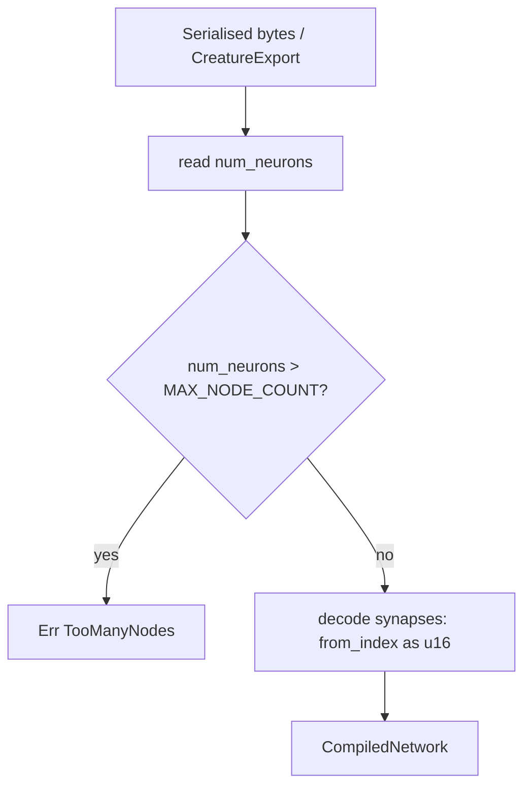

## Summary

Shrink `SynapseData` from **12 bytes to 8 bytes** to cut forward-pass memory
bandwidth. The forward pass is gather-bound — the whole synapse array is streamed
once per activation — so a smaller per-synapse record means less memory traffic
and better cache-line utilisation.

The change narrows `from_index` from `u32` to `u16` and drops the explicit
3-byte padding field. The on-wire format already stores `from_index` as a `u16`
(`u16::from_le_bytes(...)` in the decoder), so **no precision is lost** and
numeric outputs are unchanged. Every gather site (`synapse.from_index as usize`)
works unchanged because `u16 as usize` is identical at the call sites.

Because `from_index` is now a `u16`, a network may address at most
`u16::MAX + 1` (65536) nodes. This is captured as a documented `MAX_NODE_COUNT`
constant and enforced at load time:

- `CompiledNetwork::new` returns `NetworkError::TooManyNodes` for oversized
  serialised networks.
- `compile_creature` returns `CreatureError::TooManyNodes` for oversized
  creatures.

Closes #177.

### Layout: before vs after

```rust
// Before — 12 bytes (4 weight + 4 from_index + 1 type + 3 padding)
#[repr(C)]
pub struct SynapseData {
    pub weight: f32,
    pub from_index: u32,
    pub synapse_type: u8,
    pub _padding: [u8; 3],
}

// After — 8 bytes (4 weight + 2 from_index + 1 type + 1 trailing pad)
#[repr(C)]
pub struct SynapseData {
    pub weight: f32,
    pub from_index: u16,
    pub synapse_type: u8,
}
```

`repr(C)` keeps 4-byte alignment, so the SIMD weight loads stay aligned
(asserted by a test).

### Load-time invariant



## Evidence

Backend/library change — no web UI to screenshot. Evidence is the Criterion
benchmark delta plus the test suite.

### Benchmark results (`cargo bench -p neat-core --bench hot_paths`)

Measured with `--warm-up-time 1 --measurement-time 3 --sample-size 30`,
`--save-baseline before` (12-byte struct) then `--baseline before` (8-byte
struct). A new wide/shallow `production_4134` fixture (4134 nodes, mean fan-in
≈ 5 → ~20.6k synapses) mirrors the #175 production creature shape; no `.bin`
production fixture exists on this branch yet, so the shape is reproduced
deterministically in the harness.

| Benchmark | Change | Significant (p<0.05) |
|---|---|---|
| `forward_pass/production_4134` | **−2.05%** | ✅ |
| `forward_pass/large_5000` | **−3.44%** | ✅ |
| `forward_pass/medium_500` | **−3.42%** | ✅ |
| `forward_pass/small_50` | −0.14% | no (noise) |
| `batched_scoring/trace_batch_4way/large_5000` | **−6.92%** | ✅ |
| `batched_scoring/mse_sum_8records/medium_500` | **−5.60%** | ✅ |
| `batched_scoring/trace_batch_4way/small_50` | −1.25% | ✅ |

The gather-bound `forward_pass` path improves measurably and significantly
across the medium/large/production fixtures — the primary target of the issue.
The `batched_scoring` paths do more per-synapse work (squash, trace recording),
so memory bandwidth is a smaller fraction; their larger fixtures still show
significant wins (trace_batch_4way/large_5000 −6.9%) while a few small/noisy
cases land within measurement noise.

## Test Plan

New tests:

- `neat-core/src/network.rs`
  - `synapse_data_is_eight_bytes` — asserts `size_of::<SynapseData>() == 8` and
    `align_of == 4` (the observable footprint invariant this issue delivers).
  - `new_rejects_networks_exceeding_max_node_count` — header over `MAX_NODE_COUNT`
    yields `NetworkError::TooManyNodes`.
  - `new_accepts_max_node_count_boundary` — exactly `MAX_NODE_COUNT` nodes loads.
  - `new_preserves_high_source_index` — a `from_index` of 64000 round-trips
    through the loader without truncation.
- `neat-core/tests/creature_compile.rs`
  - `compile_creature_rejects_too_many_nodes` — oversized creature yields
    `CreatureError::TooManyNodes`.

Updated construction/helper sites to the 8-byte struct (no `_padding`, `u16`
`from_index`): `creature.rs`, `topology_export.rs`, `simd_native.rs` test
helper, the `hot_paths` bench, the `bench_single_record_weighted_sums` example,
and the `simd_weighted_sums` / `network_activate_trace_batch` integration tests.

Gate: `cargo test --workspace` (153 lib + integration tests pass), `cargo clippy
-D warnings`, `cargo fmt`, `cargo check`, `RUSTDOCFLAGS=-D warnings cargo doc`,
and `cargo build --release` all pass. Pre-existing, unrelated `tests/scripts`
bats failures about `ci.yml` invoking `cargo upgrade`/`bump-deps.sh` are not
touched by this change.
