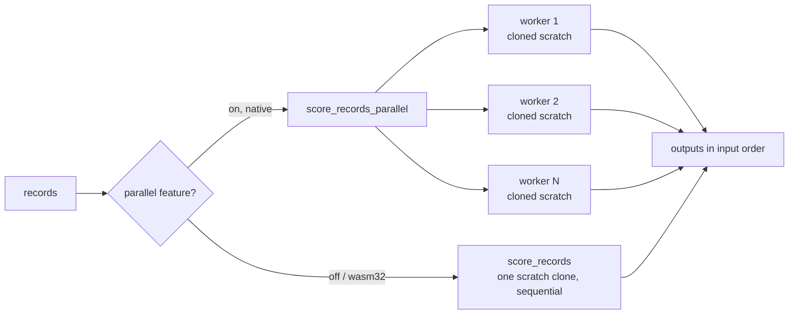

# Native, feature-gated data-parallel record scoring (rayon)

## Summary

Adds an **opt-in, native-only** data-parallel scoring path so a production-size
dataset can be pushed through one creature across all cores — the embarrassingly
parallel "data" half of #175. Scoring N records is independent per record, so it
scales near-linearly with core count and composes with the per-record
micro-optimisations from the sibling sub-issues. Closes #179.

What changed:

- **New `parallel` Cargo feature** (off by default) pulling in `rayon`. `rayon`
  is declared under a `cfg(not(target_arch = "wasm32"))` target table, and the
  parallel code is gated `#[cfg(all(feature = "parallel", not(target_arch =
  "wasm32")))]`, so the **default build and the `wasm32` build pull in no rayon
  symbols** and keep their single-thread path.
- **`CompiledNetwork::score_records_parallel(&self, records, num_outputs)`** —
  chunks records across the rayon pool via `par_iter().map_init(...)`. Each
  worker initialises **its own cloned scratch context** (the `Clone` carries
  `activations` / `hint_values_buffer` / the 4-way batch buffers), so no
  `&mut self` is shared across threads: immutable weights are read through
  `&self` while every worker owns its buffers. When the feature is off or on
  wasm, the method is a thin fallback to the sequential path.
- **`CompiledNetwork::score_records(&self, records, num_outputs)`** — the
  sequential reference (one scratch clone), used as the fallback and the parity
  baseline.
- **`parallel_scoring` Criterion bench** reporting records/sec at 1 vs all
  cores on the `production` / `production_2x` fixtures (#175/#176). No-op shim
  without the feature so the target builds on every configuration.

Determinism: every record is scored by the same `activate` used sequentially,
with no cross-record state, and `collect()` preserves input order — so results
are **identical** to the sequential path regardless of thread count (verified by
tests).

### Drive-by fix (required for a green build)

The milestone branch's bench fixtures (`benches/common/mod.rs` and
`benches/hot_paths.rs`) still constructed `SynapseData` with the pre-#177 layout
(`from_index: u32` + `_padding`), so `cargo check --tests` / `--all-targets`
failed to compile on the milestone branch before this PR. Updated both to the
current `from_index: u16` layout. This was necessary to build the
acceptance-criteria benchmark and to keep `quality.sh` green.

## Evidence (performance)

`cargo bench -p neat-core --features parallel --bench parallel_scoring`, scoring
2048 records, on a 12-core host (`nproc` = 12). Throughput is records/sec
(Criterion `thrpt`, median):

| Fixture | 1 core | 12 cores | Speed-up |
|---------|--------|----------|----------|
| `production` (4134 neurons, ~21.7k synapses) | 52.4 ms → **39.06 Kelem/s** | 7.18 ms → **285.4 Kelem/s** | **~7.3×** |
| `production_2x` (8268 neurons, ~43.5k synapses) | 111.3 ms → **18.40 Kelem/s** | 20.78 ms → **98.56 Kelem/s** | **~5.4×** |

Throughput scales with core count, satisfying the acceptance criterion. (Per
the Performance Task Workflow, the "before" is the 1-core measurement, which is
the existing single-threaded behaviour; the parallel path is the gain.)

Default + wasm builds unchanged:

- `cargo check -p neat-core --target wasm32-unknown-unknown` — clean.
- `cargo check -p neat-core --target wasm32-unknown-unknown --features parallel`
  — clean and **does not compile rayon** for wasm (target-gated dependency).
- `cargo deny check` — advisories / bans / licenses / sources all OK with rayon
  added.

## Test Plan

New `neat-core/tests/parallel_scoring.rs` (passes both default and
`--features parallel`, which `quality.sh` exercises via `--all-features`):

- `parallel_scoring_matches_sequential_on_production_fixture` — 257 records (not
  a multiple of any core count) on the production fixture, equal to an
  independent sequential reference.
- `parallel_scoring_matches_sequential_across_shapes` — parity across
  `small_50`, `medium_500`, `production`, `production_2x`.
- `output_order_is_preserved` — index-aligned against the reference with 200
  distinct records.
- `each_output_has_num_outputs_elements`, `single_record_matches_direct_activate`,
  `empty_records_yields_empty_output`, `score_records_matches_reference`.

Gates run green locally: `cargo clippy --workspace --all-targets --all-features
-- -D warnings`, `cargo test --workspace --lib --tests --all-features`,
`cargo doc`, release build, `cargo deny check`.

> Note: `quality.sh`'s `bats` suite has 4 **pre-existing** failures
> (`ci.yml ...bump-deps.sh`, tests 31/32/33/37) that exist on the clean
> milestone branch independent of this change and are unrelated to #179
> (they assert `ci.yml` wiring, untouched here).
