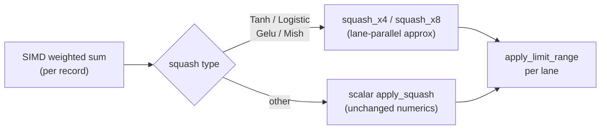

# [perf] Vectorise the activation (squash) function across batched records

## Summary

The batched activation paths produce one accumulated pre-activation **per
record** with the SIMD weighted-sum kernels, but then applied the squash **per
record with the scalar `apply_squash`**. For the hot transcendental squashes
(`Tanh`, `Logistic`, `Gelu`, `Mish`) that `libm` call dominates the per-neuron
cost on the wide/shallow production creature (~1673 non-input neurons, ~13
average fan-in).

This PR adds `neat-core/src/squash_simd.rs`: branchless, fixed-size-array
approximations of those four squashes that LLVM auto-vectorises (SSE/AVX/FMA on
`x86_64`, NEON on `aarch64`, `simd128` on `wasm32`) so all 4 (or 8) batch lanes
are evaluated at once. They are wired into both batched paths:

- `CompiledNetwork::activate_and_trace_batch_4way` (`network.rs`)
- the 8-record / 4-record loss path (`loss.rs`)

Every vectorised type is bounded within `5e-6` (tighter than the `1e-5` the
existing batch-parity tests already assert) of the scalar `apply_squash`. Squash
types **without** a vectorised approximation return `None`, so the caller keeps
the existing scalar path and their numerics are unchanged. Scalar `apply_squash`
remains the single source of truth for correctness.

No hand-written platform intrinsics or `unsafe` are introduced — the kernels are
plain branchless `f32` arithmetic over `[f32; N]` arrays, which the optimiser
vectorises and which also compiles for `wasm32`.

Closes #180.

## Evidence (performance)

Backend/CLI change — no UI. Measured with the repo's Criterion harness on
`aarch64` via `--save-baseline before` / `--baseline`.

### Production fixtures — `batched_scoring`

| Benchmark | Before | After | Change |
|---|---|---|---|
| `trace_batch_4way/production` | ~48.7 µs | ~34.0 µs | **−31%** |
| `trace_batch_4way/production_2x` | ~133 µs | ~79 µs | **−42%** |
| `mse_sum_8records/production` | ~83.3 µs | ~77.3 µs | −7% to −11% |
| `mse_sum_8records/production_2x` | ~335 µs | ~330 µs | ~noise |

The 4-way traced activation path (the direct target) improves ~30–42%
reproducibly. The 8-record MSE loss path is more memory-bound — the squash is a
smaller fraction there — so its gain is smaller and `production_2x` sits inside
run-to-run noise (that fixture already reported ~13% high-severe outliers at
baseline).

### Per-call squash speedup — `squash_x4` (4 lanes)

| Squash | Scalar ×4 | SIMD `squash_x4` | Speedup |
|---|---|---|---|
| Tanh | 6.25 ns | 1.98 ns | 3.2× |
| Logistic | 4.83 ns | 2.39 ns | 2.0× |
| Gelu | 8.11 ns | 2.56 ns | 3.2× |
| Mish | 19.07 ns | 3.04 ns | 6.3× |

## Test Plan

New range/property tests in `neat-core/src/squash_simd.rs` (assert the bounded
error vs scalar `apply_squash`, the acceptance criterion):

- `tanh_within_tolerance_over_range`, `logistic_within_tolerance_over_range`,
  `gelu_within_tolerance_over_range`, `mish_within_tolerance_over_range` — sweep
  the finite input range and assert max abs error ≤ `SQUASH_SIMD_MAX_ABS_ERR`.
- `all_four_lanes_match_scalar`, `x8_matches_x4` — each lane reproduces its own
  scalar squash for the 4- and 8-lane entry points.
- `non_vectorised_types_opt_out` — non-transcendental types return `None` (caller
  falls back to scalar, unchanged numerics).
- `extreme_inputs_are_finite` — saturating/overflow-prone inputs stay finite (no
  NaN/Inf from the `exp`/ratio reconstruction).

Existing batch-parity tests continue to pass unchanged, confirming the
vectorised path stays within the established `1e-5` tolerance of the
single-record scalar path:

- `network.rs::test_batch_4way_matches_single_tanh_logistic`
- full `cargo test --workspace --lib --tests` green.

Benchmark additions: a `squash_x4` Criterion group (scalar ×4 vs `simd_x4`) for
the four vectorised types, alongside the existing `batched_scoring` production
fixtures used for the before/after comparison above.
