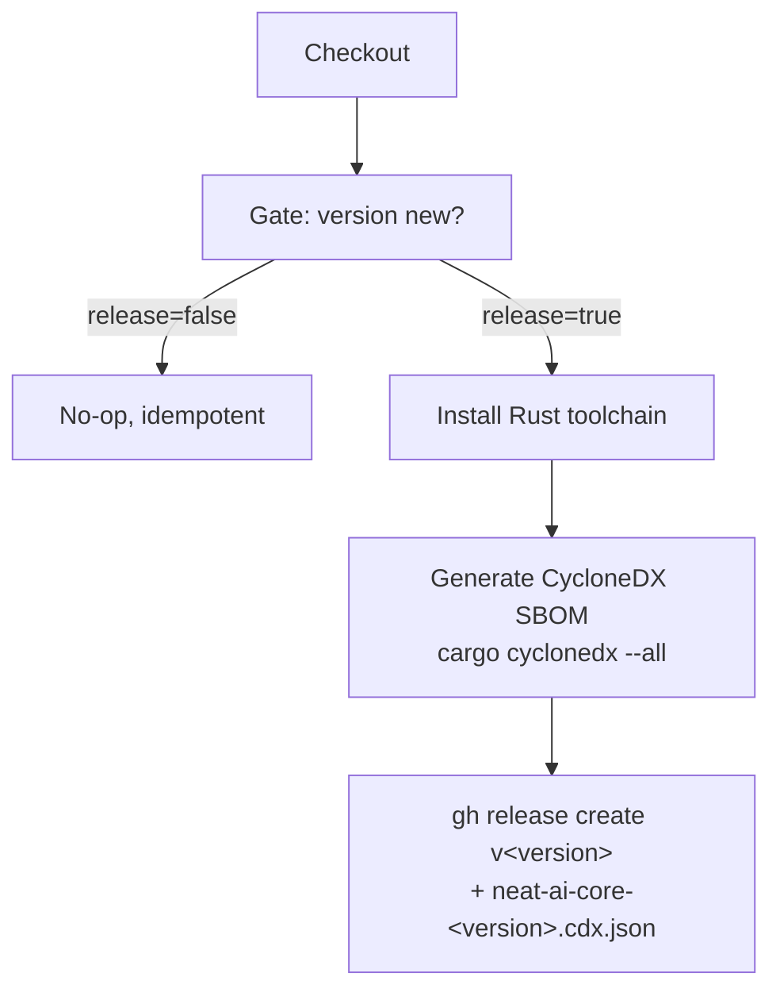

# SCR-SBOM: ship a CycloneDX SBOM with the semver release

## Summary

`release.yml` cuts a `v<version>` git tag + GitHub release on a workspace
version bump but attached **no** Software Bill of Materials, so a downstream
consumer holding only a published release could not answer "is the affected
crate, at the affected version, inside *this* release?" without rebuilding from
source and re-resolving `Cargo.lock`. The complementary per-commit
`wasm_activation` bundle already ships a CycloneDX SBOM (Issue #125); this PR
closes the other half by generating and publishing an SBOM next to the semver
release too.

The build-provenance attestation (Issue #122) records *who built* an artefact;
this SBOM records *what went into* it — turning incident response from a
rebuild into a lookup.

Changes to `.github/workflows/release.yml`:

1. The single release step is split so an idempotency **gate** step decides
   whether the version needs a release (unchanged tag/release short-circuit
   logic, now exposed as a `release` step output).
2. When a release is due, a SHA-pinned `dtolnay/rust-toolchain@stable` is
   installed and a CycloneDX SBOM is generated from the locked dependency graph
   with `cargo install cargo-cyclonedx --version 0.5.7 --locked` then
   `cargo cyclonedx --format json --all`. The pinning + `--locked` discipline
   mirrors `wasm-pack` (Issue #78) and the wasm-bundle SBOM (Issue #125).
3. The resulting `neat-ai-core-<version>.cdx.json` is uploaded as a release
   asset via `gh release create`.

Step outputs are bound to `env:` before use in `run:` blocks (no direct
`${{ ... }}` interpolation into shell), keeping the workflow within the
existing script-injection discipline.

Closes #197.

## Evidence

This is a CI-only change with no web interface to screenshot. It is verified by
`tests/scripts/release_sbom.bats` (added) and the existing workflow-hygiene
suites (`workflow_sha_pinning.bats`, `workflow_script_injection.bats`), plus
`actionlint`.

Release-job step flow after this change:



Test run (new suite + hygiene suites):

```
ok 1 release workflow file exists
ok 2 release workflow is valid YAML
ok 3 release job has a step that generates a CycloneDX SBOM
ok 4 cargo-cyclonedx install is version-pinned for supply-chain hygiene
ok 5 SBOM is published as a Release asset (.cdx.json)
ok 6 SBOM is generated before the Release is published
ok 7 every action in every workflow is pinned to a 40-char commit SHA
... (workflow_sha_pinning + workflow_script_injection all pass)
```

`actionlint .github/workflows/release.yml` passes cleanly.

> Note: 4 pre-existing `ci_workflow_quarantine.bats` failures are present on the
> base branch (`Develop`) and are unrelated to this change — `ci.yml` is not
> touched here.

## Test Plan

- Added `tests/scripts/release_sbom.bats` — "what" tests that parse
  `release.yml` and assert: a step invokes `cargo cyclonedx`; the
  `cargo-cyclonedx` install is `--version`-pinned and `--locked`; a `.cdx.json`
  asset is handed to `gh release create`; and the SBOM is generated before the
  release is published. The suite failed against the unmodified workflow
  (tests 3–6 red) and passes after the change.
- Re-ran the existing `wasm_bundle_sbom.bats`, `workflow_sha_pinning.bats`, and
  `workflow_script_injection.bats` suites to confirm no regression.
