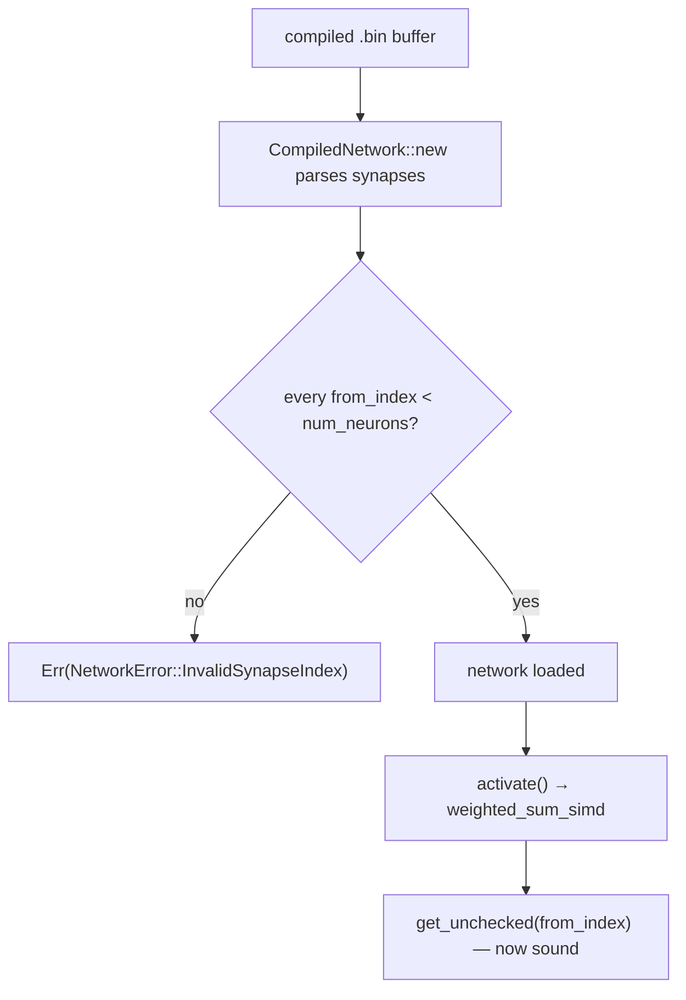

# Fix: validate synapse `from_index` at load time (Issue #207)

## Summary

`CompiledNetwork::new` deserialised each synapse's `from_index` (`u16`) straight
from the input bytes without ever checking it was a valid neuron index. During
the forward pass the native SIMD kernels read the activation buffer (sized to
exactly `num_neurons`) with **unchecked** indexing (`get_unchecked`) keyed on
that `from_index`. A malformed or corrupted compiled-network buffer declaring a
synapse with `from_index >= num_neurons` therefore caused an out-of-bounds read
— undefined behaviour (heap information disclosure or a fault) on every
`activate()` / `activate_into()` call.

The fix validates the invariant **once, at deserialisation time**. After the
parse loop, `CompiledNetwork::new` now returns a new typed error
`NetworkError::InvalidSynapseIndex { from_index, num_neurons }` if any synapse
references an index outside `0..num_neurons`. A network that loads successfully
is guaranteed to have every `from_index` in range, so the existing
`get_unchecked` calls become sound and the hot path is unchanged. The
index-validity precondition is now documented in each affected kernel's
`# Safety` / `// SAFETY:` block and in the `weighted_sum_simd` dispatcher.

Closes #207.

## Evidence

Backend/library change only — no web interface to screenshot. Verified via the
Rust test suite and the full local quality gate (fmt, clippy `-D warnings`,
tests, doc all clean). The four failing checks in `quality.sh` are pre-existing
`bats` tests asserting `ci.yml` invokes `bump-deps.sh` — unrelated files this PR
does not touch.

## Test Plan

Added `neat-core/src/network.rs` unit tests (Issue #207 block):

- `new_rejects_out_of_range_from_index` — `from_index == num_neurons` (first
  out-of-bounds value) is rejected with `InvalidSynapseIndex` carrying the
  offending index and node count.
- `new_rejects_far_out_of_range_from_index` — `from_index == u16::MAX` (top of
  the attacker-controllable range) is rejected.
- `new_accepts_max_valid_from_index` — the largest in-range index
  (`num_neurons - 1`) still loads, proving the guard rejects only genuinely
  out-of-bounds indices.
- `activate_is_bounded_for_loaded_network` — a successfully loaded network runs
  a full forward pass with a finite result, confirming no out-of-bounds access.

All new tests fail to compile against the unfixed code (the
`InvalidSynapseIndex` variant does not exist) and pass after the fix. Existing
loader tests (`new_rejects_networks_exceeding_max_node_count`,
`new_preserves_high_source_index`, etc.) remain green.

## Security self-check

- **Input validation**: the deserialiser now validates every source index
  before the network can be activated — the core of this fix.
- **Injection / secrets / auth**: not applicable; no new external surface,
  secrets, or endpoints.
- **Error handling**: returns a typed, non-leaking `NetworkError`; no internal
  state exposed.
