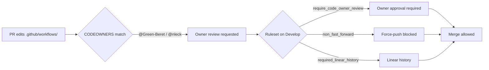

# Add CODEOWNERS coverage + code-owner-review branch protection (Issue #208)

## Summary

The repository shipped **no `CODEOWNERS`** in any of the three GitHub-recognised
locations, yet runs **privileged workflows**:

- `.github/workflows/wasm-bundle.yml` — `id-token: write` (OIDC keyless Sigstore signing)
- `.github/workflows/ci.yml`, `upgrade-dependencies.yml` — `secrets.ACTIONS_PUSH` (PAT, `contents:write`)
- `.github/workflows/semgrep.yml` — `secrets.SEMGREP_APP_TOKEN`

Without owner review on those paths, a pull request can quietly edit a workflow
that runs with those secrets / the OIDC token and merge — the exact path used to
exfiltrate secrets or mint a signed artefact.

This PR closes the static gap and codifies the branch-protection controls:

1. **`.github/CODEOWNERS`** requires a designated owner to review
   `.github/workflows/`, `.github/actions/`, `.github/rulesets/`, and the
   `CODEOWNERS` file itself.
2. **`.github/rulesets/develop.json`** is a settings-as-code mirror of the live
   default-branch ruleset with `require_code_owner_review: true` and a
   `non_fast_forward` (force-push block) added — the two controls the issue
   asks for. A repo admin applies it (it is not auto-applied).
3. **`SECURITY.md`** gains a *Review governance* section documenting both
   controls and the admin apply-step.

Closes #208.

### Owner choice — concrete accounts, not a placeholder team

The issue suggested `@stSoftwareAU/maintainers`. That team **does not exist**,
and — verified via the org API — **no team holds write access to this repo**
(the `developers` team reaches `NEAT-AI` and `NEAT-AI-Explore` but not
`NEAT-AI-core`). A CODEOWNERS entry naming a non-existent team, or a team
without repo write access, is an **invalid owner** that GitHub silently ignores
— the control would look present but never enforce. The rules therefore name
the two confirmed repo admins (`@Green-Beret`, `@nleck`), excluding the
`stservice` bot so it cannot self-approve. A code comment records how to swap to
a team once one exists and is granted write access.

### Branch protection — settings-as-code, admin applies

The live ruleset on `Develop` (id `15236989`, observed via the API) **already**
requires 1 approving review, required status checks, linear history, and blocks
deletions — but `require_code_owner_review` is **off** and force-pushes are
**not** blocked. `develop.json` mirrors that ruleset and flips exactly those two
gaps. Editing the file does not change the live ruleset: a repo admin must `PUT`
it to `/repos/stSoftwareAU/NEAT-AI-core/rulesets/15236989` (or apply via
*Settings → Rules → Rulesets*). Required **signed commits** is deliberately not
enabled — the `Auto-format Code` / `Auto-increment Versions` CI jobs push
unsigned commits with the `ACTIONS_PUSH` PAT and a signed-commit rule would
reject them.

## Evidence

Backend/CI-config change — no web UI to screenshot. Verified via the bats
suites (all green under `./quality.sh`). Review-gate flow:

## Test Plan

- `tests/scripts/codeowners_coverage.bats` (CODEOWNERS coverage):
  - CODEOWNERS exists in a GitHub-recognised location.
  - `.github/workflows/` and `.github/actions/` are covered with an owner.
  - No rule may be ownerless.
  - Owners are not the non-existent `@stSoftwareAU/maintainers` placeholder.
- `tests/scripts/branch_protection_ruleset.bats` (settings-as-code ruleset):
  - The ruleset is valid JSON, targets the default branch, and is `active`.
  - It requires code-owner review + ≥1 approval.
  - It blocks force-pushes (`non_fast_forward`) and requires linear history.
  - It does **not** require signed commits (would reject CI bot pushes).

### Pre-existing unrelated failures

`./quality.sh` reports 4 failures in `tests/scripts/ci_workflow_quarantine.bats`
(tests concerning `ci.yml` invoking `bump-deps.sh`, tests 43–45, 49). These fail
on a clean `origin/Develop` checkout **before** this change and are unrelated to
issue #208 — this PR does not touch `ci.yml`. Left out of scope.
