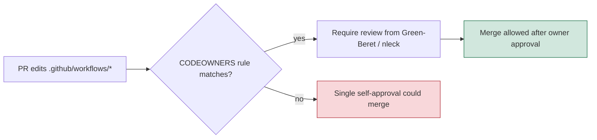

# Add CODEOWNERS coverage for privileged CI paths (Issue #208)

## Summary

The repository shipped **no `CODEOWNERS`** in any of the three GitHub-recognised
locations, yet runs **privileged workflows**:

- `.github/workflows/wasm-bundle.yml` — `id-token: write` (OIDC keyless Sigstore signing)
- `.github/workflows/ci.yml`, `upgrade-dependencies.yml` — `secrets.ACTIONS_PUSH` (PAT, `contents:write`)
- `.github/workflows/semgrep.yml` — `secrets.SEMGREP_APP_TOKEN`

Without owner review on those paths, a pull request can quietly edit a workflow
that runs with those secrets / the OIDC token and merge on a single
self-approval — the exact path used to exfiltrate secrets or mint a signed
artefact.

This PR adds `.github/CODEOWNERS` requiring a designated owner to review
`.github/workflows/`, `.github/actions/`, and the `CODEOWNERS` file itself, plus
a bats test that keeps the coverage from regressing.

**Closes #208.**

### Owner choice — concrete accounts, not a placeholder team

The issue suggested `@stSoftwareAU/maintainers`. That team **does not exist** in
the org (`ai-users`, `developers`, `service`, `support`, `system-admin`,
`vibe-coders` are the only teams), and **no team holds explicit write access to
this repo**. A CODEOWNERS entry naming a non-existent team, or a team without
repo write access, is an **invalid owner** that GitHub silently ignores — the
security control would look present but never enforce. The rules therefore name
the two org members who are confirmed repo admins (`@Green-Beret`, `@nleck`),
excluding the `stservice` bot account so it cannot self-approve. A code comment
records how to swap to a team once one exists and is granted write access.

## Change flow



> Note: CODEOWNERS only **enforces** review once the default branch enables
> "Require review from Code Owners" — see below.

## Branch protection (recommendation — requires a human/admin decision)

The issue also asks to enable required-review branch protection. This is a
repository **settings** change, not a file, and it directly affects the
automated CI push bots (`ACTIONS_PUSH` pushes version bumps / rustfmt fixups to
`Develop`). Enabling required reviews without accommodating those bots would
break the release automation, so this is left as an explicit recommendation for
a human admin rather than flipped autonomously.

Current protection on `Develop` (observed via the API): force-pushes and
deletions are already blocked and required status checks (`gitleaks`, `semgrep`,
`markdownlint`) are strict, but there are **no required pull-request reviews**
and required signatures are off. Recommended additions:

- Require at least **1 approving review** before merge.
- Enable **"Require review from Code Owners"** (activates this CODEOWNERS file).
- Consider **required signed commits** and **linear history** to match the
  rebase/squash workflow.

## Evidence

Backend/CI-config change — no web UI to screenshot. Verified via the test
suite. The new bats test is **red before** the file exists and **green after**:

```
ok 1 a CODEOWNERS file exists in a GitHub-recognised location
ok 2 CODEOWNERS covers .github/workflows/ with an owner
ok 3 CODEOWNERS covers .github/actions/ with an owner
ok 4 every CODEOWNERS rule names at least one owner
ok 5 owners are concrete accounts, not the unresolved placeholder team
```

Full `tests/scripts` bats suite: the CODEOWNERS tests (and the whole
workflow-security suite) pass. Four pre-existing failures in
`ci_workflow_quarantine.bats` (`ci.yml` calls `cargo upgrade`/`cargo update`
directly, tests 43–45, 49) are **unrelated to this change** — this PR adds only
two files and does not touch `ci.yml`. They originate from commit `11ba77d`
(#190) and are out of scope for issue #208.

## Test Plan

- Added `tests/scripts/codeowners_coverage.bats`:
  - CODEOWNERS exists in a GitHub-recognised location (happy path).
  - Coverage of `.github/workflows/` with an owner (primary requirement).
  - Coverage of `.github/actions/` with an owner.
  - No rule may be ownerless (edge case / regression guard).
  - Owners must not be the non-existent `@stSoftwareAU/maintainers` placeholder
    (regression guard against an unenforceable entry).
- Confirmed the suite fails before `.github/CODEOWNERS` is added and passes
  after (TDD red → green).
