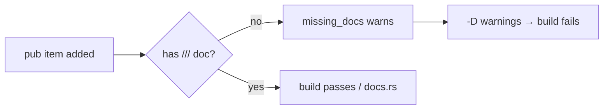

## Summary

Enabled the `missing_docs` Rust lint on the workspace and documented the
remaining undocumented public API items in `neat-core`, so the crate's public
surface stays fully documented on docs.rs and CI catches new gaps. Closes #209.

The lint is added to `[workspace.lints.rust]` as `missing_docs = "warn"`; because
`quality.sh` (and CI) build with `RUSTFLAGS="-D warnings"` and docs with
`RUSTDOCFLAGS="-D warnings"`, an undocumented `pub` item now fails the build.

Enabling the lint surfaced the *actual* undocumented items (the line numbers in
the issue were stale — the listed `network.rs`/`creature.rs`/`accumulate.rs`
items already carry `///` docs). The real gaps were:

- `neat-core/src/squash.rs` — all 38 `SquashType` activation-function variants.
- `neat-core/src/propagate_codec.rs` — the 11 public fields of `DecodedPropagate`.
- `neat-core/src/training_data.rs` — the struct/variant fields of
  `TrainingDataError` (`InvalidFileSize`, `InvalidConfig`).

Each item received a concise one-line `///` summary. Per the Rust API Guidelines
(C-EXAMPLE), a runnable `# Examples` doctest was added to the public
`apply_squash` function.

The lint is set to `"warn"` (rather than `"deny"`) so the value applies via the
`-D warnings` gate today while leaving room to promote it to `"deny"` in the lint
table once the surface is proven stable — matching the issue's suggested rollout.

## Evidence

Backend/library-only change — no web interface to screenshot. Verified via the
Rust toolchain:

- `cargo check --workspace --all-targets --all-features` with `RUSTFLAGS="-D warnings"`:
  **0** `missing documentation` errors (was 53 before the docs were added).
- `cargo clippy --workspace --all-targets --all-features -- -D warnings`: clean.
- `RUSTDOCFLAGS="-D warnings" cargo doc --workspace --no-deps`: builds cleanly.
- `cargo test --doc --workspace`: 2 passed (includes the new `apply_squash` doctest).
- `cargo test --workspace --lib --tests --all-features`: all existing tests pass.

Note: `quality.sh` also runs a `tests/scripts` bats suite that has **4
pre-existing failures** about `ci.yml`/`bump-deps.sh` (`not ok 43/44/45/49`).
These reproduce on the untouched base branch (`git stash` → `bats tests/scripts`)
and are unrelated to this documentation/lint change, which touches no workflow or
shell files.

## Test Plan

- Added `apply_squash` `# Examples` doctest in `neat-core/src/squash.rs`,
  asserting ReLU maps negatives to `0.0`, passes positives through, and Identity
  returns the input unchanged — run by `cargo test --doc`.
- The `missing_docs` lint itself is the regression guard: with `-D warnings`, any
  future undocumented `pub` item fails `cargo check`/`cargo doc` in CI.
- Re-ran the full Rust gate (build, clippy, check, lib/integration tests,
  doctests, doc) — all green.
