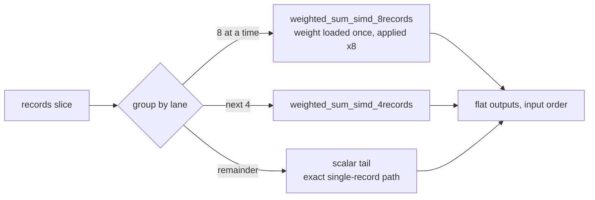

# [#227] Score records through the 8-record batched SIMD path

## Summary

Route record scoring through the existing **8-record batched SIMD path** so the
synapse gather + weighted-sum is amortised across 8 records instead of one at a
time. The production topology is *wide, shallow, sparse, varied fan-in* —
gather-bound — where the single-record forward pass re-reads each synapse's
weight and metadata once **per record**. Batching loads each weight once and
applies it across 8 (then 4) records via `weighted_sum_simd_8records` /
`weighted_sum_simd_4records`, cutting gather traffic on the dominant
standard-squash neurons.

New module `neat-core/src/batch_scoring.rs` adds `CompiledNetwork::score_batch_into`
plus a reusable `BatchScratch` (eight lane buffers). Both `score_records` and
`score_records_parallel` now drive this batched forward pass; the parallel path
splits records into fixed 64-record chunks (a multiple of the SIMD batch) so each
rayon worker owns its own scratch and every record lands on the same primitive
either way. Public signatures, the flat output layout, and the single output
allocation (Issue #229) are unchanged.

**Closes #230.**

### Numerics

- **Squash** uses the exact scalar inline branch of `activate_into` (Identity /
  ReLU / Logistic / Tanh, else `apply_squash`) — no vectorised approximation —
  so the squash itself is bit-identical.
- **Standard-squash** neurons sum *across records* rather than across synapses,
  re-associating the `f32` accumulation. Results therefore match the per-record
  reference **within tolerance** (~1e-6 observed, `TOL = 1e-3`), not bit-for-bit
  — the acceptance criteria explicitly allow SIMD reordering / `f32`
  accumulation differences.
- **Aggregate** squashes (Min/Max/If/Hypotenuse/HypotenuseV2/Mean) and the
  **scalar tail** run the exact single-record path, so those neurons and those
  records are bit-identical to the reference.
- **Sequential and parallel paths agree bit-for-bit** (each record's result is
  independent of its batch-mates, and the chunk size is a multiple of the SIMD
  batch).

## Evidence

Backend/CLI change — no web interface to screenshot. Verified by benchmarks and
the extended lane-parity test suite.

### Benchmark (performance gate: merge only on ≥5% gain)

`cargo bench -p neat-core --features parallel --bench parallel_scoring`
(`--warm-up-time 1 --measurement-time 3 --sample-size 20`), Apple Silicon,
2048 records/batch. Baseline = #227 `HEAD` (per-record `activate_into`); After =
this branch.

| Bench | Baseline | After | Change |
|-------|---------:|------:|-------:|
| `score_records/production/1_core` | 47.55 ms | 28.85 ms | **−39.3%** |
| `score_records/production/10_cores` | 9.19 ms | 6.34 ms | **−32.1%** |
| `score_records/production_2x/1_core` | 100.71 ms | 78.53 ms | **−22.0%** |
| `score_records/production_2x/10_cores` | 18.97 ms | 15.96 ms | **−16.8%** |

All four measurements clear the ≥5% gate; Criterion's own change detection
reports `Performance has improved` (p < 0.05) on every one. The single-core
numbers isolate the forward-pass lever (no rayon noise): scoring the gather-bound
production creature is **~39% faster** per core.

## Test Plan

Extended `neat-core/tests/parallel_scoring.rs`:

- Added `TOL` + `assert_close` and relaxed the four per-record-reference parity
  tests (`parallel_scoring_matches_sequential_on_production_fixture`,
  `parallel_scoring_matches_sequential_across_shapes`,
  `score_records_matches_reference`, `output_order_is_preserved`) to the agreed
  float tolerance where `f32` re-association requires it. `single_record_matches_direct_activate`
  and `empty_records_yields_empty_output` stay **exact** (scalar/degenerate paths).
- Added `tail_boundary_record_counts_match_reference` exercising counts
  `0,1,2,3,4,5,7,8,9,12,15,16,17,24,31,33` — straddling every 8/4/scalar
  boundary — asserting both exact output **length** (no record dropped or
  duplicated) and per-record parity within tolerance.
- Added `sequential_and_parallel_are_bit_identical` (counts 7,8,9,65,130,257
  across three shapes) proving the two paths agree bit-for-bit.
- `neat-core/tests/simd_weighted_sums.rs` and `network_activate_trace_batch.rs`
  (unchanged) continue to guard the underlying SIMD primitives.

Updated `neat-core/tests/scoring_allocations.rs` doc comments to describe the
batched path (behaviour it directly tests); the no-per-record-allocation
invariant still holds (one output buffer + one lane-scratch set, constant in
record count).

Full local gate green: `cargo fmt --check`, `cargo clippy --workspace
--all-targets --all-features -D warnings`, `cargo test --workspace --lib --tests
--all-features`, `cargo doc -D warnings`, `cargo build --release`, `cargo deny
check`. Also verified the default (no-`parallel`) build and its
`score_records_parallel` fallback.
