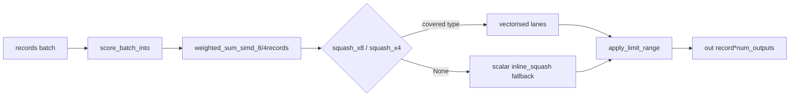

# PR Summary — Issue #243

## Summary

Wire the batched **scoring** hot path through the vectorised squash
approximations, and broaden `squash_simd` coverage to the high-frequency
production squash types that were still scalar. **Closes #243.**

Production flamegraphs (NEAT-AI-scorer#296) showed `mse_sum_batch_packed` and
the libm transcendental mix dominating evolution wall-clock, yet the #230
scoring path (`score_batch_into` → `score_records` / `score_records_parallel`)
still applied the squash **scalar, per lane** — so it never used the SIMD squash
work #180 already paid for.

Two changes:

1. **`CompiledNetwork::score_batch_into`** now feeds its 8- and 4-record lane
   sums through `squash_x8` / `squash_x4` (falling back to the scalar inline
   squash for uncovered types), exactly the way `mse_sum_batch_packed` does.
2. **`squash_simd`** gains branchless, auto-vectorisable lane implementations for
   the production mix that was still scalar:
   - *Cheap / algebraic (exact f32):* `Absolute`, `HardTanh`, `Relu6`,
     `LeakyRelu`, `Bipolar`, `Softsign`, `BentIdentity`, `Isru`.
   - *Transcendental (approximation reusing the existing `exp` / new `sin` /
     `atan` cores):* `Gaussian`, `Swish`, `BipolarSigmoid`, `Elu`, `Selu`,
     `Sine`, `Cosine`, `ArcTan`.

Scalar `apply_squash` stays the correctness oracle: every added type is bounded
within `SQUASH_SIMD_MAX_ABS_ERR` (5e-6) of it, asserted by range-sweep tests
(same pattern the hot transcendentals already use). Uncovered types (e.g.
`Identity`, `Relu`, `Softplus`, `Square`, `Cube`, aggregates) still return `None`
and keep bit-identical scalar numerics.

## Evidence

### Benchmarks (performance gate)

**Host:** Apple Silicon (GRQ-23, GRQ class), quiet machine, interleaved A/B via
Criterion `--save-baseline before` / `--baseline before`.

```bash
cargo bench -p neat-core --bench hot_paths -- --save-baseline before 'production'
# … change …
cargo bench -p neat-core --bench hot_paths -- --baseline before 'scoring/production'
```

| Benchmark | Before | After | Change | CIs |
|---|---:|---:|---:|---|
| `scoring/production` | 59.94 ms | 36.91 ms | **−38.4 %** (thrpt +62 %) | non-overlapping, p < 0.05 |
| `scoring/production_2x` | 155.0 ms | 86.83 ms | **−44.0 %** (thrpt +79 %) | non-overlapping, p < 0.05 |

Both clear the **≥ 5 %** merge gate on `scoring/production` decisively with
non-overlapping confidence intervals. The `scoring` benches build an all-`Tanh`
production creature, so the win is the direct result of routing the squash
through `squash_x8` instead of eight scalar `tanhf` calls per neuron.

> Note: `forward_pass/*` is the single-record path (`activate_into`), which this
> change does not touch; its numbers are unchanged bar measurement noise.

### Data flow



### Correctness

Backend/CLI change — no web UI to screenshot. Verified via tests:

- `neat-core/tests/score_squash_simd_parity.rs` (new): scores distinct-per-record
  batches through the public `score_records` and asserts parity with the scalar
  per-record `activate` reference across every batch boundary (8-block, 4-block,
  tail) for all 20 vectorised types **and** representative scalar-fallback types.
- `squash_simd` range tests: each added type is swept over its realistic finite
  window and asserted within `SQUASH_SIMD_MAX_ABS_ERR` of scalar `apply_squash`.
- Existing `tests/parallel_scoring.rs` (incl. `--features parallel`) and
  `tests/mse_squash_simd_parity.rs` stay green — the scoring/loss parity within
  the agreed f32/SIMD tolerance (#227/#230) is preserved.

`cargo fmt --check` and `cargo clippy --all-targets` are clean. `./quality.sh`
has 4 pre-existing failures (tests 48–54, all about `ci.yml`/`bump-deps.sh`
quarantine wiring) that also fail on the base branch `Develop` — unrelated to
this change and out of scope.

## Test Plan

- **Added** `neat-core/tests/score_squash_simd_parity.rs`:
  - `score_batch_matches_scalar_for_vectorised_squashes`
  - `score_batch_matches_scalar_across_batch_boundaries`
  - `score_batch_non_vectorised_squash_matches_scalar`
- **Added** in `squash_simd.rs` unit tests:
  - `issue_243_additions_within_tolerance_over_range` (per-type range sweep)
  - `bipolar_matches_scalar_sign`
  - Expanded `VECTORISED`, `all_four_lanes_match_scalar`, `x8_matches_x4`,
    `extreme_inputs_are_finite` to cover all 20 types; refreshed
    `non_vectorised_types_opt_out`.
- **Ran** `cargo test -p neat-core` (all suites) and
  `cargo test -p neat-core --features parallel --test parallel_scoring` — green.
- **Ran** the Criterion A/B benchmark gate (table above).
