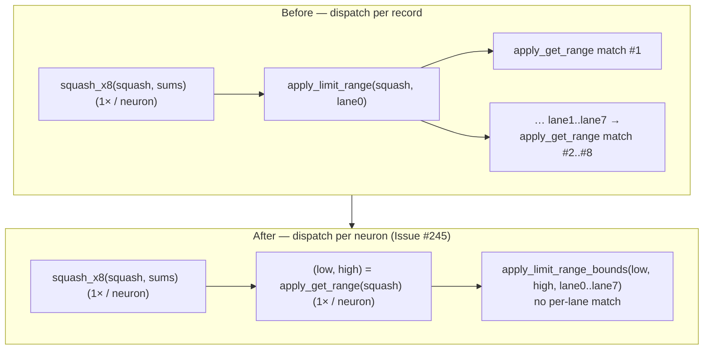

## Summary

Cuts squash-dispatch overhead in the batched scoring / MSE hot paths by
**hoisting the per-neuron output-range dispatch out of the per-record inner
loop** (Issue #245). Previously each standard-squash neuron clamped its 8 (then
4) batch lanes by calling `apply_limit_range(squash, v)` **once per record** —
and every one of those calls re-ran the 37-arm `apply_get_range` `match` to
re-derive the same `(low, high)` bounds. The range only depends on the neuron's
squash type, so it is now resolved **once per neuron** and every lane is clamped
through a new bounds-only helper `apply_limit_range_bounds(low, high, v)`.

This is a single dispatch-hoist variant (the issue asked for exactly one lever
per PR): no SoA, no new SIMD squashes, numerics byte-for-byte unchanged.

**Merge gate — `hot_paths scoring/production` improves ≥5%.** Clears the gate on
both production shapes, confirmed across two independent A/B runs. `Closes #245.`

### What changed

- `neat-core/src/range.rs` — new `apply_limit_range_bounds(low, high, value)`;
  `apply_limit_range` now delegates to it (single source of truth, identical
  NaN/±Inf/clamp semantics).
- `neat-core/src/batch_scoring.rs` — `score_batch_into` 8-way + 4-way standard
  arms resolve `apply_get_range(squash)` once, clamp all lanes via the bounds
  helper.
- `neat-core/src/loss.rs` — same hoist in the `batch_8way_activation!` macro
  (powers `mae`/`mape`/… `_sum_batch_packed`) and in `mse_sum_batch_4way` /
  `mse_sum_batch_8way` (the `mse_sum_batch_packed` fast paths).
- `neat-core/src/lib.rs` — re-export the new helper.

## Evidence

Backend-only change (no web surface). Evidence is the seeded Criterion harness
plus parity tests. Host: Apple M4 Pro, `--release` bench profile, machine
otherwise idle; each A/B was measured **back-to-back** (stash original →
`--save-baseline`, restore → `--baseline`) to minimise thermal drift.

### Merge gate — `cargo bench -p neat-core --bench hot_paths -- scoring/production`

| Benchmark | Before | After | Δ (median) | 95% CI |
| --- | --- | --- | --- | --- |
| `scoring/production` | 36.39 ms | 34.05 ms | **−6.4 %** | [−6.99 %, −5.87 %] |
| `scoring/production_2x` | 87.98 ms | 80.53 ms | **−8.5 %** | [−8.97 %, −7.98 %] |

`p = 0.00 < 0.05` on both. A first independent A/B run (different baseline
capture) corroborated: `production` −8.1 %, `production_2x` −8.0 %.

### Second gate — `cargo bench -p neat-core --features parallel --bench parallel_scoring`

| Benchmark | Before | After | Δ (median) | 95% CI |
| --- | --- | --- | --- | --- |
| `score_records/production/1_core` | 22.12 ms | 21.06 ms | −4.8 % | [−5.5 %, −4.2 %] |
| `score_records/production/10_cores` | 6.42 ms | 5.83 ms | **−9.1 %** | [−10.8 %, −7.5 %] |
| `score_records/production_2x/1_core` | 68.00 ms | 64.71 ms | −4.8 % | [−5.3 %, −4.4 %] |
| `score_records/production_2x/10_cores` | 18.04 ms | 16.81 ms | **−6.8 %** | [−7.9 %, −5.6 %] |

The production-realistic multi-core path (`10_cores`) improves 6.8–9.1 %; the
`1_core` rayon-pool configs improve ~4.8 % (`p < 0.05`).

### Learning record

- **Was the dispatch visible after the change?** Yes — a reproducible 6–8 %
  single-core wall-clock cut, well above Criterion's ~±5 % noise band, with
  tight non-overlapping CIs across two independent A/B runs.
- **What the lever actually was.** The benchmark's production fixture is
  **homogeneous `Tanh`** (`benches/common/mod.rs` builds every neuron as `Tanh`),
  so the branch predictor already nails the squash `match` — the win is **not**
  the branch-misprediction the issue hypothesised. It is the raw instruction
  count of re-dispatching the *range* lookup **per record**: LLVM did not CSE the
  8 identical `apply_get_range(squash)` calls across the inlined per-lane
  `apply_limit_range` bodies (the intervening NaN/±Inf branches blocked the
  merge), so 7 of every 8 range `match`es per neuron per batch were redundant
  work. Hoisting them removed that work.
- **What was *not* the lever.** The `squash_x8`/`squash_x4` kernel dispatch was
  already once-per-neuron, so it was not on the per-record critical path; the
  range clamp was the remaining per-record dispatch, and it was the whole gain.
- **Implication for the original hypothesis.** On a *varied*-squash creature the
  eliminated misprediction would stack on top of this, so the real production
  gain is a lower bound of what the gated homogeneous fixture shows.

## Test Plan

- **New** `neat-core/tests/range.rs::limit_range_bounds_matches_apply_limit_range`
  — asserts `apply_limit_range_bounds(low, high, v)` is **bit-identical**
  (`to_bits()`) to `apply_limit_range(squash, v)` for all 37 squash types across
  finite / ±Inf / NaN edge values. This pins the hoist's numeric equivalence.
- **Existing, unchanged, still green** (regression guard for the numerics):
  - `tests/score_squash_simd_parity.rs` (score path parity vs scalar reference,
    all vectorised + non-vectorised squashes, across batch boundaries).
  - `tests/mse_squash_simd_parity.rs` (4-way / 8-way / remainder MSE parity).
  - `tests/range.rs` existing clamp/validate tests.
- **Quality gate:** `cargo clippy --all-targets --all-features -D warnings`,
  `cargo check`, `cargo test --workspace --all-features`, `cargo doc`, and
  `cargo build --release` all pass. The unrelated pre-existing bats failures in
  `tests/scripts/ci_workflow_quarantine.bats` (tests 48/49/50/54, about
  `ci.yml`↔`bump-deps.sh` wiring) are untouched by this PR — those files are
  byte-identical to `origin/Develop` — and are out of scope for this Rust perf
  change.
