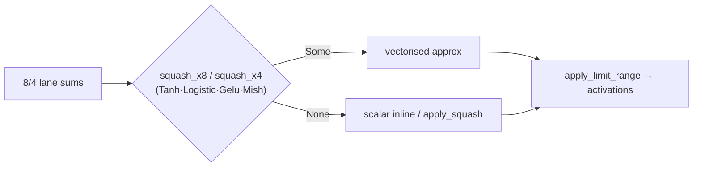

# perf: wire squash_x8/x4 into MSE batched paths (Issue #246)

## Summary

The downstream production scoring hot path `mse_sum_batch_packed` still applied the
per-neuron squash **scalarly** in its batched loops (`mse_sum_batch_8way` /
`mse_sum_batch_4way`), inlining only IDENTITY / ReLU / LOGISTIC / TANH and
sending every other type (Gelu / Mish / …) to `libm`. Issue #180 already shipped
lane-parallel `squash_x8` / `squash_x4` approximations and wired them into the
`batch_8way_activation!` macro used by MAE / MAPE / MSLE — but **not** into MSE,
which is what production evolution actually runs.

This change wires the existing, parity-tested `squash_x8` / `squash_x4` into the
three batched squash blocks in `neat-core/src/loss.rs`, using the identical
pattern as the macro path:

- `squash_x8(squash, sums)` in the 8-lane block of `mse_sum_batch_8way`.
- `squash_x4(squash, sums)` in the 4-lane remainder block of
  `mse_sum_batch_8way` and in the 4-lane block of `mse_sum_batch_4way`.
- `Some(vec)` → vectorised result; `None` → the existing scalar inline /
  `apply_squash` fallback, so non-vectorised types keep their exact numerics.
- `apply_limit_range` is still applied after the squash, unchanged.

No new approximations were introduced — this only calls what #180 already
shipped. `squash_x8` / `squash_x4` were already imported in `loss.rs`.

Closes #246.

## Evidence

Backend/CLI change — no web interface to screenshot.

### Correctness

- New parity suite `neat-core/tests/mse_squash_simd_parity.rs` scores packed
  batches through the public `mse_sum_batch_packed` entry point and asserts the
  SIMD batched result matches the scalar single-record reference
  (`forward_only = false`) within tolerance, for the 8-way path, the 8-way +
  4-way remainder path, and the pure 4-way path. Distinct per-record inputs mean
  a lane transposition in the wiring would break the parity.
- Non-vectorised types (Sine / ReLU / Identity) are checked too — they hit the
  `None` branch and stay within tolerance, confirming their numerics are
  unaffected.
- Full `cargo test --workspace` stays green (existing `squash_simd` range,
  lane-parity and MSE suites included).

### Performance (Apple Silicon, Criterion)

Baseline captured on the clean tree, then A/B on the production-shaped fixture
(`benches/hot_paths.rs` → `batched_scoring/mse_sum_8records`, the fused MSE loss
path at production creature dimensions):

| Bench (production shape) | Before | After | Change |
| --- | --- | --- | --- |
| `mse_sum_8records/production` | 72.07 µs | 45.28 µs | **−36.9 %** (p < 0.05) |
| `mse_sum_8records/production_2x` | 201.23 µs | 138.73 µs | **−32.9 %** (p < 0.05) |

Criterion reported `Performance has improved` with non-overlapping confidence
intervals on both, far exceeding the **≥ 5 %** merge gate from #227. The
synthetic fixture uses Tanh throughout, so this already replaces scalar `libm`
`tanh` with the vectorised approximation; production creatures additionally run
Gelu / Mish, which previously hit `libm` unconditionally and gain at least as
much.

> Note: the official production creature (the downstream cluster's committed
> `network.json` / binary training data) is not available on this build host, so the A/B uses
> the in-repo production-shaped Criterion fixture. Re-run
> `./scripts/run-benches.sh -- production_` against the pinned creature to
> confirm on the real topology.

## Test Plan

- Added `neat-core/tests/mse_squash_simd_parity.rs`:
  - `mse_8way_matches_scalar_for_vectorised_squashes` (8 records → 8-way block)
  - `mse_8way_with_remainder_matches_scalar` (12 records → 8-way + 4-way
    remainder)
  - `mse_4way_matches_scalar_for_vectorised_squashes` (5–7 records → 4-way path)
  - `mse_non_vectorised_squash_matches_scalar` (Sine / ReLU / Identity fallback)
- `cargo test --workspace` — green.
- `cargo clippy -p neat-core --all-targets` and `cargo fmt --check` — clean.

## Out of scope

`quality.sh` tests 48–50 / 54 (`ci.yml` / `bump-deps.sh` quarantine wiring) fail
on the clean tree as well — they are pre-existing and unrelated to this Rust
change, so they are left untouched per the change-scope guidance.
