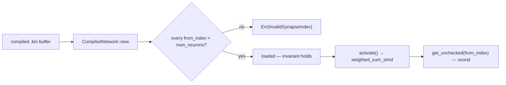

# Fold SIMD / unsafe / buffer-reuse invariants into AGENTS.md and SECURITY.md (Issue #259)

## Summary

The SIMD / `unsafe` / buffer-reuse engineering campaign left durable soundness
invariants in the PR-summary archive that never reached the agent instruction
files, leaving them invisible at the moment an agent edits `simd_native.rs`. One
is a memory-safety (UB) invariant a future refactor could silently regress.

This PR folds those learnings into the instruction files and prunes the
now-redundant source summaries:

- **`AGENTS.md`** gains an **"Unsafe & SIMD invariants"** section capturing:
  - the load-time `from_index < num_neurons` validation that makes the
    `get_unchecked` SIMD path sound (`NetworkError::InvalidSynapseIndex`,
    `neat-core/src/network.rs:326`) — never remove it;
  - the `unsafe_op_in_unsafe_fn = "deny"` floor and the "don't wrap an
    already-enabled intrinsic" rule (wrapping trips `unused_unsafe`), plus which
    ops genuinely need an `unsafe { … }` block;
  - the `// SAFETY:`-names-the-`is_*_feature_detected!`-guard convention;
  - the buffer-reuse rule — per-call reset to fresh-alloc state **plus** a
    state-leak regression test, sound only because each thread owns its own
    `CompiledNetwork`;
  - a Mermaid `flowchart` showing the load-validate → `get_unchecked` → sound
    invariant chain.
- **`SECURITY.md`** gains a **"Memory safety of compiled-network loading"** note
  recording that untrusted compiled-network input is made safe for the
  `get_unchecked` SIMD path by the single load-time `from_index` validation, so
  that check must never be removed.
- Pruned the six absorbed source summaries — `pr-summary-207.md`, `-165.md`,
  `-112.md`, `-154.md`, `-155.md`, `-11.md` — **after** the learnings landed
  (DRY; no test, index, or README referenced them).

All source claims were verified against the tree before folding them in
(`Cargo.toml:28` deny floor, `network.rs:326` validation, `simd_native.rs`
`get_unchecked` + `// SAFETY:` blocks).

Closes #259.

## Evidence

Documentation-only change — no web interface to screenshot. Verified via new
bats tests (this repo tests documentation content the same way in
`security_runbook.bats`) and the local quality gate.

`./quality.sh` bats stage: the 10 new assertions (tests 123–132) pass; fmt /
clippy / cargo-test / doc are unaffected (no Rust or `Cargo.toml` change). The
gate still reports the **four pre-existing** `ci.yml` / `bump-deps.sh` failures
(tests 48, 49, 50, 54) documented verbatim in the pruned `pr-summary-207.md` /
`-112.md`; they predate and are unrelated to this change (this PR touches no
`ci.yml`).

## Test Plan

Added `tests/scripts/unsafe_simd_invariants.bats` (Issue #259 regression), which
fails against the pre-change docs and passes after:

- AGENTS.md has an "Unsafe & SIMD invariants" section.
- AGENTS.md records `unsafe_op_in_unsafe_fn`, the `unused_unsafe`
  don't-wrap rule, the `// SAFETY:` + `_feature_detected!` convention, the
  buffer-reuse reset + state-leak-test rule, and `get_unchecked` +
  `InvalidSynapseIndex`, and draws a Mermaid diagram.
- SECURITY.md records `InvalidSynapseIndex` + `get_unchecked` and states the
  `from_index` check must never be removed.
