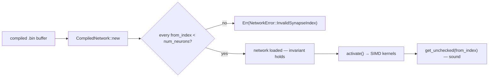

# Fold SIMD / `unsafe` / buffer-reuse invariants into AGENTS.md + SECURITY.md (Issue #259)

## Summary

The SIMD / `unsafe` / buffer-reuse engineering campaign left durable invariants
stranded in the PR-summary archive where they were invisible at the moment an
agent edits `neat-core/src/simd_native.rs`. This PR folds those learnings into
the agent instruction files so they travel with the hot path, then prunes the
now-absorbed source summaries. Closes #259.

- **`AGENTS.md`** gains an **"Unsafe & SIMD invariants"** section capturing:
  - the load-time `from_index < num_neurons` validation
    (`NetworkError::InvalidSynapseIndex`) as the soundness precondition for the
    `get_unchecked` SIMD reads — never remove or bypass it (memory-safety / UB);
  - the `unsafe_op_in_unsafe_fn = "deny"` floor and the "don't wrap an
    already-enabled compute intrinsic" rule (wrapping trips `unused_unsafe`),
    with the exact list of operations that *do* need an `unsafe { … }` block;
  - the `// SAFETY:`-names-its-`is_*_feature_detected!`-guard convention;
  - the buffer-reuse rule — reused scratch buffers force `&mut self`, are sound
    only under one-network-per-thread (`#[derive(Clone)]`), and require a
    per-call reset to fresh-alloc state plus a state-leak regression test;
  - a Mermaid `flowchart` showing load-validate → SIMD `get_unchecked` → safe.
- **`SECURITY.md`** gains a **"Memory safety: untrusted compiled-network input"**
  note recording that the single load-time index validation is what makes an
  untrusted compiled-network buffer safe for the `get_unchecked` SIMD path, and
  that the check must never be removed.
- **Pruned** the six now-absorbed source summaries (`pr-summary-207.md`,
  `-165.md`, `-112.md`, `-154.md`, `-155.md`, `-11.md`) — only after the
  learnings landed. No other file references them (verified by grep).

## Evidence

Documentation change — no web interface to screenshot. The invariant chain is
captured as a Mermaid diagram in `AGENTS.md`:

Verification:

- `bats tests/scripts/unsafe_simd_invariants.bats` — 9/9 pass against the
  updated docs (all 9 failed against the pre-change docs).
- `bats tests/scripts` — the full suite is green except the 4 long-standing
  pre-existing failures (tests about `ci.yml` invoking `bump-deps.sh`), which
  are unrelated to this change and documented as pre-existing in every prior PR
  summary.
- `markdownlint-cli2 AGENTS.md SECURITY.md` — 0 errors.
- `codespell` — clean on the changed files.

Source references cross-checked against the tree: `Cargo.toml`
(`unsafe_op_in_unsafe_fn = "deny"`), `neat-core/src/network.rs`
(`NetworkError::InvalidSynapseIndex`, `from_index as usize >= num_neurons`
guard), `neat-core/src/simd_native.rs` (`get_unchecked`, `// SAFETY:` +
`is_*_feature_detected!` guards).

## Test Plan

- Added `tests/scripts/unsafe_simd_invariants.bats` (Issue #259) — a
  documentation-content regression suite following the existing
  `security_runbook.bats` precedent (the content *is* the deliverable, so its
  presence is the observable outcome). It pins:
  - the AGENTS.md "Unsafe & SIMD invariants" section heading;
  - the `unsafe_op_in_unsafe_fn` deny floor and the do-not-wrap-already-enabled
    intrinsic rule (`unused_unsafe` / `target_feature`);
  - the `// SAFETY:` names-the-guard convention (`is_*_feature_detected`);
  - the load-time `from_index` / `get_unchecked` / `InvalidSynapseIndex`
    soundness chain;
  - the buffer-reuse rule (state-leak test + per-thread ownership);
  - the presence of a Mermaid diagram;
  - the SECURITY.md memory-safety note and its "must never be removed" clause.
- All 9 assertions fail against the pre-change docs and pass after the edits.
