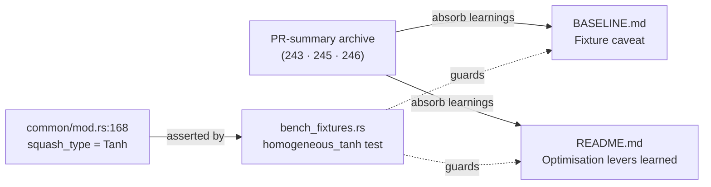

## Summary

Fold the two durable learnings from the #227 perf campaign — recorded so far
only in the PR-summary archive — into the committed bench docs, so they are not
lost and the committed numbers are read correctly. **Closes #261.**

Two learnings were absorbed:

1. **Fixture caveat — squash homogeneity.** The `production` / `production_2x`
   Criterion fixtures build every neuron as `SquashType::Tanh`
   (`neat-core/benches/common/mod.rs:168`). `BASELINE.md` documented
   host/toolchain/record-count but never this squash homogeneity, letting a
   reader over-read the committed `scoring`/`production` numbers. Real
   production creatures also run `Gelu`/`Mish` (scalar `libm`), so on this fixture
   squash-vectorisation deltas are a **lower bound** and branch-prediction
   levers are **unmeasurable**.
2. **Optimisation lever learned (negative result, PR #245).** The #245 6–8%
   single-core win was **not** the branch-misprediction the issue hypothesised
   — on a homogeneous-`Tanh` fixture the predictor already nails the one-arm
   squash `match`. The real lever was LLVM **failing to CSE** eight identical
   `apply_get_range(squash)` range-lookups per neuron (intervening `NaN`/`±Inf`
   branches blocked the merge), so 7 of 8 range matches per batch were
   redundant. Rule preserved: hoist per-record range lookups; do not attribute
   a perf delta to an unverified cause.

### What changed

- `neat-core/benches/BASELINE.md` — new **"Fixture caveat — squash homogeneity"**
  section stating the fixtures are uniformly `Tanh`, so vectorisation deltas are
  a lower bound and branch-prediction levers are unmeasurable here.
- `neat-core/benches/README.md` — a fixture-caveat note under the shape table,
  plus an **"Optimisation levers learned"** section recording the #245 range-CSE
  finding and its corollary for future squash/scoring work.
- `neat-core/tests/bench_fixtures.rs` — new "what" test
  `production_fixture_squash_is_homogeneous_tanh` that asserts every neuron in
  both production fixtures is `Tanh`, so the documented caveat is machine-checked
  and any future change diversifying the fixture squash fails the test rather
  than silently invalidating the docs.

The `pr-summary-243/-245/-246.md` archives are retained: Issue #2173 makes
`docs/archive/pr-summaries/` the permanent home for PR summaries, and the
durable learnings they carried now also live in the bench docs.

## Evidence

Documentation + test change — no web interface to screenshot. The caveat's
underlying fact is now machine-checked:

- `cargo test -p neat-core --test bench_fixtures` — 10 passed, including the new
  `production_fixture_squash_is_homogeneous_tanh`.
- `./quality.sh` passes cleanly (markdownlint, fmt, clippy `-D warnings`, deny,
  full workspace tests).

## Test Plan

- Added `neat-core/tests/bench_fixtures.rs::production_fixture_squash_is_homogeneous_tanh`
  — builds the `production` and `production_2x` fixtures and asserts every
  neuron's `squash_type` is `SquashType::Tanh`, locking the documented
  homogeneity caveat.
- Existing `bench_fixtures` tests remain unchanged and green.
