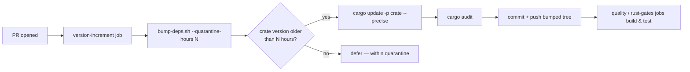

# Fix the known-failing `quality.sh` bats tests so the quality gate is trustworthy

## Summary

`./quality.sh` had four permanently-red `bats` tests on a clean `Develop`
checkout — the `tests/scripts/ci_workflow_quarantine.bats` suite. A standing red
gate cannot prevent regressions: it sends agents chasing a pre-existing failure
and masks genuine new ones. This fixes the **true root cause** rather than
documenting the failure as "expected".

The tests were **correct**; the CI **wiring had regressed**. The
`version-increment` job in `.github/workflows/ci.yml` refreshed dependencies by
calling `cargo upgrade --incompatible` and `cargo update` **directly**, which
bypasses the `VIBE_BUMP_QUARANTINE_HOURS` release-age quarantine that
`bump-deps.sh` enforces (Issue #76). This re-opened the fast-flagged
supply-chain window the quarantine was written to close, and the regression
assertions in `ci_workflow_quarantine.bats` correctly went red.

The fix routes the PR dependency-refresh through `bump-deps.sh`, exactly as the
canonical scheduled `upgrade-dependencies.yml` already does, so the quarantine
is honoured on every bump path. With the wiring corrected, all four tests pass
and `./quality.sh`'s bats stage is green on a clean checkout — any future
failure in this suite is now a genuine regression signal.

Closes #263.

### What changed in `.github/workflows/ci.yml`

- The `version-increment` step now runs
  `./bump-deps.sh --quarantine-hours "${VIBE_BUMP_QUARANTINE_HOURS}" --skip-build`
  instead of the direct `cargo upgrade --incompatible` / `cargo update`. The
  quarantine (default 24 h, overridable via the `VIBE_BUMP_QUARANTINE_HOURS`
  repo variable) is now honoured. `--skip-build` avoids a redundant compile —
  the downstream `quality` / `rust-gates` jobs already build the bumped tree,
  while `cargo audit` still runs inside `bump-deps.sh` for an early advisory
  signal.
- The tool-install step now installs `cargo-audit` (required by `bump-deps.sh`)
  instead of `cargo-edit` (only needed by the removed `cargo upgrade`);
  `cargo-outdated` is retained for the informational report.

### On the "line-indexed fragility" (requirement #2)

The drift in the reported failure numbers across PR summaries
(31/32/33/37 → 43/44/45/49 → 48/49/50/54) was **not** line-number-based
assertions inside the suite — the suite already asserts on **content and
names** (`grep` for the `bump-deps.sh` invocation, the `cargo upgrade` / bare
`cargo update` command strings, and the `VIBE_BUMP_QUARANTINE_HOURS` knob), with
no line-indexed checks. The drifting numbers were `bats`' sequential global
numbering across the whole `tests/scripts` directory as sibling suites were
added or removed. The correct remedy is exactly this PR: make the suite green so
the numbers stop being quoted as "known failures" at all. No line-indexed
assertions exist to remove.

## Evidence

Backend/CI change — no web interface to screenshot. Verified by test execution.

**Before** (`bats tests/scripts/ci_workflow_quarantine.bats`):

```text
not ok 1 ci.yml version-increment job invokes bump-deps.sh
not ok 2 ci.yml does not call cargo upgrade directly (bypasses quarantine)
not ok 3 ci.yml does not call bare cargo update (bypasses quarantine)
ok 4 upgrade-dependencies.yml invokes bump-deps.sh
...
not ok 7 ci.yml passes the VIBE_BUMP_QUARANTINE_HOURS knob to bump-deps.sh
```

**After** — all 8 pass, and the full `tests/scripts` suite is green (172/172):

```text
1..8
ok 1 ci.yml version-increment job invokes bump-deps.sh
ok 2 ci.yml does not call cargo upgrade directly (bypasses quarantine)
ok 3 ci.yml does not call bare cargo update (bypasses quarantine)
ok 4 upgrade-dependencies.yml invokes bump-deps.sh
ok 5 upgrade-dependencies.yml does not call cargo upgrade directly
ok 6 upgrade-dependencies.yml does not call bare cargo update
ok 7 ci.yml passes the VIBE_BUMP_QUARANTINE_HOURS knob to bump-deps.sh
ok 8 upgrade-dependencies.yml passes the VIBE_BUMP_QUARANTINE_HOURS knob
```

`actionlint .github/workflows/ci.yml`, `bash -n` on all `*.sh`, and
`shellcheck -s bash` all pass clean.

### Dependency-refresh flow (after fix)



## Test Plan

- The existing regression suite `tests/scripts/ci_workflow_quarantine.bats` is
  the "what" test for this fix (it asserts the observable wiring contract, not
  implementation detail). It failed against the unfixed `ci.yml` and passes
  after the fix — the required failing-test-first linkage.
- Ran `bats tests/scripts/ci_workflow_quarantine.bats` — 8/8 pass.
- Ran the full `bats tests/scripts` suite — 172/172 pass (no `not ok`).
- Ran `actionlint` on the edited workflow, plus `bash -n` and `shellcheck` —
  all clean.
- No Rust source was touched, so the Rust build/clippy/test gates are
  unaffected by this change.
