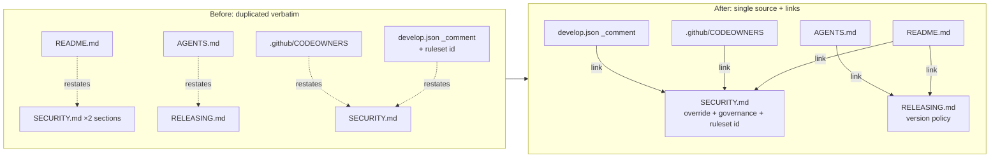

# PR Summary — Issue #264

## Summary

Several operational procedures were maintained verbatim in two or three docs at
once, so the copies would drift as one was edited and the others forgotten
(duplicate/redundant content — the low-severity maintenance hazard flagged in
`BP-694fec042ea8`). This PR collapses each duplicated block to a single
authoritative home and replaces the other copies with links, so the values that
must stay identical (a flag name, the ruleset id, the version policy) live in
exactly one prose location. No learning is deleted — only the redundant
restatements are collapsed to links. **Closes #264.**

### What changed

| Procedure | Authoritative home | Copies reduced to a link |
|-----------|--------------------|--------------------------|
| Emergency quarantine override / dependency bump | `SECURITY.md` — the two near-duplicate H2 sections merged into one (`## Emergency quarantine override` with a `### Runbook`) | `README.md` restatement of the bypass levers → one-line pointer to `SECURITY.md#emergency-quarantine-override` |
| Version-bump policy | `RELEASING.md` | `README.md` table row and `AGENTS.md` line trimmed to a link + one-line summary (dropped the restated `0.1.x → 0.2.0` specifics) |
| CODEOWNERS/ruleset governance rationale + ruleset-apply id | `SECURITY.md` ("Review governance") | `.github/CODEOWNERS` header and `.github/rulesets/develop.json` `_comment` now point at `SECURITY.md`; the hard-coded ruleset id `15236989` lives in exactly one prose location |

### Consolidation flow

## Evidence

Documentation-only change (plus a new bats guard); no web interface to
screenshot. Verified via the shell test gate and the doc linters:

- `bats tests/scripts` — **182/182 pass**, including the new
  `docs_single_source.bats` (10 assertions) and the untouched
  `security_quarantine_override.bats` / `security_runbook.bats` /
  `codeowners_coverage.bats` / `branch_protection_ruleset.bats` suites, which
  still pass because the merged section preserves every grep token (the
  "emergency dependency bump" wording, both bypass levers, `cargo audit`).
- `codespell` — clean.
- `markdownlint-cli2` — 0 errors across the edited Markdown.
- `develop.json` re-validated as JSON after the `_comment` edit.

## Test Plan

- **Added `tests/scripts/docs_single_source.bats`** pinning the consolidation
  invariants:
  - the emergency-override bypass levers live only in `SECURITY.md` (not
    restated in `README.md`);
  - `SECURITY.md` keeps a single merged `## Emergency ` H2, not two;
  - the version-policy `0.1.x → 0.2.0` specifics are not restated in `README.md`
    or `AGENTS.md`, which link to `RELEASING.md` instead;
  - the ruleset id `15236989` appears in `SECURITY.md` and **not** in
    `develop.json` (exactly one prose location);
  - `develop.json` and `.github/CODEOWNERS` point at `SECURITY.md`.
- **No existing tests removed or modified.** The pre-existing SECURITY/CODEOWNERS
  /ruleset bats suites continue to pass unchanged.
