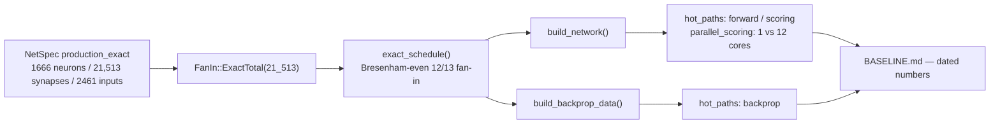

# Criterion baseline on the production topology (Issue #286)

## Summary

Established a reproducible **Criterion baseline on the exact production
topology** — the downstream production cluster's committed creature shape of **1,666 non-input
neurons, 21,513 synapses, 2,461 inputs** — so every later perf change in this
crate has a dated before/after anchor. Measurement only, no optimisation
(optimisation lands in the lane sub-issues that gate on these numbers).
**Closes #286.**

What changed:

- **New `production_exact` fixture** in `neat-core/benches/common/mod.rs`. Unlike
  the existing `production` shape (a ~13-average `FanIn::VariedAround`
  approximation, ~21.7k synapses), the new shape uses a new
  **`FanIn::ExactTotal(21_513)`** variant that distributes the synapses across
  the 1,666 neurons as evenly as possible (12 or 13 each, Bresenham-interleaved),
  so the fixture reproduces the real model **to the synapse**. Seeded and
  deterministic.
- The new variant is threaded through **both** deterministic builders —
  `build_network` (forward/scoring) and `build_backprop_data` (backprop) — via a
  pre-computed `exact_schedule`. The RNG-drawn shapes stay on their existing
  `draw` path, so every committed `production`/`production_2x` baseline is
  byte-for-byte unchanged.
- `production_exact` is wired into the `hot_paths` groups (its label starts with
  `production`, so the `scoring` group and the `production` regex filter pick it
  up) and added to the `parallel_scoring` label list, covering **both lanes**:
  the default single-thread path and the native `--features parallel` path.
- **`BASELINE.md`** gains a dated (2026-07-18, rustc 1.97.0) production-exact
  section with single-thread and parallel numbers, plus a per-creature scoring
  latency mapped back to the project metric (**score improvement per wall-clock
  hour**).

### Fixture → baseline flow

## Evidence

Backend/bench-only change — no web UI to screenshot. Evidence is the dated
benchmark numbers recorded in `neat-core/benches/BASELINE.md` and the fixture
tests that assert the exact topology.

**Single-thread lane** (`cargo bench -p neat-core --bench hot_paths -- production_exact`):

| Group | production_exact |
| --- | --- |
| `forward_pass` | 30.76 µs `[30.19, 31.35]` (~134 Melem/s) |
| `batched_scoring/trace_batch_4way` | 122.65 µs `[120.98, 124.33]` |
| `batched_scoring/mse_sum_8records` | 242.08 µs `[239.09, 244.99]` |
| `backprop` | 214.14 µs `[210.46, 218.05]` (~19.3 Melem/s) |
| `scoring` (4096 records) | 91.50 ms `[90.05, 92.96]` (44.8 Krecords/s) |

**Parallel lane** (`cargo bench -p neat-core --features parallel --bench parallel_scoring -- production_exact`):

| Shape | 1 core | 12 cores | records/s (1 → 12) | Speed-up |
| --- | --- | --- | --- | --- |
| `production_exact` | 61.84 ms `[60.36, 63.38]` | 24.62 ms `[22.35, 26.98]` | 66.2 K → 166.4 K | 2.51× |

Per-creature corpus pass (~2.24 M records/generation): ≈ **33.9 s** single-core,
≈ **13.5 s** on 12 cores — the denominator of the project metric. The
scoring-lane run-to-run variance (~62–92 ms single-core across invocations, a
thermal artefact of the laptop-class M4 Pro) is documented honestly in
`BASELINE.md`; the internally-consistent 2.51× parallel ratio is the
authoritative anchor.

## Test Plan

New/updated tests in `neat-core/tests/bench_fixtures.rs` (run green via
`cargo test -p neat-core --test bench_fixtures`, and compiled in PR CI by
`cargo check/clippy --all-targets --all-features`):

- `production_exact_matches_committed_grq_topology` — asserts exactly 2,461
  inputs, 1,666 non-input neurons, 4,127 total, and **21,513** built synapses.
- `production_exact_fan_in_is_evenly_spread_and_varies` — fan-in takes at most
  two values (12/13) with a mean near the production ~13.
- `production_exact_build_is_deterministic` — same seed reproduces identical
  synapses and neurons (reproducibility guard).
- `production_exact_backprop_data_has_exact_synapse_count` — regression test for
  the backprop builder honouring the exact schedule (caught a real bug where
  `build_backprop_data` fell through to `draw`, building a synapse-free network).
- `production_exact_network_activates_to_finite_outputs` — forward pass produces
  finite outputs.
- `production_fixture_squash_is_homogeneous_tanh` — extended to cover the new
  shape, keeping the documented squash-homogeneity caveat honest.

No existing tests removed or modified in behaviour; existing
`production`/`production_2x` fixtures and baselines are untouched.
