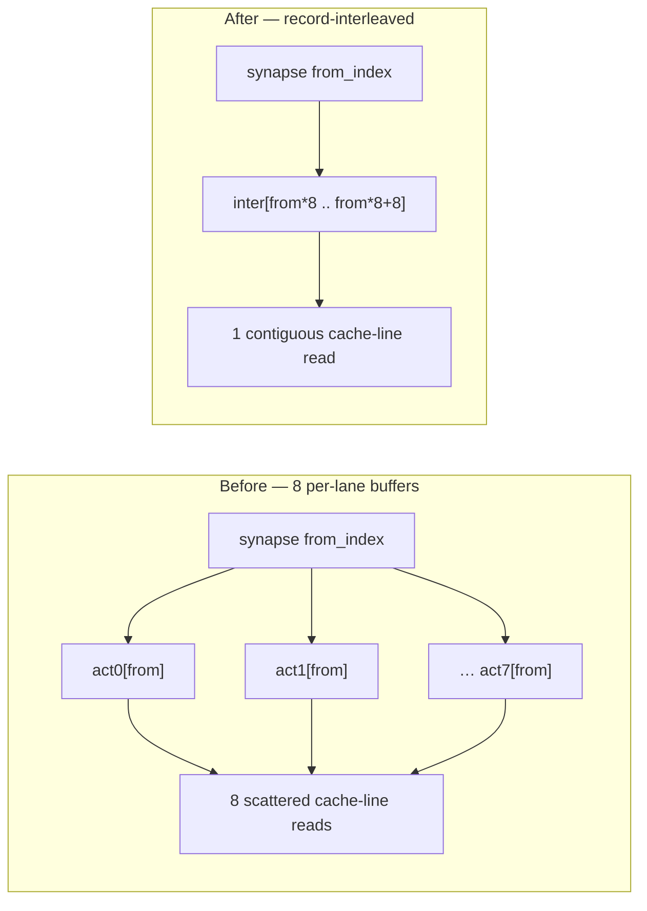

# Optimise the wasm32 single-thread per-creature scoring hot path (Issue #287)

## Summary

Speeds up the single-thread record-scoring hot path (`score_records` →
`score_batch_into`) — the lane NEAT-AI's per-creature `wasm32` workers drive —
by switching the batched forward pass to a **record-interleaved activation
layout**. Instead of eight separate per-lane activation buffers, one group of
eight records is transposed into a single buffer where lane `l` of source
neuron `n` lives at `inter[n * 8 + l]`, so all eight records for a synapse's
source are **contiguous**. Each gather in the new `weighted_sum_interleaved_8`
kernel is then one cache-line read (two adjacent 4-wide loads on NEON, one
`_mm256_loadu_ps` on AVX2, one contiguous `f32x4` pair on wasm `simd128`)
instead of eight scattered loads across eight buffers, and each neuron's eight
outputs are a single contiguous store. This extends the #230 batched-SIMD
approach to the gather/scatter itself; because the win is **layout-driven**, it
applies identically to the native and `wasm32` builds.

Networks that contain aggregate squashes (Minimum/Maximum/If/Hypotenuse/
HypotenuseV2/Mean) keep the original per-lane path via an automatic dispatch;
the all-standard-squash production topology takes the interleaved fast path.

Closes #287.

### What changed

- `neat-core/src/simd_native.rs` — `weighted_sum_interleaved_8` (AVX2 / NEON /
  scalar), mirroring the existing 8-record kernels and their `get_unchecked`
  load-time-validation soundness contract (`from_index < num_neurons` ⇒
  `from_index * 8 + 8 ≤ inter.len()`).
- `neat-core/src/simd.rs` — the `wasm32` `simd128`/`relaxed-simd`
  `weighted_sum_interleaved_8`, plus the native re-export.
- `neat-core/src/batch_scoring.rs` — `BatchScratch` gains the interleaved
  buffer; `score_batch_into` dispatches to `score_batch_interleaved` (fast path)
  or the retained `score_batch_per_lane` (aggregate fallback). Full 8-record
  groups run the interleaved kernel; the `records.len() % 8` tail runs the exact
  single-record kernel so single-record scoring stays bit-for-bit identical to
  `activate`.

### Scope note — wasm32 target, native evidence gate

The issue targets the `wasm32` scoring lane, but the repo's evidence gate
(`neat-core/benches/hot_paths.rs`, `BASELINE.md`) is a native Criterion harness
— the `wasm32` SIMD path is `cfg`'d out of the host build and cannot be A/B'd
here. The optimisation therefore lives in the **shared, architecture-neutral**
scoring structure so the identical layout change benefits both builds, and is
measured on the native `production_exact` fixture the baseline anchors to. The
`wasm32` and native builds and clippy both pass.

## Evidence — before/after benchmark (Performance Task Workflow)

Backend/CLI change with no web interface, so evidence is Criterion, not a
screenshot. Fixture: `production_exact` (1,666 non-input neurons / 21,513
synapses / 2,461 inputs), the exact committed production-cluster topology.

Separate `cargo bench` invocations drift on the laptop-class M4 Pro (the
`BASELINE.md` thermal caveat), so the A/B was run as **alternating** old/new
rounds of the *same* prebuilt bench binaries, capturing the **unchanged**
`forward_pass` benchmark as a drift control. The control stayed flat, proving
the `scoring` delta is the code change and not thermal drift.

4 alternating rounds, rustc 1.97.0, `--release`, Criterion `--sample-size 60`
(median ms):

| Round | `scoring` OLD | `scoring` NEW | `forward_pass` OLD (control) | `forward_pass` NEW (control) |
| --- | --- | --- | --- | --- |
| 1 | 82.98 ms | 48.98 ms | 31.77 µs | 36.11 µs |
| 2 | 104.35 ms | 49.73 ms | 35.74 µs | 35.03 µs |
| 3 | 109.33 ms | 53.29 ms | 35.17 µs | 36.96 µs |
| 4 | 108.85 ms | 40.30 ms | 35.92 µs | 30.74 µs |
| **mean** | **101.4 ms** | **48.1 ms** | **34.65 µs** | **34.71 µs** |

- `scoring/production_exact`: **101.4 ms → 48.1 ms, −52% (≈2.1× faster)**; every
  round is far faster on the new path.
- `forward_pass` control (the single-record `activate` path, untouched): flat
  (34.65 vs 34.71 µs mean) → drift cancelled.

At ~48 ms the per-creature ~2.24 M-record corpus pass drops from ≈33.9 s toward
the low 20s of seconds on a single core — a direct gain on the score-per-hour
metric. `BASELINE.md` is updated with this result and the methodology.

## Test Plan

- **New** `neat-core/tests/interleaved_scoring_parity.rs` — "what" tests
  exercising both dispatch branches across the 8-record boundary (counts
  1,7,8,9,16,17):
  - `interleaved_fast_path_matches_reference_across_boundaries` — all-Tanh net
    (fast path) matches the scalar `activate` reference within SIMD tolerance.
  - `interleaved_single_record_is_bit_identical_to_activate` — single record is
    bit-for-bit identical (exact tail path).
  - `aggregate_fallback_path_matches_reference_across_boundaries` — Maximum net
    (per-lane fallback) is exact.
- Existing scoring parity/allocation suites pass unchanged:
  `score_squash_simd_parity`, `mse_squash_simd_parity`, `parallel_scoring`
  (incl. `single_record_matches_direct_activate`,
  `sequential_and_parallel_are_bit_identical`), `scoring_allocations`
  (no per-record allocation — `BatchScratch` allocates once).
- `./quality.sh` passes: fmt, clippy (`-D warnings`, native + `wasm32`),
  `cargo deny`, full `cargo test`, doc build, release build.
